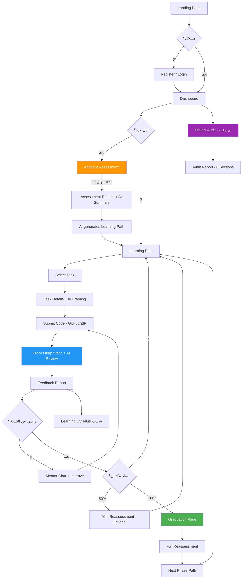

# 02 - رحلة المستخدم (User Flow)
> الحالة: ✅ مكتمل

---

## ملخص (للـ Presentation)

رحلة المستخدم في Code Mentor هي حلقة متكاملة تبدأ من التسجيل وتنتهي بسيرة ذاتية تعليمية مثبتة بالبيانات. كل خطوة تبني على السابقة.

---

## رحلة المستخدم الكاملة (End-to-End Flow)

### المرحلة 1: الدخول
```
Landing Page → Register/Login → Dashboard
```
- المستخدم يصل للـ Landing Page (`/`)
- يسجل بـ Email/Password أو GitHub OAuth (`/register` أو `/login`)
- يُوجّه تلقائياً إلى Dashboard (`/dashboard`)

### المرحلة 2: التقييم
```
Dashboard → Start Assessment → 30 Questions (Adaptive) → Results + AI Summary
```
- المستخدم يبدأ التقييم (`/assessment`)
- 30 سؤال تكيّفي — الصعوبة تتغير بناءً على الأداء (2PL IRT)
- بعد الانتهاء → صفحة النتائج مع ملخص AI (`/assessment/results`)
- التقييم يُنشئ Skill Profile (نقاط القوة والضعف)

### المرحلة 3: مسار التعلم
```
Results → AI generates Learning Path → Learning Path View
```
- بناءً على نتائج التقييم، يُنشأ مسار تعلم مخصص بالـ AI
- 5-10 مهام مرتبة حسب نقاط الضعف (`/learning-path`)
- كل مهمة لها AI Framing: لماذا مهمة؟ ما يجب التركيز عليه؟

### المرحلة 4: التنفيذ والمراجعة (Core Loop)
```
Pick Task → View Details → Submit Code (GitHub/ZIP) → Wait → Receive Feedback
```
- المستخدم يختار مهمة من مساره (`/learning-path/project/:taskId`)
- يقرأ تفاصيل المهمة مع AI Framing
- يرفع كوده عبر GitHub URL أو ZIP (`/submissions/:id`)
- النظام يشغّل:
  1. Static Analysis (6 أدوات)
  2. AI Review (5 محاور)
- يحصل على تقرير مفصل (`/submissions/:id/feedback`)

### المرحلة 5: التعلم العميق
```
Feedback → Mentor Chat → Improve → Resubmit
```
- يقرأ التقرير (scores, strengths, weaknesses, inline annotations)
- يسأل Mentor Chat عن أي نقطة غير واضحة (RAG-based)
- يحسّن كوده ويرفعه مرة أخرى

### المرحلة 6: التكيّف المستمر
```
Every 3 tasks → Path Adaptation → Approve/Reject changes
```
- بعد كل 3 مهام مكتملة (أو تغيير كبير في المستوى) → النظام يقترح تعديلات على المسار
- المستخدم يوافق أو يرفض التعديلات المقترحة
- عند 50% → Mini Reassessment اختياري (10 أسئلة)

### المرحلة 7: التخرّج والمرحلة التالية
```
Path 100% → Graduation Page → Full Reassessment → Next Phase Path
```
- عند إكمال المسار → صفحة التخرّج (`/learning-path/graduation`)
- Before/After Radar Chart + AI Journey Summary
- تقييم كامل إجباري (30 سؤال)
- إنشاء مسار جديد بمستوى أعلى (Next Phase)

### المرحلة الموازية: Project Audit
```
Any time → Upload Project → Receive Audit Report
```
- في أي وقت، المستخدم يرفع مشروع كامل (`/audit/new`)
- يحصل على تقرير من 8 أقسام مع Completeness Analysis

---

## مخطط التدفق (Flow Diagram)



---

## الشاشات الرئيسية (مرتبطة بالـ Routes)

| الشاشة | الـ Route | الوصف |
|--------|----------|-------|
| Landing Page | `/` | صفحة الهبوط العامة |
| Login | `/login` | تسجيل الدخول |
| Register | `/register` | إنشاء حساب |
| Dashboard | `/dashboard` | لوحة التحكم الرئيسية |
| Assessment Start | `/assessment` | بدء التقييم |
| Assessment Questions | `/assessment/question` | أسئلة التقييم |
| Assessment Results | `/assessment/results` | نتائج التقييم + AI Summary |
| Learning Path | `/learning-path` | مسار التعلم الحالي |
| Task Details | `/learning-path/project/:taskId` | تفاصيل المهمة + AI Framing |
| Tasks Library | `/tasks` | مكتبة المهام |
| Task Detail | `/tasks/:id` | تفاصيل مهمة |
| Submission Detail | `/submissions/:id` | حالة الرفع |
| Feedback View | `/submissions/:id/feedback` | تقرير المراجعة |
| Audit New | `/audit/new` | إنشاء فحص مشروع |
| Audit Detail | `/audit/:id` | تقرير الفحص |
| Audits History | `/audits/me` | سجل الفحوصات |
| Profile | `/profile` | الملف الشخصي |
| Learning CV | `/learning-cv` | السيرة الذاتية التعليمية |
| Public CV | `/cv/:slug` | السيرة العامة (Anonymous) |
| Analytics | `/analytics` | تحليلات المهارات |
| Achievements | `/achievements` | الإنجازات والـ Badges |
| Activity | `/activity` | سجل النشاط |
| Graduation | `/learning-path/graduation` | صفحة التخرّج |
| Adaptations History | `/learning-path/adaptations` | سجل التكيّفات |
| **Admin** Dashboard | `/admin` | لوحة الإدارة |
| **Admin** Users | `/admin/users` | إدارة المستخدمين |
| **Admin** Tasks | `/admin/tasks` | إدارة المهام |
| **Admin** Questions | `/admin/questions` | إدارة الأسئلة |
| **Admin** Question Generator | `/admin/questions/generate` | توليد أسئلة بالـ AI |
| **Admin** Task Generator | `/admin/tasks/generate` | توليد مهام بالـ AI |
| **Admin** Calibration | `/admin/calibration` | معايرة IRT |
| **Admin** Adaptations | `/admin/adaptations` | مراقبة التكيّفات |

---

## الملفات المرجعية
- ✅ `frontend/src/router.tsx` — جميع الـ Routes
- ✅ `frontend/src/features/` — 21 feature folder
- ✅ `docs/PRD.md` — User Stories
- ✅ `docs/architecture.md` — Data Flows (§4.1-4.7)

---

## نقاط مهمة للعرض

### ✅ ركّز على:
- بناء الـ Flow تدريجياً أثناء الشرح (لا تعرض كل شيء مرة واحدة!)
- كل خطوة تظهر عند شرحها
- التركيز على "رحلة المتعلم" وليس الـ Routes التقنية
- الـ Core Loop هو القلب: Submit → Review → Learn → Improve

### ❌ تجنّب:
- عرض جدول الـ Routes كما هو (ممل)
- ذكر التفاصيل التقنية للـ routing

---

## اقتراحات للـ Slides

### سلايد User Flow:
- ابدأ بدائرة فارغة
- كل خطوة تظهر عند الكلام عنها (Morph animation)
- استخدم أيقونات بسيطة لكل مرحلة
- الـ Core Loop يكون في المنتصف بلون مميز
- الـ Project Audit يظهر كفرع جانبي
