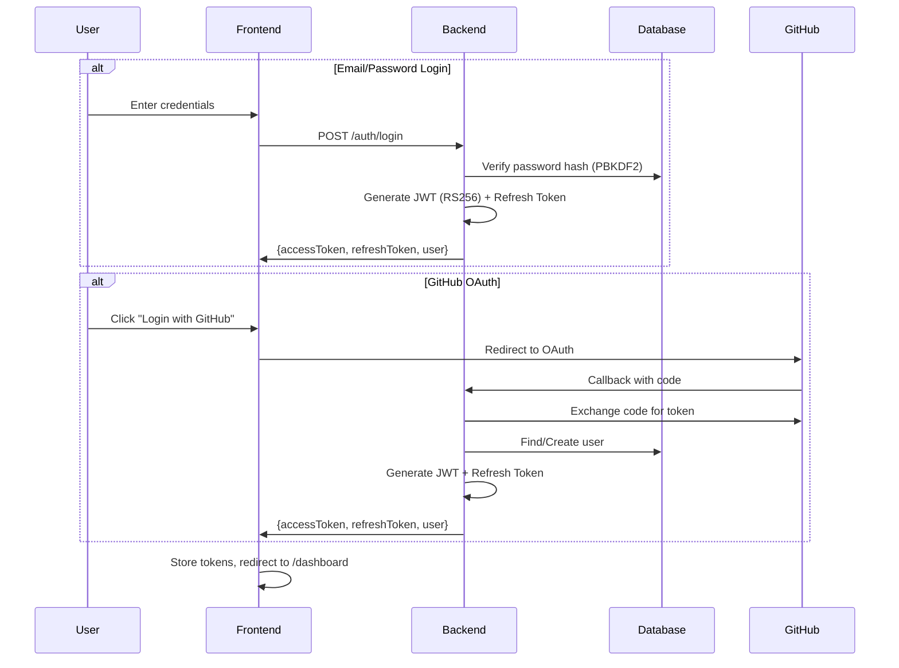

# 03 - Feature: Authentication & Profile
> الحالة: ✅ مكتمل

---

## ملخص (للـ Presentation)

نظام توثيق آمن ومتكامل يدعم طريقتين للدخول مع حماية كاملة.

---

## طرق تسجيل الدخول

### 1. Email/Password
- تسجيل بالاسم + البريد + كلمة المرور
- كلمة المرور مُشفّرة بـ **PBKDF2** (100k iterations) عبر ASP.NET Identity
- إرسال بريد تحقق (لكن لا يمنع الدخول في الـ MVP)

### 2. GitHub OAuth
- الضغط على "Login with GitHub" → يحوّل لـ GitHub
- عند العودة: يُنشئ حساب تلقائياً أو يربطه بالحساب الموجود
- الـ OAuth Token يُحفظ مُشفّراً بـ **AES-256** في قاعدة البيانات
- يُستخدم لاحقاً للوصول للـ Repos الخاصة عند رفع الكود

---

## آلية التوثيق (JWT)

```
Login → JWT (RS256, 1 ساعة) + Refresh Token (7 أيام)
```

| العنصر | التفاصيل |
|--------|----------|
| **JWT Algorithm** | RS256 (asymmetric — أكثر أماناً من HS256) |
| **Access Token** | صالح لمدة 1 ساعة |
| **Refresh Token** | صالح لمدة 7 أيام، مُخزّن في HttpOnly Cookie |
| **Token Refresh** | `POST /auth/refresh` يعطي access token جديد بدون إعادة Login |
| **Logout** | `POST /auth/logout` يُبطل الـ Refresh Token |

### الحماية
- **5 محاولات دخول فاشلة خلال 15 دقيقة** → قفل الحساب 15 دقيقة
- **Rate Limiting**: Fixed window 5/15-min/IP على endpoint الـ Login
- **استعادة كلمة المرور**: عبر رابط مؤقت (10 دقائق) يُرسل بالبريد

---

## انتقال المستخدم بعد الدخول

```
Login/Register → Dashboard
                  ↓
            أول مرة؟ → Assessment
                  ↓
            لديه Path؟ → Learning Path
                  ↓
            كل شيء جاهز → يتصفح ويتعلم
```

- بعد Login ناجح: Frontend يحفظ الـ Tokens ويوجّه لـ `/dashboard`
- كل الـ API requests تحمل `Authorization: Bearer <jwt>`
- Protected Routes تمنع الوصول بدون Token

---

## الشاشات المتعلقة

| الشاشة | Route | الملاحظات |
|--------|-------|----------|
| Landing | `/` | زر Login / Register / Login with GitHub |
| Login | `/login` | AuthLayout مخصص (بدون Sidebar) |
| Register | `/register` | نفس الـ Layout |
| GitHub Success | `/auth/github/success` | صفحة وسيطة تلتقط الـ Tokens |
| Profile | `/profile` | عرض وتعديل الملف الشخصي |
| Profile Edit | `/profile/edit` | صفحة تعديل مفصلة |
| Settings | `/settings` | إعدادات الحساب |

---

## Sequence Diagram



---

## الملفات المرجعية
- ✅ `docs/PRD.md` §4.1 — User Stories US-01 to US-05
- ✅ `docs/architecture.md` §4.1 — Login Data Flow
- ✅ `docs/decisions.md` — ADR-010 (Identity in Infrastructure), ADR-011 (OAuth deferred to S2), ADR-012 (Rate limiter)
- ✅ `frontend/src/features/auth/` — Login, Register, GitHubSuccess pages
- ✅ `frontend/src/router.tsx` — Auth routes (lines 58-74)

---

## نقاط مهمة للعرض

### ✅ ركّز على:
- **سرعة العرض**: هذا الجزء يُعرض بسرعة (تم مناقشته في الترم الأول)
- طريقتا الدخول (Email + GitHub OAuth)
- أمان JWT (RS256, refresh rotation)
- الربط بالـ User Flow بعدها

### ❌ تجنّب:
- تفاصيل PBKDF2 (ذكر "تشفير صناعي" يكفي)
- شرح كل endpoint بالتفصيل

---

## اقتراحات للـ Slides

### سلايد واحد يكفي:
- عنوان: "Authentication & Security"
- أيقونتين: 🔑 Email/Password + 🐙 GitHub OAuth
- سهم بسيط: Login → JWT → Protected Access
- نقطة أمان: RS256 + Rate Limiting + Account Lockout
- Screenshot من صفحة Login (إن أمكن)
