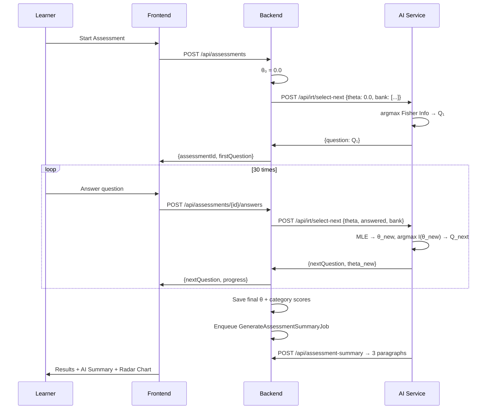

# 04 - Feature: Adaptive Assessment (F2 + F15)
> الحالة: ✅ مكتمل

---

## ملخص (للـ Presentation)

نظام تقييم تكيّفي يستخدم خوارزمية **IRT 2PL** (Item Response Theory — Two Parameter Logistic) لتقييم المتعلم بدقة علمية. يختار كل سؤال بذكاء بناءً على أداء المتعلم حتى تلك اللحظة، مع توليد أسئلة بالـ AI وملخص ذكي بعد التقييم.

---

## لماذا IRT وليس مجرد اختبار عادي؟

### المشكلة في الاختبارات التقليدية:
- أسئلة ثابتة للجميع (نفس الصعوبة)
- لا تستفيد من إجابات المتعلم أثناء الاختبار
- تحتاج عدد كبير من الأسئلة لتحديد المستوى بدقة

### الحل مع IRT:
- **كل سؤال يختلف** بناءً على أدائك حتى الآن
- **30 سؤال فقط** تكفي لتحديد مستواك بدقة عالية (بدلاً من 100+)
- **نتيجة علمية** مبنية على نموذج إحصائي معتمد عالمياً

---

## النموذج الرياضي (2PL IRT)

### المعادلة الأساسية:
```
P(correct | θ, a, b) = 1 / (1 + exp(-a × (θ - b)))
```

### المتغيرات:
| المتغير | الاسم | الوصف | المدى |
|---------|-------|-------|-------|
| **θ** (theta) | قدرة المتعلم | مستوى المتعلم الكامن | -4 إلى +4 |
| **b** | صعوبة السؤال | مستوى الـ θ الذي عنده P(correct) = 0.5 | -3 إلى +3 |
| **a** | تمييز السؤال | حدّة المنحنى عند b — كم السؤال "يفصل" بين المستويات | 0.3 إلى 3.0 |

### الفكرة ببساطة:
- إذا كان **θ > b** (مستواك أعلى من صعوبة السؤال) → احتمال الإجابة الصحيحة **عالي**
- إذا كان **θ < b** → احتمال الإجابة الصحيحة **منخفض**
- إذا كان **θ = b** → الاحتمال بالضبط **50%**
- الـ **a** يحدد سرعة الانتقال: `a` عالي = سؤال حاد (يميّز بدقة)

### Fisher Information (اختيار السؤال التالي):
```
I_i(θ) = a² × P_i(θ) × (1 - P_i(θ))
```
- **أقصى معلومات** عندما θ = b (يعني P = 0.5 = أكبر عدم يقين)
- النظام يختار السؤال الذي **يعظّم** هذه المعلومات = أكثر سؤال مفيد لتحديد مستواك

---

## كيف يعمل التقييم (Flow)

### خطوة بخطوة:

```
1. المتعلم يبدأ التقييم
   → θ₀ = 0.0 (نقطة البداية)

2. اختيار السؤال الأول:
   → argmax I_i(θ=0) → السؤال الأقرب لـ b=0

3. المتعلم يجيب (صح أو خطأ)
   → تحديث θ بالـ MLE (Maximum Likelihood Estimation)
   
4. اختيار السؤال التالي:
   → argmax I_i(θ_new) → أفضل سؤال للمستوى الجديد

5. تكرار 30 مرة

6. النتيجة النهائية:
   → θ_final + per-category scores + AI Summary
```

### Sequence Diagram:



---

## مكونات النظام

### 1. IRT Engine (`ai-service/app/irt/engine.py`)
- **~200 سطر** من الكود الرياضي
- 4 دوال أساسية:
  - `p_correct(θ, a, b)` → احتمال الإجابة الصحيحة
  - `item_info(θ, a, b)` → Fisher Information
  - `estimate_theta_mle(responses)` → تقدير θ بالـ MLE
  - `select_next_question(θ, bank)` → اختيار أفضل سؤال
  - `recalibrate_item(responses)` → إعادة معايرة (a, b) تجريبياً
- يستخدم **scipy.optimize** للتحسين الرياضي

### 2. Question Generator (`ai-service/app/services/question_generator.py`)
- **~438 سطر**
- يولّد أسئلة MCQ بالـ AI (GPT-5.1-codex-mini)
- مع تقدير ذاتي لـ (a, b) — يمكن للـ Admin تعديلها
- JSON repair: fence-strip + balanced-block extraction
- Retry-with-self-correction (محاولة واحدة إضافية عند فشل التحقق)

### 3. Assessment Summarizer (`ai-service/app/services/assessment_summarizer.py`)
- **~445 سطر**
- يولّد ملخص AI من 3 فقرات بعد التقييم:
  1. **نقاط القوة** (Strengths)
  2. **نقاط الضعف** (Weaknesses)  
  3. **إرشادات المسار** (Path Guidance)
- يُغذّي مباشرة مولّد مسار التعلم

### 4. Empirical Recalibration (`RecalibrateIRTJob`)
- عندما يكون لسؤال ≥1000 إجابة → يُعاد حساب (a, b) بالـ MLE
- يحفظ النتائج في `IRTCalibrationLog` للمراجعة

---

## بنك الأسئلة

| الخاصية | القيمة |
|---------|--------|
| **الحجم المستهدف** | 250+ سؤال |
| **الحد الأدنى** | 150 سؤال (للـ Defense) |
| **الفئات** | Data Structures, Algorithms, OOP, Databases, Security |
| **الصعوبات** | 3 مستويات (Easy, Medium, Hard) |
| **الأنواع** | MCQ (4 خيارات) + Code Snippet اختياري |
| **المصدر** | يدوي + AI-generated (مراجع من الـ Admin) |

### كل سؤال يحتوي على:
- النص + 4 خيارات + الإجابة الصحيحة
- `IRT_A` (discrimination) + `IRT_B` (difficulty)
- `CalibrationSource`: AI / Admin / Empirical
- Code Snippet (اختياري) + Language
- Embedding (لكشف التكرار)

---

## AI Assessment Summary

بعد إكمال التقييم، يُنتج ملخص AI من 3 فقرات:

### مثال:
> **نقاط القوة**: تظهر أداءً قوياً في التحكم في التدفق وهياكل البيانات الأساسية. قدرتك على التعامل مع المصفوفات والقوائم المرتبطة واضحة...
>
> **نقاط الضعف**: تحتاج تحسيناً ملحوظاً في معالجة الأخطاء والأمان. عدة أسئلة حول التحقق من المدخلات والتشفير كانت صعبة...
>
> **إرشادات المسار**: نقترح البدء بمهام تركز على معالجة الأخطاء الآمنة والتحقق من المدخلات، ثم الانتقال تدريجياً إلى مواضيع الأداء...

---

## المعايرة (Calibration)

### 3 مراحل:
1. **AI Self-Rate**: عند التوليد، الـ AI يقدّر (a, b) أولياً
2. **Admin Override**: الـ Admin يراجع ويعدّل عبر `/admin/calibration`
3. **Empirical MLE**: بعد 1000+ إجابة، يُعاد الحساب تلقائياً بالبيانات الفعلية


---

## الاختبارات

| الاختبار | معيار النجاح |
|----------|-------------|
| `p_correct` boundary | عند θ=b يعطي 0.5±1e-9 |
| `item_info` correctness | أقصى قيمة عند θ=b |
| Synthetic learner MLE | θ_hat ضمن ±0.5 من θ_true في ≥95% من 100 تجربة |
| `select_next_question` | يختار السؤال الأقرب لـ b=θ |
| `recalibrate_item` Monte-Carlo | عند 1000 إجابة: ±0.2 لـ a و ±0.3 لـ b |

---

## الملفات المرجعية
- ✅ `ai-service/app/irt/engine.py` — المحرك الرياضي
- ✅ `ai-service/app/services/question_generator.py` — مولّد الأسئلة
- ✅ `ai-service/app/services/assessment_summarizer.py` — ملخص التقييم
- ✅ `docs/assessment-learning-path.md` — التصميم الكامل (§§2-6)
- ✅ `docs/PRD.md` §4.11 — User Stories F15

---

## نقاط مهمة للعرض

### ✅ ركّز على:
- **الرسم البياني S-Curve**: اعرض منحنى P(correct) vs θ لعدة أسئلة
- **الـ Demo المباشر**: اعرض تقييم حقيقي — السؤال يتغير بناءً على الأداء
- **المقارنة**: IRT vs اختبار عادي (30 سؤال IRT = 100 سؤال عادي)
- **ملخص AI**: اعرض مثال حقيقي للملخص
- **3 مراحل المعايرة**: AI → Admin → Empirical

### ❌ تجنّب:
- المعادلات الرياضية المعقدة بالتفصيل (اعرض المعادلة الأساسية فقط)
- شرح scipy.optimize
- تفاصيل الـ retry mechanism

---

## اقتراحات للـ Slides

### سلايد 1: "ما هو IRT؟"
- S-curve بسيط يوضح العلاقة بين θ و P(correct)
- 3 أسئلة بألوان مختلفة (سهل، متوسط، صعب)
- نقطة: "يختار السؤال الأفضل لك"

### سلايد 2: "كيف يعمل التقييم؟"
- Animation: θ يتحرك على المحور مع كل إجابة
- السؤال يتغير ← θ يتحدث ← سؤال جديد
- 30 خطوة → نتيجة دقيقة

### سلايد 3: "بنك الأسئلة الذكي"
- 250 سؤال × 5 فئات × 3 صعوبات
- AI يولّد + Admin يراجع + البيانات تعايِر
- Dashboard screenshot

### سلايد 4: "AI Summary"
- مثال حقيقي: 3 فقرات
- السهم: Summary → يغذّي → Learning Path
