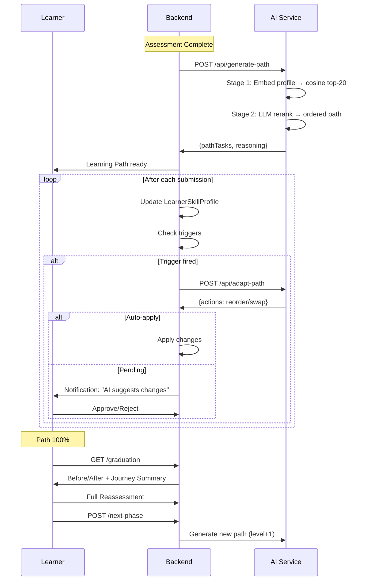

# 05 - Feature: Learning Path & Continuous Adaptation (F3 + F16)
> الحالة: ✅ مكتمل

---

## ملخص (للـ Presentation)

مسار تعلم مخصص يُنشأ بالذكاء الاصطناعي ويتكيّف مع تقدمك — ليس ثابتاً بل حي ومتغيّر.

---

## كيف يُنشأ المسار (Hybrid Recall + LLM Rerank)

### Stage 1: Embedding Recall
```
Learner Profile → text-embedding-3-small → 1536-dim vector
↓
Cosine Similarity vs Task Embeddings Cache → Top-20 candidates
```
- يُبنى نص يصف المتعلم (المستوى، نقاط القوة والضعف، ملخص التقييم)
- يُحوَّل لـ Vector بنفس نموذج Embeddings المستخدم في RAG
- يُقارن بجميع المهام المخزّنة ← يختار أقرب 20

### Stage 2: LLM Rerank
```
Top-20 candidates + Learner Context → GPT-5.1-codex-mini → Ordered path (5-10 tasks)
```
- الـ LLM يقرأ:
  - ملف الطالب (نقاط كل مهارة)
  - ملخص التقييم
  - الـ 20 مهمة المرشحة (عنوان + صعوبة + skills + prerequisites)
  - المهام المكتملة سابقاً
- يُخرج مسار مرتب من 5-10 مهام مع تبرير لكل اختيار

### الفحوصات (Validations):
1. **Pydantic Schema** — كل entry لها taskId, orderIndex, reasoning, focusSkills
2. **Cross-check** — كل taskId يجب أن يكون في الـ candidates
3. **No completed** — لا يختار مهمة أكملتها سابقاً
4. **Topology** — كل prerequisite يجب أن يظهر قبلها أو يكون مكتملاً
5. **Retry** — عند فشل أي فحص: يعيد المحاولة مع شرح الخطأ (حتى مرتين)

---

## التكيّف المستمر (Continuous Adaptation - F16)

### المحفزات (Triggers):

| المحفز | الشرط | يتجاوز Cooldown؟ |
|--------|-------|-----------------|
| **Periodic** | كل 3 مهام مكتملة | ❌ |
| **Score Swing** | تغيّر >10 نقاط في أي فئة | ❌ |
| **Path 100%** | إكمال المسار بالكامل | ✅ |
| **On-Demand** | المتعلم يطلب تحديث | ✅ |
| **Mini Reassessment** | بعد اختبار قصير عند 50% | ❌ |

### مستويات الإشارة (Signal Levels):

| المستوى | التغيير | الإجراءات المسموحة |
|---------|---------|-------------------|
| **Small** (<10) | لا شيء | —— |
| **Small** (10-20) | إعادة ترتيب فقط | Reorder within same skill |
| **Medium** (20-30) | ترتيب + تبديل | Reorder + Swap one task |
| **Large** (>30 أو 100%) | كل شيء | Reorder + Multiple swaps |

### Auto-Apply vs Pending:
```
if action.type == "reorder" AND confidence > 0.8 AND intra-skill:
    → Auto-apply (تطبيق تلقائي)
else:
    → Pending (ينتظر موافقة المتعلم)
```

### مكافحة التقلبات (Anti-Thrashing):
- **24h Cooldown** — لا تكيّف أكثر من مرة كل 24 ساعة
- **10pt Confidence Threshold** — لا تغيير إلا عند تغيير كبير
- **Full Audit Log** — كل تكيّف مسجّل بالتفصيل

---

## التخرّج (Graduation Flow)

```
Path 100% → Graduation Page → Before/After Radar Chart
    → Full Reassessment (30Q) → New Skill Profile
    → AI generates Next Phase Path (level+1)
```

---

## Sequence Diagram



---

## الملفات المرجعية
- ✅ `ai-service/app/services/path_generator.py` — 700 سطر (Hybrid recall + LLM rerank)
- ✅ `docs/assessment-learning-path.md` §§4.4, 7 — Flow C, D
- ✅ `frontend/src/features/learning-path/` — UI components

---

## نقاط للعرض

### ✅ ركّز على:
- **Hybrid Approach**: Embeddings + LLM = أفضل من كل واحد بمفرده
- **التكيّف الحي**: اعرض "قبل وبعد" للمسار بعد تحسّن المتعلم
- **Topology Check**: المسار يحترم الـ Prerequisites تلقائياً
- **الـ Demo**: اعرض مسار حقيقي مع AI Reasoning لكل مهمة

### ❌ تجنّب:
- تفاصيل الـ JSON schema
- شرح الـ retry mechanism
