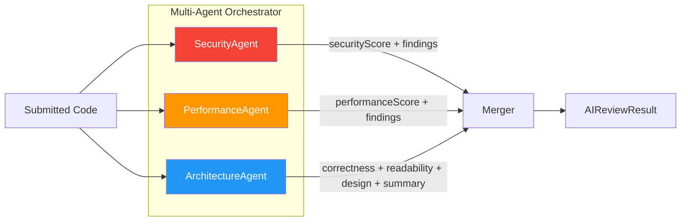
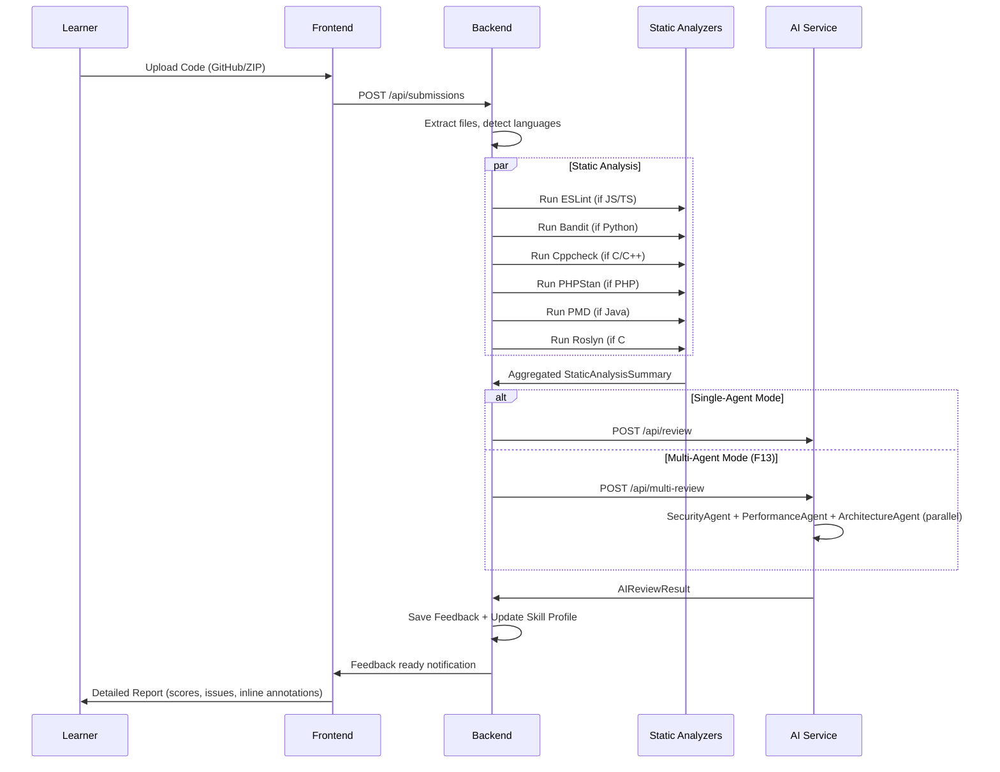

# 06 - Feature: Code Review Pipeline (F5 + F6 + F13)
> الحالة: ✅ مكتمل

---

## ملخص (للـ Presentation)

نظام مراجعة كود متعدد الطبقات يجمع بين **6 أدوات تحليل ثابت** و**مراجعة AI متعددة الوكلاء** لتقديم تغذية راجعة بمستوى مطور أقدم في أقل من 5 دقائق.

---

## طبقات المراجعة

### الطبقة 1: Static Analysis (6 أدوات)

| الأداة | اللغات | ما تكشفه |
|--------|--------|----------|
| **ESLint** | JavaScript, TypeScript | أخطاء بنائية، أنماط سيئة، ES6+ issues |
| **Bandit** | Python | ثغرات أمنية، injection, hardcoded passwords |
| **Cppcheck** | C, C++ | memory leaks, buffer overflows, undefined behavior |
| **PHPStan** | PHP | type errors, dead code, deprecated functions |
| **PMD** | Java | code smells, complexity, naming conventions |
| **Roslyn Analyzers** | C# | .NET best practices, async issues, null safety |

### كيف تعمل:
```
Upload Code → Extract Files → Detect Languages → Run Matching Analyzers
     → Parse Results → Aggregate → Feed to AI Reviewer
```
- كل أداة تعمل في container معزول (Docker)
- النتائج تُجمع في `StaticAnalysisSummary`: إجمالي المشاكل، الحرجة، الفئات
- تُمرر كـ context للـ AI Reviewer

---

### الطبقة 2: AI Review — Single-Agent (`ai_reviewer.py`)

الـ AI Reviewer الأساسي — **464 سطر**:

#### المحاور الخمسة + واحد:
| المحور | الوصف | المدى |
|--------|-------|-------|
| **Correctness** | هل الكود يعمل صح؟ | 0-100 |
| **Readability** | هل الكود سهل القراءة والفهم؟ | 0-100 |
| **Security** | هل فيه ثغرات أمنية؟ | 0-100 |
| **Performance** | هل الكود كفء؟ | 0-100 |
| **Design** | هل التصميم والمعمارية جيدة؟ | 0-100 |
| **Task Fit** | هل الكود يحل المهمة المطلوبة فعلاً؟ | 0-100 |

#### المخرجات:
- **Overall Score** (0-100)
- **Per-axis Scores** (6 محاور)
- **Strengths** — نقاط القوة
- **Weaknesses** — نقاط الضعف
- **Recommendations** — توصيات محددة
- **Detailed Issues** — مشاكل مفصلة مع file/line
- **Learning Resources** — مصادر تعلم مقترحة
- **Executive Summary** — ملخص تنفيذي
- **Progress Analysis** — تحليل التقدم مقارنة بالمحاولات السابقة

#### Task Fit Capping:
```
if taskFit < 50:
    overall_score = min(overall_score, 30)
```
→ حتى لو الكود ممتاز لكنه لا يحل المهمة المطلوبة = الدرجة الكلية لا تتجاوز 30

---

### الطبقة 3: Multi-Agent Review (F13) (`multi_agent.py`)

**702 سطر** — 3 وكلاء متخصصين يعملون بالتوازي:



#### الوكلاء:
| الوكيل | المسؤولية | Template |
|--------|----------|----------|
| **SecurityAgent** | `security` score + findings + annotations | `agent_security.v1.txt` |
| **PerformanceAgent** | `performance` score + findings + annotations | `agent_performance.v1.txt` |
| **ArchitectureAgent** | `correctness` + `readability` + `design` + كل الملخصات | `agent_architecture.v1.txt` |

#### كيف يعمل:
1. `asyncio.gather` — 3 agents يعملون **بالتوازي** (timeout 90s/agent)
2. كل agent له prompt خاص ومسؤولية محددة
3. **Merge**: النتائج تُدمج في `AIReviewResult` واحد
4. **Dedup**: `Jaccard similarity ≥ 0.7` لمنع تكرار نفس النقطة
5. **Partial mode**: إذا فشل agent واحد → النتيجة جزئية (الباقي يعمل)
6. **Annotations merge**: تعليقات inline تُدمج بـ (file, line) — إذا عدة agents علّقوا على نفس السطر يُضاف prefix

#### لماذا Multi-Agent أفضل من Single-Prompt؟
- **تخصص**: كل agent يركز على مجاله فقط = تحليل أعمق
- **تزامن**: 3 agents بالتوازي ≈ نفس وقت agent واحد
- **موثوقية**: إذا فشل agent واحد لا يفشل كل شيء
- **تكلفة**: ~3× من single-prompt لكن أعمق بكثير

---

## Pipeline الكامل



---

## Enhanced Review (F14)

عند المحاولة الثانية فما فوق:
- يتلقى الـ AI **تاريخ المحاولات السابقة** (up to 9 submissions)
- يقارن: "ما تحسّن؟ ما تكرر؟ ما الجديد؟"
- يُخرج `progressAnalysis` + يعلّم `isRepeatedMistake` على المشاكل المتكررة

---

## الملفات المرجعية
- ✅ `ai-service/app/services/ai_reviewer.py` — 464 سطر (Single-agent)
- ✅ `ai-service/app/services/multi_agent.py` — 702 سطر (Multi-agent orchestrator)
- ✅ `ai-service/app/services/prompts.py` — Prompt building
- ✅ `docs/architecture.md` §4.5 — Code Review Data Flow
- ✅ `docs/PRD.md` §4.6-4.7 — User Stories F6, F7

---

## نقاط للعرض

### ✅ ركّز على:
- **الـ Pipeline المرئي**: Static Analysis → AI Review → Feedback Report
- **3 Agents بالتوازي**: اعرض الـ diagram
- **مثال حقيقي**: قبل وبعد — كود فيه مشكلة أمنية والـ SecurityAgent يكتشفها
- **6 محاور + Task Fit**: اعرض الـ Radar Chart
- **مقارنة سريعة**: Single vs Multi-Agent

### ❌ تجنّب:
- تفاصيل JSON repair
- كود الـ parsing
