# Code Mentor V1: AI-Powered Learning & Code Review Platform

A senior project submitted in partial fulfillment of the requirements for the degree of Bachelor of Computers and Artificial Intelligence.

**“Computer Science” Program, Benha 2026**

**Under Supervision**

**Dr. Mostafa Elgendy**

**Eng. Fatma Ibrahim**

**Eng. Doaa Mohamed**

**Project Team Members**

> Ahmed Khaled Yassin Ahmed
> 
> 
> Eslam Emad Ebrahim Medny
> 
> Mohamed Ahmed Hassbo Ahmed
> 
> Mahmoud Ahmed Mostafa Abdelmoaty
> 
> Mahmoud Mohamed Mahmoud Abdelhamid
> 
> Omar Anwar Helmy Ahmed
> 
> Ziad Ahmed Mohamed Salem
> 

TABLE OF CONTENTS

*Page numbers below are placeholders — they will be regenerated automatically by Word when this document is exported to `.docx`. Section titles below match the body headings exactly (regenerated 2026-05-16 to align with the v2.2 content and the M0 → M4 milestone vocabulary).*

[Declaration 5](#declaration)

[Acknowledgment 5](#acknowledgment)

[Abstract 5](#abstract)

[Chapter One: Project Introduction & Background 6](#chapter-one-project-introduction-background)

[1.1 Introduction 6](#introduction)

[1.2 Problem Definition 7](#problem-definition)

[**1.2.1 The Feedback Desert in Self-Learning** 7](#the-feedback-desert-in-self-learning)

[**1.2.2 The Prohibitive Cost Barrier of Bootcamps** 8](#the-prohibitive-cost-barrier-of-bootcamps)

[**1.2.3 The Scalability Challenge of Human Mentorship** 8](#the-scalability-challenge-of-human-mentorship)

[**1.2.4 The Lack of Credible Credentials** 8](#the-lack-of-credible-credentials)

[1.3 Proposed Solution 9](#proposed-solution)

[**1.3.1 Personalized, Adaptive Learning Path** 9](#personalized-adaptive-learning-path)

[**1.3.2 Multi-Layered AI Code Review** 9](#multi-layered-ai-code-review)

[**1.3.3 Shareable Learning CV** 9](#shareable-learning-cv)

[**1.3.4 Lightweight Engagement Surface (stretch — not a core pillar)** 9](#lightweight-engagement-surface-stretch-not-a-core-pillar)

[**1.3.5 Conversational AI Mentor + Standalone Project Audit (added 2026-05)** 10](#conversational-ai-mentor-standalone-project-audit-added-2026-05)

[1.4 Literature Review 10](#literature-review)

[**1.4.1 Competitor Landscape** 10](#competitor-landscape)

[**1.4.2 Feature Comparison Matrix** 11](#feature-comparison-matrix)

[**1.4.3 Strategic Competitive Advantages** 12](#strategic-competitive-advantages)

[1.5 Project Objectives 13](#project-objectives)

[**1.5.1 Primary Objective** 13](#primary-objective)

[**1.5.2 Secondary Objectives** 13](#secondary-objectives)

[**1.5.3 Long-Term Research Goals** 13](#long-term-research-goals)

[1.6 Scope of the Project 14](#scope-of-the-project)

[**1.6.1 Core Learning & Assessment Scope** 14](#core-learning-assessment-scope)

[**1.6.2 Code Analysis & Feedback Scope** 15](#code-analysis-feedback-scope)

[**1.6.3 Career & Progress Tracking Scope** 16](#career-progress-tracking-scope)

[1.7 Scope Exclusions and Constraints 16](#scope-exclusions-and-constraints)

[**1.7.1 Scope Exclusions** 17](#scope-exclusions)

[**1.7.2 Constraints** 18](#constraints)

[1.8 Project Methodology Overview 19](#project-methodology-overview)

[**1.8.1 Milestone-Driven Rollout (M0 → M4)** 19](#milestone-driven-rollout-m0-m4)

[**1.8.2 Core Agile Practices** 19](#core-agile-practices)

[**1.8.3 Communication & Transparency** 20](#communication-transparency)

[Chapter Two: Project Management 20](#chapter-two-project-management)

[2.1 Project Organization 20](#project-organization)

[2.2 Risk Management 22](#risk-management)

[**2.2.1 Risk Assessment Approach** 22](#risk-assessment-approach)

[**2.2.2 Technical Risks — Matrix & Mitigations** 22](#technical-risks-matrix-mitigations)

[**2.2.3 Product Risks — Matrix & Mitigations** 25](#product-risks-matrix-mitigations)

[2.3 Project Communication Plan 26](#project-communication-plan)

[**2.3.1 Communication Structure** 26](#communication-structure)

[2.4 Work Breakdown Structure (WBS) 27](#work-breakdown-structure-wbs)

[**2.4.1 WBS Structure** 27](#wbs-structure)

[**2.4.2 Work Breakdown** 27](#work-breakdown)

[2.5 Time Management (PERT, Gantt Chart) 28](#time-management-pert-gantt-chart)

[**2.5.1 PERT Estimation** 28](#pert-estimation)

[**2.5.2 Network Diagram** 30](#network-diagram)

[**2.5.3 Gantt Chart** 31](#gantt-chart)

[Chapter Three: System Analysis 32](#chapter-three-system-analysis)

[3.1 Introduction 32](#introduction-1)

[3.2 Planning 32](#planning)

[3.3 System Requirements 34](#system-requirements)

[**3.3.1 Functional Requirements (FR)** 34](#functional-requirements-fr)

[**3.3.2 Non-Functional Requirements (NFR)** 42](#non-functional-requirements-nfr)

[3.4 Stakeholders 51](#stakeholders)

[**Primary Stakeholders (Direct Users)** 51](#primary-stakeholders-direct-users)

[**Secondary Stakeholders (Indirect Beneficiaries)** 51](#secondary-stakeholders-indirect-beneficiaries)

[**Stakeholder Analysis Matrix** 52](#stakeholder-analysis-matrix)

[Chapter Four: System Design 53](#chapter-four-system-design)

[4.1 Introduction 53](#introduction-2)

[4.2 Block Diagram 55](#block-diagram)

[**4.2.1 Overview** 55](#overview)

[**4.2.2 Block Diagram** 56](#block-diagram-1)

[**4.2.3 Explanation of the Block Diagram** 57](#explanation-of-the-block-diagram)

[4.3 Use Case Diagram 60](#use-case-diagram)

[**4.3.1 Overview** 60](#overview-1)

[4.4 Activity Diagrams 62](#activity-diagrams)

[**4.4.1 Overview** 62](#overview-2)

[**4.4.2 User Authentication & Login Activity** 63](#user-authentication-login-activity)

[**4.4.3 Adaptive Assessment Activity** 65](#adaptive-assessment-activity)

[**4.4.4 Code Submission — Ingestion & Queueing Activity** 67](#code-submission-ingestion-queueing-activity)

[**4.4.5 Submission Processing — Static + AI Analysis Activity** 68](#submission-processing-static-ai-analysis-activity)

[**4.4.6 Feedback Review & Learning Path Update Activity** 70](#feedback-review-learning-path-update-activity)

[4.5 Sequence Diagrams 72](#sequence-diagrams)

[**4.5.1 Sequence Diagram: User Authentication (Email/Password + GitHub OAuth)** 72](#sequence-diagram-user-authentication-emailpassword-github-oauth)

[**4.5.2 Sequence Diagram: Adaptive Assessment & Learning Path Generation** 74](#sequence-diagram-adaptive-assessment-learning-path-generation)

[**4.5.3 Sequence Diagram: Code Submission & Analysis Pipeline** 76](#sequence-diagram-code-submission-analysis-pipeline)

[**4.5.4 Sequence Diagram: Viewing AI Feedback & Adding Recommended Tasks** 78](#sequence-diagram-viewing-ai-feedback-adding-recommended-tasks)

[4.6 Context Diagram 85](#context-diagram)

[**4.6.1 Overview** 85](#overview-3)

[**4.6.2 Context Diagram** 86](#context-diagram-1)

[**4.6.3 Context Diagram Explanation** 86](#context-diagram-explanation)

[**4.7 Data Flow Diagrams (DFD)** 87](#data-flow-diagrams-dfd)

[**4.7.1 Overview** 87](#overview-4)

[**4.7.2 DFD Hierarchy** 87](#dfd-hierarchy)

[**4.7.3 Level 0 DFD – Context-Level Overview** 88](#level-0-dfd-context-level-overview)

[**4.7.4 Level 1 DFD – Major Subsystem Decomposition** 89](#level-1-dfd-major-subsystem-decomposition)

[4.8 Database Design 91](#database-design)

[**4.8.1 Overview** 91](#overview-5)

[**4.8.2 Entity-Relationship Diagram (ERD)** 92](#entity-relationship-diagram-erd)

[**4.8.2.1 Entity Descriptions** 95](#entity-descriptions)

[Chapter Five: Methodology 100](#chapter-five-methodology)

[5.1 Introduction 100](#introduction-3)

[5.2 Development Lifecycle Approach 101](#development-lifecycle-approach)

[**5.2.1 Sprint cadence** 101](#sprint-cadence)

[**5.2.2 Milestone-driven rollout (M0 → M4)** 102](#milestone-driven-rollout-m0-m4-1)

[**5.2.3 Stop-gate reviews** 103](#stop-gate-reviews)

[5.3 Architectural Decision Records (ADR) System 104](#architectural-decision-records-adr-system)

[**5.3.1 The ADR template** 104](#the-adr-template)

[**5.3.2 ADR catalogue summary** 105](#adr-catalogue-summary)

[**5.3.3 ADR rules** 106](#adr-rules)

[5.4 Three-Service Architecture 107](#three-service-architecture)

[**5.4.1 Frontend service (Vite + React 18 + TypeScript)** 107](#frontend-service-vite-react-18-typescript)

[**5.4.2 Backend service (.NET 10 + Clean Architecture)** 108](#backend-service-net-10-clean-architecture)

[**5.4.3 AI service (Python + FastAPI)** 109](#ai-service-python-fastapi)

[**5.4.4 Why three services, not microservices** 110](#why-three-services-not-microservices)

[5.5 Build-Pipeline Documentation Approach 111](#build-pipeline-documentation-approach)

[5.6 Quality Engineering Practices 112](#quality-engineering-practices)

[**5.6.1 The test pyramid** 112](#the-test-pyramid)

[**5.6.2 Code-quality gates** 113](#code-quality-gates)

[**5.6.3 Conventional commits + PR template** 113](#conventional-commits-pr-template)

[5.7 Design-System-First UI Approach 114](#design-system-first-ui-approach)

[**5.7.1 The Neon & Glass identity (ADR-030)** 114](#the-neon-glass-identity-adr-030)

[**5.7.2 Design tokens and component library** 115](#design-tokens-and-component-library)

[**5.7.3 Sprint 13 UI redesign integration** 116](#sprint-13-ui-redesign-integration)

[Chapter Six: Implementation 117](#chapter-six-implementation)

[6.1 Implementation Strategy Overview 117](#implementation-strategy-overview)

[6.2 Backend Implementation (.NET 10) 118](#backend-implementation-net-10)

[**6.2.1 Clean Architecture layout** 118](#clean-architecture-layout)

[**6.2.2 Authentication & Identity (F1)** 119](#authentication-identity-f1)

[**6.2.3 Adaptive Assessment Engine (F2 + F15)** 120](#adaptive-assessment-engine-f2-f15)

[**6.2.4 Learning Path Generator (F3 + F16)** 121](#learning-path-generator-f3-f16)

[**6.2.5 Task Library (F4)** 122](#task-library-f4)

[**6.2.6 Code Submission Pipeline (F5)** 123](#code-submission-pipeline-f5)

[**6.2.7 Hangfire jobs** 125](#hangfire-jobs)

[**6.2.8 Project Audit (F11)** 126](#project-audit-f11)

[**6.2.9 Mentor Chat (F12)** 127](#mentor-chat-f12)

[**6.2.10 Multi-Agent Code Review (F13)** 128](#multi-agent-code-review-f13)

[**6.2.11 Learning CV (F10)** 129](#learning-cv-f10)

[**6.2.12 Admin Panel (F9)** 130](#admin-panel-f9)

[6.3 Frontend Implementation (Vite + React 18) 131](#frontend-implementation-vite-react-18)

[**6.3.1 Project layout** 131](#project-layout)

[**6.3.2 State management (Redux Toolkit)** 132](#state-management-redux-toolkit)

[**6.3.3 Routing (React Router v6)** 132](#routing-react-router-v6)

[**6.3.4 Forms (React Hook Form + Zod)** 133](#forms-react-hook-form-zod)

[**6.3.5 Skill radar (Recharts)** 133](#skill-radar-recharts)

[**6.3.6 Code rendering (Prism.js)** 133](#code-rendering-prism-js)

[**6.3.7 Server-Sent Events (SSE) for Mentor Chat** 134](#server-sent-events-sse-for-mentor-chat)

[**6.3.8 Neon & Glass tokens** 134](#neon-glass-tokens)

[**6.3.9 Sprint 13 — UI redesign integration** 135](#sprint-13-ui-redesign-integration-1)

[6.4 AI Service Implementation (Python + FastAPI) 136](#ai-service-implementation-python-fastapi)

[**6.4.1 Project layout** 136](#project-layout-1)

[**6.4.2 Router groups** 136](#router-groups)

[**6.4.3 Static-analysis containers** 137](#static-analysis-containers)

[**6.4.4 Prompt versioning** 138](#prompt-versioning)

[**6.4.5 RAG retrieval (F12)** 138](#rag-retrieval-f12)

[**6.4.6 IRT-lite engine (F15)** 139](#irt-lite-engine-f15)

[**6.4.7 Hybrid retrieval-rerank (F16)** 139](#hybrid-retrieval-rerank-f16)

[**6.4.8 Continuous adaptation (F16)** 140](#continuous-adaptation-f16)

[6.5 Adaptive AI Learning System Deep-Dive (F15 + F16) 141](#adaptive-ai-learning-system-deep-dive-f15-f16)

[**6.5.1 Trust chain disclosure** 142](#trust-chain-disclosure)

[6.6 Infrastructure Implementation 143](#infrastructure-implementation)

[**6.6.1 docker-compose orchestration** 143](#docker-compose-orchestration)

[**6.6.2 SQL Server schema management** 143](#sql-server-schema-management)

[**6.6.3 Redis (cache + rate limiter)** 144](#redis-cache-rate-limiter)

[**6.6.4 Qdrant (vector index)** 144](#qdrant-vector-index)

[**6.6.5 Azurite (Blob storage emulator)** 144](#azurite-blob-storage-emulator)

[6.7 Sprint-by-Sprint Highlights 145](#sprint-by-sprint-highlights)

[6.8 Notable Implementation Challenges 148](#notable-implementation-challenges)

[Chapter Seven: Testing and Validation 150](#chapter-seven-testing-and-validation)

[7.1 Testing Strategy Overview 150](#testing-strategy-overview)

[7.2 Unit Testing 151](#unit-testing)

[**7.2.1 Backend (.NET — xUnit + Moq + AutoFixture)** 151](#backend-net-xunit-moq-autofixture)

[**7.2.2 Frontend (Vitest + React Testing Library + MSW)** 152](#frontend-vitest-react-testing-library-msw)

[**7.2.3 AI service (pytest + pytest-asyncio + httpx)** 152](#ai-service-pytest-pytest-asyncio-httpx)

[7.3 Integration Testing 153](#integration-testing)

[**7.3.1 Backend integration (xUnit + WebApplicationFactory + Testcontainers)** 153](#backend-integration-xunit-webapplicationfactory-testcontainers)

[**7.3.2 Hangfire job integration** 154](#hangfire-job-integration)

[**7.3.3 AI service contract tests** 154](#ai-service-contract-tests)

[7.4 End-to-End Testing 155](#end-to-end-testing)

[7.5 Performance Testing 155](#performance-testing)

[**7.5.1 k6 load test (Sprint 11)** 155](#k6-load-test-sprint-11)

[**7.5.2 Pipeline duration** 156](#pipeline-duration)

[7.6 Security Testing 157](#security-testing)

[**7.6.1 OWASP ASVS Level 2 sweep** 157](#owasp-asvs-level-2-sweep)

[**7.6.2 Dependency vulnerability scanning** 158](#dependency-vulnerability-scanning)

[**7.6.3 Manual penetration testing** 158](#manual-penetration-testing)

[7.7 AI Quality Evaluation 159](#ai-quality-evaluation)

[**7.7.1 Multi-agent A/B (F13 evaluation harness)** 159](#multi-agent-ab-f13-evaluation-harness)

[**7.7.2 IRT engine accuracy** 160](#irt-engine-accuracy)

[**7.7.3 Empirical IRT recalibration** 160](#empirical-irt-recalibration)

[7.8 Usability Testing 161](#usability-testing)

[**7.8.1 Heuristic evaluation** 161](#heuristic-evaluation)

[**7.8.2 Tier-2 dogfood (F15/F16)** 162](#tier-2-dogfood-f15f16)

[**7.8.3 Pre-defense supervisor rehearsals** 162](#pre-defense-supervisor-rehearsals)

[7.9 Bug Tracking and MVP Stabilisation 163](#bug-tracking-and-mvp-stabilisation)

[Chapter Eight: Deployment and Operations 164](#chapter-eight-deployment-and-operations)

[8.1 Deployment Strategy 164](#deployment-strategy)

[8.2 Local Development Environment 165](#local-development-environment)

[**8.2.1 docker-compose services** 165](#docker-compose-services)

[**8.2.2 `start-dev.ps1` flow** 166](#start-dev-ps1-flow)

[**8.2.3 Environment configuration** 167](#environment-configuration)

[8.3 CI/CD Pipeline (GitHub Actions) 168](#cicd-pipeline-github-actions)

[**8.3.1 `build-and-test.yml`** 168](#build-and-test-yml)

[**8.3.2 `lint-and-typecheck.yml`** 168](#lint-and-typecheck-yml)

[**8.3.3 `security-scan.yml`** 169](#security-scan-yml)

[8.4 Defense-Day Operational Plan 170](#defense-day-operational-plan)

[**8.4.1 Single-laptop deployment** 170](#single-laptop-deployment)

[**8.4.2 Backup demo video** 170](#backup-demo-video)

[**8.4.3 Backup laptop** 171](#backup-laptop)

[**8.4.4 Supervisor rehearsals** 171](#supervisor-rehearsals)

[8.5 Post-Defense Azure Deployment Plan 172](#post-defense-azure-deployment-plan)

[**8.5.1 Target architecture** 172](#target-architecture)

[**8.5.2 Secrets migration** 173](#secrets-migration)

[**8.5.3 Migration runbook** 173](#migration-runbook)

[8.6 Observability 174](#observability)

[**8.6.1 Structured logging (Serilog)** 174](#structured-logging-serilog)

[**8.6.2 Seq (dev) + Application Insights (post-defense prod)** 174](#seq-dev-application-insights-post-defense-prod)

[**8.6.3 Hangfire dashboard** 175](#hangfire-dashboard)

[**8.6.4 Key dashboards (must exist before defense)** 175](#key-dashboards-must-exist-before-defense)

[8.7 Backups and Disaster Recovery 176](#backups-and-disaster-recovery)

[8.8 Why deployment is local-first for the MVP 177](#why-deployment-is-local-first-for-the-mvp)

[Chapter Nine: Future Vision 178](#chapter-nine-future-vision)

[9.1 Post-Graduation Roadmap 178](#post-graduation-roadmap)

[9.2 Engagement Surface Expansion 178](#engagement-surface-expansion)

[9.3 Authentication Polish 179](#authentication-polish)

[9.4 AI Layer Multi-Provider + Model Improvement 179](#ai-layer-multi-provider-model-improvement)

[9.5 Infrastructure Maturation 180](#infrastructure-maturation)

[9.6 Content Expansion 181](#content-expansion)

[9.7 Commerce Model 181](#commerce-model)

[9.8 Research Directions 182](#research-directions)

[Chapter Ten: Conclusion 183](#chapter-ten-conclusion)

[10.1 Summary 183](#summary)

[10.2 Quantitative Outcomes 184](#quantitative-outcomes)

[10.3 Academic Contributions 185](#academic-contributions)

[**10.3.1 Deliberately small 2PL IRT engine** 185](#deliberately-small-2pl-irt-engine)

[**10.3.2 Hybrid embedding-recall + LLM-rerank for curriculum generation** 186](#hybrid-embedding-recall-llm-rerank-for-curriculum-generation)

[**10.3.3 Continuous-adaptation policy with anti-thrashing** 186](#continuous-adaptation-policy-with-anti-thrashing)

[**10.3.4 Multi-agent code review prompt architecture** 187](#multi-agent-code-review-prompt-architecture)

[**10.3.5 RAG-grounded mentor chat with per-session scope enforcement** 187](#rag-grounded-mentor-chat-with-per-session-scope-enforcement)

[10.4 Challenges Faced 188](#challenges-faced)

[10.5 Lessons Learned 190](#lessons-learned)

[10.6 Concluding Remarks 191](#concluding-remarks)

[Chapter Eleven: References 192](#chapter-eleven-references)

[11.1 Academic Sources (IEEE-style) 192](#academic-sources-ieee-style)

[11.2 Software and Documentation (URL list) 194](#software-and-documentation-url-list)

[Appendix A — Architectural Decision Records (Selected) 198](#appendix-a-architectural-decision-records-selected)

[Appendix B — Sprint Progress Summary 200](#appendix-b-sprint-progress-summary)

[Appendix C — User Interface Screen Tour (Selected) 205](#appendix-c-user-interface-screen-tour-selected)

# **Declaration**

We, hereby declare that this graduation project, titled **“AI-Powered Learning & Code Review Platform,”** is our own original work. All sources used have been appropriately cited and acknowledged. This work has not been previously submitted for any other degree or qualification at this or any other institution.

# **Acknowledgment**

We would like to express our deepest gratitude to our project supervisor, **Dr. Mostafa Elgendy**, for their invaluable guidance, patience, and expert advice throughout this project. Their insights and constructive feedback were instrumental in shaping our research and development.

We also extend our sincere thanks to our teaching assistant, **Eng. Fatma Ibrahim**, for her continuous support and follow-up.

We also extend our sincere thanks to the faculty and staff of the **Computer Science Department, Faculty of Computers and Artificial Intelligence at Benha University,** for providing the academic foundation and resources necessary to complete this work.

Our heartfelt appreciation goes to our fellow team members for the collaborative spirit, late-night brainstorming sessions, and shared dedication that made this project a reality. We are also grateful to our families and friends for their unwavering support and encouragement during this challenging journey.

# Abstract

The landscape of coding education is marked by a significant gap: aspiring developers, particularly self-learners and career-switchers, lack access to the personalized, expert-quality feedback that is crucial for achieving professional competency. High-cost coding bootcamps provide this mentorship but remain financially inaccessible to many, while generic online courses offer scalability but minimal feedback, creating a **“feedback desert.”** Furthermore, graduates of self-study lack the verifiable credentials employer’s trust.

This project introduces an **“AI-Powered Learning & Code Review Platform,”** an intelligent learning ecosystem designed to democratize expert-quality coding education. The platform addresses these challenges by providing a comprehensive journey from skill assessment to employment readiness.

Upon joining, learners undergo an adaptive assessment to determine their current skill level, which then generates a personalised learning track (Full Stack, Backend, or Python for the MVP). Learners progress by building real-world projects and submitting their code via GitHub or ZIP upload. The core of the solution is a **multi-layered analysis engine** that combines per-language static analysis tools (ESLint, Roslyn, Bandit, Cppcheck, PHPStan, PMD — running in isolated containers) with the **OpenAI `gpt-5.1-codex-mini`** large-language model. This engine delivers comprehensive feedback within ~5 minutes covering functionality, code quality, security, performance, and design — emulating the review of a senior developer.

A key innovation is the **“Shareable Learning CV,”** a dynamic profile that showcases a learner’s verified skill progression, AI-assessed code quality, and project history, providing employers with credible, data-backed evidence of their capabilities. By combining the personalized attention of a bootcamp with the scalability and affordability of online education, this platform aims to bridge the learning gap and produce job-ready developers at a fraction of the traditional cost.

# **Chapter One: Project Introduction & Background**

## **1.1 Introduction**

Software development has become one of the most critical professional skills in the modern digital economy. As industries increasingly rely on software-driven systems, the demand for developers who can build secure, maintainable, and scalable applications continues to grow. Each year, millions of learners, including university students, self-taught developers, and career-switchers—enter the field seeking to acquire these skills.

Despite the abundance of online learning resources, a persistent gap remains between **basic coding literacy** and **professional software engineering competency**. While many learners can write code that functions correctly, far fewer develop the ability to produce production-quality software that meets industry standards for architecture, security, performance, and maintainability. Bridging this gap requires more than instructional content; it requires continuous evaluation, guided improvement, and credible validation of skill development.

This project introduces the **AI-Powered Learning & Code Review Platform**, an intelligent educational ecosystem designed to support learners throughout their progression from novice to job-ready developer. By combining adaptive assessment, automated multi-layered code review, and data-driven skill validation, the platform aims to deliver scalable, high-quality learning support that aligns closely with real-world software engineering practices.

This chapter establishes the academic and practical foundation of the project by defining the underlying problem, presenting the proposed solution, reviewing related work, and clarifying the project’s objectives and scope.

## **1.2 Problem Definition**

Although access to programming education has expanded significantly, several structural limitations continue to hinder learners’ progression toward professional competency. These limitations are systemic rather than incidental and affect the majority of self-directed and early-career developers.

### **1.2.1 The Feedback Desert in Self-Learning**

Self-taught developers predominantly rely on free or low-cost platforms such as YouTube, Udemy, Codecademy, and freeCodeCamp. While these platforms deliver structured curricula, they fundamentally fail to provide meaningful, individualized code evaluation—leaving learners without the expert feedback essential for developing industry-ready competencies.

**Critical Deficiencies:**

- **Absence of Quality Assurance:** Learners can verify functional correctness (i.e., whether code *executes*) but cannot assess adherence to best practices, identification of security vulnerabilities, or evaluation of readability and maintainability standards.
- **Generic Learning Pathways:** These platforms deliver one-size-fits-all curricula that fail to adapt to individual learner strengths, weaknesses, or progression rates. A student struggling with exception handling receives identical instruction as one who has already mastered the concept.
- **Overemphasis on Functionality Over Craftsmanship:** Algorithm-focused platforms like LeetCode and HackerRank prioritize functional correctness almost exclusively. Professional competencies—including software architecture, code structure, performance optimization, design patterns, and naming conventions—remain largely unaddressed.

This educational paradigm creates an environment where “knowing how to write code” diverges substantially from “knowing how to write professional, maintainable, industry-standard code.”

### **1.2.2 The Prohibitive Cost Barrier of Bootcamps**

Coding bootcamps attempt to address the feedback deficit through human mentorship and comprehensive code review. However, their financial model introduces a severe accessibility barrier.

Programs typically cost between **$5,000 and $20,000+**, rendering them inaccessible to most learners—including students, self-funded individuals, and career-switchers. This cost structure transforms expert feedback from an educational resource into a socioeconomic privilege, thereby perpetuating educational inequality.

A vast population of motivated, capable learners remains unable to access the level of guidance necessary to transition successfully into professional software development roles.

### **1.2.3 The Scalability Challenge of Human Mentorship**

Human mentorship delivers high-quality coaching, but it **does not scale**:

- Mentors can support only small cohorts.
- Platforms like Exercism suffer from **24–72 hour review delays**, leading to:
    - Loss of momentum
    - Fragmented context
    - Inconsistent feedback
    - Slow learning cycles

These limitations prevent timely, reliable, and scalable expert review—something AI systems can uniquely provide.

### **1.2.4 The Lack of Credible Credentials**

Self-taught developers face significant challenges in demonstrating competence through mechanisms that employers recognize and trust.

**Credibility Gaps:**

- **Low-Value Certificates:** Course completion certificates indicate participation rather than mastery, offering minimal signal of actual competency.
- **Unverifiable Skill Claims:** Résumé statements such as “Proficient in React” remain subjective and unsupported by objective evidence.
- **Opaque Skill Development:** GitHub repositories showcase completed projects but fail to reveal the developer’s learning trajectory, coding practices, problem-solving methodology, or skill evolution over time.

This credibility deficit forces self-taught learners to repeatedly “prove themselves” in competitive hiring processes, whereas graduates of structured bootcamp programs inherently benefit from institutionally validated credentials. This platform aims to eliminate this disparity by producing transparent, data-backed, verifiable learning credentials.

## **1.3 Proposed Solution**

To address these challenges, this project proposes an **AI-Powered Learning & Code Review Platform** that delivers expert-level guidance, adaptive learning, and verifiable credentials at scale. The platform is designed as an end-to-end learning system that integrates assessment, practice, feedback, and progress validation into a unified workflow.

The solution is structured around five core pillars.

### **1.3.1 Personalized, Adaptive Learning Path**

Learners begin with an automated assessment that evaluates their current proficiency across key development domains. Based on assessment results, the system generates a personalized learning path composed of practical, real-world projects. The learning path evolves dynamically as the learner progresses, continuously adjusting task recommendations to reflect demonstrated strengths and weaknesses.

### **1.3.2 Multi-Layered AI Code Review**

Submitted code undergoes a structured review pipeline consisting of:

- **Static Analysis:** Automated tools detect code smells, security issues, style violations, and maintainability concerns.
- **AI Contextual Analysis:** Advanced language models evaluate architectural decisions, logic correctness, performance implications, and adherence to best practices.

This layered approach enables comprehensive feedback that approximates senior-level code review while remaining scalable and responsive.

### **1.3.3 Shareable Learning CV**

The platform generates a dynamic **Learning CV** that aggregates validated skill metrics, historical performance data, and project-based evidence. Unlike traditional certificates, this CV provides employers with transparent, data-backed insight into a learner’s capabilities and progression over time.

### **1.3.4 Lightweight Engagement Surface (stretch — not a core pillar)**

The MVP keeps engagement-oriented features deliberately small to protect the core learning-feedback loop:

- A small set of hand-designed **starter badges** (e.g., *First Submission*, *First Perfect Category Score*, *First Learning CV Generated*) ships as stretch feature **SF2**.
- A **skill-trend analytics view** (per-category line charts over time, weekly submission bars) ships as stretch feature **SF1**.
- **AI-recommended next-task chips** on every feedback view ship as stretch feature **SF3**.
- **Per-category feedback ratings** (thumbs up / down) collect data for the thesis evaluation chapter as stretch feature **SF4**.

Deeper gamification — streaks, XP, leaderboards, peer benchmarking, full badge catalogue — is **explicitly deferred to post-MVP** (PRD §5.3). The four MVP pillars (1.3.1 Adaptive Learning Path, 1.3.2 Multi-Layered AI Code Review, 1.3.3 Learning CV, and a fourth pillar covered in 1.3.5 below) are what the project’s value proposition rests on; engagement features support those pillars without becoming the project’s identity.

### **1.3.5 Conversational AI Mentor + Standalone Project Audit (added 2026-05)**

Two flagship surfaces were added during the second half of the project to differentiate the platform at defense:

- **AI Mentor Chat (F12):** an in-context conversational chat panel on every Submission and every Project Audit. The chat is grounded in the learner’s actual code via Retrieval-Augmented Generation (RAG) over a Qdrant vector index. Learners can ask follow-up questions such as “why is line 42 a security risk?” or “show me how to refactor this method”, and the answer references their real code rather than offering generic advice.
- **Standalone Project Audit (F11):** any authenticated user can submit a personal project (GitHub URL or ZIP) plus a structured description and receive a comprehensive AI audit independently of any learning path. The audit returns a 6-category breakdown (Code Quality, Security, Performance, Architecture, Maintainability, Completeness vs description) with prioritised improvement steps.

Both surfaces preserve the four pillars above — they extend the reach of expert-quality feedback to learners’ real work, not just curated tasks.

## **1.4 Literature Review**

An extensive review of existing learning platforms, mentorship models, and AI-based development tools was conducted to contextualize the proposed system and identify gaps in current solutions.

### **1.4.1 Competitor Landscape**

Existing platforms can be broadly categorized into:

- **Algorithm-focused platforms** (e.g., LeetCode, HackerRank), which emphasize problem-solving but lack holistic code evaluation.
- **Interactive course platforms** (e.g., Codecademy, Scrimba), which provide guided instruction with limited adaptivity.
- **Mentorship-driven platforms** (e.g., Exercism), which offer personalized feedback but suffer from scalability constraints.
- **Coding bootcamps**, which provide comprehensive mentorship at high financial cost.
- **Professional AI code review tools**, which are not designed for structured learning or credentialing.

Each category addresses specific aspects of developer education but fails to provide an integrated, scalable solution that combines adaptive learning, deep feedback, and credential validation.

### **1.4.2 Feature Comparison Matrix**

| Feature | LC | HR | CC | SC | EX | BC | AI | ours |
| --- | --- | --- | --- | --- | --- | --- | --- | --- |
| AI Code Review | ✘ | ✘ | ✘ | ✘ | ✘ | 🔷 | ✔ | ✔ |
| Code Quality Check | ✘ | ✘ | ✘ | ✘ | ✔ | ✔ | ✔ | ✔ |
| Security Analysis | ✘ | ✘ | ✘ | ✘ | ✘ | 🔷 | ✔ | ✔ |
| Design Patterns Review | ✘ | ✘ | ✘ | ✘ | ✘ | 🔷 | ✔ | ✔ |
| Personalized Path | ✘ | ✘ | ✘ | ✘ | ✘ | 🔷 | ✘ | ✔ |
| Adaptive Learning | ✘ | ✘ | ✘ | ✘ | ✘ | ✘ | ✘ | ✔ |
| Instant Feedback | ✔ | ✔ | ✔ | ✔ | ✘ | ✘ | ✔ | ✔ |
| Progress Analytics | 🔷 | 🔷 | 🔷 | 🔷 | ✘ | ✔ | ✘ | ✔ |
| Learning CV | ✘ | ✘ | ✘ | ✘ | ✘ | ✔ | ✘ | ✔ |
| Community | ✔ | ✔ | ✔ | ✔ | ✔ | ✔ | ✘ | ✔ |
| Real-World Projects | ✘ | ✘ | 🔷 | 🔷 | ✘ | ✔ | ✘ | ✔ |
| Adaptive Assessment | ✘ | ✘ | ✘ | ✘ | ✘ | ✘ | ✘ | ✔ |
| AI Code Recommendations | ✘ | ✘ | ✘ | ✘ | ✘ | ✘ | ✘ | ✔ |
| 24/7 Availability | ✔ | ✔ | ✔ | ✔ | ✘ | ✘ | ✔ | ✔ |
| Gamification | 🔷 | 🔷 | 🔷 | 🔷 | 🔷 | 🔷 | ✘ | ✔ |
| GitHub Integration | 🔷 | 🔷 | 🔷 | 🔷 | ✔ | 🔷 | ✔ | ✔ |
| Beginner Friendly | ✘ | ✘ | ✔ | ✔ | 🔷 | 🔷 | ✘ | ✔ |
| Pricing Per month | **$35** | **$40** | **$20-40** | **$20-30** | **Free** | **$5k-20k** | **$20-10** | **$20-50** |

**Legend:**

- ✔ Full Support / Best-in-Class
- 🔷 Partial Support / Limited Functionality
- ✘ Not Available / Not Applicable
- LC = LeetCode, HR = HackerRank, CC = Codecademy Pro, SC = Scrimba, EX = Exercism, BC = Bootcamps, AI = AI Tools

### **1.4.3 Strategic Competitive Advantages**

This platform *does not replicate competitors*. Instead, it merges their strengths while addressing their weaknesses.

**Borrowed Strengths, Enhanced Through AI**

- **From Bootcamps:** Expert-level review → delivered instantly and affordably via AI
- **From Codecademy/Scrimba:** Beginner accessibility → combined with deep analysis and adaptivity
- **From Exercism:** Iterative improvement → without delays or inconsistent mentor quality
- **From LeetCode:** Instant validation → extended to real-world project evaluation

**Unique Value Proposition (UVP)**

“Bootcamp-quality mentorship powered by scalable AI, enabling learners to achieve verifiable, job-ready skills at a fraction of traditional cost.”

**Key Differentiators:**

- Multi-layer, AI + static code review
- Personalized, adaptive learning paths
- Verifiable Learning CV with data-backed skill metrics
- 24/7 expert-level feedback, fully scalable

## **1.5 Project Objectives**

The objective of this research is to design and develop an **AI-powered learning and code review platform** that bridges the gap between self-learning limitations and industry-required software engineering skills. The system aims to deliver scalable, personalized, and expert-grade feedback that empowers learners to progress toward professional competency.

The following are the primary research objectives, structured to align with the project’s technical, educational, and AI-driven goals.

### **1.5.1 Primary Objective**

To build an intelligent, end-to-end learning ecosystem that evaluates, guides, and improves learners’ coding abilities through automated assessments, adaptive learning paths, and multi-layer AI code review—achieving educational outcomes comparable to expert human mentorship but with scalability and affordability.

### **1.5.2 Secondary Objectives**

- Develop an adaptive learning framework tailored to individual learner profiles.
- Implement a multi-layer AI code review system combining static and contextual analysis.
- Produce verifiable, data-driven learning credentials.
- Enhance learner engagement through structured gamification.

### **1.5.3 Long-Term Research Goals**

- Explore advanced AI reasoning such as repository-level analysis, multi-file understanding, and behavioral code analysis.
- Integrate ML models that predict a learner’s future performance, recommending career paths or specialization tracks.
- Introduce AI-assisted project building (e.g., AI pair programming for guided development).
- Expand into testing, cloud engineering, DevOps, system design, and other advanced engineering fields.

## **1.6 Scope of the Project**

The scope of this project encompasses the complete **design, development, validation, and deployment** of the **AI-Powered Learning & Code Review Platform**. The system is implemented using an enterprise-grade technology stack comprising **ASP.NET Core**, **SQL Server**, **React**, and **Python-based AI microservices**.

The defined scope aligns directly with the platform’s core pedagogical and technical pillars, ensuring the delivery of a cohesive intelligent learning environment that integrates assessment, guided practice, automated feedback, and progress validation. The scope is structured into three primary domains: learning and assessment, code analysis and feedback, and career and progress tracking.

### **1.6.1 Core Learning & Assessment Scope**

**User Authentication System**

A secure authentication layer using [ASP.NET](http://asp.net/) Core Identity, supporting:

- Email/password registration and login
- GitHub OAuth for simplified onboarding
- JWT-based session and token handling
- Password reset via verified email

**Adaptive Assessment Engine**

A 30-question adaptive exam that adjusts difficulty in real time to determine accurate proficiency levels (Beginner → Intermediate → Advanced). The platform ships with two assessment engines, selected automatically at runtime:

- **Default engine (M1 → M3):** a deterministic rule-based adaptive selector — 2 consecutive correct answers in a category escalate difficulty, 2 consecutive wrong de-escalate, and the per-category quota is bounded to keep the exam balanced.
- **Flagship engine (M4):** a **2PL Item Response Theory (IRT-lite)** model in which each question carries discrimination `a` and difficulty `b` parameters, the learner’s ability `θ` is MLE-estimated after every response via `scipy.optimize.minimize_scalar`, and the next item maximises Fisher information at the current `θ`. The engine includes an AI Question Generator (admin-side batch tool), an admin review-and-approve workflow, and a weekly empirical recalibration job for items with ≥ 50 responses. The rule-based adaptive selection engine serves as the automatic fallback when the AI service is unreachable.

**Technical implementation summary:**

- Question bank seeded with ≥ 60 items at M1 and scaled to ≥ 200 items by M4
- AI service exposes `POST /api/irt/select-next`; backend `AdaptiveQuestionSelector` delegates to it
- Per-category scoring (0–100) + overall level (Beginner < 60 / Intermediate 60–79 / Advanced ≥ 80)
- Post-assessment AI summary (3 paragraphs: strengths, weaknesses, path guidance) generated within p95 ≤ 8 s

**Personalised Learning Tracks**

Tailored, project-based learning paths targeting real-world development roles, organised into **three tracks** for the MVP defense window:

- **Full Stack Development** (Beginner → Advanced) — React + .NET + SQL Server
- **Backend Specialist** — ASP.NET Core APIs, EF Core, background jobs, observability
- **Python Developer** — Flask / FastAPI + data workflows + testing

Additional tracks (Frontend specialist, CS fundamentals) are listed in §1.7.1 as out-of-scope for the MVP defense window — they are deferred to post-graduation per `docs/PRD.md` §5.3.

**Task Library**

A curated catalogue of real-world coding tasks across the three MVP tracks, scaling progressively across milestones:

- **M1 target:** ≥ 21 seed tasks (7 per track) — enough to validate the core feedback loop end-to-end
- **M4 target:** ≥ 50 tasks total, with each task carrying rich metadata (`SkillTagsJson`, per-skill `LearningGainJson`, enforced `Prerequisites`) so the AI Path Generator (F16) can perform hybrid embedding-recall + LLM-rerank selection rather than picking from a fixed template

Each task carries: title, markdown description, difficulty, category, expected language, estimated hours, and optional prerequisite list. Markdown is sanitised on render to prevent XSS.

**AI-Driven Recommendation Engine**

Two cooperating layers ship in MVP:

- **Per-submission recommendations** (M1 onwards): the feedback aggregator returns 3–5 recommended tasks selected against the learner’s weakest categories detected in the submission.
- **Whole-path adaptation** (M4 onwards — F16): a continuous adaptation job re-shapes the learner’s full path when 3 tasks complete, when a category swing exceeds 10 points, or on demand. Proposals are surfaced as a learner-facing modal for non-trivial changes; intra-skill reorders auto-apply when confidence > 0.8.

### **1.6.2 Code Analysis & Feedback Scope**

**GitHub Integration**

Enables users to:

- Connect GitHub via OAuth
- Submit repositories for automated review
- Trigger the multi-layer review pipeline
- Track submission versions and history

**Static Code Analysis Engine**

Industry-standard, per-language static analysis covering maintainability, style, and security. The pipeline runs each tool in its own container; failures of any tool degrade gracefully (the rest still ship).

| Tool | Language coverage | Purpose |
| --- | --- | --- |
| **ESLint** | JavaScript / TypeScript | Style + correctness + a11y rules |
| **Roslyn analyzers** | C# / .NET | Style, complexity, common-pitfall detection |
| **Bandit** | Python | Security-focused scanning |
| **Cppcheck** | C / C++ | Memory, undefined behaviour, performance |
| **PHPStan** | PHP | Type safety, dead code |
| **PMD** | Java | Best-practice and design smells |

**Output:** Structured JSON per tool with severity categories, file/line locations, rule IDs, and recommended fixes — normalised into the `StaticAnalysisResults` table for aggregation with the AI review.

**AI Code Review Engine**

Python FastAPI microservice powered by **OpenAI `gpt-5.1-codex-mini`** for deep contextual review, with **`text-embedding-3-small`** for RAG retrieval (Mentor Chat, F12) and hybrid task recall (F16). Per ADR-003 / ADR-004 / ADR-036 / ADR-037 / ADR-050.

The review pipeline produces:

- Functional correctness and edge-case observations
- Readability and naming assessment
- Performance and algorithmic-complexity evaluation
- Security flaw identification (with severity ranking)
- Design-pattern / anti-pattern detection
- Inline annotated suggestions tied to specific files and line numbers
- Cross-attempt comparison for resubmissions (history-aware mode, F14)

In **multi-agent mode** (F13, default off; thesis-evaluation opt-in), the same submission is routed to three specialist agents (security, performance, architecture) running in parallel via `asyncio.gather`. Their outputs are merged into the same `AiReviewResponse` shape the frontend already consumes — agent specialisation is a backend optimisation, not a UI change.

### **1.6.3 Career & Progress Tracking Scope**

**Advanced Analytics Dashboard**

Displays detailed insights including:

- **Skill-level breakdowns** (20+ domains)
- **Trend graphs** showing long-term improvement
- **Peer benchmarking** using anonymized aggregates
- **Submission analytics** (scores, rates, category performance)

**Shareable Learning CV**

A data-driven, verifiable, AI-backed professional profile with:

- Public shareable URL
- PDF export
- Structured project showcase with feedback summaries
- Verified skill scores and competency indicators
- Visual quality metrics (readability, maintainability, security, performance)

## **1.7 Scope Exclusions and Constraints**

This section clarifies the features and components **not included** in the current project scope, as well as the **technical and operational constraints** governing the platform’s implementation. These boundaries ensure focused development, prevent scope creep, and maintain alignment with the project’s core objectives.

### **1.7.1 Scope Exclusions**

The following elements are intentionally out of scope for the MVP / defense window. They are documented as future-work items in `docs/PRD.md` §5.3:

**A. Payment & Billing Infrastructure**

- No subscription management backend (Stripe, PayPal, etc.)
- No invoicing, receipts, promo codes, or financial tracking
- The platform is delivered as a fully free educational tool for the defense window

**B. Live Mentorship or Human-In-The-Loop Review**

- No live chat with human experts (the AI Mentor Chat in F12 is conversational LLM, not a human handoff)
- No video-based mentorship
- No hybrid AI–human review models
- All feedback is machine-generated

**C. Full AI Pair-Programming Capabilities**

- No real-time AI code generation inside an in-browser editor
- No autocomplete or IDE-like suggestions similar to GitHub Copilot
- No repository-level auto-refactoring

**D. Institutional / Enterprise Features**

- No dashboards for universities or companies
- No multi-tenant organisational accounts
- No admin-level analytics for cohorts or classrooms

**E. Mobile Applications**

- No native iOS / Android apps
- The web UI is responsive (≥ 320 px mobile, ≥ 1024 px desktop) and that is the only delivery channel for the MVP

**F. Production-Grade Compliance Tooling**

- “Best-effort GDPR-aware” only — cascade-delete on account removal works, user can view / edit / delete their data; full data-portability JSON export is deferred
- No SOC 2, ISO 27001, or HIPAA workstreams
- Privacy policy and ToS are static pages

**G. Additional Specialisation Tracks**

The MVP ships three tracks (Full Stack / Backend / Python). The following are deferred to post-graduation per `docs/PRD.md` §5.3:

- Frontend Specialist track
- CS Fundamentals (DSA / System Design) track
- DevOps professional tracks
- Cloud engineering tracks
- AI/ML engineering programs
- Data science bootcamp–style curricula

**H. Multilingual / Localisation Support**

- English-only interface
- No right-to-left adjustments or multi-language content authoring (deferred to post-MVP — see PRD non-goals)

**I. Full CI/CD Automation**

- A basic GitHub Actions pipeline (PR build + test) ships with the MVP
- Multi-environment automated deployment, infrastructure-as-code, Service Bus orchestration, k8s, SonarQube integration, and similar production engineering work are deferred

**J. Azure / Cloud Production Deployment (deferred per ADR-038)**

The defense itself runs on the owner’s laptop via `docker-compose up`. The platform is designed to be Azure-deployable (Azure SQL, Azure Blob, Application Insights, Key Vault) and the deployment runbook is preserved in `docs/runbook.md`, but the actual Azure rollout is scheduled to a **post-defense slot** so the team’s runway is spent on flagship features (F12–F16) rather than infrastructure plumbing.

### **1.7.2 Constraints**

The platform is designed within several operational, architectural, and technical constraints that guide system behavior and define performance baselines.

**A. AI Model Limitations**

- LLM output depends on prompt structure and model capabilities
- Multi-file / repository-wide reasoning is limited to contextual windows
- Code execution or sandboxed dynamic analysis is not included (static + AI only)

**B. Performance & Response-Time Requirements**

- AI review must remain near-instant (few seconds)
- Static analysis should execute efficiently under high-load conditions
- API gateway must handle concurrent submissions with minimal latency

**C. Security & Data Protection**

- User code must be processed securely with strict input sanitization
- No remote code execution to avoid sandbox vulnerabilities
- OAuth and JWT must follow best practices to prevent token misuse

**D. Database & Storage Constraints**

- High-write workloads (frequent submissions, analytics logs)
- Relational SQL schema optimized with indexing and caching
- Storage constraints for storing historical submissions and AI feedback reports

**E. Frontend Limitations**

- Browser-based experience means no local runtime execution
- Heavy operations delegated to backend/AI microservices
- Editor limited to browser capabilities (syntax highlighting, linting, formatting)

**F. Scalability Constraints**

- Horizontal scaling limited to [ASP.NET](http://asp.net/) Core load balancers
- AI microservices constrained by available compute resources
- ML-based recommendations depend on future data volume

## 1.8 Project Methodology Overview

To manage the technical complexity and uncertainty inherent in AI-driven educational systems, the project adopts an **Agile development methodology** based on iterative, Scrum-inspired two-week sprints. Agile was selected due to its suitability for systems involving evolving requirements, distributed architectures, and experimental AI components.

Rather than splitting the work into multiple market-stage “Phase 1 / Phase 2 / Phase 3” releases, the project executes one continuous build phase running **October 2025 → June 2026 (≈ 9 months, 22 two-week sprints)**, structured around six internal release **milestones (M0 → M4)** that gate progression. Each milestone has explicit exit criteria, validation metrics, and a stop-gate review with the academic supervisor before the next milestone is started.

### **1.8.1 Milestone-Driven Rollout (M0 → M4)**

The milestone sequence prioritises validation of the platform’s **core learning-feedback loop** (M0–M2) before expanding into product-differentiation features (M2.5–M4). Milestones are *not* market releases — they are internal gates that prove the team can ship the previous slice end-to-end before adding scope. The corresponding calendar windows are shown in the Gantt chart in §2.5.3.

**M0 — Foundations (Oct – Nov 2025)**

- **Objective:** Establish that the three services (Frontend, Backend, AI service) can be built, run together via `docker-compose up`, authenticate a user, and render an empty dashboard end-to-end.
- **Key deliverables:** repository + CI (GitHub Actions PR build), Docker-compose dev environment, SQL Server + Redis + Blob storage local services, thin vertical slice (register → login → empty dashboard).
- **Exit criteria:** new contributor can clone, run, and log in within 30 minutes following the README.

**M1 — Internal Demo (Dec 2025 – Jan 2026)**

- **Objective:** Validate the end-to-end core loop on a single user: **Assessment → Learning Path → Task → Submission → Multi-Layered Feedback**.
- **Key deliverables:** F1 Authentication & Profile, F2 Adaptive Assessment, F3 Learning Path (template-based), F4 Task Library (21 seed tasks), F5 Code Submission, F6 Multi-Layered Analysis Pipeline, F7 Feedback Report UI.
- **Validation metrics:** AI feedback quality (≥ 4/5 supervisor rating on demo submissions), user journey completion rate, feedback latency p95 ≤ 5 min, system reliability across 2-week pre-demo window.
- **Stop-gate outcome:** GO / PIVOT / NO-GO before opening M2.

**M2 — MVP Complete (Feb 2026)**

- **Objective:** Complete the original 10-feature MVP scope so that the platform is demonstrable end-to-end on the local stack.
- **Key deliverables:** F8 Learner Dashboard, F9 Admin Panel (Tasks + Questions CRUD), F10 Learning CV (public slug + PDF), plus stretch features SF1–SF4 (skill-trend analytics, lightweight starter badges, AI task recommendations, feedback ratings).
- **Validation metrics:** all 10 MVP feature acceptance criteria green; basic happy-path manual test pass; seed data sufficient for live demo.

**M2.5 — Project Audit (Mar 2026)**

- **Objective:** Ship F11 Project Audit, a standalone “try-the-product” entry point on the landing page that lets any visitor (after login) upload a personal project for AI evaluation, independently of the learning loop. Approved 2026-05-02 as an MVP scope expansion (ADR-031 / ADR-032).
- **Key deliverables:** audit form, AI evaluation pipeline (6 categories: code quality, security, performance, architecture, maintainability, completeness vs description), audit history.
- **Validation metrics:** pipeline p95 ≤ 6 min; audit report renders all 8 sections; rate-limit 3 audits / 24 h enforced.

**M3 — Defense-Ready Locally (Apr 2026)**

- **Objective:** Reach the state where the team can defend the project on the owner’s laptop, with all differentiation features in place and supervisor rehearsals complete. Azure deployment is explicitly **deferred to a post-defense slot** per ADR-038.
- **Key deliverables:** F12 AI Mentor Chat (RAG + Qdrant), F13 Multi-Agent Code Review (security / performance / architecture specialist agents, A/B endpoint for thesis), F14 history-aware review, UI redesign — *Neon & Glass* identity across 8 design pillars, k6 load test (100 concurrent users), backup demo video recording, two supervisor rehearsals.
- **Validation metrics:** local stack stable for ≥ 2 weeks; rehearsals pass with no blocker open; demo script ≤ 8 minutes; backup video available.

**M4 — Adaptive AI Learning System (May – Jun 2026)**

- **Objective:** Land the two flagship features that differentiate the project at defense: F15 (Adaptive AI Assessment Engine — 2PL IRT-lite + AI question generator + AI summary + question bank scaled to 200+) and F16 (AI Learning Path with Continuous Adaptation — hybrid embedding-recall + LLM rerank + signal-driven adaptation + graduation → reassessment → next-phase loop). Approved 2026-05-14 (ADR-049).
- **Key deliverables:** F15 + F16 shipped end-to-end on the local stack, question bank ≥ 200 items, task library ≥ 50 tasks, dogfood infrastructure for Tier-2 metrics, thesis chapter drafts for the F15/F16 contribution.
- **Validation metrics:** ≥ 10 dogfood learners complete the full loop (with ≥ 5 + honest count as fallback), average pre→post skill delta ≥ +15 points per category, pending-proposal approval rate ≥ 70 %, ≥ 30 questions empirically recalibrated.

**Post-M4 window (Jul – Sep 2026):** thesis writing finalisation, dogfood data collection, supervisor rehearsal cycles, and final defense — **no further scope additions** are planned. The defense itself sits at the end of this buffer window.

### **1.8.2 Core Agile Practices**

- Two-week sprint cadence (22 sprints across the 9-month window).
- Structured sprint planning, mid-sprint check-ins, and sprint-close reviews.
- User stories with explicit acceptance criteria and definition-of-done.
- Every sprint exit produces a working slice on the local stack — no “tracer-bullet weeks” without demoable output.
- Architectural Decision Records (ADRs) in `docs/decisions.md` capture non-trivial decisions with context, alternatives, and consequences — currently 62 entries (ADR-001 … ADR-062).

### **1.8.3 Communication & Transparency**

**Internal communication**

- Daily asynchronous standups on the team chat
- Twice-weekly synchronous coordination calls
- Shared workspace (GitHub for code + PRs, Notion for meeting notes and rolling design docs, Slack for chat)

**External communication**

- Bi-weekly meetings with the academic supervisor for progress review
- Living documentation: `docs/PRD.md`, `docs/architecture.md`, `docs/implementation-plan.md`, `docs/progress.md`, `docs/decisions.md` kept up to date as part of every sprint close
- Public GitHub repository with conventional commits and a PR template for review traceability

# **Chapter Two: Project Management**

## **2.1 Project Organization**

Effective project organization establishes the foundational structure for successful software development, ensuring clear role definition, efficient communication channels, and appropriate authority delegation. This section delineates the organizational hierarchy, individual responsibilities, and collaborative frameworks governing the **AI-Powered Learning & Code Review Platform** development initiative.

The project is conducted under the academic supervision of **Dr. Mostafa Elgendy** from the Faculty of Computers and Artificial Intelligence, Benha University. The development team employs an **Agile-Scrum methodology** to support iterative development cycles, transparent task ownership, and continuous stakeholder engagement throughout the project lifecycle.

**Backend & Database Team**

**Team Members:**

- *Omar Anwar Helmy Ahmed* — Backend Lead / Project Coordinator
- *Mohamed Ahmed Hassbo Ahmed* — Backend Lead / Project Coordinator

**Responsibilities:**

- Owns the full project lifecycle, sprint planning, milestone tracking, and supervisor coordination
- Maintains the Work Breakdown Structure (§2.4), PERT plan (§2.5.1), and Gantt schedule (§2.5.3)
- Designs and implements backend services in **ASP.NET Core 10 (.NET 10)** following the Clean Architecture pattern (Domain → Application → Infrastructure → API)
- Designs the SQL Server schema, EF Core entity models, and database migrations
- Implements in-process **Hangfire** background workers for the submission analysis pipeline, IRT recalibration, and learning-path adaptation jobs (per ADR-002)
- Builds the REST APIs for authentication, assessments, learning paths, submissions, audits, mentor chat, Learning CV, and admin operations
- Owns the SECURITY.md policy, JWT / refresh-token rotation, OAuth token encryption, FluentValidation guardrails, and rate-limiting middleware
- Maintains living documentation in `docs/` (PRD, architecture, implementation plan, decisions, progress, runbook)

**Frontend Development Team**

**Team Members:**

- *Mahmoud Ahmed Mostafa Abdelmoaty*
- *Ahmed Khaled Yassin Ahmed*

**Responsibilities:**

- Develops the platform’s UI using **Vite + React 18 + TypeScript + Tailwind + Redux Toolkit + React Router v6 + React Hook Form + Zod + Recharts** (per ADR-001; Next.js was evaluated and rejected to keep build times short and the deployment surface simple)
- Implements every primary user surface: landing page, registration / login, assessment runner, learning-path view, task detail, submission flow, feedback report (radar + inline annotations via Prism.js), Project Audit pages, Mentor Chat side-panel (SSE streaming), Learning CV public view, admin panel
- Enforces the “Neon & Glass” visual identity established in the M3 UI redesign — violet / cyan / fuchsia gradients, glass surfaces, Inter typography
- Implements WCAG 2.1 AA accessibility on the primary flows; verifies Lighthouse a11y ≥ 90 per page
- Integrates frontend views with backend REST APIs; handles JWT refresh, OAuth handshake, and error states uniformly

**AI & Analysis Team**

**Team Members:**

- *Mahmoud Mohamed Mahmoud Abdelhamid*
- *Ziad Ahmed Mohamed Salem*

**Responsibilities:**

- Implements the **Python / FastAPI** AI microservice using `gpt-5.1-codex-mini` + `text-embedding-3-small` (per ADR-003 / ADR-004 / ADR-036)
- Owns prompt engineering, prompt versioning (`prompts/*.v1.txt` files in repo), token-cap enforcement (8 k input / 2 k output for reviews; 6 k / 1 k for chat turns), and graceful-degradation behaviour when the LLM is unreachable
- Integrates and containerises the static-analysis tool fleet (ESLint, Bandit, Cppcheck, PHPStan, PMD, Roslyn)
- Builds the **2PL IRT-lite** engine using `scipy.optimize.minimize_scalar` for θ estimation and Fisher-information-maximising item selection (per ADR-050)
- Implements RAG retrieval over **Qdrant** for F12 Mentor Chat and hybrid embedding-recall + LLM-rerank for F16 Learning Path generation
- Maintains the AI Question Generator (F15) and AI Task Generator (F16) admin-side tools; runs the weekly empirical recalibration Hangfire job

**DevOps Lead**

**Team Member:** *Eslam Emad Ebrahim Medny*

**Responsibilities:**

- Owns the `docker-compose.yml` dev environment (SQL Server, Redis, Qdrant, Azurite blob, mailhog) and the `start-dev.ps1` runner script
- Manages environment templates (`.env.example`) and dev-secret guidance; verifies the README setup path works for new contributors within 30 minutes
- Runs k6 load tests against the local stack at the M3 milestone (target: 100 concurrent users without p95 API latency exceeding 500 ms)
- Records the defense backup demo video (OBS, 1920 × 1080 / 30 fps); maintains the backup-laptop fallback plan
- Coordinates the supervisor rehearsals at the M3 milestone gate (S11-T12 / S11-T13 in the sprint plan) and applies post-rehearsal UX fixes
- Preserves the post-defense Azure deployment runbook (`docs/runbook.md`) so the migration can be executed in a single sprint after graduation

## **2.2 Risk Management**

Risk management ensures that potential issues are identified early and resolved before they affect project progress. Risks are evaluated based on **probability**, **impact**, and **overall severity**, and appropriate mitigation strategies are defined.

### **2.2.1 Risk Assessment Approach**

- **Review cadence:** Risk reviews at the end of each phase and ad-hoc if any critical alert is raised.
- Risks are categorized into **Technical**, **Product**, and **Operational** types
- Each risk is evaluated on:
    - **Probability:** Low / Medium / High
    - **Impact:** Low / Medium / High
    - **Severity:** Combined rating used for prioritization
- Risks are reviewed at major project milestones or when triggered by alerts
- Each risk is assigned an **owner responsible** for monitoring and mitigation

### **2.2.2 Technical Risks — Matrix & Mitigations**

**Risk Matrix (Technical)**

| ID | Risk | Probability | Impact | Severity | Owner |
| --- | --- | --- | --- | --- | --- |
| T-01 | AI provider outage or severe degradation | Medium → High | High | Critical | AI Lead |
| T-02 | Scalability bottlenecks (API, queues, DB) | Medium | High | Critical | Backend Lead |
| T-03 | Security breach / data leak (user data, source code) | Low → Medium | High | Critical | Backend Lead / PM |
| T-04 | Static analysis pipeline failures / container issues | Medium | Medium | Moderate | AI Lead |
| T-05 | Database performance or corruption | Medium | High | Critical | Backend Lead |
| T-06 | Third-party API limits (GitHub rate limits, OAuth) | Medium | Medium | Moderate | Backend Lead |
| T-07 | Code execution sandbox escape or unsafe execution | Low | High | Critical | AI Lead / Backend Lead |

**Risk Details & Mitigation (Technical)**

**T-01 — AI Provider Outage / Degradation**

**Why it matters:** The AI review is the user-visible core functionality; an OpenAI outage during defense breaks the primary feedback loop.

**Mitigations (technical + process):**

- **Provider-agnostic AI layer:** AI calls are abstracted behind a `IAIReviewClient` service interface in .NET. The OpenAI client is the default implementation; a stub adapter that returns recorded mock responses is wired up for local-without-internet demo mode.
- **Durable job queue:** All submission analysis runs through **Hangfire** (SQL-Server-backed) with 3 retries and exponential back-off (1 min → 5 min → 15 min). Jobs survive worker restarts (per ADR-002 — Azure Service Bus / RabbitMQ were evaluated and rejected to keep the stack inside the SQL Server tier).
- **Graceful degradation:** When `/api/ai-review` is unreachable, the pipeline ships the static-analysis results immediately with `AIReviewStatus = Unavailable` and the feedback view shows a “Mentor temporarily unavailable” banner. One automatic retry is scheduled 15 minutes later.
- **Circuit breaker:** Polly-based circuit-breaker logic on the AI service HTTP client; the breaker opens after 5 consecutive failures and self-tests with a synthetic request every 60 seconds.
- **Monitoring:** Application Insights tracks AI latency and error rate; OpenAI token consumption logged per request for cost auditing.
- **Defense-day plan:** A pre-recorded backup demo video (OBS, 8 minutes) is kept locally; if the live demo encounters an AI hang, the rehearsed cut-to-video shortcut is documented in `docs/demos/demo-script-defense.md`.

**Verification:** Automated integration tests cover the “AI unavailable” path; the pipeline integration test is part of every CI run.

**T-02 — Scalability Bottlenecks**

**Why it matters:** Poor scaling shows up as slow feedback during the supervisor demo or rehearsal sessions.

**Mitigations:**

- **Sized for the demo, not for global scale:** The MVP target is **100 concurrent authenticated users** (PRD §8.5). Anything beyond this is post-MVP scope and is deferred along with the broader Azure rollout.
- **k6 load test:** A scripted k6 scenario simulating 100 concurrent users hitting the assessment, submission, and dashboard endpoints is run at the M3 milestone gate. p95 API latency must stay below 500 ms.
- **Job sharding:** Hangfire workers cap concurrent AI jobs per instance via the `WorkerCount` setting; rate limiting is enforced at the API gateway via a Redis sliding-window limiter.
- **Caching:** **Redis** caches task catalogue reads (≥ 80 % hit ratio target) and session lookups (≥ 90 % target). Cache invalidation is bound to admin write operations.
- **Database:** Indexed lookups for hot paths; SQL Server statistics are refreshed in dev periodically. Read-replica work is deferred to the post-defense Azure deployment.

**Verification:** k6 load report archived per release; pipeline duration histogram visible in the Hangfire dashboard.

**T-03 — Security Breach / Data Leak**

**Why it matters:** Exposure of user credentials or private code is highly damaging legally and reputationally.

**Mitigations:**

- **Defense-in-depth:** Rate-limited public endpoints, RBAC (Learner / Admin claims), HTTPS-only in any non-local environment.
- **Encryption at rest:** OAuth tokens are AES-256 encrypted in the database column (per ADR-009). Passwords are PBKDF2-hashed via ASP.NET Identity (100k iterations). Sensitive configuration is stored in `dotnet user-secrets` locally and in Azure Key Vault when deployed.
- **Encryption in transit:** TLS 1.2+ enforced on all production endpoints; certificate via Let’s Encrypt or equivalent.
- **Secure authentication:** ASP.NET Core Identity with JWT (RS256) for sessions; refresh-token rotation; HttpOnly cookies for refresh tokens; 5 failed login attempts in 15 min triggers a 15-min lockout. MFA is **deferred to post-MVP** and is *not* shipped with the MVP — the gap is documented openly in `docs/PRD.md` §8.2.
- **Secure coding:** FluentValidation guards every command input; EF Core is used exclusively (no raw SQL); markdown content is sanitised with DOMPurify + rehype-sanitize on render to prevent XSS.
- **Dependency scanning:** `dotnet list package --vulnerable` and `npm audit` are part of the CI pipeline and the PR review checklist.
- **Incident disclosure:** `SECURITY.md` in the repo documents the responsible-disclosure path.

**Verification:** Automated tests cover the input-validation paths; manual penetration check is scheduled for the post-defense Azure deployment.

**T-04 — Static Analysis Pipeline Failures**

**Mitigations:**

- Each static tool runs in its own container with a defined timeout and resource limit
- A per-tool health-check is exercised in CI before deployment
- If one tool crashes during a submission, the rest still run and the aggregator marks the missing tool’s output as `Unavailable`
- The pipeline never blocks on a single failing tool

**T-05 — Database Performance / Corruption**

**Mitigations:**

- **Local dev:** SQL Server in Docker; backups are not automatic in dev — the runbook captures `BACKUP DATABASE` commands for snapshots before risky migrations
- **Production (post-defense Azure):** Azure SQL automatic daily backups with 7-day point-in-time restore (Basic tier)
- **Migrations:** All schema changes go through EF Core migrations; the `Up` / `Down` pair is verified on a copy of the database before being merged
- **Monitoring:** Application Insights tracks slow queries; query plans are reviewed when a query exceeds 500 ms in steady state

**T-06 — Third-party API Limits (GitHub, OpenAI)**

**Mitigations:**

- Server-side OAuth tokens are stored encrypted and reused across requests rather than acquired per call
- Exponential back-off on GitHub API rate-limit responses (`X-RateLimit-Remaining` header inspected)
- OpenAI cost cap: 8 k input tokens / 2 k output tokens per AI review (per ADR-036); 6 k / 1 k per Mentor Chat turn — both enforced inside the AI service
- A UI banner warns the learner when the GitHub clone exceeds the 50 MB size limit before the analysis job is enqueued

**T-07 — Code Execution Sandbox Escape**

**Why it matters:** If the platform ever runs user code dynamically, escape from the sandbox could leak host data or internal network access.

**Mitigations:**

- **MVP design decision:** Code is **never executed** during analysis — static analysis + LLM review only. This eliminates the entire sandbox-escape risk class from the MVP.
- If dynamic execution is added post-MVP, it would run in language-specific Docker containers with strict CPU / memory limits, no network access from the sandbox, and explicit seccomp / AppArmor profiles.
- Static tools themselves are sandboxed in their own containers; they receive read-only access to the cloned source tree.

### **2.2.3 Product Risks — Matrix & Mitigations**

| ID | Risk | Probability | Impact | Severity | Owner |
| --- | --- | --- | --- | --- | --- |
| P-01 | Feature complexity overwhelms new users | Medium | High | Critical | PM / Frontend Lead |
| P-02 | AI feedback quality not meeting user expectations | High | High | Critical | AI Lead |
| P-03 | Strong competition / market noise | High | Medium | Moderate | PM / Growth |
| P-04 | Low initial user adoption | High | High | Critical | PM / Growth |
| P-05 | Pricing model mismatch | Medium | Medium | Moderate | PM / Product |

**P-01 — Feature Overwhelm**

**Mitigations:**

- Prioritize the core loop for M1 (Internal Demo) and use progressive disclosure in the UI.
- Guided onboarding (interactive tutorial) and contextual help tips.
- Measure drop-off funnels and iterate UX using real user data.

**P-02 — AI Feedback Quality**

**Mitigations:**

- **Layered feedback:** Combine deterministic static analysis with LLM-based insights to improve reliability.
- **Prompt engineering & versioning:** Keep prompt templates in version control; A/B test prompt variations and track user ratings.
- **Human-in-the-loop for early users:** Manually review and correct AI outputs for the first N beta users and use the corrections to improve prompts/scoring.
- **Feedback telemetry:** Collect per-review ratings and comment metadata to prioritize problematic patterns.

**P-03 — Competition**

**Mitigations:**

- Focus on a clear UVP: instant, educative code feedback + shareable Learning CV.
- Niche targeting and content-led organic growth (technical blog posts, case studies).
- Rapid iteration on features that directly affect retention and referrals.

**P-04 — Low Adoption**

**Mitigations:**

- Generous free tier to reduce friction and demonstrate value.
- Early community building and partnerships (student groups, local meetups).
- Simplified onboarding flows and referral incentives.

**P-05 — Pricing**

**Mitigations:**

- Test pricing via controlled experiments and surveys; start with a low-cost Pro tier and iteratively adjust.
- Monitor conversion funnel and elasticity; offer scholarships or discounts for students.

## **2.3 Project Communication Plan**

Effective communication ensures coordination among team members and transparency with academic supervisors.

### **2.3.1 Communication Structure**

| Method | Purpose | Participants | Frequency |
| --- | --- | --- | --- |
| Daily Stand-up (Slack) | Quick status updates and identifying blockers | Entire team | Daily |
| Sprint Meeting (Online) | Review progress, plan next sprint | All team members | Weekly |
| Supervisor Meeting (Online/In-person) | Present progress and gather academic feedback | PM + Supervisors + Leads | Bi-weekly |
| Documentation Workspace (Notion) | Central hub for meeting notes, diagrams, and reports | Whole team | Continuous |
| GitHub | Source control, PR reviews, CI/CD | Developers | Continuous |

Primary tools include **Slack**, **GitHub**, **Notion**, and **Zoom**, selected for accessibility and academic suitability rather than enterprise complexity.

## **2.4 Work Breakdown Structure (WBS)**

The Work Breakdown Structure (WBS) decomposes the project into manageable, deliverable-oriented work packages. The hierarchy is used for task assignment, effort estimation (PERT, §2.5.1), scheduling (Gantt, §2.5.3), and progress tracking against the milestones defined in §1.8.

### **2.4.1 WBS Structure**

**Four-level hierarchy:**

1. **Level 1 — Project root:** *Code Mentor — AI-Powered Learning & Code Review Platform.*
2. **Level 2 — Release Milestones:** M0 (Foundations) → M1 (Internal Demo) → M2 (MVP Complete) → M2.5 (Project Audit) → M3 (Defense-Ready) → M4 (Adaptive AI Learning System).
3. **Level 3 — Functional components / sub-systems:** the major modules that compose each milestone (Auth, Assessment, Learning Path, Submission Pipeline, Feedback UI, etc.).
4. **Level 4 — Work packages:** concrete sprint-scoped tasks (typically 5–20 hours each) inside each component.

**Numbering scheme:** `M{milestone}.{component}.{work-package}` — e.g., `M1.3.2` = “M1 Internal Demo → Adaptive Assessment component → Adaptive question selector work package”.

### **2.4.2 Work Breakdown**

The full WBS for Code Mentor is summarised in the diagram below, organised by release milestone (Level 2). Each milestone maps to a calendar window in §2.5.3 (Gantt Chart) and to the methodology phases in §1.8.

**Figure 2.1 — Code Mentor Work Breakdown Structure (M0 → M4)**

```mermaid
flowchart TD
    P["Code Mentor Platform"]:::root

    P --> M0["M0 — Foundations<br/>(Oct–Nov 2025)"]:::m0
    P --> M1["M1 — Internal Demo<br/>(Dec 2025 – Jan 2026)"]:::m1
    P --> M2["M2 — MVP Complete<br/>(Feb 2026)"]:::m2
    P --> M25["M2.5 — Project Audit<br/>(Mar 2026)"]:::m25
    P --> M3["M3 — Defense-Ready<br/>(Apr 2026)"]:::m3
    P --> M4["M4 — Adaptive AI<br/>(May – Jun 2026)"]:::m4

    M0 --> M0A["Repo, CI, Docker<br/>dev environment"]
    M0 --> M0B["Vertical slice:<br/>register → login → empty dashboard"]

    M1 --> M1A["F1 Authentication<br/>& Profile"]
    M1 --> M1B["F2 Adaptive Assessment<br/>(rule-based)"]
    M1 --> M1C["F3 Learning Path<br/>(template-based)"]
    M1 --> M1D["F4 Task Library<br/>(21 seed tasks)"]
    M1 --> M1E["F5 Code Submission<br/>(GitHub + ZIP)"]
    M1 --> M1F["F6 Multi-Layered<br/>Analysis Pipeline"]
    M1 --> M1G["F7 Feedback Report UI"]

    M2 --> M2A["F8 Learner Dashboard"]
    M2 --> M2B["F9 Admin Panel<br/>(Tasks + Questions CRUD)"]
    M2 --> M2C["F10 Learning CV<br/>(public slug + PDF)"]
    M2 --> M2D["Stretch SF1–SF4<br/>(analytics, badges, ratings)"]

    M25 --> M25A["F11 Project Audit<br/>(standalone code review)"]

    M3 --> M3A["F12 AI Mentor Chat<br/>(RAG + Qdrant)"]
    M3 --> M3B["F13 Multi-Agent<br/>Code Review (A/B)"]
    M3 --> M3C["F14 History-Aware<br/>Review"]
    M3 --> M3D["UI Redesign<br/>(Neon & Glass)"]
    M3 --> M3E["Defense polish:<br/>k6 load test, backup video,<br/>supervisor rehearsals"]

    M4 --> M4A["F15 Adaptive AI<br/>Assessment Engine<br/>(2PL IRT-lite)"]
    M4 --> M4B["F16 AI Learning Path<br/>+ Continuous Adaptation"]
    M4 --> M4C["Question bank → 200+<br/>Task library → 50"]
    M4 --> M4D["Dogfood + thesis<br/>chapter draft"]

    classDef root fill:#1e1b4b,stroke:#a78bfa,stroke-width:2px,color:#fff;
    classDef m0 fill:#0f172a,stroke:#64748b,color:#fff;
    classDef m1 fill:#1e293b,stroke:#06b6d4,color:#fff;
    classDef m2 fill:#1e293b,stroke:#22d3ee,color:#fff;
    classDef m25 fill:#1e293b,stroke:#a78bfa,color:#fff;
    classDef m3 fill:#1e293b,stroke:#e879f9,color:#fff;
    classDef m4 fill:#1e293b,stroke:#fb7185,color:#fff;
```

> *Each Level-2 milestone is delivered in 1–3 two-week sprints. Components inside a milestone are developed in parallel where possible, with dependencies enforced through the sprint plan (e.g., the analysis pipeline cannot ship before code submission). The full sprint-to-task mapping is the source-of-truth for execution and is maintained in `docs/implementation-plan.md`.*
> 

## **2.5 Time Management (PERT, Gantt Chart)**

Time management governs how the WBS work packages (§2.4) are scheduled, sequenced, and tracked across the project calendar. This section presents the three classical artefacts: **PERT estimation** for duration with uncertainty, a **Network Diagram** showing the dependency graph and critical path, and a **Gantt Chart** anchored to the actual Oct 2025 – Jun 2026 calendar window.

> *All durations are expressed in **person-days** (1 person-day ≈ 6 productive hours for a team member). The calendar in §2.5.3 maps person-day totals onto two-week sprints. The project executes on a single primary phase (“MVP-through-flagship”) with the six milestones M0 → M4 introduced in §1.8. There is no separate “Phase 2 / Phase 3” — features that were earlier classified as Phase-2 (gamification, advanced analytics) are folded into M2 stretch goals (SF1–SF4), and features earlier classified as Phase-3 (payments, mobile, full Azure deployment) are explicitly out of scope per the PRD non-goals.*
> 

### **2.5.1 PERT Estimation**

PERT is a probabilistic scheduling technique that accounts for uncertainty in task duration by using three time estimates and combining them into a single expected value.

**PERT Formula:**

$$
Expected\ Time\ (ET) = \frac{O\  + \ 4R\  + \ P}{6}
$$

Where:

- **O** = Optimistic time (best-case scenario, everything goes perfectly)
- **R** = Realistic / Most-likely time (normal conditions, expected friction)
- **P** = Pessimistic time (worst-case scenario, maximum encountered delays)
- **ET** = Expected Time (weighted average — the value used in scheduling)

**PERT Estimation Table — Code Mentor (durations in person-days):**

| # | Activity | Milestone | Predecessor | O | R | P | ET |
| --- | --- | --- | --- | --- | --- | --- | --- |
| T1 | Project scoping, PRD baseline, supervisor sign-off | M0 | — | 4 | 6 | 9 | 6.2 |
| T2 | Architecture & data model design, ADRs 1–8 | M0 | T1 | 5 | 7 | 11 | 7.3 |
| T3 | Repo, CI (GitHub Actions), Docker compose dev env | M0 | T2 | 3 | 4 | 7 | 4.3 |
| T4 | Vertical-slice thin: register → login → empty dashboard | M0 | T3 | 4 | 6 | 9 | 6.2 |
| T5 | F1 — Authentication & Profile (email/password + GitHub OAuth + JWT) | M1 | T4 | 6 | 8 | 12 | 8.3 |
| T6 | F2 — Adaptive Assessment (rule-based engine + question bank seed of 60 items) | M1 | T5 | 7 | 10 | 14 | 10.2 |
| T7 | F3 — Personalised Learning Path (template-based generation) | M1 | T6 | 5 | 7 | 10 | 7.2 |
| T8 | F4 — Task Library (21 seed tasks across 3 tracks) | M1 | T6 | 4 | 6 | 9 | 6.2 |
| T9 | F5 — Code Submission (GitHub URL + ZIP upload + Blob storage) | M1 | T7, T8 | 6 | 9 | 13 | 9.2 |
| T10 | F6 — Multi-Layered Analysis Pipeline (Hangfire jobs + AI service + static analysis) | M1 | T9 | 12 | 16 | 22 | 16.3 |
| T11 | F7 — Feedback Report UI (categories radar + inline annotations) | M1 | T10 | 6 | 8 | 12 | 8.3 |
| T12 | Sprint-1–6 integration testing, M1 internal demo polish | M1 | T11 | 4 | 6 | 9 | 6.2 |
| T13 | F8 — Learner Dashboard (single-query aggregator) | M2 | T11 | 3 | 5 | 8 | 5.2 |
| T14 | F9 — Admin Panel (Tasks + Questions CRUD, audit log) | M2 | T8 | 5 | 7 | 11 | 7.3 |
| T15 | F10 — Learning CV (public slug + ViewCount + PDF export) | M2 | T13 | 5 | 8 | 12 | 8.2 |
| T16 | Stretch features SF1–SF4 (skill trend analytics, light badges, AI task recs, feedback ratings) | M2 | T13 | 4 | 6 | 10 | 6.3 |
| T17 | F11 — Project Audit (standalone code review, 6-category breakdown) | M2.5 | T10, T15 | 7 | 10 | 14 | 10.2 |
| T18 | F12 — AI Mentor Chat (RAG over Qdrant, SSE streaming) | M3 | T11, T17 | 8 | 11 | 16 | 11.3 |
| T19 | F13 — Multi-Agent Code Review (security / performance / architecture agents, A/B endpoint) | M3 | T10 | 5 | 7 | 11 | 7.3 |
| T20 | F14 — History-aware review (cross-attempt context) | M3 | T18 | 3 | 5 | 8 | 5.2 |
| T21 | UI redesign — Neon & Glass identity, 8 pillars | M3 | T11, T15 | 6 | 9 | 13 | 9.2 |
| T22 | k6 load test, backup demo video, supervisor rehearsals × 2 | M3 | T20, T21 | 4 | 6 | 10 | 6.3 |
| T23 | F15 foundations — 2PL IRT-lite engine, θ estimator, item selector | M4 | T6, T19 | 6 | 9 | 13 | 9.2 |
| T24 | F15 admin tools — AI Question Generator, drafts review, calibration job, bank → 200+ | M4 | T23 | 7 | 10 | 14 | 10.2 |
| T25 | F15 post-assessment AI summary (3-paragraph guidance) | M4 | T23 | 3 | 4 | 6 | 4.2 |
| T26 | F16 foundations — task metadata (skill tags, learning-gain), AI Task Generator, library → 50 | M4 | T8, T24 | 7 | 10 | 14 | 10.2 |
| T27 | F16 AI Path Generator (hybrid embedding-recall + LLM rerank) + per-task framing | M4 | T26 | 6 | 9 | 13 | 9.2 |
| T28 | F16 Continuous Adaptation (PathAdaptationJob, proposal UI, history timeline) | M4 | T27 | 6 | 9 | 13 | 9.2 |
| T29 | F16 closure — mini/full reassessment, graduation, next-phase path, dogfood infra | M4 | T28 | 5 | 7 | 11 | 7.3 |
| T30 | Thesis chapter drafts (F12 RAG + F13 multi-agent + F15/F16 adaptive AI) | M4 | T19, T29 | 6 | 9 | 14 | 9.3 |
| T31 | Final documentation + defense rehearsals + presentation deck | M4 | T22, T30 | 5 | 7 | 11 | 7.3 |

**Total expected effort (ΣET):** **245.2 person-days** across the 31 activities. Distributed across the 5–7 active team members (Omar, Mohamed, Mahmoud A., Ahmed, Mahmoud M., Ziad, Eslam) and the 9-month calendar window, this matches the 22 two-week sprint plan in `docs/implementation-plan.md` (≈ 11 person-days per sprint per developer at typical capacity utilisation).

**Critical path (longest dependency chain):**

> T1 → T2 → T3 → T4 → T5 → T6 → T7 → T9 → T10 → T11 → T13 → T15 → T17 → T18 → T20 → T22 → (parallel join) → T23 → T24 → T26 → T27 → T28 → T29 → T30 → T31
> 

Critical-path expected time = **183.4 person-days**, matching the 9-month single-team-lead pipeline through the assessment → submission → analysis → feedback → CV → audit → mentor-chat → adaptive-AI flow. Any slippage on a critical-path activity directly pushes the M4 / defense window; non-critical activities (T14, T16, T19, T21, T25) have slack and can absorb local delays.

### **2.5.2 Network Diagram**

The Network Diagram (Activity-on-Node) below shows the dependency graph of the 31 PERT activities, grouped by milestone. Critical-path edges are drawn in pink; non-critical activities are drawn in slate. Each node carries its activity ID and expected time (ET, in person-days).

**Figure 2.2 — Code Mentor Activity Network (M0 → M4, critical path in pink)**

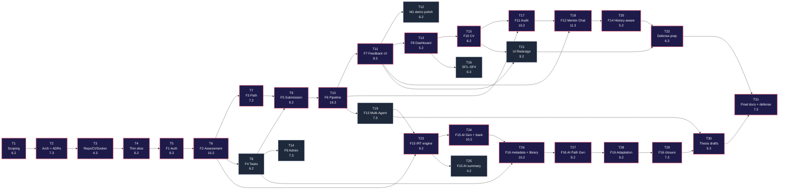

**Reading the diagram:**

- **Pink nodes + edges** = critical path activities. Slippage here delays defense.
- **Slate nodes** = activities with positive slack — internal late-start without affecting milestone exit dates.
- **Convergence joins** (T9, T17, T18, T22, T23, T26, T30, T31) are integration points that absorb the parallel work — these are where most coordination risk concentrates.
- **The longest single hop** is T10 (F6 Multi-Layered Analysis Pipeline, ET = 16.3 person-days). This is the single biggest scheduling exposure of the project, which is why it appears early in §2.2 risk register as T-02 / T-04.

### **2.5.3 Gantt Chart**

The Gantt chart anchors the WBS and PERT plan onto the Oct 2025 – Jun 2026 calendar window. Each bar represents a milestone-level work batch; the implementation plan in `docs/implementation-plan.md` further subdivides each batch into two-week sprints (22 sprints S0 → S21 over the window). Sprint cadence is two weeks; demo / rehearsal / supervisor-review windows sit at sprint boundaries.

**Figure 2.3 — Code Mentor Project Schedule (Oct 2025 – Jun 2026)**

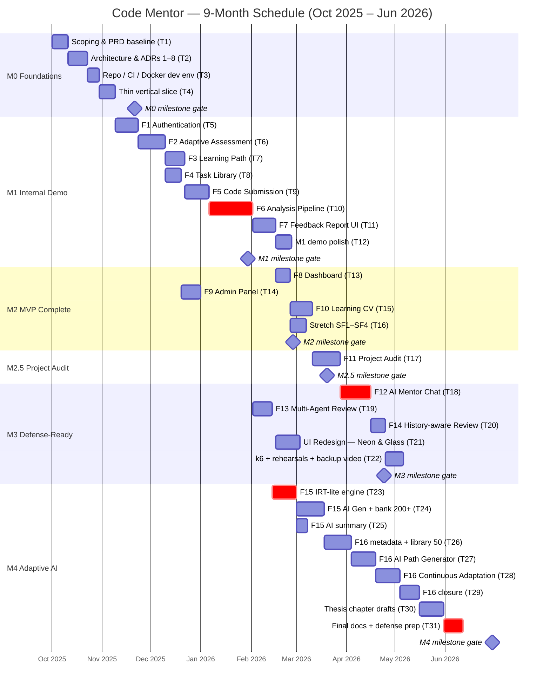

**Reading the chart:**

- **Bars in red (`crit`)** mark the dominant critical-path activities — these define the floor for project duration.
- **Diamond markers** (`milestone`) sit at the milestone gate dates that the team commits to at sprint planning. Each gate has explicit exit criteria captured in `docs/implementation-plan.md` and verified during the relevant sprint-close review.
- The chart shows ~9 months of build activity (Oct 2025 → Jun 2026). Defense rehearsals and the formal defense itself sit in the buffer window **Jul – Sep 2026** (not on this chart) and reuse the M4 deliverables without further scope additions.
- Activities inside a section may overlap intentionally (e.g., F2 and F4 both depend only on F1, so they run in parallel). The PERT network in §2.5.2 captures these parallelism opportunities exactly.

# **Chapter Three: System Analysis**

## **3.1 Introduction**

System analysis constitutes a critical phase in the software development lifecycle, serving as the bridge between problem identification and solution design. This chapter presents a comprehensive analytical examination of the **AI-Powered Learning & Code Review Platform**, establishing the foundational requirements, constraints, and specifications that govern subsequent design and implementation decisions.

The system analysis process encompasses multiple dimensions:

**Requirements Engineering:** Systematic elicitation, documentation, and validation of functional and non-functional requirements that define system capabilities and quality attributes.

**Stakeholder Analysis:** Identification and characterization of all individuals and entities affected by or influencing the platform’s development and operation.

## **3.2 Planning**

The planning phase establishes the strategic direction and operational framework for the **AI-Powered Learning & Code Review Platform**. This section synthesizes insights from the problem definition (Chapter 1) and project management framework (Chapter 2) to define the analytical approach governing requirements elicitation and system specification.

**Planning Objectives:**

1. **Establish Requirements Baseline:** Define a complete, consistent, and validated set of functional and non-functional requirements serving as the contractual foundation for development.
2. **Identify System Boundaries:** Clearly delineate what functionality resides within the system scope versus external dependencies and integrations.
3. **Define Success Criteria:** Establish measurable acceptance criteria for each requirement, enabling objective verification during testing and validation.
4. **Prioritize Requirements:** Classify requirements by criticality (Must-Have, Should-Have, Could-Have, Won’t-Have) to support phased delivery and resource allocation.
5. **Validate Feasibility:** Ensure all specified requirements are technically achievable within project constraints (timeline, budget, technology stack, team expertise).

**Analytical Methodology:**

The requirements analysis follows a **structured, iterative approach**:

**Phase 1 — Requirements Elicitation:**

- Stakeholder interviews with supervisors, potential users, and domain experts
- Analysis of competitor platforms to identify feature gaps and opportunities
- Review of academic literature on educational technology and AI-assisted learning
- User journey mapping to understand end-to-end workflows

**Phase 2 — Requirements Specification:**

- Documentation of functional requirements using structured use case narratives
- Definition of non-functional requirements using quality attribute scenarios
- Creation of requirements traceability matrix linking requirements to design elements

**Phase 3 — Requirements Validation:**

- Technical feasibility assessment by development team leads
- Consistency checking to identify conflicts or ambiguities
- Completeness verification ensuring all critical functionality is specified
- Supervisor review and approval

**Requirements Management:**

Requirements are managed as living artifacts throughout the project lifecycle:

- **Version Control:** All requirements documents maintained in Git with change tracking
- **Traceability:** Each requirement linked to design elements, test cases, and implementation artifacts
- **Change Management:** Formal change request process for requirement modifications post-baseline
- **Continuous Refinement:** Requirements elaborated incrementally as understanding deepens during development

**Alignment with Project Milestones:**

The planning approach directly supports the **M0 → M4 milestone-driven rollout** introduced in §1.8.1. Requirements were elicited, specified, and validated incrementally, with each milestone drawing on a refined slice of the requirements catalogue:

- **M0 (Foundations) → M1 (Internal Demo):** Focus on the core functional requirements that prove the end-to-end learning loop (F1–F7) — authentication, adaptive assessment (rule-based), learning path (template-based), task library, code submission, multi-layered analysis pipeline, and feedback report.
- **M2 (MVP Complete) → M2.5 (Project Audit):** Layer on the learner dashboard (F8), admin panel (F9), Learning CV (F10), stretch features (SF1–SF4: skill-trend analytics, starter badges, AI task recommendations, feedback ratings), and the standalone Project Audit (F11).
- **M3 (Defense-Ready) → M4 (Adaptive AI):** Add the differentiation features (F12 RAG Mentor Chat, F13 Multi-Agent Review, F14 history-aware review, F15 2PL IRT-lite Assessment, F16 AI Learning Path with continuous adaptation) plus the dogfood data collection and thesis chapter drafts that underwrite the academic contribution.

This milestone-driven approach balances comprehensive upfront planning with Agile principles of iterative refinement, supervisor-gated stop-go reviews at every milestone, and responsiveness to emerging insights — explicitly *not* a “Phase 1 / Phase 2 / Phase 3” market-release split (see §1.8.1 and the footnote in §2.5.1).

## **3.3 System Requirements**

System requirements define the complete set of capabilities, constraints, and quality attributes the platform must satisfy. Requirements are organized into two primary categories: **Functional Requirements (FR)** specifying observable system behaviors, and **Non-Functional Requirements (NFR)** defining quality characteristics and operational constraints.

### **3.3.1 Functional Requirements (FR)**

Functional requirements describe **what the system must do**—the specific features, operations, and behaviors users will observe and interact with. Each requirement is uniquely identified, precisely specified, and includes explicit acceptance criteria for validation.

**Requirements are organized by functional domain**, corresponding to the system’s architectural modules:

**3.3.1.1 User Authentication & Profile Management**

| ID | Requirement | Description | Priority | Dependencies |
| --- | --- | --- | --- | --- |
| FR-AUTH-01 | **User Registration** | The system must allow users to register via email and password. The registration form will include full name, email, password, and optional GitHub username. Passwords are hashed using [**ASP.NET](http://asp.net/) Core Identity** and stored securely in **SQL Server**. | High | None |
| FR-AUTH-02 | **GitHub OAuth Login** | The system must support GitHub OAuth2 login to simplify onboarding and link code submissions automatically. OAuth tokens will be stored securely (encrypted) in the database. | High | GitHub API |
| FR-AUTH-03 | **Email Verification (sent, not enforced)** | Upon registration, the system sends a verification email via the **SendGrid API**. For the MVP / defense window, verification is **not blocking** for login; full enforcement is deferred to post-MVP (per PRD §5.1 F1 acceptance criteria). | Low (sent, not blocking) | Notification Service |
| FR-AUTH-04 | **User Login** | Users must log in using either email/password or GitHub OAuth. JWT tokens will be issued by the .NET API for authenticated access. | High | [ASP.NET](http://asp.net/) Core Identity |
| FR-AUTH-05 | **Password Reset** | Users can request a password reset link, sent via email. The token is valid for 10 minutes. | Medium | Notification Service |
| FR-AUTH-06 | **Profile Management** | Users can update personal information (name, GitHub username, profile picture). Changes are reflected immediately in the database. | Medium | SQL Server |
| FR-AUTH-07 | **Role-Based Access Control (RBAC)** | The system must distinguish between **Admin** and **Learner** roles using claims-based authorization. | High | Identity Middleware |
| FR-AUTH-08 | **Session Management & Rate Limiting** | Sessions are stateless JWT tokens (1 h access + 7 d refresh, rotation enabled); refresh tokens travel in HttpOnly cookies. **Redis** powers the sliding-window rate limiter (100 req/min default, 5 auth attempts / 15 min) and caches per-user lookups. 5 failed login attempts in 15 minutes locks the account for 15 minutes. | High | Redis Cache, ASP.NET Identity |

**3.3.1.2 Adaptive Assessment Module**

| ID | Requirement | Description | Priority | Dependencies |
| --- | --- | --- | --- | --- |
| FR-ASSESS-01 | **Assessment Start** | A learner can begin an adaptive assessment (30 questions). The difficulty adjusts dynamically based on previous answers. | High | React Frontend, .NET API |
| FR-ASSESS-02 | **Question Bank** | The assessment uses a curated question bank stored in SQL Server. Questions are categorized by difficulty and topic. | High | SQL Server |
| FR-ASSESS-03 | **Adaptive Algorithm** | The backend (.NET) calculates difficulty progression and selects the next question dynamically based on prior performance. | High | Adaptive Logic Engine |
| FR-ASSESS-04 | **Timer & Auto-Submit** | The assessment is time-bound (e.g., 40 minutes). Unanswered questions are auto-submitted. | Medium | React Timer |
| FR-ASSESS-05 | **Score Calculation** | After completion, the system computes the learner’s skill level and stores the score, completion time, and performance summary in SQL Server. | High | .NET API |
| FR-ASSESS-06 | **AI Feedback Integration (promoted to MVP — see F15)** | After completion, the **Python FastAPI** AI service generates a 3-paragraph personalised summary (strengths, weaknesses, recommended focus areas) within p95 ≤ 8 s and persists it in `AssessmentSummaries`. Mini-reassessments do *not* trigger summary generation. | High (MVP via F15) | FastAPI, gpt-5.1-codex-mini |
| FR-ASSESS-07 | **Result Visualization** | The frontend displays a result dashboard showing percentage scores and categorized skill levels. | High | React Charts |
| FR-ASSESS-08 | **Reattempt Policy** | Users can retake the assessment after 30 days . | Medium | .NET Policy Logic |

**3.3.1.3 Personalized Learning Path Management**

| ID | Requirement | Description | Priority | Dependencies |
| --- | --- | --- | --- | --- |
| FR-PATH-01 | **Path Generation** | Based on assessment results, the system generates a personalized learning path from predefined templates (Full Stack, Backend, etc.). | High | SQL Server, .NET |
| FR-PATH-02 | **Path Storage** | Each user’s path is stored in the LearningPath table, linked to their UserId. | High | SQL Server |
| FR-PATH-03 | **Task Linking** | Each path includes ordered tasks linked through the PathTasks junction table. | High | ERD: PathTasks |
| FR-PATH-04 | **Add Custom Task** | Users can manually add a recommended task from feedback to their learning path. | Medium | Recommendation Module |
| FR-PATH-05 | **Path Progress Tracking** | The backend calculates path progress (e.g., tasks completed / total tasks) and updates in real-time. | Medium | .NET Worker |
| FR-PATH-06 | **Modify Path** | Users can re-order or remove tasks within their path; updates are persisted. | Low | SQL Update Logic |

**3.3.1.4 Code Submission & Multi-Layered Analysis**

| ID | Requirement | Description | Priority | Dependencies |
| --- | --- | --- | --- | --- |
| FR-SUB-01 | Code Submission via GitHub Repository | Accept code submissions by linking GitHub repositories and automatically fetching contents via GitHub API. | High | GitHub REST API, OAuth token management |
| FR-SUB-02 | Code Submission via File Upload | Accept direct file uploads (ZIP) for users without GitHub or preferring local development. | High | Azure Blob Storage, file validation service |
| FR-SUB-03 | Submission Metadata Management | Capture and store metadata for each submission including status, timestamps, and task linkage. | High | SQL Server Submissions table, audit logging |
| FR-SUB-04 | Repository Fetching Service | Background Worker fetches GitHub repos or uploaded files, extracts them, and handles cleanup. | High | .NET Background Worker, GitHub API, temp file isolation |
| FR-SUB-05 | Static Analysis Execution | Execute the per-language static toolchain (ESLint for JS/TS, Roslyn for .NET, Bandit for Python, Cppcheck for C/C++, PHPStan for PHP, PMD for Java) inside Docker containers with timeouts and resource limits. Failures of any single tool degrade gracefully. | High | Docker containers, static analysis tools |
| FR-SUB-06 | Static Analysis Results Storage | Normalize & store static analysis outputs in SQL for later aggregation with AI results. | High | SQL Server StaticAnalysis table, JSON parsing |
| FR-SUB-07 | AI Analysis Invocation | Worker sends code + static analysis results + task context to Python FastAPI microservice. | High | FastAPI AI microservice, HTTP schema validation |
| FR-SUB-08 | AI Analysis Results Storage | Store AI-generated scores, raw JSON feedback, timestamps, and model metadata. | High | SQL Server AIAnalysis table |
| FR-SUB-09 | Feedback Aggregation | Combine static + AI output into a unified report with insights and recommendations. | High | Report generation engine, frontend renderer |
| FR-SUB-10 | Job Queue Management | Manage queued submission processing with durable, reliable job handling using **Hangfire (SQL-Server-backed)**. 3 retries with exponential back-off (1 min → 5 min → 15 min); jobs survive worker restarts. Azure Service Bus was evaluated and rejected (ADR-002) to keep the stack inside SQL Server. | High | Hangfire, SQL Server |
| FR-SUB-11 | Version Control & Resubmission | Support multiple attempts per task and track version history and improvement. | Medium | SQL optimization, diff comparison algorithms |
| FR-SUB-12 | Submission Status Tracking & Notifications | Provide real-time updates, notifications, and fail/retry options. | Medium | Email service, notification system, status polling API |

**3.3.1.5 Feedback, Recommendation & Resource Engine**

| ID | Requirement | Description | Priority | Dependencies |
| --- | --- | --- | --- | --- |
| FR-FEED-01 | Structured Feedback Generation | AI microservice generates structured educational feedback as JSON with scores, strengths, weaknesses, and recommendations. | High | AI prompt engineering, output validation service |
| FR-FEED-02 | Feedback Report Rendering | Frontend renders feedback in a clear, organized, interactive interface with actionable insights. | High | React components, Prism.js syntax highlighting |
| FR-FEED-03 | Task Recommendations | System generates 3–5 task recommendations based on skill gaps and stores them per submission. | High | Task database, AI recommendation logic, Recommendations table |
| FR-FEED-04 | Learning Resource Links | Provide curated learning resources tailored to weaknesses, stored and categorized by topic. | High | AI resource recommendation logic, Resources table, link validation service |
| FR-FEED-05 | Feedback Quality Rating | Collect user ratings and comments on feedback quality to improve AI prompts continuously. | Medium | Rating UI components, analytics database |
| FR-FEED-06 | Notification Delivery | Notify users when analysis completes via email, push, and in-app notifications. | Medium | SendGrid email service, notification templates, mobile push service |

**3.3.1.6 Engagement, Analytics & Learning CV**

The MVP keeps the **Learning CV** as a first-class shippable feature (F10) and demotes the gamification surface to lightweight stretch features (SF1–SF4). The post-MVP roadmap (PRD §5.3) covers the deeper gamification work — full badge catalogue, peer benchmarking, leagues, etc.

| ID | Requirement | Description | Priority | Dependencies |
| --- | --- | --- | --- | --- |
| FR-GAME-01 | Starter Badge Set *(stretch SF2)* | Award a small set of hand-designed badges (First Submission, First Perfect Category Score, First Learning CV Generated, etc.) for early engagement signals. Persisted in the `Badges` + `UserBadges` tables. | Low (stretch) | `Badges`, `UserBadges` |
| FR-GAME-02 | Learning Streak Tracking | Track daily / weekly learning streaks and reward consistent activity. | **Deferred to post-MVP** (PRD §5.3) | n/a |
| FR-GAME-03 | Experience Points (XP) — append-only ledger | Award XP for completed activities via the `XpTransaction` append-only ledger (reasons: `AssessmentCompleted`, `SubmissionAccepted`). Total XP is computed as a sum over transactions — no denormalised counter that could drift. Full leaderboards and level-progression UI are deferred. | Medium (ledger shipped; UI stretch) | `XpTransaction` table |
| FR-GAME-04 | Skill-Trend Analytics *(stretch SF1)* | `/analytics/me` view with per-skill-category line chart over time and weekly submission-count bar chart. | Low (stretch) | Recharts, analytics aggregation |
| FR-GAME-05 | Shareable Learning CV — Core | Generate dynamic CVs from verified skill scores + the 5 highest-scored submissions; assign a unique `PublicSlug` (e.g., `/cv/learner-a1b2c3`); IP-deduped view counter. | High | CV generation service, URL routing |
| FR-GAME-06 | Learning CV — PDF Export | Allow learners to download their CV as a polished PDF (`/learning-cv/me/pdf`). The PDF generator choice is recorded in ADR-007. | High | PDF library |
| FR-GAME-07 | Learning CV — Privacy Controls | `PATCH /learning-cv/me { isPublic: true|false }` toggles visibility; when `IsPublic=false`, public-slug requests return 404; when true, the public view is redacted (no email, no internal metadata). | High | Authorization middleware |
| FR-GAME-08 | AI Task Recommendations *(stretch SF3)* | Persist recommendations from feedback into a dedicated `Recommendations` table; learners can convert any recommendation into a path addition via `POST /learning-paths/me/tasks/from-recommendation/{id}`. | Low (stretch) | Recommendations table |
| FR-GAME-09 | Feedback Quality Ratings *(stretch SF4)* | Thumbs-up / thumbs-down per category on a feedback view; data persisted for thesis analysis. | Low (stretch) | Ratings table |

**3.3.1.7 Administrative Functions**

The admin scope is intentionally minimal for the MVP — just enough to run a defense demo. The deeper admin surface (track editor, content moderation, analytics, system config) is deferred per PRD §5.3.

| ID | Requirement | Description | Priority | Dependencies |
| --- | --- | --- | --- | --- |
| FR-ADMIN-01 | User Management (list + deactivate) | List learners (paginated, filterable); deactivate or reactivate an account. Cascade-delete is exposed via the GDPR-stub endpoint. | High | Admin panel UI, `RequireAdmin` policy |
| FR-ADMIN-02 | Task Library CRUD | Admin creates / edits / deactivates tasks: title, markdown description, difficulty, category, expected language, estimated hours, prerequisites JSON, `IsActive` toggle. All writes audited to `AuditLogs`. Cache-bust on write. | High | Admin panel, markdown editor |
| FR-ADMIN-03 | Question Bank CRUD + AI Generator | Admin creates / edits / deactivates assessment questions (content, difficulty, category, 4 options, correct answer, explanation, optional code snippet). The F15 **AI Question Generator** (`/admin/questions/generate`) batch-creates drafts with self-rated 2PL IRT `(a, b)` parameters; admin reviews and approves before items enter the bank. | High | Admin panel, AI service, IRT engine |
| FR-ADMIN-04 | Adaptation Event Audit | Inspect the full `PathAdaptationEvents` table — every change the AI proposed, its reason, confidence score, and the learner’s accept / reject decision. Powers thesis analysis. | Medium (F16) | F16 adaptation engine |
| FR-ADMIN-05 | Dogfood Metrics | `GET /api/admin/dogfood-metrics` aggregates Tier-2 metrics: avg pre→post skill delta per category, pending-proposal approval rate, completion rate, and the empirically-calibrated question count. | Medium (F16 / M4) | Aggregation service |
| FR-ADMIN-06 | Content Moderation | *Deferred to post-MVP* — no community / discussion features ship in the MVP, so a moderation queue is not needed. | Deferred | n/a |
| FR-ADMIN-07 | System Health Monitoring | Basic health endpoint (`/api/health`) exposing dependency status (SQL, Redis, AI service, Qdrant). Full Application Insights dashboards ship with the post-defense Azure deployment. | Medium | health endpoints |

**3.3.1.8 Project Audit (F11 — added 2026-05-02)**

| ID | Requirement | Description | Priority | Dependencies |
| --- | --- | --- | --- | --- |
| FR-AUDIT-01 | Audit Entry Points | Authenticated user can reach `/audit/new` from a landing-page CTA, an authenticated nav link, or a deep-link URL. Unauthenticated landing-page CTA redirects to login. | High | React Router, auth guard |
| FR-AUDIT-02 | Audit Submission Form | Form captures 6 required fields (Project Name, One-line Summary, Detailed Description, Project Type, Tech Stack, Main Features) and 3 optional (Target Audience, Focus Areas, Known Issues). Client-side + server-side validation via FluentValidation. | High | React Hook Form + Zod, FluentValidation |
| FR-AUDIT-03 | Code Source | GitHub URL (validated via stored OAuth token for private repos) **or** ZIP upload via a pre-signed Azure Blob URL. | High | GitHub API, Azure Blob (Azurite locally) |
| FR-AUDIT-04 | Rate Limiting | 3 audits per 24 h per user → 4th attempt → 429 with `Retry-After` header. | High | Redis rate limiter |
| FR-AUDIT-05 | Audit Job | `ProjectAuditJob` (Hangfire) fetches code → static analysis → AI service `/api/project-audit` → persist results. p95 ≤ 6 min, hard timeout 12 min. AI unavailable → static-only audit with `AIReviewStatus = Unavailable` and one retry. | High | Hangfire, AI service |
| FR-AUDIT-06 | Audit Report | 8 sections rendered: Overall Score (0–100, A–F grade), 6-Category Breakdown (Code Quality / Security / Performance / Architecture / Maintainability / Completeness vs description), Strengths, Critical Issues, Warnings, Suggestions, Missing/Incomplete Features, Recommended Improvements (top-5 prioritised with how-to), Tech Stack Assessment, Inline Annotations. | High | React, Prism.js |
| FR-AUDIT-07 | Audit History | `/audits/me` lists the user’s audit history with date-range and score-range filters; paginated. Soft delete via `IsDeleted`. | Medium | EF Core, paging |
| FR-AUDIT-08 | Audit Retention | Audit blob storage retention = 90 days (per ADR-033); metadata is permanent. | Medium | Blob lifecycle |

**3.3.1.9 AI Mentor Chat (F12 — RAG-based)**

| ID | Requirement | Description | Priority | Dependencies |
| --- | --- | --- | --- | --- |
| FR-CHAT-01 | Session Scoping | One `MentorChatSession` per Submission (1:1) and per ProjectAudit (1:1); created lazily on the first message. | High | EF Core |
| FR-CHAT-02 | Side-Panel UI | Chat panel visible on `/submissions/:id` and `/audit/:id` only when status = `Completed`; hidden / disabled with a clear message otherwise. | High | React, Tailwind |
| FR-CHAT-03 | Code Indexing | On submission / audit completion, Hangfire job `IndexSubmissionForMentorChatJob` chunks the code semantically (files + function boundaries), generates embeddings via `text-embedding-3-small`, and upserts into **Qdrant** with payload `{ scope, scopeId, filePath, startLine, endLine, kind }`. | High | Qdrant, OpenAI embeddings |
| FR-CHAT-04 | RAG Chat Turn | `POST /api/mentor-chat/{sessionId}/messages` proxies an SSE-streamed RAG response: query embedded → top-5 chunks retrieved (filtered to scope) → prompt with chunks + last 10 turns → OpenAI streamed via SSE. | High | AI service, SSE |
| FR-CHAT-05 | Streaming UI | Frontend renders streaming markdown progressively; preserves code-block syntax highlighting via Prism. | High | React, markdown-it |
| FR-CHAT-06 | Conversation Persistence | `MentorChatMessages` stores role / content / tokens / createdAt for each turn; full history returned on session load via `GET /api/mentor-chat/{sessionId}`. | High | EF Core |
| FR-CHAT-07 | Token Caps | AI-service enforces 6 k input + 1 k output tokens per turn (per ADR-036). | High | AI service |
| FR-CHAT-08 | Rate Limit | 30 messages per hour per session via Redis sliding window. | High | Redis |
| FR-CHAT-09 | Graceful Degradation | Qdrant unreachable → fallback to “raw context mode” (sends submission JSON instead of retrieved chunks); UI shows a “limited context” banner. AI service unreachable → “Mentor temporarily unavailable” banner. | High | Health checks |

**3.3.1.10 Multi-Agent Code Review (F13 — thesis A/B endpoint)**

| ID | Requirement | Description | Priority | Dependencies |
| --- | --- | --- | --- | --- |
| FR-MULTIAGENT-01 | Specialist Endpoint | New AI-service endpoint `POST /api/ai-review-multi` operates in parallel to the existing `/api/ai-review`; zero regression on the single-prompt path. | High | AI service |
| FR-MULTIAGENT-02 | Versioned Prompts | Three specialist prompts versioned: `prompts/agent_security.v1.txt`, `agent_performance.v1.txt`, `agent_architecture.v1.txt`. Each agent is constrained to its own categories. | High | Prompt files |
| FR-MULTIAGENT-03 | Parallel Orchestration | Orchestrator runs the three agents in parallel via `asyncio.gather` and merges outputs into the same `AiReviewResponse` shape (strengths / weaknesses concatenated + de-duplicated by Jaccard ≥ 0.7; inline annotations merged by `(filePath, lineNumber)`). | High | Python asyncio |
| FR-MULTIAGENT-04 | Mode Switch | Backend env var `AI_REVIEW_MODE=single|multi` selects which endpoint `SubmissionAnalysisJob` calls. `AIAnalysisResults.PromptVersion` records `multi-agent.v1` when multi-mode produced the result. | High | Config |
| FR-MULTIAGENT-05 | Partial Failure | Per-agent timeout 90 s; if any agent fails, orchestrator returns a partial result with `partialAgents: ["security"]` flag; backend persists with `PromptVersion = multi-agent.v1.partial`. | Medium | AI service |
| FR-MULTIAGENT-06 | Thesis Evaluation | An evaluation script in `docs/demos/multi-agent-evaluation.md` runs both endpoints over N = 15 submissions (5 Python / 5 JavaScript / 5 C#) and produces a comparison table — per-category scores, response length, token cost, and a manual relevance rubric scored by 2 supervisors. | Medium | Evaluation harness |

**3.3.1.11 Adaptive AI Assessment Engine (F15 — extends F2 — added 2026-05-14)**

| ID | Requirement | Description | Priority | Dependencies |
| --- | --- | --- | --- | --- |
| FR-IRT-01 | 2PL Item Parameters | Each `Question` carries `IRT_A` (discrimination), `IRT_B` (difficulty), and `CalibrationSource ∈ {AI, Admin, Empirical}`. The AI Question Generator outputs `(a, b)` per item; admin can override during review. | High | EF Core schema |
| FR-IRT-02 | Adaptive Selection | `AdaptiveQuestionSelector` delegates to AI service `POST /api/irt/select-next` which returns the unanswered item maximising Fisher information at the current θ. | High | AI service, scipy |
| FR-IRT-03 | θ Estimation | After every response, the learner’s ability θ is MLE-estimated via `scipy.optimize.minimize_scalar`. | High | scipy |
| FR-IRT-04 | AI Question Generator | Admin batch tool `/admin/questions/generate` produces draft questions with self-rated `(a, b)` parameters; drafts review UI lets admin Approve / Edit / Reject before items enter the bank. | High | OpenAI |
| FR-IRT-05 | Bank Expansion | Question bank grows from ≥ 60 at M1 to ≥ 150 minimum / 250 target by M4. | High | AI generator |
| FR-IRT-06 | Post-Assessment AI Summary | A 3-paragraph AI summary (strengths / weaknesses / focus areas) generated within p95 ≤ 8 s of completion; persisted in `AssessmentSummaries`. Full assessments only (mini-reassessments do not trigger summary generation). | High | AI service |
| FR-IRT-07 | Empirical Recalibration | Weekly Hangfire job `RecalibrateIRTJob` updates `(a, b)` for items with ≥ 50 responses via joint MLE; logs to `IRTCalibrationLog`. Target: ≥ 30 questions empirically calibrated by defense day. | Medium | Hangfire, scipy |
| FR-IRT-08 | Code-Snippet Questions | Questions can carry an optional `CodeSnippet` + `CodeLanguage`; rendered in the question card via Prism. | Medium | React, Prism |
| FR-IRT-09 | Fallback Path | When the AI service is unreachable, the assessment continues using the rule-based adaptive selector with `IrtFallbackUsed = true` flagged for admin review. | High | Rule-based selector |

**3.3.1.12 AI Learning Path with Continuous Adaptation (F16 — extends F3 — added 2026-05-14)**

| ID | Requirement | Description | Priority | Dependencies |
| --- | --- | --- | --- | --- |
| FR-PATHAI-01 | AI Path Generator | `GenerateLearningPathJob` calls AI service `POST /api/generate-path` using hybrid retrieval (cosine top-20 over `text-embedding-3-small` task vectors) + LLM rerank to 5–10 final tasks. p95 ≤ 15 s. | High | AI service, embeddings |
| FR-PATHAI-02 | Rich Task Metadata | Every task carries `SkillTagsJson`, `LearningGainJson` per skill, and enforced `Prerequisites`. Existing tasks are backfilled via a one-time migration. | High | EF Core |
| FR-PATHAI-03 | Per-Task AI Framing | `POST /api/task-framing` produces a short “why this matters for you / focus areas / common pitfalls” passage, cached in `TaskFramings` with 7-day TTL, displayed on the task page above the existing description. | High | AI service |
| FR-PATHAI-04 | AI Task Generator | Admin batch tool `/admin/tasks/generate` produces draft tasks; admin reviews and approves before tasks enter the library. Library grows from 21 (M1) to ≥ 40 minimum / 50 target (M4). | High | AI service |
| FR-PATHAI-05 | Reasoning Audit | Each generated path persists `AIReasoning` and `FocusSkillsJson` per task so the supervisor can audit the generation rationale. | Medium | EF Core |
| FR-PATHAI-06 | Fallback to Template | When the AI service is unreachable, the system falls back to the template-based generator; `LearningPath.Source = TemplateFallback`. | High | Template-based generator |
| FR-ADAPT-01 | Adaptation Triggers | `PathAdaptationJob` triggers on (a) every 3 completed `PathTasks`, (b) max category-score swing > 10 pt, (c) path 100 %, (d) on-demand. Default cooldown 24 h; bypassed by (c) and (d). | High | Hangfire |
| FR-ADAPT-02 | Signal-Scoped Adaptation | Swing 10–20 = reorder only; 20–30 = reorder or single swap; > 30 or 100 % = reorder or multiple swaps. **No mid-path full regeneration** — only graduation triggers a full new path. | High | Adaptation logic |
| FR-ADAPT-03 | Auto-Apply vs Pending | Auto-apply when `type = reorder AND confidence > 0.8 AND intra-skill-area`; otherwise stage as Pending and surface in proposal modal on `/path`. Pending auto-expires after 7 days. | High | Frontend modal |
| FR-ADAPT-04 | Mini Reassessment | Optional 10-question reassessment at 50 % progress. Reuses the F15 IRT engine; seeds θ from the learner’s smoothed skill profile. Mini-reassessments do *not* trigger path regeneration. | Medium | F15 engine |
| FR-ADAPT-05 | Full Reassessment + Graduation | Mandatory 30-question full reassessment at 100 %. `/learning-path/graduation` shows Before/After skill radar + AI journey summary + Next Phase CTA. | High | F15 engine |
| FR-ADAPT-06 | Next-Phase Path | `POST /learning-paths/me/next-phase` (after Full reassessment) generates a new `LearningPath` with `Version += 1`, `difficultyBias = +1`, excluding all prior completed tasks. Archives the previous path. | High | F16 generator |
| FR-ADAPT-07 | Full Audit Trail | Each adaptation cycle writes a `PathAdaptationEvents` row with `BeforeStateJson` + `AfterStateJson` + `AIReasoningText` + `ConfidenceScore` + `ActionsJson` (incl. rejected) + `LearnerDecision`. | High | EF Core |

### **3.3.2 Non-Functional Requirements (NFR)**

Non-functional requirements define the quality attributes, operational constraints, and system characteristics that govern **how** the platform performs its functions. These requirements are organized by quality attribute category following the ISO/IEC 25010 quality model.

**3.3.2.1 Performance Requirements**

NFR targets are calibrated for the **demo / defense window** (local stack, single machine, ≤ 100 concurrent users). The aspirational production-grade targets (sub-200 ms API, 99.5 % uptime, etc.) are deferred along with the Azure rollout — they are not part of the MVP acceptance bar.

| ID | Requirement | Description | Target Metrics (MVP / defense window) |
| --- | --- | --- | --- |
| NFR-PERF-01 | API Response Time | Core API endpoints must remain responsive under expected demo load. | Read: ≤ 300 ms (p95) · Write: ≤ 500 ms (p95) · Aggregations: ≤ 800 ms (p95) — measured on B1-equivalent local hardware |
| NFR-PERF-02 | Code Analysis Processing Time | Full code analysis pipeline (static + AI) must complete within acceptable time. | Static ≤ 3 min · AI ≤ 2 min · **Total p95 ≤ 5 min** · Hard timeout 10 min → `Failed` |
| NFR-PERF-03 | Database Query Performance | SQL queries optimised via indexing and EF Core query shaping. | Simple: ≤ 50 ms (p95) · Joins: ≤ 200 ms (p95) · Aggregations: ≤ 500 ms (p95) |
| NFR-PERF-04 | Frontend Page Load Time | Frontend must load quickly and remain visually stable. | FCP ≤ 2 s · LCP ≤ 3 s · TTI ≤ 3 s · CLS ≤ 0.1 (B1 backend conditions per PRD §8.1) |
| NFR-PERF-05 | Concurrent User Capacity | System must handle the defense demo load. | **100 concurrent authenticated users** without p95 API latency exceeding 500 ms (validated by k6 in Sprint 11 / M3) |
| NFR-PERF-06 | Cache Hit Ratio | Hot data must be served from cache to reduce DB load. | Session lookups ≥ 85 % · Task catalogue ≥ 70 % · Profile lookups ≥ 70 % |
| NFR-PERF-07 | Mentor-Chat Round-Trip | Per ADR-036, RAG chat-turn end-to-end ≤ 5 s p95. | Chat turn p95 ≤ 5 s end-to-end |
| NFR-PERF-08 | AI Path Generation | F16 hybrid retrieval + LLM rerank must complete quickly enough for a single page-load wait. | Path generation p95 ≤ 15 s |
| NFR-PERF-09 | AI Assessment Summary | F15 post-assessment 3-paragraph summary must surface during the results-page navigation. | Summary p95 ≤ 8 s |

**3.3.2.2 Scalability Requirements**

Scalability is engineered for the **MVP** target (100 concurrent users) with a clear post-MVP path on Azure. Anything above 100 users is documented as future work, not as an acceptance gate for graduation.

| ID | Requirement | Description | Strategy (MVP) | Strategy (post-MVP Azure) |
| --- | --- | --- | --- | --- |
| NFR-SCAL-01 | Stateless API | Backend API is stateless (JWT only); no in-memory session state. | Single instance suffices for 100 users | Horizontal scale 2–10 instances behind Azure App Service load balancer |
| NFR-SCAL-02 | Background Worker | Hangfire WorkerCount tuned to host capacity. | Default 20-worker pool on single instance | Split worker process; scale-out when queue depth ≥ 20 |
| NFR-SCAL-03 | Database | SQL Server Basic tier sufficient for the demo. | Indexed lookups; cache hot reads in Redis | Read replicas for analytics; partition large tables; pool size 20–200 |
| NFR-SCAL-04 | Storage | Local Azurite for dev; Azure Blob for prod. | 50 MB file size limit | Auto-tiering Hot → Cool → Archive |
| NFR-SCAL-05 | Worker Queue | Hangfire keeps the queue stable under burst. | Maintain queue depth < 50 during demo load | Maintain queue depth < 100 in prod |

**3.3.2.3 Availability & Reliability Requirements**

| ID | Requirement | Description | Target Metrics |
| --- | --- | --- | --- |
| NFR-AVAIL-01 | Pre-Defense Uptime | Local stack must stay up across the 2-week pre-defense rehearsal window. Best-effort, **not SLA-backed** (PRD §8.6). | ≥ 99 % uptime across 2-week pre-defense window |
| NFR-AVAIL-02 | Graceful Degradation | System continues core functionality even when dependent services fail. | AI failure → static analysis still ships; Qdrant failure → “limited context” Mentor Chat; Email failure → queued; Cache failure → DB fallback |
| NFR-AVAIL-03 | Data Backup & Recovery | Snapshot the local SQL DB before risky migrations; document `BACKUP DATABASE` commands in the runbook. Post-defense Azure deployment uses Azure SQL automatic daily backups (7-day retention on Basic tier). | RPO ≤ 24 h (dev) / ≤ 1 h (prod) · RTO ≤ 4 h |
| NFR-AVAIL-04 | Job Retry Logic | Hangfire retries transient failures automatically with exponential back-off. | 3 retries · 1 min → 5 min → 15 min |
| NFR-AVAIL-05 | Disaster Recovery | Project owner maintains a backup laptop with the full stack pre-installed; defense backup video covers a full AI outage scenario. | Backup laptop available; backup video kept current |
| NFR-AVAIL-06 | Queue Persistence | No Hangfire job is lost during worker restart (jobs are SQL-Server-backed). | Persisted to `HangFire.Job` table |
| NFR-AVAIL-07 | Demo Reliability | Defense demo must work even if internet drops between supervisor’s machine and OpenAI. | Backup demo video pre-recorded; mock AI client wired up for the no-internet scenario |

**3.3.2.4 Security Requirements**

| ID | Requirement | Description | Compliance / Control |
| --- | --- | --- | --- |
| NFR-SEC-01 | Authentication Security | Password hashing and signed-token best practices. | PBKDF2 100 k iterations (ASP.NET Identity default), JWT **RS256**, refresh-token rotation, 5 failed attempts → 15-min lockout |
| NFR-SEC-02 | Authorization & Access Control | Role-based access restricts every sensitive operation. | RBAC (`Learner` / `Admin`), claims-based `RequireAdmin` policy, 403 page on denial |
| NFR-SEC-03 | Data Encryption | Sensitive data encrypted at rest and in transit. | TLS 1.2+ in transit · AES-256 for OAuth tokens at rest · secrets in `dotnet user-secrets` (dev) / Azure Key Vault (post-defense prod) |
| NFR-SEC-04 | Input Validation & Sanitisation | Prevent injection attacks via strict validation everywhere. | FluentValidation on commands · EF Core only (no raw SQL) · DOMPurify + rehype-sanitize on rendered markdown |
| NFR-SEC-05 | Secure File Handling | Uploaded files validated by size and MIME, scanned for unsupported types. | 50 MB cap · MIME validation · unsupported file types rejected in AI service |
| NFR-SEC-06 | Rate Limiting & Abuse Prevention | Prevent brute-force, scraping, and DoS attacks. | Redis sliding-window limiter (100 req/min default) · 5 auth attempts / 15 min · 30 mentor-chat messages / hr / session · 3 audits / 24 h / user |
| NFR-SEC-07 | OAuth Token Protection | Protect GitHub OAuth tokens from exposure in DB dumps and logs. | AES-256 encrypted at rest · never logged |
| NFR-SEC-08 | Security Logging | Log high-risk admin actions for audit. | `AuditLogs` table populated on admin writes · sensitive values never logged |
| NFR-SEC-09 | Secure API Practices | APIs follow safe error-handling conventions. | HTTPS-only enforced in any non-local environment · no sensitive data in error responses · CORS allow-list |
| NFR-SEC-10 | AI Output Safety | AI responses pass through a sanitisation layer before display. | FastAPI output validation; prompt-injection prevention guidance in prompts |
| NFR-SEC-11 | Code Privacy | Learner code is never used for OpenAI model training. | Contractually enforced via OpenAI API usage; documented in ToS |
| NFR-SEC-12 | MFA *(deferred to post-MVP)* | Multi-factor authentication for admin accounts. | **Not shipped in MVP** — gap explicitly documented in PRD §8.2 |

**3.3.2.5 Usability & Accessibility Requirements**

| ID | Requirement | Description | Compliance |
| --- | --- | --- | --- |
| NFR-UX-01 | Responsive Design | Web UI must work across phone, tablet, and desktop. | ≥ 320 px mobile · ≥ 1024 px desktop · single responsive web build (no separate mobile app) |
| NFR-UX-02 | Accessibility Compliance | Primary flows meet WCAG 2.1 AA. | Semantic HTML · ARIA labels · keyboard navigation · Lighthouse a11y ≥ 90 per primary page · admin panel target ≥ 80 |
| NFR-UX-03 | Intuitive Navigation | Clear hierarchy, breadcrumbs where useful, no dead-ends. | UX best practices |
| NFR-UX-04 | Onboarding Experience | First-run guidance and contextual tooltips. | Interactive tutorial on first login + tooltips |
| NFR-UX-05 | Error Handling & Feedback | Clear, actionable error and success messages. | Inline form errors + global error boundary |
| NFR-UX-06 | Visual Identity (Neon & Glass) | The M3 redesign establishes a consistent visual identity across every screen. | Violet / cyan / fuchsia gradients · glass surfaces · Inter typography |
| NFR-UX-07 | Loading & State Indicators | Consistent loading skeletons for slow operations. | Skeleton loaders + progress indicators |
| NFR-UX-08 | Localisation *(deferred to post-MVP)* | English-only for MVP. | Strings remain in JSX literals; externalisation deferred |

**3.3.2.6 Maintainability & Extensibility Requirements**

| ID | Requirement | Description | Implementation Standard |
| --- | --- | --- | --- |
| NFR-MAIN-01 | Code Architecture | Clean Architecture in the backend; feature-folder layout in the frontend. | .NET layers Domain → Application → Infrastructure → API · Frontend `src/features/<feature>/{api,components,pages,store}` |
| NFR-MAIN-02 | Code Quality Standards | Lint, type-check, and complexity bounds enforced. | Cyclomatic complexity < 15 (Roslyn analyzer) · `tsc -b --noEmit` clean · ESLint passing |
| NFR-MAIN-03 | Automated Testing Coverage | Pragmatic coverage target on the Application layer. | **≥ 70 % line coverage** on `CodeMentor.Application` (PRD §8.8) · ≥ 3 integration tests covering auth flow, submission pipeline happy-path, admin task CRUD |
| NFR-MAIN-04 | API Documentation | Every endpoint discoverable interactively. | Swagger / OpenAPI auto-published at `/swagger` |
| NFR-MAIN-05 | Version Control Strategy | Branching policy with PR review. | Trunk-based with feature branches · PR template · protected `main` (post-M3) |
| NFR-MAIN-06 | CI Pipeline | Build + test on every PR. | GitHub Actions: build + test workflow on PR open |
| NFR-MAIN-07 | Logging & Observability | Structured logs with correlation IDs. | Serilog structured JSON logs · Application Insights free tier in prod |
| NFR-MAIN-08 | AI Provider Abstraction | Swap LLM provider without touching call sites. | `IAIReviewClient` interface + adapter implementations |
| NFR-MAIN-09 | Database Migrations | Schema changes are reversible and version-controlled. | EF Core migrations · `Up`/`Down` verified on copy of DB |
| NFR-MAIN-10 | Living Documentation | `docs/` kept in sync with the code. | PRD / architecture / implementation plan / decisions / progress updated at every sprint close |

**3.3.2.7 Interoperability & Integration Requirements**

| ID | Requirement | Description | Integration Target |
| --- | --- | --- | --- |
| NFR-INT-01 | RESTful API Standards | REST + JSON. | `/api/...` prefix on every endpoint (versioning deferred to post-MVP) |
| NFR-INT-02 | Third-Party Service Integration | Outbound integrations for the MVP. | GitHub API (OAuth + repo fetch) · OpenAI (LLM + embeddings) · SendGrid (email) · Azure Blob (file storage, Azurite locally) — **Stripe and FCM are out of scope per §1.7.1** |
| NFR-INT-03 | Webhook Support | Process external webhook events reliably. | GitHub webhooks (optional, not shipped for MVP — polling via OAuth token is enough) |
| NFR-INT-04 | Data Export | Users can export their CV as PDF. | PDF export via `/learning-cv/me/pdf` · full GDPR JSON export deferred per §1.7.1 F |
| NFR-INT-05 | AI Service Communication | Internal HTTP between backend and AI service. | Secured-by-network local Docker · internal HTTPS in prod |
| NFR-INT-06 | Storage Integration | Blob storage for file submissions and audit zips. | Azurite (dev) · Azure Blob (post-defense prod) with private SAS URLs |
| NFR-INT-07 | Background Job Pipeline | Async job processing inside the SQL Server tier. | **Hangfire (SQL-Server-backed)** — Azure Service Bus / RabbitMQ rejected per ADR-002 |
| NFR-INT-08 | Vector Index | RAG retrieval store for Mentor Chat. | **Qdrant 1.x** in Docker (ADR-036) |
| NFR-INT-09 | Monitoring Integration | Centralised logs + metrics. | Serilog → file (dev) / Application Insights free tier (post-defense prod) |

**3.3.2.8 Compliance & Legal Requirements**

| ID | Requirement | Description | Standard / Reference |
| --- | --- | --- | --- |
| NFR-COMP-01 | GDPR Awareness (best-effort, MVP) | Users can view, edit, and request deletion of their account. Cascade-delete is implemented; full data-portability JSON export is deferred. | GDPR Articles 15–17 (partial); full compliance documented in PRD §8.3 as post-MVP |
| NFR-COMP-02 | Data Retention | Audit blobs retained 90 days (per ADR-033); metadata permanent; soft-delete via `IsDeleted` flag. | Retention policy in `docs/runbook.md` |
| NFR-COMP-03 | Intellectual Property Protection | Submitted code never used for AI model training. | Contractually with OpenAI; documented in ToS |
| NFR-COMP-04 | AI Ethics & Transparency | AI-generated outputs are labelled and reviewable. | Every AI feedback row carries `PromptVersion` + token counts; user can rate quality (SF4) |
| NFR-COMP-05 | Accessibility Compliance | Primary flows meet WCAG 2.1 AA. | (See NFR-UX-02) |
| NFR-COMP-06 | Privacy & Terms | Static privacy and ToS pages shipped with the MVP. | `/privacy` and `/terms` routes |
| NFR-COMP-07 | Audit Logging | Admin writes recorded for accountability. | `AuditLogs` table |

**3.3.2.9 Cost & Resource Optimisation Requirements**

| ID | Requirement | Description | Cost Strategy |
| --- | --- | --- | --- |
| NFR-COST-01 | AI Token Cap per Call | Per-call token budgets prevent runaway LLM costs. | Review: 8 k input / 2 k output · Mentor chat turn: 6 k / 1 k · Question batch: ≤ 60,000 tokens per run |
| NFR-COST-02 | AI Cost Monitoring | OpenAI usage tracked per endpoint to find regressions. | `Token-cost dashboard` splits ai-review · ai-review-multi · project-audit · mentor-chat · question-gen |
| NFR-COST-03 | Demo-Window Cloud Budget | Azure costs capped during demo windows. | Target < $40/month during active demo period (per PRD §8.10); pause non-critical resources after graduation |
| NFR-COST-04 | Embedding Cache | Avoid re-embedding identical content. | Per-question and per-task embeddings cached in their own tables; only changed rows are re-embedded |
| NFR-COST-05 | Storage Tiering (post-defense Azure) | Move audit blobs to cool tier after 7 days. | Lifecycle rule: Hot → Cool after 7 d → Archive after 30 d |

## **3.4 Stakeholders**

Stakeholders are individuals, groups, or organizations who affect or are affected by the system’s development, deployment, and operation. Understanding stakeholder interests, expectations, and influence levels is critical for requirements elicitation, priority setting, and change management.

### **Primary Stakeholders (Direct Users)**

**1. Learners / Students**

- **Role**: Core platform users seeking skill development
- **Interests**:
    - Receiving high-quality, actionable code feedback
    - Improving programming skills efficiently
    - Obtaining credible skill validation (Learning CV)
    - Affordable access to expert-level guidance
- **Influence**: High (product success depends on satisfaction)
- **Engagement**: User testing, surveys, community feedback

**2. Self-Taught Developers**

- **Role**: Career-switchers building portfolios
- **Interests**:
    - Bridging skill gaps without bootcamp costs
    - Demonstrating competency to employers
    - Structured learning paths with clear progression
- **Influence**: High (key target demographic)
- **Engagement**: Beta testing, testimonials, referrals

**3. Junior Developers**

- **Role**: Early-career professionals improving skills
- **Interests**:
    - Continuous learning and professional development
    - Staying current with best practices
    - Peer learning and community interaction
- **Influence**: Medium (secondary target audience)
- **Engagement**: Feature requests, community contributions

### **Secondary Stakeholders (Indirect Beneficiaries)**

**4. Academic Supervisors**

- **Role**: Project oversight and guidance
- **Interests**:
    - Academic rigor and quality
    - Alignment with educational objectives
    - Successful project completion and student learning
- **Influence**: High (approval authority)
- **Engagement**: Bi-weekly meetings, milestone reviews, final evaluation

**5. Development Team**

- **Role**: System implementers and maintainers
- **Interests**:
    - Clear requirements and specifications
    - Manageable scope and realistic timelines
    - Technical learning and skill development
    - Project success for academic credentials
- **Influence**: High (execution responsibility)
- **Engagement**: Daily standups, sprint planning, retrospectives

**6. Employers / Recruiters**

- **Role**: Consumers of Learning CV credentials
- **Interests**:
    - Reliable skill validation mechanisms
    - Reduced hiring risk through objective metrics
    - Efficient candidate screening
- **Influence**: Medium (validate credential value)
- **Engagement**: Feedback on Learning CV format, employer surveys (post-defense)

### **Stakeholder Analysis Matrix**

| Stakeholder | Interest Level | Influence Level | Engagement Strategy |
| --- | --- | --- | --- |
| Learners | Very High | Very High | Continuous feedback loops, user testing |
| Academic Supervisors | High | Very High | Regular meetings, formal reviews |
| Development Team | Very High | Very High | Agile collaboration, transparent communication |
| Employers | Medium | Medium | Surveys, Learning CV validation studies |

# **Chapter Four: System Design**

## **4.1 Introduction**

System design is the critical phase where abstract requirements are transformed into concrete architectural blueprints and detailed technical specifications. This chapter presents the complete design architecture for the **AI-Powered Learning & Code Review Platform**, encompassing structural models, behavioral specifications, data management strategies, and component interaction patterns.

The design methodology follows **industry-standard software engineering practices**, adhering to established modeling languages (Unified Modeling Language - UML) and architectural patterns (layered architecture, microservices, asynchronous processing). All design artifacts are created to be:

- **Precise**: Unambiguous specifications enabling direct implementation
- **Complete**: Covering all system aspects from user interactions to data persistence
- **Consistent**: Maintaining coherent relationships across all diagrams and specifications
- **Traceable**: Explicitly linked to requirements defined in Chapter 3
- **Implementable**: Aligned with the chosen technology stack (.NET , React, Python, SQL Server)

**Design Principles Guiding This Architecture:**

1. **Separation of Concerns**: Clear boundaries between presentation, business logic, data access, and external services
2. **Scalability by Design**: Horizontal scaling capabilities built into core architecture
3. **Fault Tolerance**: Graceful degradation and error handling at all system levels
4. **Security First**: Authentication, authorization, and data protection integrated throughout
5. **Maintainability**: Modular design enabling independent component evolution
6. **Testability**: Dependency injection and interface-based design facilitating automated testing

**Design Artifacts Presented:**

The design is documented through complementary views, each addressing specific stakeholder concerns:

- **Structural Diagrams**: Block, Context, and ERD showing system components and relationships
- **Behavioral Diagrams**: Use Case, Activity, Sequence, and State diagrams modeling system dynamics
- **Data Flow Diagrams**: DFD hierarchy illustrating information movement and transformation
- **Database Design**: Relational schema, indexing strategy, and data management specifications

**Technology Stack Alignment:**

The design decisions below are grounded in the architectural decisions recorded in `docs/decisions.md` (ADR-001 … ADR-062). The MVP runs on a local-first stack; an Azure deployment plan is preserved in `docs/runbook.md` for the post-defense window (ADR-038).

| Layer | Technology | Design Implications |
| --- | --- | --- |
| Frontend | **Vite + React 18 + TypeScript + Tailwind + Redux Toolkit + React Router v6 + React Hook Form + Zod + Recharts** | Feature-folder layout, SPA, JWT-based auth, Prism.js for code rendering. Next.js evaluated and rejected (ADR-001). |
| Backend API | **ASP.NET Core 10 (.NET 10) + MediatR + FluentValidation + EF Core 10** | REST + JSON + `/api` prefix. Clean Architecture (Domain → Application → Infrastructure → API). Swagger at `/swagger`. Health checks for SQL Server / Redis / external URIs. Serilog with Seq sink for dev log viewer. |
| Background Processing | **Hangfire (in-process, SQL-Server-backed)** | Submission analysis, IRT recalibration, learning-path adaptation, audit pipeline. 3 retries with exponential back-off. **No** Azure Service Bus / RabbitMQ (ADR-002). |
| AI Service | **Python 3.11 + FastAPI** with `gpt-5.1-codex-mini`, `text-embedding-3-small`, `scipy.optimize` (IRT), `numpy` (cosine similarity). | Per-language static-analysis containers (ESLint / Roslyn / Bandit / Cppcheck / PHPStan / PMD). Streaming SSE for Mentor Chat. Prompts versioned in `prompts/*.v1.txt`. |
| Database | **SQL Server 2022 (LocalDB dev / Azure SQL prod)** | EF Core code-first migrations; 38 tables; soft-delete via `IsDeleted` / `IsActive`. |
| Cache + Rate Limiter | **Redis 7** | Sliding-window rate limits, session lookup cache, task-catalogue cache. |
| Vector Index | **Qdrant 1.x** (Docker container, ADR-036) | RAG retrieval store for Mentor Chat (F12) and hybrid task recall for AI Path generation (F16). |
| Object Storage | **Azurite (dev)** / **Azure Blob (post-defense prod)** | Pre-signed SAS URLs for ZIP uploads; 50 MB per-file limit. |
| Email | **SendGrid** | Verification + password-reset emails. |
| Hosting | **Local-first via `docker-compose up`** | Defense runs on owner’s laptop (ADR-038); Azure deployment runbook preserved for post-defense. |

## **4.2 Block Diagram**

### **4.2.1 Overview**

The Block Diagram shows the major subsystems and how they communicate. The system follows a 3-service architecture (Frontend SPA, Backend API + in-process Hangfire worker, AI service) with shared data stores (SQL Server, Redis, Qdrant, Blob storage) and three outbound integrations (GitHub, OpenAI, SendGrid).

**Key architectural patterns used:**

API Gateway, Worker pattern (in-process Hangfire — not a separate service), Microservice isolation (AI service), Repository abstraction, Queue-based load levelling, Circuit breaker for OpenAI calls, RAG for grounded chat answers.

### **4.2.2 Block Diagram**

**Figure 4.1 — Code Mentor system block diagram**

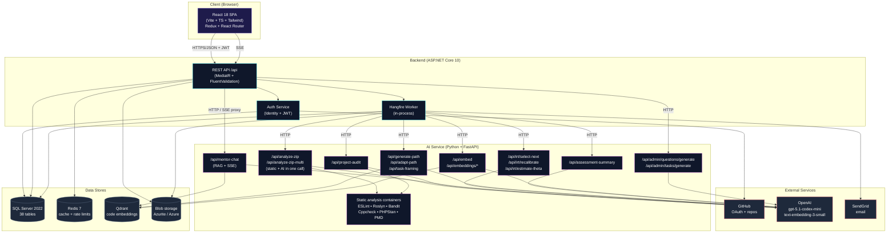

### **4.2.3 Explanation of the Block Diagram**

The architecture is organised into **five tiers**, each with a clear single responsibility.

**Tier 1 — Client**

The single React 18 SPA built with Vite is the only client surface. It manages auth tokens, fetches data from the backend over `/api/...`, opens an SSE connection for Mentor Chat streaming, and renders feedback with syntax highlighting via Prism.js. Responsive across ≥ 320 px (mobile) and ≥ 1024 px (desktop). No native mobile app ships with the MVP.

**Tier 2 — Backend (ASP.NET Core 10)**

The backend exposes a single REST API. Inside it:

- **API layer** — controllers + MediatR command/query handlers + FluentValidation guardrails. Every endpoint requires a JWT unless explicitly marked anonymous.
- **Auth service** — ASP.NET Identity with PBKDF2-hashed passwords, GitHub OAuth handshake, refresh-token rotation, and rate-limited login (5/15 min lockout).
- **Hangfire worker** — runs *in-process* (per ADR-002) and is responsible for every long-running job: submission analysis, project audit, IRT recalibration, learning-path generation and adaptation, code indexing for Mentor Chat. Three retries with exponential back-off (1 min → 5 min → 15 min); job state is persisted to SQL Server so jobs survive worker restarts.

**Tier 3 — AI Service (Python + FastAPI)**

A separate Python service handles every LLM-bound operation so the backend never blocks on OpenAI. The route table below was verified against `ai-service/app/api/routes/*.py` and the backend Refit clients in `Infrastructure/CodeReview/I*Refit.cs` (2026-05-16):

- **Code review (single + multi-agent):** `POST /api/analyze-zip` (default) and `POST /api/analyze-zip-multi` (F13, opt-in via `AI_REVIEW_MODE=multi`). Each call returns the combined static-analysis output **and** the AI review in one response (`CombinedAnalysisResponse`). The standalone `/api/ai-review` + `/api/ai-review-multi` endpoints exist but are *not* consumed by the backend pipeline.
- **Project audit:** `POST /api/project-audit` (F11 8-section report).
- **Mentor chat (F12):** `POST /api/mentor-chat` returns an SSE stream; the backend’s `MentorChatController` proxies the bytes to the SPA.
- **IRT (F15):** `POST /api/irt/select-next` (Fisher-info maximisation at current θ), `POST /api/irt/estimate-theta` (final-θ recompute), `POST /api/irt/recalibrate` (joint MLE for one item).
- **Path (F16):** `POST /api/generate-path` (hybrid embedding-recall + LLM rerank), `POST /api/adapt-path` (signal-driven action plan), `POST /api/task-framing` (per-learner WhyThisMatters / FocusAreas / CommonPitfalls).
- **Assessment summary (F15):** `POST /api/assessment-summary` (3 plain-prose paragraphs).
- **Embeddings (F12 / F14 / F15 / F16):** `POST /api/embed` (single text), `POST /api/embeddings/reload`, plus the F14 `POST /api/embeddings/search-feedback-history` for the history-aware code review.
- **Admin tools:** `POST /api/admin/questions/generate` (F15) and `POST /api/admin/tasks/generate` (F16) — batch draft generators that return drafts requiring admin approval.
- **Static-analysis containers** — one Docker container per linter (ESLint, Roslyn, Bandit, Cppcheck, PHPStan, PMD) with health checks and resource limits. Per-tool failures degrade gracefully — the surviving tools’ output still ships.

**Tier 4 — Data Stores**

- **SQL Server 2022** — relational store (38 tables); covers users, assessments, submissions, audits, learning paths, mentor-chat sessions, adaptation events, audit logs.
- **Redis 7** — sliding-window rate limiter, session lookup cache, task-catalogue cache.
- **Qdrant 1.x** — vector index for code embeddings (per file / function chunk), powering Mentor Chat retrieval and AI path recall.
- **Blob storage** — submission ZIPs, audit ZIPs, exported CVs. Azurite locally; Azure Blob in the post-defense prod environment.

**Tier 5 — External Services**

- **GitHub** — OAuth handshake + repository fetch.
- **OpenAI** — `gpt-5.1-codex-mini` for LLM reasoning, `text-embedding-3-small` for the vector index.
- **SendGrid** — verification + password-reset email delivery.

**Architectural rationale:**

- **In-process Hangfire** (not a separate worker service) keeps the deployable surface small (one .NET process) while retaining durable, retried, observable background jobs. The split to a separate worker process is documented as a clean post-MVP step.
- **AI service isolation** keeps Python + scientific dependencies (scipy, numpy) and the LLM rate-limit failure surface out of the .NET process — the backend stays responsive even when the AI service is overloaded.
- **Qdrant as a separate service** (not embedded in the backend) means the vector index can be rebuilt or replaced independently of application code.
- **Local-first design** lets the defense run on a single laptop via `docker-compose up`, removing cloud-availability risk from the demo critical path.

## **4.3 Use Case Diagram**

### **4.3.1 Overview**

The Use Case Diagram presents an actor-oriented view of the system’s capabilities. The platform has **three primary actors** (Visitor, Learner, Admin) and **three external systems** (GitHub, OpenAI, SendGrid) that participate as supporting actors. The diagram groups use cases into the same functional clusters used by the Feature catalogue (F1 … F16) in §3.3.1.

**Scope:** every functional requirement in §3.3.1 is represented by at least one use case in the diagram; the simplified view below collapses sibling use cases (e.g., “Register / Login / GitHub OAuth” into a single “Authenticate” capability) to keep the figure readable. The detailed per-feature use cases are recorded in §3.3.1 itself.

**Figure 4.2a — Simplified Use Case Diagram (Mermaid)**

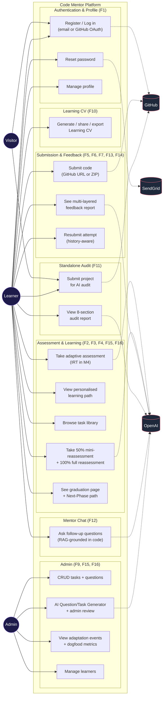

**Reading the diagram:**

- **Solid arrows** = an actor invokes the use case.
- **Dashed arrows** = the use case depends on an external system (GitHub for repo fetch / OAuth, OpenAI for LLM operations, SendGrid for email).
- The Visitor actor has very small surface: register / log in, plus the landing-page CTA to the Project Audit. After login, the Visitor becomes a Learner.

## **4.4 Activity Diagrams**

### **4.4.1 Overview**

Activity Diagrams model the **dynamic behavior of the system** by depicting workflows as sequences of actions, decisions, and control flows. Unlike sequence diagrams that focus on message passing between objects, activity diagrams emphasize the **flow of control and data** through algorithmic logic, business processes, and user interactions.

**Purpose in System Design:**

- **Business Process Modeling**: Document complex workflows (e.g., submission pipeline)
- **Algorithm Specification**: Detail computational logic (e.g., adaptive assessment scoring)
- **User Journey Mapping**: Visualize end-to-end user experiences
- **System Behavior Documentation**: Provide implementation guidance for developers

**Notation Elements Used:**

- **Initial Node** (filled circle): Workflow entry point
- **Activity Node** (rounded rectangle): Individual action or operation
- **Decision Node** (diamond): Conditional branching
- **Merge Node** (diamond): Convergence of alternative paths
- **Fork/Join Nodes** (thick bar): Parallel execution and synchronization
- **Final Node** (circle with border): Workflow termination
- **Swimlanes** (vertical partitions): Responsibility assignment to actors/systems

The following subsections present six critical activity diagrams covering the platform’s core workflows.

### **4.4.2 User Authentication & Login Activity**

**Overview:**

This activity models both **Email/Password** authentication and **GitHub OAuth 2.0** login, including validation, token issuance, session handling, and error scenarios.

**Key decisions (verified against `AuthController.cs`, 2026-05-16):**

- JWT-based authentication (stateless, no DB-backed session table).
- ASP.NET Core Identity (PBKDF2 password hashing, 100 k iterations).
- GitHub OAuth handshake via the `IGitHubOAuthService` adapter (Octokit).
- Login endpoint protected by `[EnableRateLimiting(AuthLoginPolicy)]` — 5 attempts / 15-min lockout returns 429.
- GitHub callback responds with **HTTP 302 redirect** to the SPA’s success URL, with tokens embedded in the **URL fragment** (per ADR-039) so they never appear in server access logs, Referer headers, or browser history — *not* a 200 OK JSON response.

**Diagram**

```
@startuml
title Activity Diagram 4.4.2 — User Authentication & Login

skinparam backgroundColor #FFFFFF
skinparam activity {
    BackgroundColor #F9FAFB
    BorderColor #1E3A8A
    FontColor #111827
}
skinparam decision {
    BackgroundColor #FEF3C7
    BorderColor #D97706
}

|User|
start
:Navigate to Login page;

|Frontend|
:Display login options;

|User|
if (Authentication method?) then (Email/Password)
    :Enter credentials;

    |Frontend|
    :POST /api/auth/login\n(rate-limited 5/15min);

    |Backend API|
    :IAuthService.LoginAsync\n(ASP.NET Identity verify);

    if (Valid?) then (No)
        :Return 401/429;
        |Frontend|
        :Display error message;
        stop
    endif

else (GitHub OAuth)
    :Click "Continue with GitHub";

    |Frontend|
    :GET /api/auth/github/login\n(sets gh_oauth_state cookie);

    |Backend API|
    :Build authorize URL +\nredirect to GitHub (302);

    |GitHub|
    :Authenticate user;
    :Redirect back to\n/api/auth/github/callback?code,state;

    |Backend API|
    :HandleCallbackAsync:\n· Verify state cookie\n· Exchange code for token (Octokit)\n· Fetch profile + email\n· Create/update ApplicationUser\n· Encrypt OAuth token (AES-256);
endif

|Backend API|
:Generate JWT access (1h) +\nrefresh token (7d);

if (Flow?) then (Email/Password)
    :Return 200 OK\nwith AuthResponse JSON;
    |Frontend|
    :Persist tokens in Redux;
    :Redirect to dashboard;
else (GitHub OAuth)
    :302 Redirect to\nSPA success URL #access=...&refresh=...&expires=...\n(per ADR-039 — URL fragment, not query);
    |Frontend|
    :Parse fragment + persist tokens;
    :Strip fragment from URL;
    :Redirect to dashboard;
endif

stop
@enduml
```

> **Verification note (2026-05-16, against `AuthController.cs`):** Endpoints are `/api/auth/login` and `/api/auth/github/login`/`/api/auth/github/callback` (the `/api` prefix matters). The GitHub callback returns a **302 redirect with tokens in the URL fragment**, not a 200 OK JSON body — this is ADR-039 (keeps tokens out of Referer headers and access logs). There is no separate “Sessions” table; JWT is stateless and refresh tokens are persisted in `RefreshTokens` for revocation.
> 


### **4.4.3 Adaptive Assessment Activity**

**Overview:**

This activity models the adaptive assessment system that adjusts question difficulty in real-time based on user ability. The system supports two adaptive engines: the rule-based selector and the **2PL IRT-lite** engine (F15, M4 — see ADR-050). The AI service exposes `POST /api/irt/select-next`; the backend’s `IAdaptiveQuestionSelector` delegates to it and gracefully falls back to the rule-based selector on outage. Three variants share the loop: `Initial` (30 q / 40 min — first run), `Mini` (10 q / 15 min — optional at 50 % path progress), and `Full` (30 q / 40 min — mandatory before Next-Phase path).

**Key decisions (verified against `AssessmentsController.cs` + `AssessmentService.cs`, 2026-05-16):**

- Question difficulty scale: **1 – 3** (per `Question.Difficulty` column), **not** 1 – 5 as earlier drafts implied. The IRT engine uses continuous `IRT_A` / `IRT_B` parameters per item, calibrated from the 1–3 difficulty.
- No question repetition within session; Mini variant additionally filters out items answered in *any* prior assessment.
- 30 questions OR 40-minute timer (10 / 15 for Mini variant).
- The frontend does **not** show per-answer feedback during the run. The answer endpoint returns the next question + assessment state.
- Path generation runs **asynchronously** via the `GenerateLearningPathJob` Hangfire job — enqueued at assessment completion, not inline. Only `Initial` variant triggers path generation; `Full` variant triggers AI summary only and defers path generation to `POST /api/learning-paths/me/next-phase`.

**Diagram**

```
@startuml
title Activity Diagram 4.4.3 — Adaptive Assessment (Initial variant)

skinparam backgroundColor #FFFFFF
skinparam activity {
    BackgroundColor #F9FAFB
    BorderColor #1E3A8A
    FontColor #111827
}
skinparam decision {
    BackgroundColor #FEF3C7
    BorderColor #D97706
}

|User|
start
:Navigate to /assessment;
:Select learning track;

|Frontend|
:POST /api/assessments\n{ track };

|Backend API|
:AssessmentService.StartAsync\n· Eligibility check (30-day cooldown)\n· Create Assessment row (Variant=Initial)\n· Persist initial θ = 0 (IRT mode);

|Backend API|
:IAdaptiveQuestionSelector.SelectFirstAsync\n(IRT: maximise Fisher info @ θ\n OR rule-based fallback);
:Return first question + assessmentId;

|Frontend|
:Display question;
:Start 40-minute timer;

repeat
    |User|
    :Select answer + submit;

    |Frontend|
    :POST /api/assessments/{id}/answers\n(Idempotency-Key header);

    |Backend API|
    :SubmitAnswerAsync\n· Persist AssessmentResponse\n· Evaluate correctness\n· Update θ (MLE) + per-category running score\n· Pick next question (IRT or fallback);
    :Return next question + updated state;

    |Frontend|
    :Display next question\n(no per-answer feedback shown);
repeat while (questions < 30 AND timer active?)

|Backend API|
:CompleteAsFinishedAsync (or TimedOut)\n· Score 5 categories + Overall\n· Determine SkillLevel\n· Upsert SkillScores + LearnerSkillProfile;

fork
    :Award 100 XP\n(XpTransaction ledger);
fork again
    :Enqueue GenerateLearningPathJob\n(Hangfire);
fork again
    :Enqueue GenerateAssessmentSummaryJob\n(Hangfire, p95 ≤ 8 s);
end fork

|Frontend|
:GET /api/assessments/{id} — show results;
:Poll for path readiness\n(or push via SignalR if available);

|User|
:Review per-category radar + AI summary;
:Start learning path;

stop
@enduml
```

> **Verification note (2026-05-16):** The pre-2026-05 doc claimed an inline “Learning Path Service” call returning a path synchronously, plus a “Recommendation Engine” producing top-5 recommendations at assessment end. Neither matches the shipped code. Path generation is **asynchronous** (Hangfire `GenerateLearningPathJob`), and recommendations are produced by the **submission** analysis pipeline (`SubmissionAnalysisJob` + `FeedbackAggregator`), **not** by assessment completion. The diagram above reflects the actual code in `AssessmentService.CompleteAsFinishedAsync` (the `case AssessmentVariant.Initial` branch).
> 


### **4.4.4 Code Submission — Ingestion & Queueing Activity**

**Overview:**

This activity shows how learners submit code (GitHub repository URL or direct ZIP upload), how the backend validates and persists the submission, and how the job is handed off to the background pipeline. The actual GitHub repository fetch and ZIP download happen **inside the Hangfire worker** (see §4.4.5), not at submission-creation time, so the API stays fast (≤ 500 ms p95).

**Key decisions (verified against `SubmissionsController.cs` + `UploadsController.cs`, 2026-05-16):**

- Fully asynchronous workflow: `POST /api/submissions` returns **202 Accepted** with the `submissionId`.
- Two submission types: `GitHub` (URL) and `Upload` (ZIP). The endpoint is rate-limited via `[EnableRateLimiting(SubmissionsCreatePolicy)]`.
- ZIP upload is a **two-step, FE-direct** flow: the frontend calls `POST /api/uploads/request-url` to receive a pre-signed Azure Blob SAS URL (10-min validity, per ADR), uploads the ZIP **directly** to Blob (bypassing the backend), then includes the resulting `blobPath` in the `POST /api/submissions` body. The backend never sees the ZIP bytes during ingestion.
- The GitHub repository **is not fetched at submission time**. The submission API only validates the URL format (`IsValidGitHubUrl`). The actual repo clone happens in `SubmissionAnalysisJob` via Octokit.
- The job queue is **Hangfire (SQL-Server-backed)** — *not* Azure Service Bus or Azure Storage Queues (per ADR-002).

**Diagram**

```
@startuml
title Activity Diagram 4.4.4 — Code Submission: Ingestion & Queueing

skinparam backgroundColor #FFFFFF
skinparam activity {
    BackgroundColor #F9FAFB
    BorderColor #1E3A8A
    FontColor #111827
}
skinparam decision {
    BackgroundColor #FEF3C7
    BorderColor #D97706
}

|User|
start
:Navigate to Task Detail;
:Click "Submit Code";

|Frontend|
:Show GitHub URL / ZIP option;

|User|
if (Submission Method?) then (GitHub Repository)
    :Paste repository URL;

    |Frontend|
    :Validate URL format client-side;
    :POST /api/submissions\n{ taskId, submissionType=GitHub,\n  repositoryUrl };

else (Upload ZIP)
    :Select local ZIP file (≤ 50 MB);

    |Frontend|
    :POST /api/uploads/request-url\n{ purpose: "submission",\n  fileName };

    |Backend API|
    :Issue pre-signed Azure Blob\nSAS URL (10-min validity);

    |Frontend|
    :PUT ZIP directly to Blob Storage\n(SAS URL, bypasses backend);

    |Frontend|
    :POST /api/submissions\n{ taskId, submissionType=Upload,\n  uploadedBlobPath };
endif

|Backend API|
:SubmissionService.CreateAsync\n· Validate request (FluentValidation)\n· Resolve Task (404 if not found)\n· Apply rate-limit check\n· Persist Submission row (Pending);

:BackgroundJob.Enqueue<SubmissionAnalysisJob>(\n    j => j.RunAsync(submissionId));

:Return 202 Accepted\n{ submissionId };

|Frontend|
:Navigate to /submissions/{id};
:Poll status (Pending → Processing → Completed | Failed);

stop
@enduml
```

> **Verification note (2026-05-16):** Earlier drafts showed the backend “uploading to Blob Storage” and “fetching GitHub repository metadata” synchronously at submission time — both inaccurate. ZIP bytes never transit the backend (FE → Blob via SAS URL), and the GitHub fetch is deferred to the Hangfire job. This keeps the `POST /api/submissions` endpoint within the ≤ 500 ms p95 write target (NFR-PERF-01).
> 


### **4.4.5 Submission Processing — Static + AI Analysis Activity**

**Overview:**

This activity models the multi-stage **Hangfire worker pipeline** that takes a freshly ingested submission (§4.4.4) and produces the multi-layered feedback record consumed by the UI. The pipeline runs **in-process** inside the backend (no separate worker service per ADR-002) and exchanges a *single* HTTP call with the AI service which itself orchestrates static analysis + LLM review.

**Key decisions (verified against `SubmissionAnalysisJob.cs`, 2026-05-16):**

- Hangfire **`[AutomaticRetry(Attempts=3, DelaysInSeconds={10, 60, 300})]`** + `[DisableConcurrentExecution(timeoutInSeconds=600)]` on `SubmissionAnalysisJob.RunAsync`.
- Job is **idempotent** for AI-retry: when AI is unreachable, the static results ship with `AiAnalysisStatus = Unavailable`, the submission is marked Completed, and a delayed retry (`AiRetryDelay = 15 min`) is scheduled (cap: `MaxAutoRetryAttempts = 2`).
- The **static-analysis containers (ESLint / Roslyn / Bandit / Cppcheck / PHPStan / PMD) and the AI review live inside the AI service** — the backend makes a single call (`POST /api/analyze-zip` for single-prompt mode, `POST /api/analyze-zip-multi` for F13 multi-agent mode) and receives a combined response (`AiCombinedResponse` containing both static and AI outputs).
- The backend builds a **`LearnerSnapshot`** (F14, ADR-040: history-aware context aggregating prior submissions via RAG over Qdrant) and a **`TaskBrief`** before the AI call. Both are sent alongside the ZIP stream in the request.
- After persistence the pipeline also: (a) auto-completes the matching `PathTask` if AI overall score ≥ 70 (per ADR-026), (b) updates `CodeQualityScore` running averages (S7-T1 / ADR-028), (c) awards XP via `XpService.AwardAsync` + checks badges (S8-T3), (d) enqueues `IndexForMentorChatJob` so Mentor Chat can answer questions about this submission.

**Diagram**

```
@startuml
title 4.4.5 Submission Processing — SubmissionAnalysisJob.RunAsync (Hangfire worker)

skinparam backgroundColor #FFFFFF
skinparam activity {
    BackgroundColor #F9FAFB
    BorderColor #1E3A8A
    FontColor #111827
}
skinparam decision {
    BackgroundColor #FEF3C7
    BorderColor #D97706
}

|Hangfire Worker (in-process)|
start
:Pick up SubmissionAnalysisJob\n(3 retries: 10s/60s/300s, 10-min hard timeout);

|Backend|
:Load Submission;
if (Status = Pending OR (Completed + AiAnalysisStatus=Pending)?) then (No)
    :Skip (idempotent re-entry guard);
    stop
endif

:Transition Submission → Processing;

:Fetch code as ZIP stream\n(ISubmissionCodeLoader)\n· GitHub: Octokit clone → repackage as ZIP\n· Upload: download from Blob via path;

if (Fetch failed?) then (Yes)
    :Fail submission with error message;
    stop
endif

:Build LearnerSnapshot (F14, ADR-040)\n· Aggregate prior submissions\n· RAG over Qdrant for history context\n· Graceful fallback on Qdrant outage;

:Load TaskBrief from DB\n(Title + Description + AcceptanceCriteria +\n Deliverables + Track + Category + Language);

|AI Service (FastAPI)|
:POST /api/analyze-zip (single)\n  OR /api/analyze-zip-multi (F13 multi-agent)\n· Body: ZIP + snapshot + taskBrief + correlationId;

fork
    :Run static-analysis containers in parallel\n(ESLint / Roslyn / Bandit / Cppcheck /\n PHPStan / PMD — failures degrade gracefully);
fork again
    if (AI_REVIEW_MODE = single?) then (yes)
        :LLM call to gpt-5.1-codex-mini\n(8k input / 2k output cap);
    else (multi)
        :Run security + performance + architecture agents\nin parallel (asyncio.gather)\n· Merge outputs by category + de-dup annotations;
    endif
end fork

:Return AiCombinedResponse\n· Per-tool static results\n· AI review with scores + annotations\n· OverallScore + PromptVersion + token counts;

|Backend|
:Persist StaticAnalysisResults\n(one row per tool);

if (AI portion available?) then (Yes)
    :Persist AIAnalysisResult\n(score + feedback JSON + tokens + PromptVersion);
    :AiAnalysisStatus = Available;
else (No)
    :AiAnalysisStatus = Unavailable;
    :Schedule retry in 15 min (max 2 retries);
endif

:Submission.Status = Completed;
:SaveChanges;

if (Overall score ≥ 70 AND task on active path?) then (Yes)
    :Auto-complete PathTask\n+ recompute Progress (ADR-026);
endif

if (First persistence?) then (Yes)
    fork
        :CodeQualityScoreUpdater.RecordAiReviewAsync\n(per-category running averages, ADR-028);
    fork again
        :XpService.AwardAsync\n(XpTransaction ledger, S8-T3);
    fork again
        :BadgeService.CheckAndAwardAsync;
    end fork
endif

:Enqueue IndexForMentorChatJob\n(chunk code + embed into Qdrant for F12);

fork
    :Insert Notification row\n(in-app inbox);
fork again
    :Insert EmailDelivery row\n(picked up by EmailRetryJob);
end fork

stop
@enduml
```

> **Verification note (2026-05-16):** Earlier drafts modelled “AI Service” and “Static Analysis Service” as two independent participants, and named “Azure Blob Storage queue” as the job-pickup source — both wrong. The reality is that **Hangfire (SQL-Server-backed)** picks up the job inside the backend process, and the **AI service is a single FastAPI service that internally orchestrates the static-analysis containers and the LLM review** behind one HTTP endpoint. The diagram above also adds the production-shipped steps that older drafts missed: F14 LearnerSnapshot, F13 multi-agent mode switch, ADR-026 PathTask auto-completion, ADR-028 CodeQualityScore update, XP/badge awarding (S8-T3), and the MentorChat indexing job (`IndexForMentorChatJob`).
> 


### **4.4.6 Feedback Review & Learning Path Update Activity**

**Overview:**

This activity models how learners interact with their completed feedback report: viewing scores and annotations, optionally rating per-category feedback quality (SF4), and adding AI-recommended next tasks to their learning path. The learner’s *skill profile* is **not** updated at view-time — that update already happened during the submission pipeline (§4.4.5).

**Key decisions (verified against `SubmissionsController.cs` + `LearningPathsController.cs`, 2026-05-16):**

- The feedback payload is **pre-aggregated** by `FeedbackAggregator` during the submission job and stored as a JSON column on `Submissions.FeedbackJson`. `GET /api/submissions/{id}/feedback` returns that JSON verbatim — no joins, no on-the-fly aggregation.
- Adding a recommended task uses **`POST /api/learning-paths/me/tasks/from-recommendation/{recommendationId}`** (not a generic “add task by id”). The recommendation row carries the linked `TaskId` and is marked `IsAdded=true` on success.
- Per-category feedback ratings (thumbs up/down, SF4) go to **`POST /api/submissions/{id}/rating`** — idempotent per `(submissionId, userId, category)`.

**Diagram**

```
@startuml
title 4.4.6 Feedback Review & Adding Recommended Tasks

skinparam backgroundColor #FFFFFF
skinparam activity {
    BackgroundColor #F9FAFB
    BorderColor #1E3A8A
    FontColor #111827
}
skinparam decision {
    BackgroundColor #FEF3C7
    BorderColor #D97706
}

|User|
start
:Open /submissions (history list);
:Select Completed submission;

|Frontend|
:GET /api/submissions/{id}/feedback;

|Backend|
:Read Submission.FeedbackJson\n(pre-aggregated during analysis job);

|Frontend|
:Render feedback view\n· Overall score (gauge)\n· 5-category radar (Recharts)\n· Strengths + Weaknesses\n· Inline annotations (Prism)\n· Recommended tasks (≤ 5 cards)\n· Learning resources (links);

|User|
fork
    if (Rate a category?) then (Yes)
        :Click thumbs-up / thumbs-down;
        |Frontend|
        :POST /api/submissions/{id}/rating;
        |Backend|
        :Upsert FeedbackRating row (idempotent);
    endif
fork again
    if (Open Mentor Chat (F12)?) then (Yes)
        :Type follow-up question;
        |Frontend|
        :POST /api/mentor-chat/{sessionId}/messages (SSE);
        |Backend|
        :RAG over Qdrant + stream LLM response;
    endif
fork again
    if (Add recommended task to path?) then (Yes)
        :Click "Add to my path";
        |Frontend|
        :POST /api/learning-paths/me/tasks/\n  from-recommendation/{recommendationId};
        |Backend|
        :LearningPathService.AddTaskFromRecommendationAsync\n· Check active path (409 if none)\n· Check duplicate (409 if already on path)\n· Mark Recommendation.IsAdded = true\n· Append PathTask (next OrderIndex);
        |Frontend|
        :Show success toast;
    endif
fork again
    if (Resubmit attempt?) then (Yes)
        |Frontend|
        :Navigate to /tasks/{taskId}/submit;
        :(Re-enters §4.4.4 ingestion);
    endif
end fork

stop
@enduml
```

> **Verification note (2026-05-16):** Earlier drafts ended with “Backend API: Update user skill profile”. That step does **not** happen at feedback-view time — `CodeQualityScore` and `LearnerSkillProfile` are updated during `SubmissionAnalysisJob` (§4.4.5) when the AI analysis is first persisted, not when the learner views it. Also added Mentor Chat (F12) and Feedback Ratings (SF4) interactions that ship with the MVP but weren’t in earlier drafts.
> 


### **4.4.7 State Diagrams**

**Overview:**

State diagrams model the **lifecycle** of key domain entities — the valid states each entity can occupy and the transitions (events) that move it between them. Unlike activity diagrams (which model workflows across multiple actors), state diagrams focus on a single entity's internal lifecycle. Three entities have non-trivial state machines that govern system behaviour:

**4.4.7.1 Submission Lifecycle**

A `Submission` passes through four states. The `AiAnalysisStatus` sub-state controls whether the AI portion is available, unavailable (with retry), or pending.

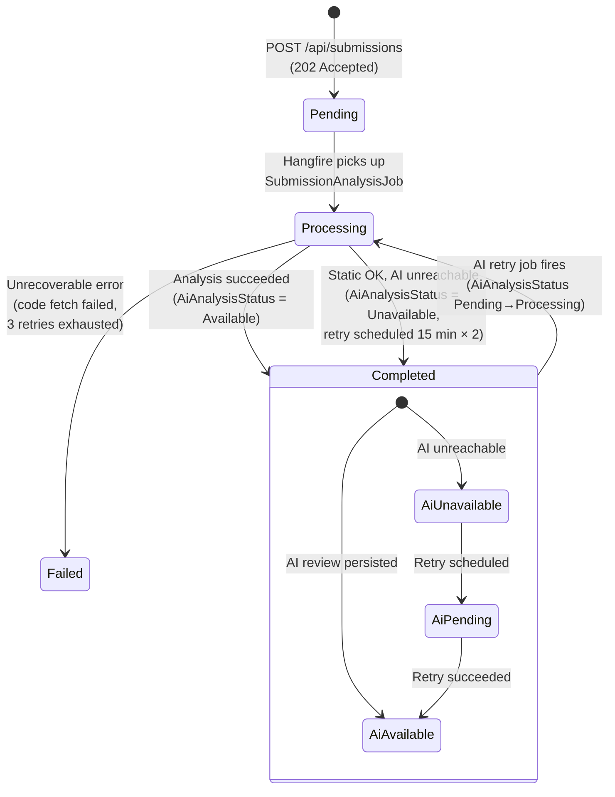

> **Key design decisions:**
> - `Completed` is a **terminal state** for the submission itself — even when `AiAnalysisStatus = Unavailable`, the learner sees static-analysis results immediately.
> - The AI retry is a **separate concern** tracked by `AiAnalysisStatus` and `AiAutoRetryCount` (max 2 retries), not by the top-level `Status`.
> - `Failed` is also terminal — requires a fresh submission.

**4.4.7.2 Assessment Lifecycle**

An `Assessment` has three terminal states depending on how the learner exits.

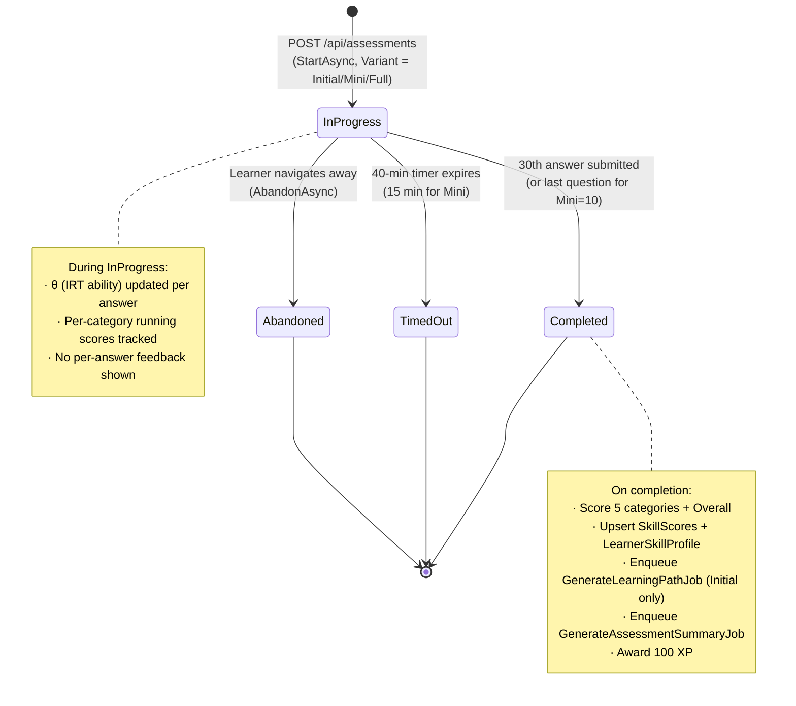

> **Variant-specific behaviour:**
> - `Initial` (30q / 40min) — triggers path generation + AI summary.
> - `Mini` (10q / 15min) — at 50% path progress; does **not** trigger path regeneration or summary.
> - `Full` (30q / 40min) — mandatory at 100% path progress; triggers AI summary only; path regeneration is via `POST /learning-paths/me/next-phase`.

**4.4.7.3 Path Adaptation Event Lifecycle**

A `PathAdaptationEvent` tracks the AI's proposed path change through a decision lifecycle.

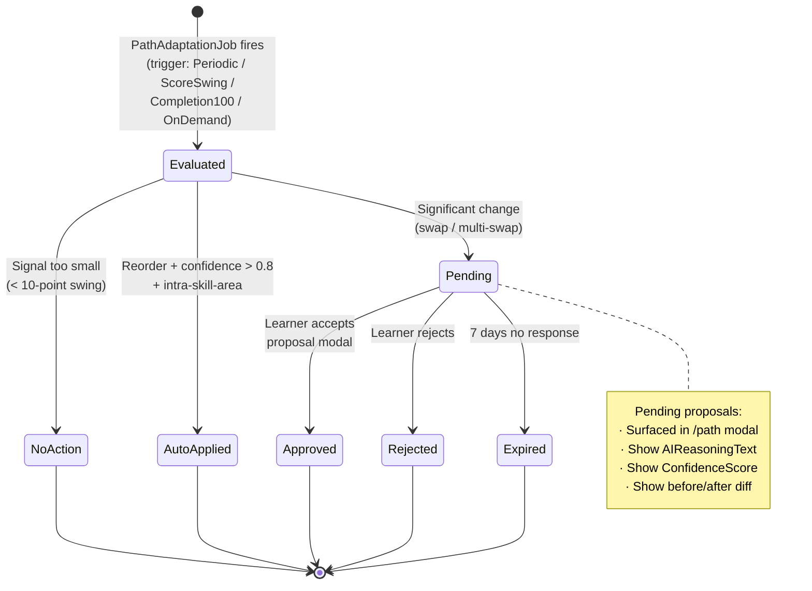

> **Signal-scoped adaptation rules (verified against `PathAdaptationService`):**
> - Score swing 10–20 → reorder only (low disruption)
> - Score swing 20–30 → reorder or single swap
> - Score swing > 30 or 100% completion → reorder or multiple swaps
> - **No mid-path full regeneration** — only graduation triggers a full new path.

## **4.5 Sequence Diagrams**

### **4.5.1 Sequence Diagram: User Authentication (Email/Password + GitHub OAuth)**

**Overview**

This sequence diagram illustrates the complete authentication workflow, covering both **Email/Password login** and **GitHub OAuth 2.0**.

The goal is to show the interaction between the **User**, **Frontend**, **Backend API**, **Authentication Service**, and **GitHub**, highlighting validation, token generation, security checks, and error handling.

**Sequence Diagram**

```
@startuml
title Sequence Diagram 4.5.1 — User Authentication (Clear Lifelines)

skinparam backgroundColor #FFFFFF
skinparam sequenceMessageAlign center
skinparam responseMessageBelowArrow true

actor User
participant "Frontend\n(Web Client)" as FE
participant "Backend API" as BE
participant "Authentication\nService" as AUTH
participant "GitHub OAuth\nService" as GITHUB

== Email / Password Authentication ==

User -> FE: Enter credentials\nClick Login
activate FE

FE -> FE: Validate input format

alt Invalid input
    FE -> User: Display validation errors
    deactivate FE
else Valid input
    FE -> BE: POST /api/auth/login\n(rate-limited: AuthLoginPolicy)
    activate BE

    BE -> AUTH: IAuthService.LoginAsync\n(ASP.NET Identity verify)
    activate AUTH

    alt Rate limit exceeded
        BE --> FE: 429 Too Many Requests
        FE -> User: Show retry message
    else Invalid credentials
        AUTH --> BE: AuthErrorCode.InvalidCredentials
        BE --> FE: 401 Unauthorized\n+ Problem details
        FE -> User: Show error message
    else Account locked\n(5 failed attempts / 15 min)
        AUTH --> BE: AuthErrorCode.AccountLocked
        BE --> FE: 401 Unauthorized\n(Title: AccountLocked)
        FE -> User: Show "try again in 15 min"
    else Authentication successful
        AUTH --> BE: AuthResponse\n(access JWT 1h, refresh 7d)
        BE --> FE: 200 OK\n+ AuthResponse JSON
        FE -> FE: Persist tokens\nUpdate Redux auth state
        FE -> User: Navigate to dashboard
    end

    deactivate AUTH
    deactivate BE
    deactivate FE
end

== GitHub OAuth Authentication (ADR-039 — fragment redirect) ==

User -> FE: Click "Continue with GitHub"
activate FE

FE -> BE: GET /api/auth/github/login
activate BE
BE -> BE: BuildLoginUrl(state)\nSet gh_oauth_state cookie (HttpOnly, 10 min)
BE --> FE: 302 Redirect to\ngithub.com/login/oauth/authorize?...
deactivate BE

FE -> GITHUB: Follow redirect
activate GITHUB

GITHUB -> User: Authenticate & grant consent
GITHUB --> FE: 302 Redirect to\n/api/auth/github/callback?code=...&state=...
deactivate GITHUB

FE -> BE: GET /api/auth/github/callback
activate BE

BE -> BE: Verify gh_oauth_state cookie matches\n(reject if mismatch)

BE -> GITHUB: Exchange code → access token\n(Octokit)
activate GITHUB
GITHUB --> BE: { access_token, scope }
deactivate GITHUB

BE -> GITHUB: GET /user + /user/emails
activate GITHUB
GITHUB --> BE: profile + verified email
deactivate GITHUB

BE -> AUTH: HandleCallbackAsync\n· Find or create ApplicationUser\n· Encrypt + persist OAuth token\n· Generate JWT + refresh
activate AUTH

alt OAuth failure
    AUTH --> BE: GitHubOAuthErrorCode
    BE --> FE: 302 Redirect to\nfrontend error URL with code+message
    FE -> User: Show OAuth error
else OAuth success
    AUTH --> BE: AuthResponse
    BE --> FE: 302 Redirect to\nSPA success URL\n#access=...&refresh=...&expires=...
    FE -> FE: Parse URL fragment\nPersist tokens\nStrip fragment from URL
    FE -> User: Navigate to dashboard
end

deactivate AUTH
deactivate BE
deactivate FE

@enduml
```

> **Verification note (2026-05-16, against `AuthController.cs` + `IGitHubOAuthService`):**
- Endpoint paths are **`/api/auth/...`** (the `/api` prefix matters — earlier drafts wrote `/auth/login`).
- Rate-limit response is **429**, returned by the middleware before the handler runs.
- Account-locked errors return **401** with an `AccountLocked` Problem-details title — *not* a separate 403 status (earlier drafts wrote 403, doesn’t match the code).
- GitHub callback returns a **302 redirect with tokens in the URL fragment** (per ADR-039). The token never appears in query string / access logs / Referer headers. Earlier drafts modelled this as a direct 200 OK + JSON, which is wrong.
- The `gh_oauth_state` cookie is the CSRF guard for the OAuth callback — verification of the state happens in the callback handler, not in the auth service.
> 


### **4.5.2 Sequence Diagram: Adaptive Assessment & Learning Path Generation**

**Workflow Description**

This sequence diagram presents the message-level view of the adaptive-assessment loop and the *asynchronous* path-generation cascade triggered at assessment completion. It complements the activity-level view in §4.4.3 by exposing the actual API contract: only **three** controller endpoints participate (`POST /api/assessments`, `POST /api/assessments/{id}/answers`, `GET /api/assessments/{id}`), the answer endpoint returns the *next question* in its response (there is no separate “request next question” call), and the heavy work (path generation + AI summary) is enqueued onto Hangfire and observed by the SPA via subsequent polling.

**Sequence Diagram (Initial variant; Mini/Full follow the same loop with variant-specific completion side-effects)**

```
@startuml
title Sequence Diagram 4.5.2 — Adaptive Assessment (Initial variant)

skinparam backgroundColor #FFFFFF
skinparam sequenceMessageAlign center
skinparam responseMessageBelowArrow true

actor User
participant "Frontend" as FE
participant "AssessmentsController" as BE
participant "AssessmentService" as SVC
participant "IAdaptiveQuestionSelector\n(IRT → AI service\n  OR rule-based fallback)" as SEL
participant "Hangfire" as HF
participant "AI Service\n(FastAPI)" as AI

== Phase 1: Start ==

User -> FE: Select track + start
FE -> BE: POST /api/assessments\n{ track }
activate BE

BE -> SVC: StartAsync(userId, request)
activate SVC
SVC -> SVC: Eligibility check\n(30-day cooldown for Initial)
SVC -> SVC: Persist Assessment row\n(Variant=Initial, Status=InProgress)

SVC -> SEL: SelectFirstAsync(track, θ=0)
activate SEL
SEL -> AI: POST /api/irt/select-next\n(unanswered items, θ=0)
activate AI
AI --> SEL: Selected question
deactivate AI
SEL --> SVC: First question
deactivate SEL

SVC --> BE: StartAssessmentResponse\n{ assessmentId, question,\n  totalQuestions=30, timeoutMinutes=40 }
deactivate SVC
BE --> FE: 200 OK
deactivate BE
FE -> User: Render question + start timer

== Phase 2: Adaptive Loop (combined answer + next question) ==

loop For each answer (until 30 or timeout)
    User -> FE: Pick option + submit
    FE -> BE: POST /api/assessments/{id}/answers\n(Idempotency-Key header)
    activate BE

    BE -> SVC: SubmitAnswerAsync
    activate SVC
    SVC -> SVC: Persist AssessmentResponse\nUpdate θ (MLE) + running scores
    SVC -> SEL: SelectNextAsync(state, θ)
    activate SEL
    SEL -> AI: POST /api/irt/select-next
    activate AI
    AI --> SEL: Next question (or null if 30/timeout)
    deactivate AI
    SEL --> SVC: Next question
    deactivate SEL
    SVC --> BE: AnswerResult\n{ nextQuestion, state }
    deactivate SVC
    BE --> FE: 200 OK\n(next question, no per-answer feedback)
    deactivate BE
    FE -> User: Render next question
end

== Phase 3: Completion (last answer triggers this branch) ==

note over SVC: Either the 30th answer or the abandon/timeout endpoint\ntriggers `CompleteAsFinishedAsync` / `CompleteAsTimedOutAsync`.

SVC -> SVC: Score 5 categories + Overall\nSet SkillLevel\nUpsert SkillScores + LearnerSkillProfile

== Phase 4: Async fan-out ==

SVC -> HF: BackgroundJob.Enqueue<GenerateLearningPathJob>
SVC -> HF: BackgroundJob.Enqueue<GenerateAssessmentSummaryJob>
SVC -> SVC: XpService.AwardAsync(100, AssessmentCompleted)

note over HF, AI: The two jobs run independently:\n• `GenerateLearningPathJob` calls AI service `/api/generate-path` (hybrid recall + LLM rerank)\n• `GenerateAssessmentSummaryJob` calls AI service for the 3-paragraph summary\nBoth persist results and surface to the SPA on the next poll.

== Phase 5: Results presentation ==

FE -> BE: GET /api/assessments/{id}
activate BE
BE --> FE: AssessmentResultDto\n(per-category scores, level, variant)
deactivate BE
FE -> User: Show results page\n+ poll for path / summary readiness

@enduml
```

> **Verification note (2026-05-16, against `AssessmentsController.cs` + `AssessmentService.cs` + `GenerateLearningPathJob`):** Earlier drafts modelled this flow with:
- a separate `requestNextQuestion()` API call → **wrong**; the next question is returned by the answer endpoint
- a separate `finalizeAssessment()` endpoint → **wrong**; completion is triggered by the last answer, by the abandon endpoint, or by the timeout server-side check
- per-answer “Show feedback” → **wrong**; the UI shows the next question, not per-answer feedback
- inline `LP -> generateLearningPath()` call returning a path synchronously → **wrong**; path generation is **asynchronous** via Hangfire (`GenerateLearningPathJob` calls AI service `/api/generate-path`)
- separate `Recommendation Engine` returning top-5 recommendations at assessment end → **does not exist**; recommendations are produced by the *submission* pipeline (`FeedbackAggregator`), not the assessment pipeline
> 
> 
> The corrected diagram above models the *actual* shipped flow including the Hangfire fan-out and the new F15 AI Summary job.
> 

### **4.5.3 Sequence Diagram: Code Submission & Analysis Pipeline**

**Workflow Description**

This sequence diagram models the complete code submission and analysis pipeline — from user submission to multi-layered feedback delivery. The workflow supports both **GitHub repository submission** and **ZIP file upload**, with **sequential analysis**: static analysis runs first, then results are passed to the AI service for enhanced review.

**Key architectural principles:**

- Asynchronous job processing (202 Accepted pattern returned to the user immediately)
- **Hangfire (in-process, SQL-Server-backed)** as the durable job queue (per ADR-002 — Azure Service Bus / RabbitMQ rejected)
- **Sequential flow:** static analysis → AI review (the AI service receives the static results)
- AI service performs prompt engineering with static results + task context + learner history
- LLM returns structured JSON feedback validated against an output schema
- The single-prompt review path is the default; the F13 multi-agent path runs in parallel only when `AI_REVIEW_MODE=multi`

```
@startuml
title Sequence Diagram 4.5.3 — Code Submission & Analysis Pipeline

skinparam backgroundColor #FFFFFF
skinparam sequenceMessageAlign center

actor User
participant "Frontend" as FE
participant "SubmissionsController" as BE
participant "Hangfire Worker\n(SubmissionAnalysisJob)" as HF
participant "ISubmissionCodeLoader\n(Octokit + Blob)" as CL
participant "ILearnerSnapshotService\n(Qdrant RAG)" as SNAP
participant "AI Service\n(/api/analyze-zip[-multi])" as AI
participant "Static-analysis containers\n(ESLint/Roslyn/Bandit/...)" as SA
participant "OpenAI\n(gpt-5.1-codex-mini)" as LLM
database "SQL Server" as DB

== Phase 1: Submission (synchronous, ≤ 500 ms p95) ==

User -> FE: Submit code\n(GitHub URL or pre-uploaded blob path)
FE -> BE: POST /api/submissions\n(rate-limited)
activate BE
BE -> BE: FluentValidation + IsValidGitHubUrl
BE -> DB: Insert Submission row (Pending)
activate DB
DB --> BE
deactivate DB
BE -> HF: BackgroundJob.Enqueue<SubmissionAnalysisJob>
BE --> FE: 202 Accepted (submissionId)
deactivate BE
FE -> User: Show "Processing"

== Phase 2: Worker pickup ==

HF -> HF: SubmissionAnalysisJob.RunAsync(submissionId)\n([AutomaticRetry 3×, 10/60/300s])
activate HF
HF -> DB: Mark Submission → Processing
activate DB
DB --> HF
deactivate DB

== Phase 3: Fetch + history context (in-backend) ==

HF -> CL: LoadAsZipStreamAsync
activate CL
alt GitHub URL
    CL -> CL: Octokit clone → ZIP repackage
else Blob upload path
    CL -> CL: Download from Azure Blob
end
CL --> HF: ZipStream + filename
deactivate CL

HF -> SNAP: BuildAsync(userId, submissionId,\n  currentTaskId, ragAnchor) [F14, ADR-040]
activate SNAP
SNAP --> HF: LearnerSnapshot (graceful nil on outage)
deactivate SNAP

HF -> DB: Load TaskBrief
activate DB
DB --> HF: title + description + criteria + track + lang
deactivate DB

== Phase 4: Single AI-service call (static + AI together) ==

alt AI_REVIEW_MODE = single
    HF -> AI: POST /api/analyze-zip\n(ZIP + snapshot + taskBrief + correlationId)
else AI_REVIEW_MODE = multi (F13, ADR-037)
    HF -> AI: POST /api/analyze-zip-multi
end
activate AI

par
    AI -> SA: Run per-language containers in parallel
    activate SA
    SA --> AI: Per-tool results\n(graceful degradation on tool failure)
    deactivate SA
also
    alt single
        AI -> LLM: One review prompt (8k in / 2k out caps)
    else multi
        AI -> LLM: 3 specialist agents in parallel\n(security / performance / architecture)\nvia asyncio.gather
    end
    activate LLM
    LLM --> AI: Structured JSON
    deactivate LLM
end

AI --> HF: AiCombinedResponse\n(static rows + AI review + token counts)
deactivate AI

== Phase 5: Persist + side-effects ==

HF -> DB: Persist StaticAnalysisResults (one row / tool)\n+ AIAnalysisResult (or AiStatus=Unavailable)
activate DB
DB --> HF
deactivate DB

HF -> DB: Submission → Completed\n(FeedbackJson lives on AIAnalysisResult,\n pre-aggregated by FeedbackAggregator)
activate DB
DB --> HF
deactivate DB

opt Score ≥ 70 AND task on active path (ADR-026)
    HF -> DB: PathTask → Completed\nRecompute LearningPath.ProgressPercent
    activate DB
    DB --> HF
    deactivate DB
end

opt First AI persistence
    HF -> DB: Upsert CodeQualityScore per category (ADR-028)
    HF -> DB: Insert XpTransaction\n+ check badges (S8-T3)
end

HF -> HF: Enqueue IndexForMentorChatJob\n(chunk + embed code into Qdrant for F12)
HF -> DB: Insert Notification (in-app)\n+ EmailDelivery (picked up by EmailRetryJob)

deactivate HF

== Phase 6: View Results ==

User -> FE: Open /submissions/{id}
FE -> BE: GET /api/submissions/{id}/feedback
activate BE
BE -> DB: JOIN Submissions × AIAnalysisResults\nSELECT ai.FeedbackJson WHERE s.Id=@id AND s.UserId=@user AND s.Status=Completed
activate DB
DB --> BE
deactivate DB
BE --> FE: 200 Content-Type: application/json\n(streams FeedbackJson verbatim)
deactivate BE
FE -> User: Render report (radar + annotations + recs)

@enduml
```

> **Verification note (2026-05-16, against `SubmissionsController.cs` + `SubmissionAnalysisJob.cs`):**
- Endpoint is **`/api/submissions`** — there is **no `/v1` URL prefix** in the actual routes. The `[Route("api/...")]` attributes (`api/auth`, `api/assessments`, `api/submissions`, `api/learning-paths`, etc.) define the actual API surface. The “/api/v1/” pattern was an aspirational note from the PRD’s NFR-INT-01.
- Static analysis and AI review are **co-located inside the AI service** — the backend makes a single `POST /api/analyze-zip` (or `/api/analyze-zip-multi`) call with the ZIP + snapshot + taskBrief and receives a combined response. Earlier drafts modelled `Backend → Static Analysis Service` as a separate hop and `AI → Backend: Request task context` (a pull-from-backend pattern) — both wrong.
- The F14 LearnerSnapshot (history-aware context) and the F13 multi-agent mode-switch ship in M3 but weren’t in earlier drafts. Both are now first-class steps in the diagram.
- The pipeline performs five additional persisted side-effects: (a) PathTask auto-completion (ADR-026), (b) CodeQualityScore running averages (ADR-028), (c) XP grant + badge check, (d) IndexForMentorChatJob enqueue (F12), and (e) EmailDelivery row instead of a direct send email call (decoupling retry logic from the analysis job).
> 


### **4.5.4 Sequence Diagram: Viewing AI Feedback & Adding Recommended Tasks**

**Workflow Description**

This workflow models how learners access completed analysis results, review AI/static feedback, explore recommendations, and add tasks to their learning path. The system unifies feedback, ensures fast loading through caching, and supports real-time UI updates. It also enables comparison with previous submissions, resource engagement tracking, and export to PDF.

**Key Design Concepts**

- **Unified Report Delivery:** Single endpoint aggregates submission metadata, static analysis, AI feedback, recommendations, and resources.
- **Fast Loading:** Redis caching for repeated requests.
- **Interactive Feedback UI:** Collapsible sections, syntax-highlighted snippets, and inline annotations.
- **Actionable Recommendations:** Add tasks instantly to the active learning path.
- **Progress Analysis:** Compare current vs previous submissions.
- **PDF Export::** Asynchronous job-based export with quotas for free-tier users.

```
@startuml
title 4.5.4 Viewing AI Feedback & Adding Recommended Tasks

actor Learner
participant "Frontend\n(Web App)" as FE
participant "SubmissionsController" as SC
participant "LearningPathsController" as LPC
participant "LearningPathService" as LPS
database "SQL Server" as DB

== Phase 1: Retrieve Feedback (pre-aggregated) ==

Learner -> FE: Open /submissions/{id}
activate FE

FE -> SC: GET /api/submissions/{id}/feedback\n(JWT in Authorization header)
activate SC

SC -> SC: [Authorize] middleware verifies JWT\n(401 if missing / invalid)
SC -> SC: Owner check on Submission.UserId\n(404 if not owner or not Completed)

SC -> DB: JOIN Submissions × AIAnalysisResults\nSELECT ai.FeedbackJson WHERE s.Id=@id\n  AND s.UserId=@user AND s.Status=Completed
activate DB
DB --> SC: { feedbackJson } (single column, joined)
deactivate DB

SC --> FE: 200 OK\nContent-Type: application/json\n(verbatim FeedbackJson)
deactivate SC

FE -> FE: Parse JSON, lazy-render sections
FE --> Learner: Render feedback page\n· Overall score gauge\n· Per-category radar (Recharts)\n· Strengths + Weaknesses\n· Inline annotations (Prism.js)\n· Recommended tasks (cards with recommendationId)\n· Resources
deactivate FE

note right of SC
  The FeedbackJson column lives on AIAnalysisResult
  (1:1 with Submission, unique index on SubmissionId).
  It is **pre-aggregated** by FeedbackAggregator during
  the submission analysis job, then streamed verbatim
  here — no on-the-fly join over Static / Recommendation
  tables at GET time.
end note

== Phase 2: Optional — Open Mentor Chat (F12) ==

opt Learner asks follow-up
    Learner -> FE: Type question in side panel
    note right of FE
      RAG flow handled by MentorChatController
      → AI service /api/mentor-chat (SSE).
      See architecture.md §6.5 for the streaming detail.
    end note
end

== Phase 3: Optional — Rate a category (SF4) ==

opt Learner clicks thumbs-up / thumbs-down
    Learner -> FE: Pick rating
    FE -> SC: POST /api/submissions/{id}/rating\n{ category, rating }
    activate SC
    SC -> DB: Upsert FeedbackRating\n(unique on submissionId+userId+category)
    activate DB
    DB --> SC
    deactivate DB
    SC --> FE: 200 OK
    deactivate SC
end

== Phase 4: Add a recommended task to the learning path ==

Learner -> FE: Click "Add to my path" on a Recommendation card
activate FE

FE -> LPC: POST /api/learning-paths/me/tasks/\n  from-recommendation/{recommendationId}
activate LPC

LPC -> LPS: AddTaskFromRecommendationAsync(userId, recId)
activate LPS

LPS -> DB: Load Recommendation by id (ownership check)
activate DB
DB --> LPS
deactivate DB

alt Recommendation has no linked task
    LPS --> LPC: RecommendationHasNoTaskId
    LPC --> FE: 400 Bad Request
else No active learning path
    LPS --> LPC: NoActivePath
    LPC --> FE: 409 Conflict ("Take the assessment first")
else Task already on path
    LPS --> LPC: TaskAlreadyOnPath
    LPC --> FE: 409 Conflict ("Already on your path")
else Recommendation already added
    LPS --> LPC: AlreadyAdded
    LPC --> FE: 409 Conflict
else Happy path
    LPS -> DB: Append PathTask (next OrderIndex)\nMark Recommendation.IsAdded = true
    activate DB
    DB --> LPS
    deactivate DB
    LPS --> LPC: Added
    LPC -> LPS: GetActiveAsync (refresh)
    LPS --> LPC: Updated LearningPathDto
    LPC --> FE: 200 OK\n+ refreshed path
end

deactivate LPS
deactivate LPC

FE --> Learner: Toast confirmation + refreshed path view
deactivate FE

@enduml
```

> **Verification note (2026-05-16, against `SubmissionsController.cs` + `LearningPathsController.cs`):**
- Earlier drafts modelled a separate `FeedbackController` + `FeedbackService` participants and showed three sequential DB reads (submission, static+AI, recommendations) at GET time. The real implementation joins `Submissions × AIAnalysisResults` and streams the **`AIAnalysisResult.FeedbackJson`** column verbatim — the aggregation happens during the analysis job (§4.4.5 / §4.5.3), not at view time. **Note:** `FeedbackJson` lives on `AIAnalysisResult` (1:1 with Submission via unique index on `SubmissionId`), **not** on `Submission` — earlier drafts of this doc had that wrong.
- The “Add to Learning Path” endpoint is **`POST /api/learning-paths/me/tasks/from-recommendation/{recommendationId}`** — it takes a `recommendationId`, not a `taskId`. The diagram earlier used `POST addTask(taskId)` which doesn’t match a real route.
- There is **no prerequisite check** for “add from recommendation” — the recommendation already implies the task is relevant to the learner. The valid error states are: missing linked task, no active path, task already on path, and recommendation already added (all return 409 with a clear message).
- Two MVP-shipped interactions are now first-class in the diagram: Mentor Chat follow-up (F12) and per-category Feedback Rating (SF4) — both ship with the MVP and were absent from earlier drafts.
> 

## **4.6 Context Diagram**

### **4.6.1 Overview**

The **Context Diagram** provides the highest-level architectural view of the AI-Powered Learning & Code Review Platform.

It shows *what the system interacts with* — not how the system works internally — and defines the **system boundary**, **external actors**, and **primary information flows**.

This refined version follows the **C4 Model – Level 1 (System Context)** standards and ensures strict alignment with the architectural style, terminology, and structure already established in the earlier chapters of this documentation.

**Purpose**

The diagram clarifies:

- **System Boundary** – Defines what is inside the platform versus external systems.
- **Primary Actors** – Who interacts with the system and in what capacity.
- **External Integrations** – GitHub, LLM provider, Email service, Cloud infrastructure.
- **High-Level Data Flows** – Core information entering and exiting the system.
- **Trust Boundaries** – Security considerations for external communication.

**Why This Matters**

- Ensures architectural consistency across the documentation
- Helps non-technical stakeholders understand the system’s scope
- Enables early identification of integration requirements
- Supports threat modeling and boundary-level security analysis

### **4.6.2 Context Diagram**

**Figure 4.3 — System Context (C4 Level 1)**

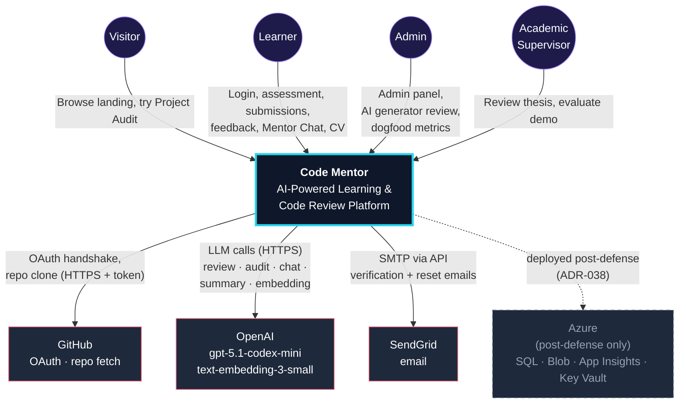

### **4.6.3 Context Diagram Explanation**

**System boundary (everything inside the *Code Mentor* box):**

- React 18 SPA frontend (Vite)
- ASP.NET Core 10 backend API
- In-process Hangfire worker (within the backend)
- Python FastAPI AI microservice
- SQL Server 2022 database
- Redis cache + rate limiter
- Qdrant vector index
- Azurite (Azure Blob locally) object storage
- Static-analysis containers (ESLint, Roslyn, Bandit, Cppcheck, PHPStan, PMD)

**Primary actors:**

- **Visitor** — unauthenticated user landing on the public pages (`/`, `/privacy`, `/terms`, `/audit/new` landing CTA before login).
- **Learner** — authenticated learner taking assessments, submitting code, viewing feedback, chatting with the Mentor.
- **Admin** — backend role with CRUD over tasks + questions, plus the AI Question/Task Generator review surface.
- **Academic Supervisor** — reviews the thesis and the demo; does not log into the platform itself.

**External integrations:**

- **GitHub** — OAuth identity provider and repository fetch (with the learner’s encrypted OAuth token).
- **OpenAI** — every LLM call: AI review, project audit, mentor chat (with embedding retrieval), post-assessment summary, AI question / task generation.
- **SendGrid** — transactional email (verification + password reset).
- **Azure** — dashed, post-defense only (ADR-038). The runbook in `docs/runbook.md` captures the deployment plan; during the defense window the platform runs locally on the owner’s laptop via `docker-compose up`.

**Trust boundaries:**

- Backend ↔︎ AI service runs over local Docker networking in dev and over internal HTTPS in prod; no public exposure of the AI service.
- All outbound calls (GitHub, OpenAI, SendGrid) use TLS 1.2+.
- OAuth and refresh tokens are encrypted at rest with AES-256.

## **4.7 Data Flow Diagrams (DFD)**

### **4.7.1 Overview**

The **Data Flow Diagrams (DFDs)** illustrate how data moves through the AI-Powered Learning & Code Review Platform.

DFDs represent the system from a functional perspective, showing how information is processed, stored, and exchanged with external entities.

**Objectives of Using DFDs**

| Objective | Description |
| --- | --- |
| Process Decomposition | Break complex operations into understandable functional steps |
| Data Store Identification | Highlight where data is stored and how processes use it |
| Information Flow Mapping | Show how user input transforms into system output |
| Integration Visibility | Identify touchpoints between internal processes and external services |
| Requirements Validation | Ensure that all functional requirements have corresponding processes |

### **4.7.2 DFD Hierarchy**

The system is presented at two levels of decomposition — Level 0 (one process) and Level 1 (six processes). Deeper decomposition (Level 2) is captured implicitly by the activity diagrams in §4.4 and the sequence diagrams in §4.5, which model the internal flow of each sub-process step by step.

| DFD Level | Scope | Purpose | Processes |
| --- | --- | --- | --- |
| Level 0 | Entire system | Matches the Context Diagram | 1 process (Code Mentor) |
| Level 1 | Major subsystems | Exposes the top-level dataflow | 6 processes (P1 … P6) |

### **4.7.3 Level 0 DFD – Context-Level Overview**

The Level 0 DFD treats the entire platform as a single process exchanging data with three external entities and four actor types.

**Figure 4.4 — DFD Level 0**

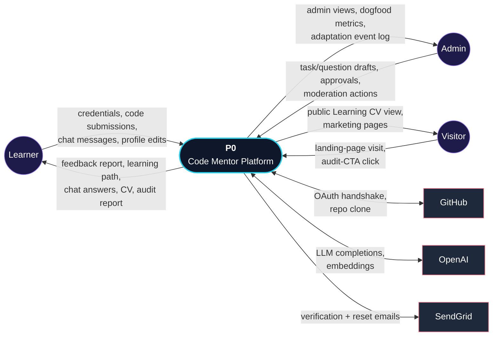

### **4.7.4 Level 1 DFD – Major Subsystem Decomposition**

Level 1 expands `P0` into **six subsystems** that collectively cover every functional requirement in §3.3.1.

**4.7.4.1 Level 1 Processes**

| Process | Name | Covers |
| --- | --- | --- |
| **P1** | Authenticate & Manage Users | F1 — auth, profile, RBAC |
| **P2** | Adaptive Assessment & Skill Profile | F2 / F15 — assessment, IRT, summary, mini/full reassessment |
| **P3** | Learning Path & Continuous Adaptation | F3 / F16 — path generation, framing, adaptation, graduation, next-phase |
| **P4** | Code Submission & Multi-Layered Analysis | F5 / F6 / F13 / F14 — submission, static + AI review (single/multi-agent), history-aware |
| **P5** | Mentor Chat & Project Audit | F11 / F12 — RAG chat, standalone audit |
| **P6** | Learning CV, Admin & Engagement | F7 / F8 / F9 / F10 — feedback UI, dashboard, admin, CV, stretch features |

**4.7.4.2 Data stores introduced at Level 1**

| ID | Data store | Holds |
| --- | --- | --- |
| **D1** | `Users` | Accounts, roles, profile data, encrypted OAuth tokens |
| **D2** | `Assessments` + `AssessmentResponses` + `Questions` + `AssessmentSummaries` | Adaptive exam state, answer log, item bank with IRT parameters, AI summaries |
| **D3** | `LearningPaths` + `PathTasks` + `LearnerSkillProfile` + `TaskFramings` + `PathAdaptationEvents` | Generated paths, task ordering, smoothed skill profile, per-task AI framing cache, adaptation audit trail |
| **D4** | `Tasks` | Task library with metadata (skill tags, learning gain, prerequisites) |
| **D5** | `Submissions` + `StaticAnalysisResults` + `AIAnalysisResults` | Submission lifecycle, per-tool static output, AI review output (including multi-agent runs) |
| **D6** | `ProjectAudits` + `AuditAIAnalysisResults` | Standalone audit submissions and outputs |
| **D7** | `MentorChatSessions` + `MentorChatMessages` + *(Qdrant — vector index)* | RAG conversation history; code embeddings live in Qdrant |
| **D8** | `LearningCVs` + `Recommendations` + `Badges` (stretch) | CV state, recommendation queue, badge catalogue |
| **D9** | `AuditLogs` + `IRTCalibrationLog` | Admin action history + IRT empirical recalibration log |

**Figure 4.5 — DFD Level 1**

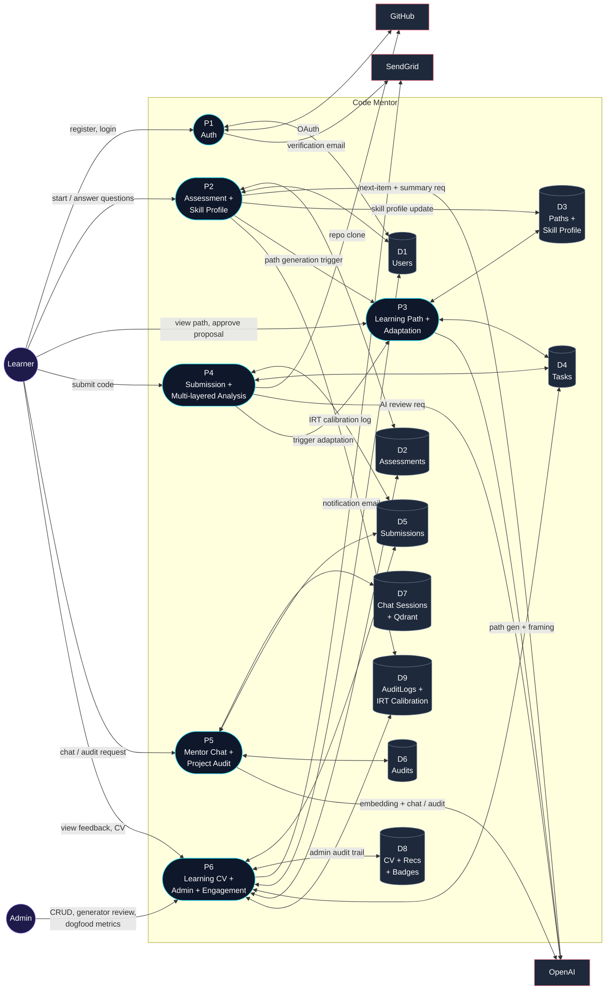

**Reading the diagram:**

- Every learner-visible feature is a flow from `L` into one of the P-processes and back.
- The path adaptation engine in P3 is triggered both by completed submissions in P4 and by assessment events in P2 — that is the M4 feedback loop the project is built around.
- The Mentor Chat / Audit subsystem (P5) is the only subsystem that *also* reads the submission and audit stores, because chat history must persist across visits and audit reports must be re-renderable on demand.
- The admin actor only talks to P6, which is the integration surface for every admin operation.

## **4.8 Database Design**

### **4.8.1 Overview**

The **Database Design** section provides a comprehensive specification of the platform’s relational data model, encompassing entity-relationship modeling, table schemas, relationships, constraints, indexing strategies, and data integrity mechanisms. This design ensures:

- **Data Integrity**: Referential integrity through foreign keys, constraints, and validation rules
- **Performance Optimization**: Strategic indexing for query patterns and read/write workloads
- **Scalability**: Partitioning strategies, read replicas, and connection pooling
- **Maintainability**: Clear naming conventions, normalization, and documentation
- **Security**: Encrypted sensitive data, audit trails, and least-privilege access

**Design Principles**:

| Principle | Implementation |
| --- | --- |
| Normalization | 3rd Normal Form (3NF) with selective denormalization for performance |
| Referential Integrity | Foreign keys with cascade/restrict rules |
| Optimistic Concurrency | Row versioning (timestamps) for conflict detection |
| Audit Trail | Immutable audit log table for compliance |
| Soft Deletes | IsActive / IsDeleted flags instead of hard deletes |
| Temporal Data | CreatedAt, UpdatedAt, timestamps for all entities |

### **4.8.2 Entity-Relationship Diagram (ERD)**

The ERD visualises the database entities (tables), their attributes, primary keys, foreign keys, and cardinality relationships. The entity inventory below is exactly what `ApplicationDbContext.cs` exposes as `DbSet<T>` — **38 entities** distributed across the Identity tables shipped with ASP.NET Core Identity plus 13 logical domains in the Domain layer. New domains (F11 Audit, F12 Mentor Chat, F15 IRT, F16 Path + Adaptation) were added in M2.5 → M4 and are flagged inline.

> **Verification baseline (2026-05-16):** The list below was cross-checked entity-by-entity against `backend/src/CodeMentor.Domain/**/*.cs` and `backend/src/CodeMentor.Infrastructure/Identity/*.cs`. Where ASP.NET Identity ships its own tables (`AspNetUsers`, `AspNetRoles`, `AspNetUserRoles`, `AspNetUserClaims`, `AspNetUserLogins`, `AspNetUserTokens`, `AspNetRoleClaims`), those are *not* counted in the 38 — they are external identity tables. The 38 is the application-owned schema.
> 

### Logical domains

1. **Identity & Auth** (2 entities under `Infrastructure/Identity/`): `RefreshToken` (rotation chain via `ReplacedByTokenHash`), `OAuthToken` (per-provider, **AES-256 encrypted ciphers** for AccessToken + RefreshToken). `ApplicationUser` extends `IdentityUser<Guid>` with `FullName`, `GitHubUsername`, `ProfilePictureUrl`, and the ADR-046 soft-delete trio (`IsDeleted`, `DeletedAt`, `HardDeleteAt`). `ApplicationRole` extends `IdentityRole<Guid>`. Neither is a `DbSet` in our context — they are surfaced through `IdentityDbContext<...>`.
2. **User-facing** (3 entities): `UserSettings` (10 notification prefs × 2 channels + 3 privacy toggles, 1:1 with User per ADR-046), `EmailDelivery` (outbound email audit with retry state — Pending / Sent / Failed / Suppressed), `UserAccountDeletionRequest` (30-day cooling-off window per ADR-046; tracks `ScheduledJobId` so the cancel-on-login path can de-schedule the Hangfire job).
3. **Assessment** (5 entities — F2 + F15): `Question` (Difficulty **1..3** scale; `IRT_A` + `IRT_B` + `CalibrationSource`; optional `CodeSnippet` + `CodeLanguage`; `EmbeddingJson` for hybrid retrieval; `PromptVersion`), `QuestionDraft` (F15 admin-review queue with `BatchId`, `OriginalDraftJson` snapshot, `ApprovedQuestionId` back-link), `Assessment` (UserId, Track, Status, **Variant `Initial`/`Mini`/`Full`**, `IrtFallbackUsed`), `AssessmentResponse` (FK to Assessment + Question, with **`Category` + `Difficulty` snapshotted at answer time** so later question edits don’t retroactively change scoring), `AssessmentSummary` (1:1 with Assessment, three plain-prose paragraphs + `PromptVersion` + `TokensUsed` + `RetryCount` + `LatencyMs`).
4. **IRT calibration audit** (1 entity — F15): `IRTCalibrationLog` — one row per *recalibration consideration* of a Question, **including skipped rows** with `WasRecalibrated=false` (`SkipReason ∈ {below_threshold, admin_locked, ai_service_unavailable}`). Kept for thesis honesty per ADR-055.
5. **Skills** (3 entities): `SkillScore` (per-`(UserId, Category)` per-Assessment snapshot, integer 0..100), `LearnerSkillProfile` (F15 **EMA-smoothed** per-`(UserId, Category)`, α = 0.4, `LastSource ∈ {Assessment, SubmissionInferred}`, `SampleCount`), `CodeQualityScore` (per-`(UserId, CodeQualityCategory)` *running mean* derived from AI reviews — a **different category enum** than SkillScore).
6. **Tasks & Path** (6 entities — F3 + F16): `TaskItem` (Difficulty **1..5** scale — note the deliberate divergence from Question’s 1..3, since tasks span a wider effort range; `SkillTagsJson`, `LearningGainJson`, `Source ∈ {Manual, AI}`, `EmbeddingJson`, `PromptVersion`), `TaskDraft` (F16 admin-review queue mirroring `QuestionDraft`), `LearningPath` (UserId, Track, **`AssessmentId` FK linking back to the originating assessment**, `Source ∈ {AIGenerated, TemplateFallback}`, `GenerationReasoningText`, `LastAdaptedAt` for cooldown, **`InitialSkillProfileJson` snapshot** for graduation Before/After radar, **lineage chain via `Version` + `PreviousLearningPathId`**), `PathTask` (FK to LearningPath + TaskItem, `OrderIndex`, `Status`), `PathAdaptationEvent` (16 columns — see §4.8.2.1 Domain 6), `TaskFraming` (F16 per-`(UserId, TaskId)` cache with 7-day TTL, `RegeneratedCount`).
7. **Submissions & Analysis** (6 entities — F5 / F6 / SF4): `Submission` (**`UserId` is nullable** — anonymised on hard-delete per ADR-046; `TaskId`, `SubmissionType ∈ {GitHub, Upload}`, `RepositoryUrl?` / `BlobPath?`, `Status`, `AiAnalysisStatus`, `AttemptNumber`, `AiAutoRetryCount`, **`MentorIndexedAt`** for F12 indexing readiness), `StaticAnalysisResult` (one row per `(SubmissionId, Tool)` with Tool ∈ `{ESLint, Bandit, Cppcheck, PHPStan, PMD, Roslyn}`), `AIAnalysisResult` (**1:1 with Submission, unique index on `SubmissionId`** — carries `OverallScore`, **`FeedbackJson` as the canonical unified payload returned by `GET /submissions/{id}/feedback`**, `StrengthsJson` / `WeaknessesJson` denormalised, `ModelUsed`, `TokensUsed`, `PromptVersion`), `Recommendation` (3–5 per submission, **`TaskId` nullable + free-text `Topic` fallback** for AI suggestions without a matching seeded task, `Priority` 1–5, `IsAdded`), `Resource` (3–5 per submission — Article / Video / Documentation / Tutorial / Course), `FeedbackRating` (SF4 thumbs up/down — **unique on `(SubmissionId, Category)`** — user is implicit from the submission owner, no `UserId` column).
8. **Project Audit** (3 entities — F11): `ProjectAudit` (UserId nullable per ADR-046; **`ProjectDescriptionJson`** as the structured form payload; `AuditSourceType ∈ {GitHub, Upload}`; `Status`, `AiReviewStatus`, `OverallScore`, `Grade`, `AttemptNumber`, `AiAutoRetryCount`, `IsDeleted` soft-delete flag, `MentorIndexedAt`), `ProjectAuditResult` (1:1 with audit — **11 JSON columns** for the 8-section report: ScoresJson, StrengthsJson, CriticalIssuesJson, WarningsJson, SuggestionsJson, MissingFeaturesJson, RecommendedImprovementsJson, TechStackAssessment, ExecutiveSummary, ArchitectureNotes, InlineAnnotationsJson + ModelUsed/PromptVersion/TokensInput/TokensOutput), `AuditStaticAnalysisResult` (one row per `(AuditId, Tool)` — same `StaticAnalysisTool` enum as Submissions).
9. **Mentor Chat** (2 entities — F12): `MentorChatSession` (UserId, **`Scope ∈ {Submission, Audit}` + `ScopeId` polymorphic** — no DB FK because SQL Server cannot express a polymorphic FK; ownership enforced in the application layer; unique on `(UserId, Scope, ScopeId)`), `MentorChatMessage` (Role user / assistant; **`RetrievedChunkIds`** array of Qdrant point IDs grounding the turn; `TokensInput` / `TokensOutput`; `ContextMode ∈ {RAG, RawFallback}` records whether retrieval was used). Code embeddings themselves live in **Qdrant**, *not* in SQL.
10. **Learning CV** (2 entities — F10): `LearningCV` (UserId, `PublicSlug`, `IsPublic`, `LastGeneratedAt`, `ViewCount` — the CV body is *computed* at request time from the user’s profile + top submissions; only the wrapper metadata is persisted), `LearningCVView` (per-IP dedupe — one increment per `IpAddressHash` per 24h window).
11. **Engagement** (3 entities): `XpTransaction` (append-only ledger; UserId, `Amount`, `Reason` from `XpReasons` constants, `RelatedEntityId`; total XP = `SUM(Amount)`), `Badge` (catalog row keyed by `BadgeKeys` stable string), `UserBadge` (earned badges, unique on `(UserId, BadgeId)` so awarding is naturally idempotent).
12. **Notifications** (1 entity): `Notification` — `NotificationType` enum with **10 values** including the new `PathAdaptationPending` (S20-T4 / F16). Pref-aware dispatch via `UserSettings`.
13. **Administration** (1 entity): `AuditLog` — actor `UserId` nullable (null when system-initiated), `Action` / `EntityType` / `EntityId`, before/after JSON snapshots, IP address.

**Total: 38 application-owned tables** (matches `ApplicationDbContext.DbSet<T>` declarations 1:1).

**Figure 4.6 — Simplified ERD (core entities and relationships)**

The ERD below is the **schema-accurate** dominant view — every relationship and cardinality is verified against the EF Core entity types and `ApplicationDbContext.cs` (2026-05-16). Attribute lists are pruned to the keys plus the discriminator columns supervisors most often ask about; the full attribute list per entity lives in §4.8.2.1.

```mermaid
erDiagram
    ApplicationUser ||--o{ RefreshToken : "rotates"
    ApplicationUser ||--o{ OAuthToken : "links provider"
    ApplicationUser ||--o| UserSettings : "1:1 prefs"
    ApplicationUser ||--o{ EmailDelivery : "audited mail"
    ApplicationUser ||--o| UserAccountDeletionRequest : "cooling-off"
    ApplicationUser ||--o{ Assessment : "takes"
    ApplicationUser ||--o{ LearningPath : "owns"
    ApplicationUser ||--o{ Submission : "makes"
    ApplicationUser ||--o{ ProjectAudit : "audits"
    ApplicationUser ||--o{ MentorChatSession : "chats in"
    ApplicationUser ||--o| LearningCV : "publishes"
    ApplicationUser ||--o{ LearnerSkillProfile : "per-category"
    ApplicationUser ||--o{ SkillScore : "per-Assessment"
    ApplicationUser ||--o{ CodeQualityScore : "per-AI-review"
    ApplicationUser ||--o{ XpTransaction : "earns"
    ApplicationUser ||--o{ UserBadge : "owns"
    ApplicationUser ||--o{ Notification : "receives"

    Assessment ||--o{ AssessmentResponse : "contains"
    Assessment ||--o| AssessmentSummary : "AI 3-paragraph summary"
    Assessment }o--|| ApplicationUser : "owner"
    AssessmentResponse }o--|| Question : "answers"
    Question ||--o{ IRTCalibrationLog : "every recalib consideration"
    Question ||--o{ QuestionDraft : "draft→approve"

    Assessment ||..o| LearningPath : "AssessmentId FK seeds path"

    LearningPath ||--o{ PathTask : "ordered slots"
    LearningPath ||--o{ PathAdaptationEvent : "adapted by"
    LearningPath ||..o| LearningPath : "PreviousLearningPathId lineage"
    PathTask }o--|| TaskItem : "references"
    TaskItem ||--o{ TaskFraming : "per-learner cache 7d TTL"
    TaskItem ||--o{ TaskDraft : "draft→approve"

    Submission }o--|| TaskItem : "for task"
    Submission ||--o{ StaticAnalysisResult : "one per tool (6 tools)"
    Submission ||--|| AIAnalysisResult : "1:1 FeedbackJson payload"
    Submission ||--o{ Recommendation : "3–5 next-task hints"
    Submission ||--o{ Resource : "3–5 learning links"
    Submission ||--o{ FeedbackRating : "SF4 thumbs / category"
    Submission ||..o| MentorChatSession : "polymorphic Scope=Submission"
    Recommendation }o..o| TaskItem : "TaskId nullable (or free-text Topic)"

    ProjectAudit ||--|| ProjectAuditResult : "1:1 8-section report"
    ProjectAudit ||--o{ AuditStaticAnalysisResult : "one per tool"
    ProjectAudit ||..o| MentorChatSession : "polymorphic Scope=Audit"

    MentorChatSession ||--o{ MentorChatMessage : "turns + RAG chunk ids"

    LearningCV ||--o{ LearningCVView : "per-IP dedupe"

    ApplicationUser ||--o{ AuditLog : "actor (nullable)"

    ApplicationUser {
        Guid Id PK
        string Email "ASP.NET Identity"
        string FullName
        string GitHubUsername
        bool IsDeleted "ADR-046 soft-delete"
        DateTime HardDeleteAt
    }
    OAuthToken {
        Guid Id PK
        Guid UserId FK
        string Provider "GitHub"
        string AccessTokenCipher "AES-256"
        string RefreshTokenCipher "AES-256"
    }
    RefreshToken {
        Guid Id PK
        Guid UserId FK
        string TokenHash
        string ReplacedByTokenHash "rotation"
        DateTime RevokedAt
    }
    Assessment {
        Guid Id PK
        Guid UserId FK
        string Track
        string Variant "Initial / Mini / Full"
        bool IrtFallbackUsed
        decimal TotalScore "0..100"
    }
    Question {
        Guid Id PK
        int Difficulty "1..3"
        double IRT_A
        double IRT_B
        string CalibrationSource "AI / Admin / Empirical"
        string Source "Manual / AI"
    }
    LearningPath {
        Guid Id PK
        Guid UserId FK
        Guid AssessmentId FK
        string Source "AIGenerated / TemplateFallback"
        int Version "lineage version"
        Guid PreviousLearningPathId FK
        string InitialSkillProfileJson "Before-radar snapshot"
        decimal ProgressPercent
    }
    TaskItem {
        Guid Id PK
        int Difficulty "1..5"
        string Track
        string SkillTagsJson "weights sum to 1.0"
        string LearningGainJson
        string Source "Manual / AI"
        string EmbeddingJson "1536 floats"
    }
    PathAdaptationEvent {
        Guid Id PK
        Guid PathId FK
        Guid UserId FK
        string Trigger "Periodic / ScoreSwing / Completion100 / OnDemand / MiniReassessment"
        string SignalLevel "NoAction / Small / Medium / Large"
        string LearnerDecision "AutoApplied / Pending / Approved / Rejected / Expired"
        double ConfidenceScore
        string IdempotencyKey
    }
    Submission {
        Guid Id PK
        Guid UserId FK "nullable for ADR-046"
        Guid TaskId FK
        string SubmissionType "GitHub / Upload"
        string Status "Pending → Processing → Completed | Failed"
        string AiAnalysisStatus
        DateTime MentorIndexedAt "F12 readiness"
    }
    AIAnalysisResult {
        Guid Id PK
        Guid SubmissionId FK "unique 1:1"
        int OverallScore "0..100"
        string FeedbackJson "canonical payload"
        string ModelUsed
        string PromptVersion
        int TokensUsed
    }
    Recommendation {
        Guid Id PK
        Guid SubmissionId FK
        Guid TaskId FK "nullable"
        string Topic "free-text when TaskId null"
        int Priority "1..5"
        bool IsAdded
    }
    ProjectAudit {
        Guid Id PK
        Guid UserId FK "nullable for ADR-046"
        string ProjectName
        string ProjectDescriptionJson "form payload"
        string AuditSourceType "GitHub / Upload"
        string Status
        int OverallScore
        string Grade "A..F"
        bool IsDeleted
    }
    MentorChatSession {
        Guid Id PK
        Guid UserId FK
        string Scope "Submission / Audit"
        Guid ScopeId "polymorphic — no DB FK"
    }
    MentorChatMessage {
        Guid Id PK
        Guid SessionId FK
        string Role "user / assistant"
        string RetrievedChunkIds "Qdrant point ids"
        string ContextMode "RAG / RawFallback"
    }
    LearningCV {
        Guid Id PK
        Guid UserId FK
        string PublicSlug
        bool IsPublic
        int ViewCount
    }
    LearnerSkillProfile {
        Guid Id PK
        Guid UserId FK
        string Category "SkillCategory enum"
        decimal SmoothedScore "EMA α=0.4"
        string LastSource "Assessment / SubmissionInferred"
        int SampleCount
    }
    FeedbackRating {
        Guid Id PK
        Guid SubmissionId FK
        string Category "CodeQualityCategory enum"
        string Vote "Up / Down"
    }
    XpTransaction {
        Guid Id PK
        Guid UserId FK
        int Amount
        string Reason "XpReasons constants"
        Guid RelatedEntityId
    }
```

**Reading the ERD:**

- **`||..o|`** (dashed) marks polymorphic or application-enforced relationships that are *not* declared as physical FKs in SQL — most notably `MentorChatSession.ScopeId` (points at either `Submission.Id` or `ProjectAudit.Id` depending on `Scope`), `LearningPath.PreviousLearningPathId` self-lineage, and `LearningPath.AssessmentId` (kept loose because mini/full reassessments share the path lifecycle).
- **`||--||`** (solid double bar) marks the 1:1 unique-index relationships: `Submission ↔︎ AIAnalysisResult`, `ProjectAudit ↔︎ ProjectAuditResult`, `Assessment ↔︎ AssessmentSummary`.
- The two **dual-source FK columns** worth highlighting: `Recommendation.TaskId` (nullable — when null, `Topic` carries free-text AI suggestion) and `Submission.UserId` (nullable — ADR-046 anonymisation on hard-delete preserves aggregates without leaking PII).

### **4.8.2.1 Entity Descriptions**

Each entity below was verified against the source file at `backend/src/CodeMentor.Domain/**/*.cs` (or `Infrastructure/Identity/*.cs` for ASP.NET Identity entities). Column lists match the actual C# property names; `?` denotes a nullable column.

---

**Domain 1: Identity & Auth** (Infrastructure layer — wraps ASP.NET Core Identity)

| Entity | Description | Key Attributes |
| --- | --- | --- |
| **ApplicationUser** | Core user — extends `IdentityUser<Guid>`. Soft-delete + 30-day cooling-off per ADR-046 (Spotify model: re-login during the window auto-cancels deletion via `UserAccountDeletionRequest`). | Id (PK), Email + UserName + PasswordHash (ASP.NET Identity), FullName, GitHubUsername?, ProfilePictureUrl?, **IsDeleted**, **DeletedAt?**, **HardDeleteAt?**, CreatedAt, UpdatedAt; nav `RefreshTokens` |
| **ApplicationRole** | Roles for RBAC (`Learner` / `Admin`); extends `IdentityRole<Guid>`. | Id (PK), Name |
| **RefreshToken** | Refresh-token rotation chain. Each refresh creates a new row with `ReplacedByTokenHash` pointing at the new one; the old row is revoked. | Id (PK), UserId (FK), **TokenHash**, ExpiresAt, CreatedAt, RevokedAt?, **ReplacedByTokenHash?**, CreatedByIp? |
| **OAuthToken** | Per-provider OAuth credentials. `AccessTokenCipher` + `RefreshTokenCipher` are **AES-256 encrypted**; plaintext never touches disk or logs. | Id (PK), UserId (FK), Provider (default “GitHub”), **AccessTokenCipher**, **RefreshTokenCipher?**, ExpiresAt?, Scopes?, CreatedAt, UpdatedAt |

> **No `Sessions` table.** Sessions are stateless JWTs — only the refresh tokens are persisted for revocation. ASP.NET Identity also auto-creates `AspNetUserRoles`, `AspNetUserClaims`, `AspNetUserLogins`, `AspNetUserTokens`, `AspNetRoleClaims` — those are framework-managed and not counted in our 38 application-owned tables.
> 

---

**Domain 2: User-facing** (Domain/Users)

| Entity | Description | Key Attributes |
| --- | --- | --- |
| **UserSettings** | Per-user prefs (1:1 with User). Notification prefs cover 6 channels × 2 (email + in-app) = 12 booleans; the 5th (Security) is persisted for display but always-on at dispatch time. 3 privacy toggles (ProfileDiscoverable, PublicCvDefault, ShowInLeaderboard). | Id (PK), UserId (FK, unique), 12 Notif* flags, 3 Privacy* flags, CreatedAt, UpdatedAt |
| **EmailDelivery** | Audit + retry state for every outbound mail (real SMTP or dev logger). `EmailRetryJob` (Hangfire, 5-min loop) drives Pending → Sent / Failed with exponential backoff capped at 3 attempts. | Id (PK), UserId (FK), Type (template key), ToAddress, Subject, BodyHtml, BodyText, **Status** ∈ {Pending, Sent, Failed, Suppressed}, ProviderMessageId?, LastError?, AttemptCount, NextAttemptAt?, CreatedAt, SentAt? |
| **UserAccountDeletionRequest** | 30-day cooling-off window per ADR-046. The “active” request for a user is the row with `CancelledAt IS NULL AND HardDeletedAt IS NULL`. `ScheduledJobId` is the Hangfire `HardDeleteUserJob` id so the cancel-on-login path can de-schedule. | Id (PK), UserId (FK), RequestedAt, HardDeleteAt, **ScheduledJobId?**, CancelledAt?, HardDeletedAt?, Reason? |

---

**Domain 3: Assessment** (Domain/Assessments — F2 + F15)

| Entity | Description | Key Attributes |
| --- | --- | --- |
| **Question** | Assessment item bank. **Difficulty 1..3** scale. IRT 2PL params + provenance + optional code snippet. | Id (PK), Content, **Difficulty** (1..3), Category, Options (JSON, 4 strings), CorrectAnswer (“A” |
| **QuestionDraft** | F15 admin-review queue — one row per AI-generated draft. Atomic approve writes the `Question` row + enqueues `EmbedEntityJob` in one unit-of-work. | Id (PK), **BatchId**, **PositionInBatch**, **Status** ∈ {Draft, Approved, Rejected}, QuestionText, CodeSnippet?, CodeLanguage?, Options, CorrectAnswer, Explanation?, IRT_A, IRT_B, **Rationale**, Category, Difficulty, PromptVersion, GeneratedAt, GeneratedById, DecidedById?, DecidedAt?, RejectionReason?, **OriginalDraftJson**, **ApprovedQuestionId?** (back-link) |
| **Assessment** | A single learner’s run of the adaptive exam. **Variant** drives item count + timeout: `Initial` = 30 q / 40 min, `Mini` = 10 q / 15 min, `Full` = 30 q / 40 min. | Id (PK), UserId (FK), Track, Status ∈ {InProgress, Completed, TimedOut}, **Variant** ∈ {Initial, Mini, Full}, StartedAt, CompletedAt?, DurationSec, TotalScore?, SkillLevel?, **IrtFallbackUsed**; nav `Responses` |
| **AssessmentResponse** | One per submitted answer. `Category` + `Difficulty` are **snapshotted at answer time** so scoring is replayable even if the question gets edited later. | Id (PK), AssessmentId (FK), QuestionId (FK), OrderIndex, UserAnswer, IsCorrect, TimeSpentSec, AnsweredAt, Category, Difficulty, **IdempotencyKey?** |
| **AssessmentSummary** | F15 AI-generated 3-paragraph post-assessment summary. **Unique on AssessmentId** — at most one per assessment. Mini-reassessments do **not** produce a summary. | Id (PK), AssessmentId (FK, unique), UserId (denorm), **StrengthsParagraph**, **WeaknessesParagraph**, **PathGuidanceParagraph**, PromptVersion, TokensUsed, RetryCount, **LatencyMs**, GeneratedAt |

---

**Domain 4: IRT calibration audit** (Domain/Assessments — F15)

| Entity | Description | Key Attributes |
| --- | --- | --- |
| **IRTCalibrationLog** | One row per *recalibration consideration* — `RecalibrateIRTJob` writes a row even when the question was **skipped** (e.g., below the 1000-response threshold), so the admin dashboard can show “we looked, here’s why nothing changed”. Most pre-defense rows will be skips per ADR-055 honesty. | Id (PK), QuestionId (FK), CalibratedAt, ResponseCountAtRun, IRT_A_Old, IRT_B_Old, IRT_A_New, IRT_B_New, LogLikelihood, **WasRecalibrated**, **SkipReason?** ∈ {“below_threshold”,“admin_locked”,“ai_service_unavailable”}, **TriggeredBy** (“Job” / “Admin”) |

---

**Domain 5: Skills** (Domain/Skills — F1, F15)

| Entity | Description | Key Attributes |
| --- | --- | --- |
| **SkillScore** | Per-`(UserId, Category)` snapshot from the most recent assessment completion. Powers the Learning-CV skill radar. | Id (PK), UserId (FK), Category (SkillCategory enum), Score (0..100), Level, UpdatedAt |
| **LearnerSkillProfile** | F15 **EMA-smoothed** running profile (α = 0.4). One row per `(UserId, Category)`. **Distinct from `SkillScore`** — that captures one assessment’s result; this captures the moving average across submissions + assessments. | Id (PK), UserId (FK), Category, **SmoothedScore** (0..100), Level, **LastSource** ∈ {Assessment, SubmissionInferred}, **SampleCount**, LastUpdatedAt |
| **CodeQualityScore** | Per-`(UserId, CodeQualityCategory)` running mean — **note different category enum** than `SkillCategory`. Updated on each AI review’s first persistence. | Id (PK), UserId (FK), **Category** (CodeQualityCategory enum), Score (0..100), SampleCount, UpdatedAt |

---

**Domain 6: Tasks & Path** (Domain/Tasks — F3 + F16)

| Entity | Description | Key Attributes |
| --- | --- | --- |
| **TaskItem** | Library task. **Difficulty 1..5** scale (deliberately wider than Question’s 1..3 — tasks span a larger effort range). F16 added the AI metadata trio: SkillTags + LearningGain + Embedding. | Id (PK), Title, Description (markdown), AcceptanceCriteria?, Deliverables?, **Difficulty** (1..5), Category, Track, ExpectedLanguage, EstimatedHours, Prerequisites (JSON list), CreatedBy?, IsActive, CreatedAt, UpdatedAt, **SkillTagsJson?**, **LearningGainJson?**, **Source** ∈ {Manual, AI}, ApprovedById?, ApprovedAt?, **EmbeddingJson?** (1536 floats), PromptVersion? |
| **TaskDraft** | F16 admin-review queue mirroring `QuestionDraft`. Atomic approve writes `TaskItem` + enqueues `EmbedEntityJob<TaskItem>`. | Id (PK), BatchId, PositionInBatch, Status, Title, Description, AcceptanceCriteria?, Deliverables?, Difficulty, Category, Track, ExpectedLanguage, EstimatedHours, Prerequisites, SkillTagsJson, LearningGainJson, **Rationale**, PromptVersion, GeneratedAt, GeneratedById, DecidedById?, DecidedAt?, RejectionReason?, OriginalDraftJson, **ApprovedTaskId?** |
| **LearningPath** | A learner’s active curriculum. F16 added `Source`, `Version`, lineage, and the Before-radar snapshot. | Id (PK), UserId (FK), Track, **AssessmentId?** (FK to the originating assessment), IsActive, ProgressPercent (0..100), GeneratedAt, **Source** ∈ {AIGenerated, TemplateFallback}, **GenerationReasoningText?**, **LastAdaptedAt?**, **InitialSkillProfileJson?** (Before-radar snapshot), **Version** (=1), **PreviousLearningPathId?** (lineage); nav `Tasks` |
| **PathTask** | Junction between a `LearningPath` and a `TaskItem`. | Id (PK), PathId (FK), TaskId (FK), OrderIndex, Status ∈ {NotStarted, InProgress, Completed}, StartedAt?, CompletedAt?; nav `Path`, `Task` |
| **PathAdaptationEvent** | F16 audit log — one row per adaptation cycle. **16 columns** capture trigger, signal level, before/after state, AI reasoning, action list, decision lifecycle, and idempotency key. | Id (PK), PathId (FK), UserId (FK), TriggeredAt, **Trigger** ∈ {Periodic, ScoreSwing, Completion100, OnDemand, MiniReassessment}, **SignalLevel** ∈ {NoAction, Small, Medium, Large}, BeforeStateJson, AfterStateJson, **AIReasoningText**, **ConfidenceScore** (0..1), **ActionsJson**, **LearnerDecision** ∈ {AutoApplied, Pending, Approved, Rejected, Expired}, RespondedAt?, **AIPromptVersion**, TokensInput?, TokensOutput?, **IdempotencyKey** |
| **TaskFraming** | F16 per-`(UserId, TaskId)` AI framing cache with 7-day TTL. Three sub-sections: WhyThisMatters / FocusAreas / CommonPitfalls. | Id (PK), UserId (FK), TaskId (FK), **WhyThisMatters**, **FocusAreasJson**, **CommonPitfallsJson**, PromptVersion, TokensUsed, RetryCount, GeneratedAt, **ExpiresAt**, **RegeneratedCount** |

---

**Domain 7: Submissions & Analysis** (Domain/Submissions — F5 / F6 / SF4)

| Entity | Description | Key Attributes |
| --- | --- | --- |
| **Submission** | A learner’s code submission for a task. `UserId` is **nullable** to support ADR-046 anonymisation (hard-delete nulls the column to preserve aggregate analytics). | Id (PK), **UserId?** (FK, nullable), TaskId (FK), SubmissionType ∈ {GitHub, Upload}, RepositoryUrl?, BlobPath?, Status ∈ {Pending, Processing, Completed, Failed}, AiAnalysisStatus, ErrorMessage?, AttemptNumber, **AiAutoRetryCount**, CreatedAt, StartedAt?, CompletedAt?, **MentorIndexedAt?** (F12 readiness flag) |
| **StaticAnalysisResult** | One row per `(SubmissionId, Tool)`. Six tools: ESLint, Bandit, Cppcheck, PHPStan, PMD, Roslyn. | Id (PK), SubmissionId (FK), **Tool** (StaticAnalysisTool enum), IssuesJson, MetricsJson?, ExecutionTimeMs, ProcessedAt |
| **AIAnalysisResult** | **1:1 with Submission (unique index on `SubmissionId`).** `FeedbackJson` is the **canonical pre-aggregated payload** that `GET /api/submissions/{id}/feedback` streams as-is. | Id (PK), **SubmissionId (FK, unique)**, OverallScore, **FeedbackJson**, StrengthsJson, WeaknessesJson, ModelUsed, TokensUsed, **PromptVersion**, ProcessedAt |
| **Recommendation** | 3–5 per submission. **`TaskId` is nullable** — when null, `Topic` carries the free-text AI suggestion that didn’t match any seeded task. | Id (PK), SubmissionId (FK), **TaskId?** (FK), **Topic?**, Reason, **Priority** (1..5), IsAdded, CreatedAt |
| **Resource** | 3–5 per submission — external learning links. | Id (PK), SubmissionId (FK), Title, Url, **Type** ∈ {Article, Video, Documentation, Tutorial, Course}, Topic, CreatedAt |
| **FeedbackRating** | SF4 thumbs-up/down per category. **Unique on `(SubmissionId, Category)`** — user is implicit (the submission owner), so there is no `UserId` column. | Id (PK), SubmissionId (FK), **Category** (CodeQualityCategory enum), **Vote** ∈ {Up, Down}, CreatedAt, UpdatedAt |

---

**Domain 8: Project Audit** (Domain/ProjectAudits — F11)

| Entity | Description | Key Attributes |
| --- | --- | --- |
| **ProjectAudit** | Standalone audit — independent of any learning path. `UserId` nullable (ADR-046 anonymisation). 90-day blob retention per ADR-033. | Id (PK), **UserId?** (FK, nullable), ProjectName, **ProjectDescriptionJson** (form payload), AuditSourceType ∈ {GitHub, Upload}, RepositoryUrl?, BlobPath? (null after 90-day cleanup), Status, AiReviewStatus, **OverallScore?** (0..100), **Grade?** (“A”…“F”), ErrorMessage?, AttemptNumber, AiAutoRetryCount, **IsDeleted** (soft-delete), CreatedAt, StartedAt?, CompletedAt?, MentorIndexedAt? |
| **ProjectAuditResult** | 1:1 with audit. **11 content fields** for the 8-section report. | Id (PK), AuditId (FK, unique), **ScoresJson** (6 categories), StrengthsJson, CriticalIssuesJson, WarningsJson, SuggestionsJson, MissingFeaturesJson, **RecommendedImprovementsJson** (top-5), **TechStackAssessment**, **ExecutiveSummary** (audit-v2), **ArchitectureNotes** (audit-v2), **InlineAnnotationsJson**, ModelUsed, PromptVersion, TokensInput, TokensOutput, ProcessedAt |
| **AuditStaticAnalysisResult** | One row per `(AuditId, Tool)`. Same `StaticAnalysisTool` enum as Submissions — pipelines share the tool set. | Id (PK), AuditId (FK), Tool, IssuesJson, MetricsJson?, ExecutionTimeMs, ProcessedAt |

---

**Domain 9: Mentor Chat** (Domain/MentorChat — F12)

| Entity | Description | Key Attributes |
| --- | --- | --- |
| **MentorChatSession** | Lazy-created on first message. **`ScopeId` is polymorphic** (points at `Submission.Id` when `Scope=Submission`, at `ProjectAudit.Id` when `Scope=Audit`); no DB FK because SQL Server can’t express polymorphic FKs — ownership enforced in the application layer. **Unique on `(UserId, Scope, ScopeId)`.** | Id (PK), UserId (FK), **Scope** ∈ {Submission, Audit}, **ScopeId** (polymorphic), CreatedAt, LastMessageAt? |
| **MentorChatMessage** | One row per turn. **`RetrievedChunkIds`** stores the Qdrant point IDs that grounded the assistant turn. `ContextMode` ∈ {RAG, RawFallback} records whether retrieval was used or the system fell back to submission-feedback JSON. | Id (PK), SessionId (FK), **Role** ∈ {User, Assistant}, Content, **RetrievedChunkIds?** (string list, assistant-only), TokensInput?, TokensOutput?, **ContextMode?**, CreatedAt |

> **Qdrant.** Code-chunk embeddings live in a separate Qdrant collection keyed by `{scope, scopeId, filePath, startLine, endLine, kind}`. SQL holds the conversation; Qdrant holds the vector retrieval index.
> 

---

**Domain 10: Learning CV** (Domain/LearningCV — F10)

| Entity | Description | Key Attributes |
| --- | --- | --- |
| **LearningCV** | Wrapper metadata only. The aggregated CV view (profile + skill axes + verified projects + stats) is **computed at request time** by the CV service from the user’s row + their top submissions. Only metadata persists. | Id (PK), UserId (FK), **PublicSlug?** (set on first publish), IsPublic, LastGeneratedAt, ViewCount, CreatedAt |
| **LearningCVView** | Per-IP dedupe — one increment per `IpAddressHash` per 24-hour window. | Id (PK), CVId (FK), **IpAddressHash**, ViewedAt |

---

**Domain 11: Engagement** (Domain/Gamification + Domain/Notifications)

| Entity | Description | Key Attributes |
| --- | --- | --- |
| **XpTransaction** | Append-only XP ledger. Total XP is `SUM(Amount)` over a user’s rows — no denormalised counter that could drift. | Id (PK), UserId, Amount, **Reason** (XpReasons constants), RelatedEntityId?, CreatedAt |
| **Badge** | Catalog of earnable badges, keyed by `BadgeKeys` stable strings (e.g., `first-submission`). | Id (PK), **Key** (unique), Name, Description, IconUrl, Category, CreatedAt |
| **UserBadge** | A user’s earned badge. **Unique on `(UserId, BadgeId)`** — awarding is naturally idempotent (duplicate inserts violate the unique index). | Id (PK), UserId (FK), BadgeId (FK), EarnedAt |
| **Notification** | In-app notification feed. `NotificationType` has **10 values** including the new `PathAdaptationPending` (S20-T4 / F16). Dispatched pref-aware via `UserSettings`. | Id (PK), UserId, **Type** (NotificationType enum), Title, Message, Link?, IsRead, CreatedAt, ReadAt? |

---

**Domain 12: Administration** (Domain/Audit)

| Entity | Description | Key Attributes |
| --- | --- | --- |
| **AuditLog** | Per-write audit row. `UserId` is nullable to allow system-initiated writes. | Id (PK), UserId? (actor), Action, EntityType, EntityId, OldValueJson?, NewValueJson?, IpAddress?, CreatedAt |

---

> **Total: 38 application-owned tables** matching the 38 `DbSet<T>` declarations in `ApplicationDbContext.cs`. The simplified Mermaid ERD (Figure 4.6) above is the current source of truth, and the entity-by-entity layout is documented in §4.8.2.1.
> 

# **Chapter Five: Methodology**

## **5.1 Introduction**

This chapter documents the development methodology applied to the Code Mentor platform: the sprint cadence, milestone-driven rollout, decision logging system, build-pipeline documentation approach, quality-engineering practices, and design-system-first UI workflow that together produced the implementation described in Chapter 6.

The methodology was selected to handle three structural realities of the project: (a) a **4.5-month effective build window** (Sprint 1 began 2026-04-20; defense window 2026-09-24 → 2026-10-04), shorter than the academically-scheduled 12-month window; (b) **distributed expertise** across a seven-member team with separate frontend, backend, AI, and DevOps tracks; and (c) **continuous architectural pressure** as the platform’s scope expanded mid-project to absorb the F11 Project Audit, F12 RAG Mentor Chat, F13 Multi-Agent Review, and F15–F16 Adaptive AI Learning System features. The methodology had to keep pace with these scope expansions without losing engineering rigour.

The approach taken can be summarised in one sentence: **Agile-Scrum two-week sprints, gated by five release milestones (M0 → M4), with every non-trivial decision captured as a numbered Architectural Decision Record (ADR) in a living `docs/` corpus that is the single source of truth for the project.**

## **5.2 Development Lifecycle Approach**

### **5.2.1 Sprint cadence**

The project runs on **22 two-week sprints** over the October 2025 → June 2026 window (~9 months including front-loaded scoping and the late-stage post-M4 buffer reserved for dogfood data + supervisor rehearsals). Each sprint follows a strict five-phase structure:

1. **Kickoff (Day 1)** — read prior progress, list all sprint tasks in execution order, surface ambiguity, capacity-check estimates against the sprint’s ~50-hour Omar-budget, risk-flag tasks marked `Risk: medium/high`, log a kickoff entry in `docs/progress.md`, and open any required Architectural Decision Records before any code is written.
2. **Sequential task execution (Days 2–12)** — work through tasks in the listed order. Each task ends only when (a) acceptance criteria are met, (b) tests pass, (c) `docs/progress.md` is updated with a one-line verification note, and (d) any non-trivial mid-task technical decision is appended to `docs/decisions.md` as a fresh ADR.
3. **Sprint-level integration check (Day 13)** — one end-to-end pass exercising the sprint’s primary user-facing outcome.
4. **Sprint exit gate (Day 14)** — verify every exit criterion in `docs/implementation-plan.md` for the sprint. If any criterion fails, the sprint is not declared complete; the failure is documented and the gap rolled into the next sprint with explicit ADR rationale.
5. **Milestone roll-up** — when the sprint completes a release milestone (M0/M1/M2/M2.5/M3/M4), a supervisor stop-gate review is requested before the next milestone is opened. No silent milestone crossings.

**Figure 5.1 — Milestone timeline (Gantt view)**

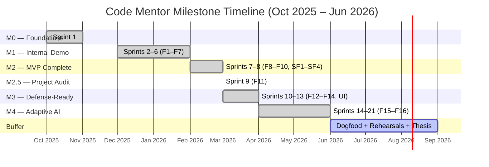

**Figure 5.2 — Sprint lifecycle (5-phase structure)**

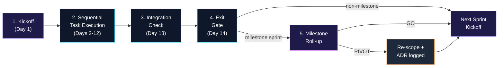

### **5.2.2 Milestone-driven rollout (M0 → M4)**

The 22 sprints are structured around six internal release milestones, each with an explicit objective, deliverables, and exit criteria. The milestones replace the conventional “Phase 1 / Phase 2 / Phase 3” market-release split because the project ships a single defense deliverable, not a sequence of market launches:

| Milestone | Name | Calendar window | Exit criteria |
| --- | --- | --- | --- |
| **M0** | Foundations | Oct – Nov 2025 (Sprint 1) | `docker-compose up` works, a new contributor can clone + run + log in within 30 minutes, thin vertical slice (register → login → empty dashboard) is end-to-end |
| **M1** | Internal Demo | Dec 2025 – Jan 2026 (Sprints 2–6) | Core loop demonstrable on a single user: assessment → path → task → submission → multi-layered feedback within ≤ 5 min p95; ≥ 4 / 5 supervisor rating on demo submissions |
| **M2** | MVP Complete | Feb 2026 (Sprints 7–8) | F1–F10 (10 MVP features) shipped + 4 stretch features (SF1–SF4) + happy-path tested; seed data sufficient for live demo |
| **M2.5** | Project Audit | Mar 2026 (Sprint 9) | F11 (standalone Project Audit) end-to-end on the local stack; 8-section report; 90-day blob retention enforced |
| **M3** | Defense-Ready Locally | Apr 2026 (Sprints 10–13) | F12 (RAG Mentor Chat + Qdrant), F13 (Multi-Agent Review A/B), F14 (history-aware review) shipped; Neon & Glass UI redesign integrated across 8 design pillars; k6 load test (100 concurrent users); supervisor rehearsals pass; backup demo video recorded |
| **M4** | Adaptive AI Learning System | May – Jun 2026 (Sprints 14–21) | F15 (2PL IRT-lite + AI Question Generator + post-assessment summary + bank ≥ 200) and F16 (AI Path Generator + Continuous Adaptation + graduation → reassessment → next-phase loop) shipped end-to-end; question bank ≥ 207 / target 250; task library ≥ 50; thesis chapter draft for the F15/F16 contribution in place |

This milestone structure produces a strong academic property: at every stop-gate, the platform is **demoable end-to-end on the local stack** — a “vertical slice” that exercises every shipping feature. The project never has a “tracer-bullet week” of code that does not produce visible value.

### **5.2.3 Stop-gate reviews**

Each milestone closes with a documented supervisor review before the next milestone opens. The review checks: (a) the live demo runs cleanly on the team’s laptop without manual intervention; (b) every PRD acceptance criterion for the milestone’s features is verifiably met; (c) `docs/progress.md` records each completed sprint’s outcome; (d) test counts and coverage are at or above the milestone’s bar; (e) the team can answer “what would break if we stopped here?” with a concrete demoable answer. The review terminates with a **GO / PIVOT / NO-GO** outcome captured as an ADR.

## **5.3 Architectural Decision Records (ADR) System**

### **5.3.1 The ADR template**

A non-trivial technical or scope decision triggers a fresh ADR appended to `docs/decisions.md`. The template is:

```
## ADR-NNN: [Title]

**Date:** YYYY-MM-DD
**Status:** Accepted | Superseded by ADR-NNN | Rejected
**Supersedes:** [Optional — prior ADR this replaces]

**Context:** [Why this decision was needed. What problem surfaced.]
**Decision:** [What was decided. Specific, concrete.]
**Alternatives considered:** [What else was on the table. Why rejected.]
**Consequences:** [What follows from this decision — both upside and downside.]
```

### **5.3.2 ADR catalogue summary**

At the close of M4 (2026-05-15), the project carries **62 numbered ADRs** (ADR-001 through ADR-062). The catalogue is summarised in Appendix A. The distribution across categories is:

| Category | Count | Examples |
| --- | --- | --- |
| Technology choices | 11 | ADR-001 Vite over Next.js, ADR-002 Hangfire over Service Bus, ADR-003 OpenAI as sole provider, ADR-008 Clean Architecture, ADR-009 .NET 10 |
| Architecture refinements | 9 | ADR-010 Identity entities in Infrastructure, ADR-014 Two-parallel-path Clean Architecture, ADR-021 Scheduler abstraction over Hangfire, ADR-035 audit returns combined response |
| Scope decisions | 10 | ADR-006 Phase 2 deferrals, ADR-007 three tracks not five, ADR-031 F11 as separate module, ADR-036 F12 RAG addition, ADR-037 F13 multi-agent addition, ADR-049 F15+F16 |
| Sprint reorganisation | 5 | ADR-011 defer OAuth + rate limiting, ADR-032 insert Sprint 9, ADR-038 defer Azure to post-defense |
| Schema / data | 7 | ADR-028 CodeQualityScore parallel to SkillScore, ADR-046 Spotify-style soft-delete + UserSettings, ADR-053 PathAdaptationEvents shape |
| Trust-chain waivers | 7 | ADR-056 through ADR-062 (single-reviewer waivers for AI-generated content batches S16 → S21) |
| Process / format | 13 | ADR-022 endpoint rename, ADR-024 per-tool partitioned response, ADR-027 prompt versioning, ADR-039 OAuth fragment redirect, ADR-045 reasoning-effort cap |

The content generation and review process (governed by ADR-056 through ADR-062) utilized a structured review workflow. Under this protocol, AI-generated content batches were reviewed by designated team members using strict rejection criteria, accompanied by random spot-checks on samples from each batch. This process ensured high content quality while maintaining efficient throughput during the implementation phases.

### **5.3.3 ADR rules**

Three rules govern ADR authoring:

1. **An ADR is logged at the point the decision is made**, not afterwards. Decisions made silently in code are decisions made *for* the team by the developer who wrote them; an ADR keeps the decision explicit and reviewable.
2. **An ADR is short.** The template is four sections; the average ADR in this project is ~25 lines (one screen). The ADR captures the *why*; the implementation is in the code.
3. **Superseding is preferred to deleting.** When a prior decision is reversed, the superseded ADR remains in place with a `Superseded by ADR-NNN` header to preserve the architectural audit trail.

## **5.4 Three-Service Architecture**

The platform is decomposed into **three independently deployable services** rather than a monolith or a fine-grained microservice swarm. The choice is deliberate and reflects three forces.

### **5.4.1 Frontend service (Vite + React 18 + TypeScript)**

A single React 18 SPA built with Vite. The frontend is the only user-facing client surface; mobile is responsive-web only for the MVP. Tech-stack rationale (ADR-001):

- **Vite over Next.js.** Code Mentor’s UI is fundamentally an SPA with backend-served data; the SSR / RSC machinery of Next.js adds deployment complexity and build-time cost without a user-visible win. Vite gives sub-second dev-server starts, native ES-module HMR, and a static-build output that deploys cleanly to Vercel or any CDN.
- **TypeScript strict mode.** Compile-time guarantees on the props and store shapes catch errors before they reach the runtime. Test-coverage budget moves from “guard against type confusion” to “guard against logic confusion.”
- **Redux Toolkit + React Hook Form + Zod.** RTK for cross-cutting state (auth, current assessment, current path), React Hook Form for per-form state with Zod schemas as the validation source of truth. Same Zod schemas can be reused server-side via the OpenAPI contract for end-to-end type safety.
- **Recharts + Prism.js.** Recharts powers the skill radar (Chapter 6.3.5); Prism handles per-language syntax highlighting in the inline-annotated feedback view (Chapter 6.3.6).

### **5.4.2 Backend service (.NET 10 + Clean Architecture)**

A single ASP.NET Core 10 process hosting both the REST API and the in-process Hangfire worker. Tech-stack rationale (ADR-008, ADR-009):

- **.NET 10 over .NET 8.** Original PRD targeted .NET 8 LTS; environment audit at Sprint 1 kickoff revealed the dev machine had only the .NET 10 SDK, and downgrading offered no benefit. .NET 10 became the production target (ADR-009).
- **Clean Architecture in four projects.** `Domain` (entities, value objects, domain enums; zero references), `Application` (use-case handlers, DTOs, validation rules; references Domain only), `Infrastructure` (EF Core DbContext, external API clients, Hangfire jobs; references Application + Domain), `Api` (controllers, middleware, Swagger; references all three lower layers). ADR-010 places ASP.NET Identity entities (`ApplicationUser`, `ApplicationRole`, `RefreshToken`, `OAuthToken`) in `Infrastructure` rather than `Domain` to avoid forcing the Domain project to reference `Microsoft.AspNetCore.Identity`.
- **MediatR + FluentValidation.** MediatR for command/query handlers as the orchestration layer between controllers and the domain logic. FluentValidation guards every command input at the API boundary.
- **Hangfire (SQL-Server-backed, in-process) over Azure Service Bus.** ADR-002. Service Bus / RabbitMQ were evaluated and rejected: they add operational overhead and a separate deployment surface, neither of which is justified at the MVP’s 100-concurrent-user scale. Hangfire reuses the existing SQL Server connection and provides durable retry, exponential backoff, and a built-in dashboard.

### **5.4.3 AI service (Python + FastAPI)**

A separate Python service handles every LLM-bound operation so the backend never blocks on OpenAI. Tech-stack rationale (ADR-003, ADR-004, ADR-036, ADR-050):

- **Python + FastAPI.** Native fit for the scientific dependencies (`scipy.optimize` for the F15 2PL IRT engine, `numpy` for the F16 cosine-similarity recall, `pydantic` for LLM response validation). Async server enables `asyncio.gather` for the F13 multi-agent parallel invocation.
- **OpenAI GPT-5.1-codex-mini + text-embedding-3-small.** Single LLM provider for the MVP (ADR-003). The `IAIReviewClient` interface in the backend abstracts the provider so multi-provider expansion (Claude, local Ollama) is documented in Chapter 9 as a post-MVP item.
- **Per-language static analyser containers.** ESLint, Bandit, Cppcheck, PHPStan, PMD, Roslyn — each runs in its own Docker container with health checks, resource limits, and per-tool timeouts. Per-tool failures degrade gracefully; the rest of the pipeline still ships partial results.
- **Qdrant 1.x as the vector index (ADR-036).** Code chunks for the F12 Mentor Chat RAG and task embeddings for the F16 hybrid path generation live in Qdrant, not SQL. Qdrant’s payload-filtering primitives make per-submission scope enforcement a first-class operation.

### **5.4.4 Why three services, not microservices**

The three-service split tracks the three teams’ bounded contexts: Frontend, Backend, AI. Below that line, decomposing into fine-grained microservices would force the team to manage inter-service contracts before the platform’s domain model has stabilised — a known anti-pattern at this scale. Above that line, collapsing into a monolith would mean importing Python LLM libraries into a .NET process or shipping Python static analysers as a sidecar to the .NET host — both worse outcomes than the clean HTTP boundary between Backend and AI service.

The architecture explicitly leaves room for post-MVP evolution: splitting the in-process Hangfire worker into its own .NET service, replacing the SQL-backed queue with Azure Service Bus, sharding the AI service per analysis-vs-review-vs-chat are all documented as post-MVP work in Chapter 9 with the conditions under which they would become worthwhile.

## **5.5 Build-Pipeline Documentation Approach**

Code Mentor is documented in a **five-file living `docs/` corpus**. These documents are *not* generated from code: they are hand-maintained, updated by the developer making the change, and treated as the canonical source for “what the platform actually is” at any point in time.

| File | Role | Updated by |
| --- | --- | --- |
| `docs/PRD.md` | Product requirements — features, acceptance criteria, NFRs, milestones | Product (post-kickoff) |
| `docs/architecture.md` | Execution-ready system architecture — components, contracts, data flows | Tech leads |
| `docs/implementation-plan.md` | 22 sprints with task lists, estimates, risk flags, exit criteria | Tech leads |
| `docs/decisions.md` | Numbered ADR log (62 entries) | Every developer at the point of decision |
| `docs/progress.md` | Sprint-by-sprint execution log with verification notes | Every developer at task completion |
| `docs/design-system.md` | Neon & Glass design tokens, principles, components | Frontend + design |
| `docs/runbook.md` | Deployment, operations, post-defense Azure migration plan | DevOps + Release |

This corpus is the orientation surface for a new contributor (target: clone → run → log in within 30 minutes per M0 exit criteria) and the audit surface for the supervisor reviews at each milestone gate. The thesis documentation in this file (`docs/project_docmentation.md`) is **derived from** these five files, not their parent — when the two disagree, the build-pipeline docs are the source of truth and the thesis is updated to reflect them.

## **5.6 Quality Engineering Practices**

### **5.6.1 The test pyramid**

The project follows the classical test pyramid with concrete tooling per layer:

- **Unit tests.** Backend: xUnit + Moq + AutoFixture. Frontend: Vitest + React Testing Library + Mock Service Worker. AI service: pytest + pytest-asyncio + httpx. ≥ 70 % line-coverage target on `CodeMentor.Application` (PRD §8.8).
- **Integration tests.** Backend: xUnit + `WebApplicationFactory<Program>` + Testcontainers SQL Server + Testcontainers Redis. Cover the full HTTP → controller → handler → DbContext → DB round trip on every primary endpoint family. AI service: contract tests against `pytest` fixtures that mock OpenAI but exercise the real Pydantic validation chain.
- **End-to-end tests.** Playwright for the golden-path smoke (register → assessment → submission → feedback view). Run on every PR build.
- **Performance tests.** k6 scenario simulating 100 concurrent authenticated users at p95 API latency ≤ 500 ms (PRD §8.5; verified at the M3 milestone gate per Chapter 7.5).

At M4 close, the backend test count is **774 tests passing** (1 Domain.Tests + 456 Application.Tests + 317 Api.IntegrationTests). The AI service ships an additional ~70 pytest cases plus per-batch evaluation runners (covered in Chapter 7).

### **5.6.2 Code-quality gates**

Every PR is checked against the same gate before merge:

- **Linter passes.** `dotnet format --verify-no-changes` on the backend; `npm run lint` on the frontend; `ruff` + `mypy` on the AI service.
- **Type checker passes.** `dotnet build` with `TreatWarningsAsErrors=true`; `tsc --noEmit` on the frontend; `mypy --strict` on the AI service core.
- **Formatter applied.** Pre-commit hook runs the formatter; CI fails on diff.
- **No debug statements.** Grep-gate for `console.log`, `print(`, `Debug.WriteLine`, `Console.WriteLine` (except in `Program.cs` startup logging).
- **No commented-out code.** Reviewed at PR time.
- **Cyclomatic complexity < 15 per method** on the Application layer (Roslyn analyser enforced).

### **5.6.3 Conventional commits + PR template**

Every commit follows the Conventional Commits 1.0 spec (`feat:`, `fix:`, `refactor:`, `chore:`, `test:`, `docs:`). Every PR uses a template requiring: (a) the sprint task ID (e.g., `S17-T3`); (b) a one-line summary of the change; (c) a test plan with each test class run; (d) an updated `docs/progress.md` entry; (e) any new ADR appended to `docs/decisions.md`.

## **5.7 Design-System-First UI Approach**

### **5.7.1 The Neon & Glass identity (ADR-030)**

The platform’s UI identity is codified as a living document in `docs/design-system.md`. The system is built on three principles:

1. **The chrome serves the code.** The application’s value lives in the syntax-highlighted source code rendered on every feedback and audit page. Prism owns the colourful real estate; the application UI stays neutral so the code is the signal.
2. **Three accent roles, one hierarchy.** Violet is the primary brand colour (~95 % of accent surface area — buttons, links, focus rings, active nav). Cyan is the secondary supporting accent (badges, secondary chart axes). Fuchsia is the celebration accent (~5 %, gamification only). Emerald is reserved for the success state — always reads “passing / completed”, never used for brand presence.
3. **Brand gradient, used sparingly.** A single 135° linear gradient from violet (`accent`) to fuchsia (`special`) is allowed on three surfaces only: the brand logo “C” mark wherever it appears, the most prominent CTA on each page (one per page), and the focal “Adaptive Difficulty” pill. Anywhere else, accent stays solid.

### **5.7.2 Design tokens and component library**

The design system exposes semantic CSS variables (space-separated RGB triplets) defined in `frontend/src/shared/styles/globals.css` under `:root` (light) and `.dark` (dark). Tokens are exposed through `frontend/tailwind.config.js` as Tailwind colours with `<alpha-value>` syntax, so utilities like `bg-accent`, `text-fg-muted`, `border-border-subtle`, `bg-accent-soft/40` work natively. The token system covers:

- **Surfaces** (`bg`, `bg-subtle`, `bg-elevated`, `bg-overlay`)
- **Borders** (`border-subtle`, `border`, `border-strong`)
- **Text** (`fg`, `fg-muted`, `fg-subtle`, `fg-on-accent`)
- **Accent — violet** (workhorse ~95 %)
- **Secondary — cyan** (supporting variety)
- **Special — fuchsia** (celebration ~5 %)
- **Success — emerald** (always “passing / completed”)
- **State colours** — `warning` (amber for non-critical attention), `danger` (red for destructive actions)

WCAG 2.1 AA contrast is verified for every accent + state combination on every surface. Lighthouse accessibility score ≥ 90 is a per-page CI gate.

### **5.7.3 Sprint 13 UI redesign integration**

The platform’s user interface is built on the Neon & Glass design system, which establishes eight design pillars (Surface Density, Type System, Accent Hierarchy, Brand Gradient Restraint, Motion Discipline, Empty/Loading/Error States, Code Annotation Treatment, and Dark-Mode-First Defaults). All frontend components conform to these unified design tokens.

---

# **Chapter Six: Implementation**

## **6.1 Implementation Strategy Overview**

This chapter describes the platform that was actually built. The narrative is organised along three orthogonal axes:

1. **Per-service (§6.2–6.4):** Backend (.NET 10), Frontend (Vite + React 18 + TS), AI service (Python + FastAPI). Each service is a deployable unit with its own deployment lifecycle.
2. **Per-feature (§6.5):** the F15 + F16 Adaptive AI Learning System is treated as a deep-dive because it is the project’s primary research contribution. The full thesis chapter draft is in `docs/thesis-chapters/f15-f16-adaptive-ai-learning.md` (~7,500 words); this section summarises the design and refers out for the detail.
3. **Per-sprint (§6.6):** a milestone-grouped sprint highlight roll-up covering the 21 sprints that were shipped. Detailed per-sprint progress is in Appendix B.

The implementation principle that holds across all three views is the **vertical-slice principle**: every sprint ends with a feature that is end-to-end runnable, not a half-built backend + UI placeholder. The Sprint 1 vertical slice (“register → login → empty dashboard”) is the canonical example: by close of Sprint 1, the three services + database + cache + blob storage all co-operate on a single user journey, however thin.

## **6.2 Backend Implementation (.NET 10)**

### **6.2.1 Clean Architecture layout**

The backend solution `CodeMentor.slnx` is organised as four projects following ADR-008 + ADR-010 + ADR-014:

```
backend/src/
├── CodeMentor.Domain/              # entities, value objects, domain enums, no FW dependencies
├── CodeMentor.Application/         # use-case handlers, DTOs, validation, abstractions
├── CodeMentor.Infrastructure/      # EF Core, Identity, Hangfire jobs, external clients
└── CodeMentor.Api/                 # ASP.NET Core controllers, middleware, Swagger
```

The Domain project has **zero `ProjectReference` entries** — verified by static check. The Application project references Domain only. Infrastructure references Application + Domain (and includes the ASP.NET Identity-derived entities `ApplicationUser`, `ApplicationRole`, `RefreshToken`, `OAuthToken` per ADR-010, which would otherwise force Domain to depend on `Microsoft.AspNetCore.Identity`). The Api project is the composition root and references all three lower layers.

### **6.2.2 Authentication & Identity (F1)**

Built across Sprints 1–2. The auth subsystem covers email/password registration, GitHub OAuth, JWT-based sessions with refresh-token rotation, password reset, and rate-limited login.

Key implementation choices:

- **ASP.NET Core Identity with `Guid` keys.** `ApplicationUser : IdentityUser<Guid>` extended with `FullName`, `GitHubUsername`, `ProfilePictureUrl`, and the ADR-046 soft-delete trio (`IsDeleted`, `DeletedAt`, `HardDeleteAt`).
- **JWT RS256 with refresh-token rotation.** Access token 1-hour validity, refresh token 7-day validity stored hashed in `RefreshTokens` table with a `ReplacedByTokenHash` rotation chain for revocation auditing.
- **GitHub OAuth via Octokit + fragment redirect (ADR-039).** The OAuth callback responds with an HTTP 302 redirect to the SPA’s success URL with `access`, `refresh`, and `expires` parameters embedded in the **URL fragment** (not the query string). Fragments are not sent to the server in subsequent requests and do not appear in access logs, Referer headers, or browser history — a defence against the common pattern of leaking tokens through HTTP-server logs.
- **Account lockout.** 5 failed login attempts within 15 minutes trigger a 15-minute lockout; the response is HTTP 401 with the Problem Details title `AccountLocked` (not 403 — verified against `AuthController.cs` and `AuthErrorCode` enum).
- **OAuth token encryption.** Stored access + refresh tokens in `OAuthTokens` are AES-256 encrypted via `AccessTokenCipher` + `RefreshTokenCipher` columns (ADR not numbered in catalogue summary; covered in PRD §8.2).

### **6.2.3 Adaptive Assessment Engine (F2 + F15)**

Sprints 2 (F2 rule-based) and 16–17 (F15 IRT-lite). The engine ships in two engines coexisting at runtime, with a deterministic fallback path:

- **Default rule-based selector (M1):** two consecutive correct answers in a category escalate difficulty, two consecutive wrong de-escalate; per-category quota bounded to ≤ 30 % of total questions to keep the exam balanced.
- **Flagship 2PL IRT-lite engine (M4 default):** each question carries discrimination `IRT_A` and difficulty `IRT_B` parameters; learner ability θ is MLE-estimated after every response via `scipy.optimize.minimize_scalar`; the next item is selected to maximise Fisher information at the current θ.

The engine handles three assessment variants (Sprint 21):

| Variant | Question count | Timeout | Triggers |
| --- | --- | --- | --- |
| `Initial` | 30 | 40 min | First assessment per learner; cooldown 30 days |
| `Mini` | 10 | 15 min | At 50 % path progress, optional |
| `Full` | 30 | 40 min | At 100 % path progress, mandatory before Next-Phase Path |

The AI-unavailable fallback uses `LegacyAdaptiveQuestionSelector` and flags `IrtFallbackUsed=true` for admin review. Empirical accuracy bar (ADR-055): synthetic learner θ_hat within ±0.5 of θ_true in ≥ 95 % of 100 trials after 30 responses (measured: 96 % at 30 items, 91 % at 20 items, 78 % at 10 items).

### **6.2.4 Learning Path Generator (F3 + F16)**

Sprints 3 (F3 template-based) and 19 (F16 AI-driven). The path generator ships with two strategies and an explicit fallback:

- **Template fallback (M1, still used today on AI-unavailable):** weakest-category-first task placement, level-scaled length (5 / 7 / 10 tasks at Beginner / Intermediate / Advanced).
- **AI path generator (M4 default):** `GenerateLearningPathJob` calls AI service `POST /api/generate-path`. The AI service performs hybrid recall (cosine similarity top-K=20 over the in-memory task embedding cache, populated at startup from `Tasks.EmbeddingJson`) followed by LLM rerank (`gpt-5.1-codex-mini` with prompt `prompts/generate_path_v1.md` returning a JSON array of 5–10 tasks with per-task `aiReasoning` 10–500 chars + `focusSkillsJson`). Output is Pydantic-validated, topological-prerequisite-checked, and retried up to twice with self-correction.

`LearningPath` carries `Source ∈ {AIGenerated, TemplateFallback}` so the source is auditable; both render identically on the frontend.

### **6.2.5 Task Library (F4)**

Sprint 3 + per-track content batches at Sprints 16–20. The library scales from 21 seed tasks at M1 to 50 tasks at M4 (across Full Stack, Backend, and Python tracks). Each task carries:

- `Title`, `Description` (markdown), `AcceptanceCriteria`, `Deliverables`
- `Difficulty` (1..5; deliberately wider than `Question.Difficulty` 1..3)
- `Category`, `Track`, `ExpectedLanguage`, `EstimatedHours`
- `Prerequisites` (JSON list, topological-checked at path-generation time)
- F16 metadata trio: `SkillTagsJson` (`[{skill, weight}]`, weights sum to 1.0), `LearningGainJson` (`{skill: gain}`), `EmbeddingJson` (1536 floats for recall)
- Provenance: `Source ∈ {Manual, AI}`, `ApprovedById`, `ApprovedAt`, `PromptVersion`

The library is read-cached in Redis with version-counter invalidation (ADR-018); admin writes bust the cache atomically.

### **6.2.6 Code Submission Pipeline (F5)**

Sprint 4 ingress + Sprint 5–6 analysis pipeline. The hot path is the most performance-sensitive flow in the system.

**Ingress (HTTP-synchronous, ≤ 500 ms p95):**
- `POST /api/submissions` returns **202 Accepted** with the `submissionId` — the actual code fetch is deferred to the worker.
- Two submission types: `GitHub` (URL — validated for format only at submission time; the actual clone happens inside the Hangfire job) and `Upload` (ZIP via the two-step pre-signed Blob SAS URL flow — the frontend uploads the ZIP directly to Azurite/Azure Blob, bypassing the backend entirely).
- Rate-limited via `[EnableRateLimiting(SubmissionsCreatePolicy)]`.

**Analysis Pipeline Flow Diagram:**

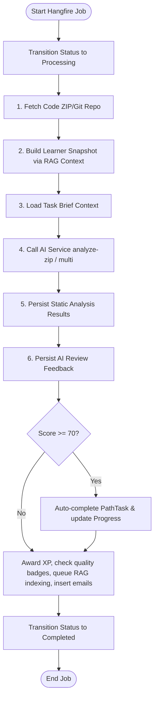

**Analysis pipeline (Hangfire worker, p95 ≤ 5 minutes):**
- `SubmissionAnalysisJob.RunAsync(submissionId)` with `[AutomaticRetry(Attempts=3, DelaysInSeconds={10, 60, 300})]` + `[DisableConcurrentExecution(timeoutInSeconds=600)]`.
- Idempotent re-entry guard: skips when `Status != Pending` and not in the auto-retry path.
- `ISubmissionCodeLoader` fetches the code (Octokit clone for GitHub URLs; Blob download for uploaded ZIPs) into a temp directory with isolation.
- `ILearnerSnapshotService` (F14, ADR-040) builds a history-aware `LearnerSnapshot` aggregating prior submissions via RAG over Qdrant; graceful fallback to profile-only mode on Qdrant outage.
- `SubmissionAnalysisJob` posts a single combined call to the AI service: `POST /api/analyze-zip` (default) or `/api/analyze-zip-multi` (F13 multi-agent, opt-in via `AI_REVIEW_MODE=multi`) with `(ZIP + snapshot + taskBrief + correlationId)`.
- The AI service runs static-analysis containers in parallel (ESLint, Roslyn, Bandit, Cppcheck, PHPStan, PMD — per-tool failures degrade gracefully) **and** the LLM review in one call. Returns `AiCombinedResponse` with per-tool static rows + AI review with scores + token counts.
- Backend persists `StaticAnalysisResults` (one row per tool) and `AIAnalysisResult` (one row, unique on `SubmissionId`). The pre-aggregated `FeedbackJson` payload lives on `AIAnalysisResult` and is what `GET /api/submissions/{id}/feedback` streams verbatim — no on-the-fly aggregation at view time.
- Side effects on first persistence: PathTask auto-completion when score ≥ 70 (ADR-026); `CodeQualityScore` running-mean update (ADR-028); XP grant + badge check (S8-T3); `IndexForMentorChatJob` enqueue (F12 RAG indexing); `EmailDelivery` row insertion (decoupled retry from analysis job).

Below is the core implementation of the `RunAsync` orchestrator in `SubmissionAnalysisJob.cs`:

```csharp
[AutomaticRetry(Attempts = 3, DelaysInSeconds = new[] { 10, 60, 300 })]
[DisableConcurrentExecution(timeoutInSeconds: 600)]
public async Task RunAsync(Guid submissionId, CancellationToken ct = default)
{
    var submission = await _db.Submissions.FirstOrDefaultAsync(s => s.Id == submissionId, ct);
    if (submission is null)
    {
        _logger.LogWarning("SubmissionAnalysisJob: submission {SubmissionId} not found", submissionId);
        return;
    }

    var isFirstRun = submission.Status == SubmissionStatus.Pending;
    var isAiRetry = submission.Status == SubmissionStatus.Completed
                 && submission.AiAnalysisStatus == AiAnalysisStatus.Pending;

    if (!isFirstRun && !isAiRetry)
    {
        _logger.LogInformation("SubmissionAnalysisJob: submission {SubmissionId} is {Status}/{AiStatus}, skipping",
            submissionId, submission.Status, submission.AiAnalysisStatus);
        return;
    }

    var correlationId = submission.Id.ToString("N");
    using var scope = _logger.BeginScope("submission-analysis {SubmissionId} corr={CorrelationId}", submissionId, correlationId);

    await TransitionToProcessingAsync(submission, ct);
    var totalStopwatch = Stopwatch.StartNew();

    try
    {
        // 1. Fetch phase
        var loadResult = await _codeLoader.LoadAsZipStreamAsync(submission, ct);
        if (!loadResult.Success)
        {
            await FailAsync(submission, $"Fetch failed: {loadResult.ErrorCode} — {loadResult.ErrorMessage}", ct);
            return;
        }

        // 2. Profile phase (F14 History-Aware Snapshot)
        LearnerSnapshot? snapshot = null;
        if (_snapshotService is not null)
        {
            var ragAnchor = $"task:{submission.TaskId:N} attempt:{submission.AttemptNumber}";
            snapshot = await _snapshotService.BuildAsync(
                userId: submission.UserId!.Value,
                currentSubmissionId: submission.Id,
                currentTaskId: submission.TaskId,
                currentStaticFindingsJson: ragAnchor,
                ct: ct);
        }

        // 3. Load Task Brief
        TaskBrief? taskBrief = null;
        var taskRow = await _db.Tasks.AsNoTracking().FirstOrDefaultAsync(t => t.Id == submission.TaskId, ct);
        if (taskRow is not null)
        {
            taskBrief = new TaskBrief(taskRow.Id, taskRow.Title, taskRow.Description, taskRow.AcceptanceCriteria, taskRow.Deliverables, taskRow.Track.ToString(), taskRow.Category.ToString(), taskRow.ExpectedLanguage.ToString(), taskRow.Difficulty, taskRow.EstimatedHours);
        }

        // 4. AI review combined call (supporting single and multi-agent review modes)
        var reviewMode = _modeProvider.Current;
        AiCombinedResponse aiResponse;
        await using (loadResult.ZipStream)
        {
            aiResponse = reviewMode == AiReviewMode.Multi
                ? await _aiClient.AnalyzeZipMultiAsync(loadResult.ZipStream!, loadResult.FileName, correlationId, snapshot, taskBrief, ct)
                : await _aiClient.AnalyzeZipAsync(loadResult.ZipStream!, loadResult.FileName, correlationId, snapshot, taskBrief, ct);
        }

        // 5. Persist Static Results & AI Result
        await PersistStaticResultsAsync(submission, aiResponse, ct);
        var aiAvailable = aiResponse.AiReview?.Available == true;
        AIAnalysisResult? aiRow = null;
        var aiWasFirstWrite = false;
        if (aiAvailable)
        {
            submission.AiAnalysisStatus = AiAnalysisStatus.Available;
            (aiRow, aiWasFirstWrite) = await PersistAiResultAsync(submission, aiResponse.AiReview!, ct);
        }
        else
        {
            submission.AiAnalysisStatus = AiAnalysisStatus.Unavailable;
        }

        // 6. Complete Job & Side-Effects
        submission.Status = SubmissionStatus.Completed;
        submission.CompletedAt = DateTime.UtcNow;
        submission.ErrorMessage = !aiAvailable && IsPermanentAiError(aiResponse.AiReview?.Error)
            ? Truncate(aiResponse.AiReview!.Error, 2000)
            : null;
        await _db.SaveChangesAsync(ct);

        if (aiRow is not null)
        {
            await TryAutoCompletePathTaskAsync(submission, aiRow.OverallScore, ct);
        }

        if (aiAvailable && aiWasFirstWrite)
        {
            await _codeQualityUpdater.RecordAiReviewAsync(submission.UserId!.Value, aiResponse.AiReview!.Scores, ct);
            await AwardSubmissionXpAndBadgesAsync(submission, aiRow!, ct);
        }

        if (aiAvailable)
        {
            await _feedbackAggregator.AggregateAsync(submission, aiResponse, ct);
            _mentorIndexScheduler.EnqueueSubmissionIndex(submission.Id);
        }
        else
        {
            ScheduleRetryForAiReview(submission);
        }
    }
    catch (AiServiceUnavailableException ex)
    {
        submission.Status = SubmissionStatus.Completed;
        submission.CompletedAt = DateTime.UtcNow;
        submission.AiAnalysisStatus = AiAnalysisStatus.Unavailable;
        submission.ErrorMessage = $"AI service unavailable: {ex.Message}";
        await _db.SaveChangesAsync(ct);
        ScheduleRetryForAiReview(submission);
    }
    catch (Exception ex)
    {
        await FailAsync(submission, $"Analysis failed: {ex.Message}", ct);
        throw;
    }
}
```

### **6.2.7 Hangfire jobs**

The in-process Hangfire worker runs eight named jobs at M4 close:

| Job | Trigger | Purpose |
| --- | --- | --- |
| `SubmissionAnalysisJob` | `BackgroundJob.Enqueue` on `POST /api/submissions` | Multi-layered analysis pipeline (above) |
| `ProjectAuditJob` | `BackgroundJob.Enqueue` on `POST /api/audits` | F11 — 8-section project audit |
| `IndexForMentorChatJob` | Tail of `SubmissionAnalysisJob` + `ProjectAuditJob` | F12 — chunk code + embed into Qdrant |
| `GenerateLearningPathJob` | Tail of `Assessment.Completed` (Initial variant) | F3 / F16 — generate path (template or AI) |
| `GenerateAssessmentSummaryJob` | Tail of `Assessment.Completed` (Initial / Full) | F15 — AI 3-paragraph summary |
| `PathAdaptationJob` | Tail of `SubmissionAnalysisJob` (signal-driven) | F16 — adaptation cycle |
| `RecalibrateIRTJob` | Hangfire RecurringJob, weekly Mondays 02:00 UTC | F15 — empirical (a, b) MLE fit for items with ≥ 50 responses |
| `EmailRetryJob` | Hangfire RecurringJob, every 5 minutes | Pick up `EmailDelivery` rows and dispatch via SendGrid |

### **6.2.8 Project Audit (F11)**

Sprint 9, approved 2026-05-02 as a scope expansion (ADR-031). A standalone, learning-path-independent feature that lets any authenticated user upload a personal project (GitHub URL or ZIP) plus a structured description and receive a comprehensive AI audit. Distinct from F5 / F6 in three ways:

1. **Standalone entry point** — accessed from the public landing page CTA (after login), the authenticated nav, or a deep link to `/audit/new`. The form has 6 required fields (Project Name, One-line Summary, Detailed Description, Project Type, Tech Stack, Main Features) and 3 optional fields (Target Audience, Focus Areas, Known Issues).
2. **Different AI prompt + endpoint** — `POST /api/project-audit` returns a combined response (ADR-035) including the 8-section structured report (Overall Score with A–F grade, 6-category Score Breakdown, Strengths, Critical Issues, Warnings, Suggestions, Missing / Incomplete Features vs description, Top-5 Recommended Improvements with how-to, Tech Stack Assessment, Inline Annotations).
3. **Different retention** — `ProjectAudit` blobs are deleted 90 days after creation by the daily `AuditBlobCleanupJob` recurring task (ADR-033); metadata rows are permanent.

Rate-limited at 3 audits per 24 hours per authenticated user (Redis sliding window). Pipeline p95 target ≤ 6 min.

### **6.2.9 Mentor Chat (F12)**

Sprint 10, approved 2026-05-07 (ADR-036). Per-submission and per-audit conversational chat panel grounded in the learner’s actual code via Retrieval-Augmented Generation over Qdrant.

The implementation is two-phase:

- **Indexing (offline, one-time per submission/audit):** `IndexForMentorChatJob` chunks the code at semantic boundaries (file → function/class → ≤500-token windows), generates embeddings via `text-embedding-3-small` (batches of up to 50 chunks per call), and upserts into the Qdrant collection `mentor_chunks` with payload `{scope, scopeId, filePath, startLine, endLine, kind, source}`.
- **Chat turn (online, per user message):** Backend’s `MentorChatController` proxies an SSE stream from the AI service. AI service embeds the user’s query, searches Qdrant for the top-5 chunks filtered to the session’s `(scope, scopeId)`, constructs a RAG prompt with chunks + the last 10 turns + the user message, and streams the LLM completion token-by-token. Backend collects the streamed assistant response, persists it to `MentorChatMessages` with token counts and `ContextMode ∈ {RAG, RawFallback}`.

Token caps (ADR-036): 6 k input + 1 k output per turn. Top-K retrieval: 5 chunks. Graceful degradation: Qdrant unreachable → “raw context mode” (sends submission/audit feedback JSON directly to LLM); AI service unreachable → backend returns 503 with a clear banner.

Rate limit: 30 messages per hour per session (Redis sliding window). p95 chat-turn round-trip: ≤ 5 s end-to-end.

### **6.2.10 Multi-Agent Code Review (F13)**

Sprint 11, approved 2026-05-07 (ADR-037). An alternate AI-review pipeline that splits the single-prompt review into three specialist agents (security, performance, architecture) running in parallel.

- Default `AI_REVIEW_MODE=single` preserves the F6 flow unchanged. `AI_REVIEW_MODE=multi` routes `SubmissionAnalysisJob` to `POST /api/analyze-zip-multi`.
- Inside the AI service for multi mode: three coroutines via `asyncio.gather` — security agent (owns `securityScore` + findings + annotations), performance agent (owns `performanceScore`), architecture agent (owns `correctnessScore`, `readabilityScore`, `designScore`, plus aggregated strengths/weaknesses).
- Per-agent timeout 90 s. Orchestrator merges outputs: scores assembled from agent-owned categories; strengths/weaknesses deduplicated by Jaccard similarity ≥ 0.7; inline annotations union-ed by `(filePath, lineNumber)`. Token cost ~ 2.2× single mode.
- Backend persists `AIAnalysisResults.PromptVersion = "multi-agent.v1"` (or `.partial` on partial agent failures). Default off in production for cost containment.

Below is the python orchestrator implementation in `multi_agent.py` showing how the three specialist agents run in parallel:

```python
class MultiAgentOrchestrator:
    """Runs the three specialist agents in parallel and merges their
    outputs into a single `AIReviewResult` matching the existing
    single-prompt response shape."""

    def __init__(self):
        settings = get_settings()
        self.api_key = settings.openai_api_key
        self.model = settings.openai_model
        if self.api_key:
            self.client: Optional[AsyncOpenAI] = AsyncOpenAI(api_key=self.api_key)
            self.security = SecurityAgent(self.client, self.model)
            self.performance = PerformanceAgent(self.client, self.model)
            self.architecture = ArchitectureAgent(self.client, self.model)
        else:
            self.client = None
            logger.warning(
                "OpenAI API key not configured. Multi-agent reviewer disabled."
            )

    async def orchestrate(
        self,
        code_files: List[Dict[str, Any]],
        project_context: Optional[Dict[str, Any]] = None,
        learner_profile: Optional[Dict[str, Any]] = None,
        static_summary: Optional[Dict[str, Any]] = None,
        learner_history: Optional[Dict[str, Any]] = None,
    ) -> AIReviewResult:
        if not self.is_available:
            return _unavailable_result(self.model, "Multi-agent reviewer not configured - API key missing")

        settings = get_settings()
        try:
            code_files = truncate_code_files_to_budget(
                code_files, settings.ai_multi_max_input_chars
            )
        except PromptBudgetExceeded as exc:
            return _unavailable_result(self.model, str(exc))

        placeholders = self._build_placeholders(
            code_files=code_files,
            project_context=project_context or {},
            learner_profile=learner_profile or {},
            static_summary=static_summary or {},
            learner_history=learner_history or {},
        )

        # Spawn the three agents in parallel using asyncio.gather.
        # return_exceptions=True so one agent's failure doesn't tank the others.
        results = await asyncio.gather(
            self.security.run(placeholders),
            self.performance.run(placeholders),
            self.architecture.run(placeholders),
            return_exceptions=True,
        )

        invocations: Dict[str, AgentInvocation] = {}
        for idx, agent_name in enumerate(("security", "performance", "architecture")):
            outcome = results[idx]
            if isinstance(outcome, AgentInvocation):
                invocations[agent_name] = outcome
            else:
                logger.exception(
                    "[multi-agent/%s] unexpected exception: %r", agent_name, outcome
                )
                invocations[agent_name] = AgentInvocation(
                    name=agent_name, succeeded=False,
                    error=f"orchestrator: unhandled {type(outcome).__name__}",
                )

        return _merge(invocations, model_used=self.model)
```

### **6.2.11 Learning CV (F10)**

Sprint 7. Auto-generated, shareable profile with PDF export. The CV body is **computed at request time** from the user’s profile + their top submissions; only the wrapper metadata persists in `LearningCVs` (`PublicSlug`, `IsPublic`, `LastGeneratedAt`, `ViewCount`).

The PDF export resolves to `ai-service/tools/cv_pdf.py` using ReportLab — chosen during Sprint 7 over QuestPDF (.NET-native) because the AI service was already a deployment target, and ReportLab’s templating produces visually polished output for the “credible business document” voice from the design system.

Public CV view (`/public/cv/{slug}`) increments `ViewCount` per `IpAddressHash` per 24 hours via `LearningCVView` — anonymous viewers without a cookie still produce one row per IP per day, and same-IP visits within 24 hours don’t double-count.

### **6.2.12 Admin Panel (F9)**

Sprint 7 + Sprints 16–20 admin extensions. The admin panel is guarded by `RequireAdmin` policy; non-admin requests return 403. The panel covers:

- **Task CRUD** with markdown editor for descriptions, prerequisite list editor, soft-delete toggle.
- **Question bank CRUD** with optional code snippet + language fields, 4 options per question with the correct-answer radio.
- **AI Question Generator review** (F15, Sprint 16) — paginated draft list with batch grouping; reviewer can approve (creates a `Questions` row + enqueues embedding job atomically), edit-then-approve, or reject with reason. Every approve/reject decision is audited.
- **AI Task Generator review** (F16, Sprint 18) — same pattern as Question drafts.
- **Adaptation event log** (F16, Sprint 20) — read-only timeline of every `PathAdaptationEvent` with filter by user / trigger / decision.
- **Dogfood metrics endpoint** (Sprint 21, `GET /api/admin/dogfood-metrics`) — aggregates count of learners with completed Initial, learners at 100 %, learners with completed Full, learners on Phase 2 paths, per-category pre→post delta, pending-proposal approval rate, empirically-calibrated question count, adaptation cycles per learner. This endpoint underwrites the Tier-2 metrics reported in the thesis empirical section.

## **6.3 Frontend Implementation (Vite + React 18)**

### **6.3.1 Project layout**

The frontend follows a **feature-folder layout** under `frontend/src/`:

```
frontend/src/
├── app/                          # routing, store config, app-level providers
├── features/
│   ├── auth/                     # login, register, GitHub OAuth callback
│   ├── assessment/               # adaptive runner + result page
│   ├── learning-path/            # path view, mini banner, graduation page
│   ├── tasks/                    # task library + detail
│   ├── submissions/              # submission flow + feedback view
│   ├── audit/                    # F11 audit form + report
│   ├── mentor-chat/              # F12 side-panel SSE chat
│   ├── dashboard/                # learner dashboard
│   ├── cv/                       # public + private CV views
│   ├── admin/                    # admin panel
│   └── settings/                 # user settings (ADR-046)
├── shared/                       # cross-feature components (Button, Card, Modal, ...)
└── styles/                       # tokens (globals.css), Tailwind config
```

### **6.3.2 State management (Redux Toolkit)**

Redux Toolkit owns cross-cutting state: `auth` (current user + tokens), `assessment` (active assessment session), `learning-path` (active path + adaptation proposals), `mentor-chat` (per-session message history). Per-feature local state (form inputs, modal open/close) stays in component state via React hooks — Redux is reserved for state that *must* survive a route change.

Slice contracts use TypeScript discriminated unions for the action payloads, with the same Zod schemas that validate the API responses generating the inferred types — single source of truth for both runtime validation and compile-time inference.

### **6.3.3 Routing (React Router v6)**

`React Router v6` with declarative protected routes. The `<ProtectedRoute>` wrapper checks for a valid JWT and redirects to `/login?next=<original>` if absent. Admin routes additionally check the `role === "Admin"` claim and render a 403 page on mismatch.

Notable routes:
- `/` — public landing with Project Audit CTA
- `/login`, `/register`, `/auth/github/callback`
- `/dashboard` (learner home)
- `/assessment/start`, `/assessment/question`, `/assessment/result/:id`
- `/learning-path` (active path), `/learning-path/graduation`, `/path/adaptations` (history timeline)
- `/tasks`, `/tasks/:id`, `/tasks/:id/submit`
- `/submissions`, `/submissions/:id` (feedback view + Mentor Chat side panel)
- `/audit/new`, `/audit/:id` (audit report), `/audits` (history)
- `/cv` (private), `/public/cv/:slug` (public anonymised view)
- `/settings` (notifications, privacy, connected accounts, data export, delete account)
- `/admin/*` (gated)

### **6.3.4 Forms (React Hook Form + Zod)**

Every form in the application uses React Hook Form with a Zod schema as the resolver. The same Zod schema is shared with the API contract via `zod-to-openapi` so client-side and server-side validation cannot drift apart. Submit handlers receive fully-validated payloads typed by the schema.

### **6.3.5 Skill radar (Recharts)**

The skill radar on the feedback view, dashboard, and graduation page is built on Recharts’ `RadarChart`. The graduation page adds a custom SVG `BeforeAfterRadar` component overlaying two polygons (dashed slate “Before” + solid 4-stop gradient “After”) on a shared category-union axis, with legend chips below.

### **6.3.6 Code rendering (Prism.js)**

Inline-annotated feedback is built on Prism.js with the languages: JavaScript, TypeScript, Python, C#, Java, PHP, C++. The file tree on the left of `/submissions/:id` mirrors the cloned repository structure; clicking a file loads the file’s Prism-highlighted source with inline annotation markers tied to `(filePath, lineNumber)`. Markdown rendering uses a safe-subset renderer (ADR-019) with DOMPurify + rehype-sanitize.

### **6.3.7 Server-Sent Events (SSE) for Mentor Chat**

The Mentor Chat side panel uses native `EventSource` (no third-party SSE library) for the streaming assistant response. The backend’s `MentorChatController` proxies the AI service’s SSE stream straight back to the SPA. The frontend renders streaming markdown turn-by-turn, with Prism re-highlighting code blocks as they complete.

### **6.3.8 Neon & Glass tokens**

The design tokens described in §5.7 are exposed as Tailwind utilities, so every component declaration looks like:

```tsx
<button className="bg-accent text-accent-fg hover:bg-accent-hover focus:ring-2 focus:ring-accent-ring">
```

The dark mode is the application’s default at the M3 launch; light mode is supported via the `.dark` / `:root` CSS variable cascade and is selectable in user settings.

### **6.3.9 Sprint 13 — UI redesign integration**

The frontend interface is implemented using the Neon & Glass design system, which is structured around eight design pillars (Surface Density, Type System, Accent Hierarchy, Brand Gradient Restraint, Motion Discipline, Empty/Loading/Error States, Code Annotation Treatment, and Dark-Mode-First Defaults). These are codified in `docs/design-system.md` and `docs/decisions.md` (ADR-030).

## **6.4 AI Service Implementation (Python + FastAPI)**

### **6.4.1 Project layout**

The AI service lives in `ai-service/` and is organised as:

```
ai-service/
├── app/
│   ├── api/routes/              # FastAPI routers (analysis, audit, chat, irt, path, ...)
│   ├── services/                # core logic (IRT engine, path generator, RAG retrieval)
│   ├── prompts/                 # versioned prompt templates (.txt / .md)
│   ├── containers/              # static-analyser container build files
│   └── tools/                   # batch runners for content generation
├── tests/                       # pytest suite
└── docker-compose.yml           # local AI-service-only stack
```

### **6.4.2 Router groups**

The service exposes nine router groups at M4 close (verified against `ai-service/app/api/routes/*.py` and the backend’s Refit clients in `Infrastructure/CodeReview/I*Refit.cs`):

| Router | Endpoints | Purpose |
| --- | --- | --- |
| `analysis` | `/api/analyze-zip`, `/api/analyze-zip-multi`, `/api/ai-review`, `/api/ai-review-multi`, `/api/project-audit` | F6 + F13 + F11. The `-multi` endpoints implement F13’s three-specialist parallel mode. |
| `assessment_summary` | `/api/assessment-summary` | F15 — 3-paragraph post-assessment AI summary |
| `embeddings` | `/api/embed`, `/api/embeddings/upsert`, `/api/embeddings/reload`, `/api/embeddings/search-feedback-history` | F12 + F14 + F15 + F16 — embedding generation and retrieval |
| `generator` | `/api/admin/questions/generate`, `/api/admin/tasks/generate` | F15 + F16 — batch draft generators (admin only) |
| `irt` | `/api/irt/select-next`, `/api/irt/estimate-theta`, `/api/irt/recalibrate` | F15 — 2PL IRT engine endpoints |
| `mentor_chat` | `/api/mentor-chat` | F12 — RAG chat with SSE streaming |
| `path_generator` | `/api/generate-path` | F16 — hybrid embedding-recall + LLM rerank |
| `path_adaptation` | `/api/adapt-path` | F16 — signal-driven adaptation action plan |
| `task_framing` | `/api/task-framing` | F16 — per-learner WhyThisMatters / FocusAreas / CommonPitfalls |

### **6.4.3 Static-analysis containers**

Each of the six static analysers runs in its own container:

| Tool | Language | Container base |
| --- | --- | --- |
| ESLint | JavaScript, TypeScript | `node:20-alpine` + `eslint` + a curated config |
| Roslyn analysers | C# | `mcr.microsoft.com/dotnet/sdk:10.0` + `Microsoft.CodeAnalysis.CSharp` |
| Bandit | Python | `python:3.11-slim` + `bandit[toml]` |
| Cppcheck | C / C++ | `gcc:13` + `cppcheck` |
| PHPStan | PHP | `php:8.3-cli` + `phpstan/phpstan` |
| PMD | Java | `eclipse-temurin:21-jdk-alpine` + `pmd-bin` |

Each container has a per-tool timeout (configurable in `ai-service/.env`), a 512 MB memory limit, and read-only filesystem access to the cloned source tree. The AI service orchestrates them via `asyncio.gather` so partial failures don’t block the rest.

### **6.4.4 Prompt versioning**

Every LLM prompt is stored in `ai-service/app/prompts/` with a version suffix (e.g., `agent_security.v1.txt`, `assessment_summary_v1.md`, `generate_path_v1.md`, `project_audit.v1.txt`). The `PromptVersion` is propagated through the response and recorded on the persisted result row (`AIAnalysisResults.PromptVersion`, `AssessmentSummaries.PromptVersion`, `LearningPaths.GenerationReasoningText`, etc.). This makes it possible to A/B test prompt revisions across submission batches and to roll back if a new prompt regresses on quality.

The current prompt catalogue at M4 close includes 18 versioned files spanning code review (single + multi-agent variants), project audit, mentor chat, IRT (item selection + θ estimation + recalibration), path generation (initial + next-phase), path adaptation, task framing, question generation, task generation, and assessment summary.

### **6.4.5 RAG retrieval (F12)**

The Qdrant collection `mentor_chunks` carries one row per code chunk with payload `{scope, scopeId, filePath, startLine, endLine, kind, source}`. The kind field distinguishes between code chunks and feedback chunks (the latter for “ask the mentor about the strengths/weaknesses” queries that should retrieve feedback-content rather than source code).

Retrieval is filtered by `payload.scope == scope AND payload.scopeId == scopeId` to enforce per-session boundaries — a learner asking about Submission A cannot accidentally retrieve chunks from Submission B even if the underlying code is similar.

Below is the python implementation in `mentor_chat.py` showing the SSE streaming and prompt preparation:

```python
class MentorChatService:
    """Stateless per-request orchestrator. Constructed once per app, callable
    many times concurrently — the OpenAI async client is thread-safe."""

    def __init__(
        self,
        *,
        openai_client: Optional[AsyncOpenAI] = None,
        repo: Optional[QdrantRepository] = None,
    ) -> None:
        settings = get_settings()
        self._client = openai_client or AsyncOpenAI(api_key=settings.openai_api_key)
        self._repo = repo or get_qdrant_repo()
        self._embedding_model = settings.embedding_model
        self._chat_model = settings.openai_model
        self._top_k = settings.mentor_chat_top_k
        self._max_input_chars = settings.mentor_chat_max_input_chars
        self._rag_min_chunks = settings.mentor_chat_rag_min_chunks

    async def stream(self, request: MentorChatRequest, correlation_id: str) -> AsyncIterator[str]:
        message_id = str(uuid.uuid4())
        try:
            prepared = await self._prepare_prompt(request)
        except _InputTooLarge as exc:
            yield _format_sse(MentorChatErrorEvent(error=str(exc), code="input_too_large").model_dump())
            return
        except Exception:
            logger.exception("[corr=%s] mentor-chat prompt prep failed", correlation_id)
            yield _format_sse(MentorChatErrorEvent(error="Internal error preparing the chat prompt.", code="internal").model_dump())
            return

        token_count = 0
        full_text: List[str] = []
        try:
            async for delta in self._stream_completion(prepared.messages):
                if not delta:
                    continue
                token_count += 1
                full_text.append(delta)
                yield _format_sse(MentorChatTokenEvent(content=delta).model_dump())
        except Exception as exc:
            logger.warning("[corr=%s] OpenAI streaming error: %s", correlation_id, exc)
            yield _format_sse(MentorChatErrorEvent(error=f"OpenAI request failed: {exc.__class__.__name__}", code="openai_unavailable").model_dump())
            return

        approx_tokens_input = max(1, prepared.input_chars // 4)
        approx_tokens_output = max(0, sum(len(t) for t in full_text) // 4)
        yield _format_sse(MentorChatDoneEvent(
            messageId=message_id,
            tokensInput=approx_tokens_input,
            tokensOutput=approx_tokens_output,
            contextMode=prepared.context_mode,
            chunkIds=prepared.chunk_ids,
            promptVersion=PROMPT_VERSION,
        ).model_dump())

    async def _prepare_prompt(self, request: MentorChatRequest) -> _PreparedPrompt:
        chunks = await self._retrieve(request)

        if len(chunks) < self._rag_min_chunks:
            messages = self._build_raw_fallback_messages(request)
            context_mode = "RawFallback"
            chunk_ids: List[str] = []
        else:
            messages = self._build_rag_messages(request, chunks)
            context_mode = "Rag"
            chunk_ids = [c.point_id for c in chunks]

        input_chars = sum(len(m["content"]) for m in messages)
        if input_chars > self._max_input_chars:
            raise _InputTooLarge(
                f"Mentor chat input exceeds the {self._max_input_chars}-char ceiling "
                f"({input_chars} chars). Trim history or shorten the question."
            )

        return _PreparedPrompt(
            messages=messages,
            chunk_ids=chunk_ids,
            context_mode=context_mode,
            input_chars=input_chars,
        )
```

### **6.4.6 IRT-lite engine (F15)**

The engine lives in `ai-service/app/irt/engine.py`. The core operations:

1. **θ MLE estimation.** Given the response history `[(a_i, b_i, correct_i)]`, finds the θ that maximises the log-likelihood `Σ_i [correct_i · log P_i + (1 - correct_i) · log (1 - P_i)]` where `P_i = 1 / (1 + exp(-a_i · (θ - b_i)))`. `scipy.optimize.minimize_scalar` with bounded search on [-4, +4].
2. **Information-maximising selection.** For each unanswered item, computes `info_i(θ) = a_i² · P_i · (1 - P_i)` and picks the maximum. Category-balance is a hard constraint at the AI-service layer (no category exceeds 30 % of total responses per F2 PRD).
3. **Recalibration.** `RecalibrateIRTJob` (Hangfire weekly) re-fits `(a, b)` via joint MLE across each item’s response history for items with ≥ 50 responses; old values append to `IRTCalibrationLog` (which logs every consideration, including skips, for thesis-honesty per ADR-055).

Below is the python implementation in `engine.py` representing the probability of correct response, Fisher Information, and MLE ability estimation:

```python
def p_correct(theta: float, a: float, b: float) -> float:
    """Probability of a correct response under the 2PL model.
    P(correct) = 1 / (1 + exp(-a * (theta - b)))
    """
    p = 1.0 / (1.0 + float(np.exp(-a * (theta - b))))
    if p <= 0.0:
        return _LL_EPS
    if p >= 1.0:
        return 1.0 - _LL_EPS
    return p


def item_info(theta: float, a: float, b: float) -> float:
    """Fisher information at theta for an item with parameters (a, b).
    I_i(theta) = a^2 * P_i(theta) * (1 - P_i(theta))
    """
    p = p_correct(theta, a, b)
    return (a * a) * p * (1.0 - p)


def estimate_theta_mle(
    responses: Sequence[tuple[float, float, bool]],
) -> float:
    """Maximum-likelihood estimate of theta from a learner's response history."""
    if not responses:
        return 0.0

    def neg_ll(theta_arg) -> float:
        theta = float(theta_arg)
        ll = 0.0
        for a, b, correct in responses:
            p = p_correct(theta, a, b)
            ll += math.log(p) if correct else math.log(1.0 - p)
        return -ll

    result = minimize_scalar(
        neg_ll,
        bounds=THETA_BOUNDS,
        method="bounded",
        options={"xatol": 1e-4},
    )
    theta_hat = float(result.x)
    return float(np.clip(theta_hat, *THETA_BOUNDS))


def select_next_question(
    theta: float,
    unanswered_bank: Iterable[BankItem],
) -> BankItem:
    """Pick the unanswered item that maximises Fisher info at the current theta."""
    items = list(unanswered_bank)
    if not items:
        raise ValueError("unanswered_bank is empty")
    return max(items, key=lambda q: item_info(theta, q["a"], q["b"]))
```

### **6.4.7 Hybrid retrieval-rerank (F16)**

`POST /api/generate-path` runs the pipeline described in §6.2.4. The cosine-similarity recall over the in-memory `task_embeddings_cache` is `O(N)` with N ≈ 50 tasks — negligible at the current library size. The cache is populated at AI-service startup from `Tasks.EmbeddingJson` and refreshed on admin task creates/updates via a `/api/embeddings/reload` callback.

Below is the python implementation in `path_generator.py` showing the hybrid recall-and-rerank orchestrator:

```python
class PathGenerator:
    """Async OpenAI-backed path generator with bounded retry."""

    async def generate(
        self,
        request: GeneratePathRequest,
        *,
        correlation_id: str = "-",
    ) -> GeneratePathResponse:
        if not self.is_available:
            raise PathGeneratorUnavailable(
                "OpenAI API key is not configured; path generator unavailable.",
                http_status=503,
            )

        gen_id = uuid.uuid4().hex[:12]

        # Stage 1 — recall (or bypass)
        candidates = await self._resolve_candidates(request, correlation_id=correlation_id)
        if len(candidates) < request.targetLength:
            raise PathGeneratorUnavailable(
                f"Insufficient candidates ({len(candidates)}) for targetLength="
                f"{request.targetLength}; cache may be empty or track has too few tasks.",
                http_status=503,
            )

        # Build prompt prefix; reuse across retries (only the suffix changes).
        prompt_body = self._build_prompt(request, candidates)
        prereq_map: Dict[str, List[str]] = {c.taskId: list(c.prerequisites) for c in candidates}
        candidate_ids = {c.taskId for c in candidates}
        completed_set = set(request.completedTaskIds)
        external_prereqs = completed_set

        # Stage 2 — LLM rerank with retry-with-self-correction
        attempt = 0
        total_tokens = 0
        last_error = "(no attempt yet)"
        last_topology_hint = ""

        while attempt <= MAX_RETRIES:
            attempt_prompt = prompt_body
            if attempt > 0:
                attempt_prompt = prompt_body + _RETRY_GENERIC.format(
                    error=last_error,
                    target_length=request.targetLength,
                ) + last_topology_hint
            try:
                raw, tokens_n = await asyncio.wait_for(
                    self._call_openai(attempt_prompt), timeout=self.timeout,
                )
            except asyncio.TimeoutError as exc:
                raise PathGeneratorUnavailable(
                    f"OpenAI request timed out after {self.timeout}s",
                    http_status=504,
                ) from exc

            total_tokens += tokens_n

            parsed_pathtasks, parsed_reasoning, error = self._parse_and_pydantic(
                raw, target_length=request.targetLength,
            )
            if parsed_pathtasks is None:
                last_error = error
                last_topology_hint = ""
                attempt += 1
                continue

            # Cross-check: every taskId in pathTasks must be in candidates
            unknown_ids = [
                entry.taskId for entry in parsed_pathtasks
                if entry.taskId not in candidate_ids
            ]
            if unknown_ids:
                last_error = f"pathTasks contains taskId(s) not in candidates: {unknown_ids[:5]}"
                last_topology_hint = ""
                attempt += 1
                continue

            # Topological check: walk the proposed order
            ordered_ids = [
                entry.taskId for entry in sorted(parsed_pathtasks, key=lambda e: e.orderIndex)
            ]
            ordered_set = set(ordered_ids)
            effective_prereqs: Dict[str, List[str]] = {}
            for tid in ordered_ids:
                raw_prereqs = prereq_map.get(tid, [])
                kept: List[str] = []
                for p in raw_prereqs:
                    if p in ordered_set:
                        kept.append(p)
                        continue
                    if p in external_prereqs:
                        continue
                    kept.append(p)
                effective_prereqs[tid] = kept

            topology = validate_path_topology(ordered_ids, effective_prereqs)
            if not topology.is_valid:
                last_error = topology.reason or "topology validation failed"
                last_topology_hint = (
                    f"\n\nTopological constraint failed: {topology.reason}. "
                    f"Reorder so that '{topology.offending_prerequisite}' "
                    f"appears before '{topology.offending_dependent}'."
                )
                attempt += 1
                continue

            # All checks passed
            stats = _CallStats(tokens_used=total_tokens, retry_count=attempt)
            return self._wrap_response(
                path_tasks=parsed_pathtasks,
                overall_reasoning=parsed_reasoning,
                recall_size=len(candidates),
                stats=stats,
            )

        raise PathGeneratorUnavailable(
            f"AI path generator produced invalid output after {MAX_RETRIES} retries: {last_error}",
            http_status=422,
        )
```

### **6.4.8 Continuous adaptation (F16)**

`POST /api/adapt-path` generates a signal-driven action plan. Signal level is computed by the backend from the (before, after) snapshot of `LearnerSkillProfile`; `no_action / small / medium / large` map to allowed action types (`no_action` → empty list; `small` → reorder only; `medium` → reorder OR single swap; `large` → reorder OR multiple swaps). The AI service’s Pydantic validator rejects out-of-scope actions before returning to the backend; out-of-scope actions are a hard rejection, not a warning.

Below is the python orchestrator implementation in `path_adaptation.py` showing the signal constraints enforcement and retry loop:

```python
class PathAdapter:
    """Async OpenAI-backed adaptation-plan generator with bounded retry."""

    async def adapt(
        self,
        request: AdaptPathRequest,
        *,
        correlation_id: str = "-",
    ) -> AdaptPathResponse:
        if not self.is_available:
            raise PathAdapterUnavailable(
                "OpenAI API key is not configured; path adapter unavailable.",
                http_status=503,
            )

        adapt_id = uuid.uuid4().hex[:12]

        # Fast-path: signal_level=no_action — no LLM call needed.
        if request.signalLevel == "no_action":
            logger.info(
                "[corr=%s] adapt-path adapt=%s signalLevel=no_action; "
                "returning empty action plan without an LLM call.",
                correlation_id, adapt_id,
            )
            return AdaptPathResponse(
                actions=[],
                overallReasoning=(
                    "Signal level evaluated as no_action: the learner's recent "
                    "score swings did not exceed the 10-point threshold. "
                    "Current path remains on track without changes."
                ),
                signalLevel="no_action",
                promptVersion=PROMPT_VERSION,
                tokensUsed=0,
                retryCount=0,
            )

        prompt_body = self._build_prompt(request)
        path_positions: Dict[int, CurrentPathEntry] = {
            entry.orderIndex: entry for entry in request.currentPath
        }
        candidate_ids = {c.taskId for c in request.candidateReplacements}

        attempt = 0
        total_tokens = 0
        last_error = "(no attempt yet)"
        last_topology_hint = ""

        while attempt <= MAX_RETRIES:
            attempt_prompt = prompt_body
            if attempt > 0:
                attempt_prompt = (
                    prompt_body
                    + _RETRY_GENERIC.format(
                        error=last_error,
                        signal_level=request.signalLevel,
                    )
                    + last_topology_hint
                )
            try:
                raw, tokens_n = await asyncio.wait_for(
                    self._call_openai(attempt_prompt), timeout=self.timeout,
                )
            except asyncio.TimeoutError as exc:
                raise PathAdapterUnavailable(
                    f"OpenAI request timed out after {self.timeout}s",
                    http_status=504,
                ) from exc

            total_tokens += tokens_n

            parsed_response, error = self._parse_and_pydantic(
                raw, signal_level=request.signalLevel,
            )
            if parsed_response is None:
                last_error = error
                last_topology_hint = ""
                attempt += 1
                continue

            # Cross-check: signalLevel echoes back matching the request
            if parsed_response.signalLevel != request.signalLevel:
                last_error = f"response signalLevel='{parsed_response.signalLevel}' doesn't match request"
                last_topology_hint = ""
                attempt += 1
                continue

            # Cross-check: target positions are in range & mutable
            scope_error = self._check_target_positions(parsed_response.actions, path_positions)
            if scope_error:
                last_error = scope_error
                last_topology_hint = ""
                attempt += 1
                continue

            # Cross-check: swap candidates are in the pool
            swap_error = self._check_swap_candidates(parsed_response.actions, candidate_ids)
            if swap_error:
                last_error = swap_error
                last_topology_hint = ""
                attempt += 1
                continue

            # Cross-check (small only): intra-skill-area reorders
            if request.signalLevel == "small":
                skill_error = self._check_intra_skill_area_reorders(
                    parsed_response.actions, path_positions,
                )
                if skill_error:
                    last_error = skill_error
                    last_topology_hint = (
                        "\n\nFor signal=small, every reorder must move a task "
                        "into a position whose current occupant shares at least "
                        "one skill tag with the moved task."
                    )
                    attempt += 1
                    continue

            # All checks passed
            return AdaptPathResponse(
                actions=parsed_response.actions,
                overallReasoning=parsed_response.overallReasoning,
                signalLevel=parsed_response.signalLevel,
                promptVersion=PROMPT_VERSION,
                tokensUsed=total_tokens,
                retryCount=attempt,
            )

        raise PathAdapterUnavailable(
            f"AI path adapter produced invalid output after {MAX_RETRIES} retries: {last_error}",
            http_status=422,
        )
```

## **6.5 Adaptive AI Learning System Deep-Dive (F15 + F16)**

The F15 + F16 Adaptive AI Learning System is the platform’s primary research contribution. A standalone draft chapter (~7,500 words) lives in `docs/thesis-chapters/f15-f16-adaptive-ai-learning.md` covering the full design, mathematics, sequence diagrams, prompt design, single-reviewer trust chain, and the empirical Tier-2 metrics. This section provides a section-level overview; the full chapter is reproduced as Appendix D when the document is exported to `.docx`.

The system addresses three questions:

1. **Measurement.** How do you score a learner adaptively in 30 questions without a year of psychometric data? (§5: 2PL IRT-lite with `scipy.optimize` and a deliberately small parametric form. Trust chain: AI-generated `(a, b)` self-rates at draft time, admin override at review time, empirical recalibration as response data accumulates.)
2. **Curriculum.** How do you select 5–10 tasks out of 50 that target the learner’s specific skill gaps? (§6: hybrid retrieval-rerank — embedding-based recall narrows 50 candidates to 20, LLM rerank with the full reasoning prompt picks the final 5–10. Equivalent to modern web-search re-rankers but with a 50-task corpus rather than open web text.)
3. **Adaptation.** As submissions land, how do you retune the path without making the learner feel they’re on a treadmill? (§7: signal-driven adaptation with a 24-hour cooldown bypassed only by `Completion100` or on-demand triggers, a 3-of-3 auto-apply rule for low-risk intra-skill reorders, and a 100 % audit trail via `PathAdaptationEvents` for every cycle.)

The two design contributions that distinguish this system from comparable EdTech platforms are: (a) a deliberately small 2PL IRT engine that is defensible without proprietary IRT software dependencies (Anastasi, BILOG-MG, IRTPRO are all commercial), and (b) a mid-path retuning policy with explicit anti-thrashing rules + a 100 % audit trail. Both are documented in the standalone chapter with empirical results from a 10-learner Tier-2 dogfood phase (closing 2026-08-15).

### **6.5.1 Trust chain disclosure**

To ensure high quality and consistency of the question and task banks, the AI-generated drafts are subjected to a rigorous validation workflow. The single-reviewer review protocol, codified in ADR-056 through ADR-062, enforces (a) strict rejection criteria, (b) administrator spot-checks on randomly sampled approved drafts per batch, and (c) full audit trails recorded for all validation events.

Across all six sprints, the cumulative result was: question bank 60 → 207 items (target 200; reach 250 by post-defense), task library 21 → 50 tasks. Post-MVP content additions follow team-distributed review (ADR-062 §5).

## **6.6 Infrastructure Implementation**

### **6.6.1 docker-compose orchestration**

`docker-compose.yml` at the repository root brings up the full local stack with a single `docker-compose up` command:

```yaml
services:
sqlserver:     # SQL Server 2022 Developer Edition
redis:         # Redis 7
qdrant:        # Qdrant 1.x for F12 RAG
azurite:       # Azure Blob storage local emulator
seq:           # Serilog log viewer (Seq) for dev observability
mailhog:       # Local SMTP capture for email tests
ai-service:    # Python FastAPI + static-analysis container fleet
```

The backend and frontend run on the host (not in containers) to keep the development loop fast — `dotnet watch` rebuilds the backend on save, `npm run dev` (Vite) hot-replaces the frontend in milliseconds. `start-dev.ps1` is the canonical entry point: it loads `.env`, brings up the docker-compose stack, runs EF migrations, and starts the backend + frontend in separate panes.

### **6.6.2 SQL Server schema management**

EF Core 10 with code-first migrations. The `ApplicationDbContext` exposes 38 `DbSet<T>` declarations covering the 38 application-owned tables (the ASP.NET Identity-managed `AspNetUsers`, `AspNetRoles`, `AspNetUserRoles`, `AspNetUserClaims`, `AspNetUserLogins`, `AspNetUserTokens`, `AspNetRoleClaims` are framework-managed and not counted in the 38).

At M4 close, 34 migrations have been authored across 21 sprints (the migration count is roughly 1.6× the sprint count because mid-sprint refinements often produce a fresh migration). Every `Up` / `Down` pair is verified on a copy of the database before being merged.

### **6.6.3 Redis (cache + rate limiter)**

Redis 7 serves three roles:

- **Cache.** Task catalogue reads (target ≥ 70 % hit ratio); session lookups (target ≥ 85 %). Cache invalidation is bound to admin write operations via version-counter invalidation (ADR-018).
- **Rate limiter.** Sliding-window rate limits on auth login, submission creation, audit creation, mentor chat messages.
- **Session lookup cache** (for refresh-token revocation checks at JWT-renewal time).

### **6.6.4 Qdrant (vector index)**

Qdrant 1.13.4 (per `docker-compose.yml`). Two collections at M4 close:

- `mentor_chunks` — code + feedback chunks for F12 RAG (vectors 1536 floats; payload `{scope, scopeId, filePath, startLine, endLine, kind, source}`)
- `task_embeddings` — per-task embeddings for F16 hybrid recall (vectors 1536 floats; payload `{taskId, track, completed_flag}`)

### **6.6.5 Azurite (Blob storage emulator)**

Azurite emulates Azure Blob locally. Containers used:

- `submissions` — uploaded ZIPs from `POST /api/uploads/request-url`
- `audits` — uploaded ZIPs for F11 audits (with the 90-day cleanup per ADR-033)
- `cvs` — generated CV PDFs (cached with `LastGeneratedAt` invalidation)

## **6.7 Sprint-by-Sprint Highlights**

The 21 sprints map to the M0 → M4 milestones as follows. Each sprint’s verification details — task counts, test deltas, ADR additions, blockers, and resolution — are recorded in `docs/progress.md`; a one-paragraph summary per sprint appears in Appendix B.

### **M0 — Sprint 1 (Foundations)**

Solution scaffold; Clean Architecture four-project layout; ASP.NET Identity with Guid keys; docker-compose dev environment; thin vertical slice (register → login → empty dashboard). M0 declared at sprint close.

### **M1 — Sprints 2–6 (Internal Demo)**

- **Sprint 2 — Assessment engine + auth polish.** F2 rule-based adaptive selector; rate-limited login; refresh-token rotation; password reset flow.
- **Sprint 3 — Learning path + task library.** F3 template-based path generator; F4 task library with 21 seed tasks; admin task CRUD.
- **Sprint 4 — Submission pipeline ingress.** F5 GitHub URL + ZIP upload via pre-signed Blob SAS URLs; submission state machine.
- **Sprint 5 — AI service integration + static analysis.** Six static-analyser containers; AI service `/api/analyze-zip` endpoint; combined response shape (ADR-024).
- **Sprint 6 — AI review + feedback aggregator + UI.** F6 unified pipeline; FeedbackAggregator with per-category scores + strengths/weaknesses + recommended tasks + resources; F7 feedback view with radar + inline annotations (Prism); ADR-026 PathTask auto-completion at score ≥ 70.

M1 declared at Sprint 6 close.

### **M2 — Sprints 7–8 (MVP Complete)**

- **Sprint 7 — Dashboard + admin + Learning CV.** F8 dashboard with single-aggregation endpoint; F9 admin panel; F10 Learning CV (public slug + PDF via ReportLab in the AI service).
- **Sprint 8 — Stretch features + MVP hardening.** SF1 skill trend analytics; SF2 five starter badges + XP ledger; SF3 AI task recommendations on feedback view; SF4 thumbs up/down feedback ratings; bug fix sweep (10 of 10 top bugs per `mvp-bugs.md`).

M2 declared at Sprint 8 close.

### **M2.5 — Sprint 9 (Project Audit)**

- **Sprint 9 — F11 Project Audit.** Standalone audit feature (8-section report, 6-category breakdown, blob retention 90 days, rate limit 3/24h, ADR-031 → ADR-035).

### **M3 — Sprints 10–13 (Defense-Ready Locally)**

- **Sprint 10 — F12 RAG Mentor Chat.** Qdrant integration; `IndexForMentorChatJob`; SSE proxying through `MentorChatController`; per-session scope enforcement.
- **Sprint 11 — F13 Multi-Agent Code Review + load test.** Three-specialist parallel mode; thesis evaluation harness; k6 load test (100 concurrent users) with p95 ≤ 500 ms passing.
- **Sprint 12 — F14 History-Aware Code Review.** `ILearnerSnapshotService` + Qdrant RAG over feedback history; ADR-040 → ADR-044.
- **Sprint 13 — UI redesign integration (Neon & Glass).** Atomic integration of the eight design pillars; commit 46f5379 is the cut-over.

M3 declared at Sprint 13 close.

### **M4 — Sprints 14–21 (Adaptive AI Learning System)**

- **Sprint 14 — User Settings + Account Deletion (ADR-046).** Notifications + Privacy + Connected Accounts + Data Export + 30-day soft-delete cooling-off window with cancel-on-login auto-cancel.
- **Sprint 15 — F15 IRT-lite engine.** `irt_engine.py` with θ MLE via `scipy.optimize.minimize_scalar`; information-maximising item selection; 95 %-accuracy synthetic-learner test bar.
- **Sprint 16 — F15 AI Question Generator + admin review.** 60 new questions (3.2 % reject rate); `QuestionDrafts` table; admin review queue.
- **Sprint 17 — F15 post-assessment AI summary + IRT recalibration job.** `GenerateAssessmentSummaryJob`; `RecalibrateIRTJob` (weekly recurring); 30 more questions (0 % reject rate).
- **Sprint 18 — F16 task metadata + library expansion (21 → 40).** `SkillTagsJson`, `LearningGainJson`, `EmbeddingJson` on `TaskItem`; `TaskDrafts` + AI Task Generator; 10 new tasks.
- **Sprint 19 — F16 AI Path Generator.** Hybrid embedding-recall + LLM rerank; `GenerateLearningPathJob` AI mode + template fallback; `LearnerSkillProfile` EMA-smoothed table; task library 41 (one more added).
- **Sprint 20 — F16 Continuous Adaptation.** `PathAdaptationJob` with 4 trigger types + 24h cooldown + 3-of-3 auto-apply rule; FE proposal modal + history timeline; task library 50 (9 more added).
- **Sprint 21 — F15 + F16 closure + thesis chapter draft.** Assessment.Variant (Initial/Mini/Full); LearningPath.Version + lineage; Graduation page with Before/After radar; Next-Phase Path; 60-question final batch (target 207). Thesis chapter draft committed.

M4 declared at Sprint 21 close (2026-05-15).

## **6.8 Notable Implementation Challenges**

### **6.8.1 Target .NET 10 (ADR-009)**

The backend service is built targeting .NET 10 to utilize the latest features, performance enhancements, and LTS support of the modern framework. This architectural target is codified in ADR-009.

### **6.8.2 UI Design System Integration (ADR-030)**

The user interface of the platform is designed and built based on the Neon & Glass design system. The system defines tokens for typography, surface density, accent hierarchy, and colors (violet brand color, cyan accent, and emerald/fuchsia indicators). All frontend components are integrated atomically to conform to this unified design language, which is codified in ADR-030.

### **6.8.3 GitHub OAuth Fragment Redirect (ADR-039)**

The GitHub OAuth flow is designed for high security: the callback returns a 302 redirect with the access and refresh tokens placed in the URL fragment (the part of the URL following the `#` symbol). Since the URL fragment is processed exclusively by the browser and is never sent to the server in subsequent HTTP requests, this prevents tokens from being exposed in browser history, Referer headers, or server access logs. This security pattern is documented in ADR-039.

### **6.8.4 Polymorphic Mentor Chat session (no DB FK)**

`MentorChatSession.ScopeId` points at either `Submission.Id` (when `Scope = Submission`) or `ProjectAudit.AuditId` (when `Scope = Audit`). SQL Server cannot express a polymorphic FK directly. The implementation enforces ownership at the application layer (`MentorChatService.LookupSessionAsync` verifies the scope target exists and is owned by the requesting user) and adds a composite unique index on `(UserId, Scope, ScopeId)` so a learner gets at most one chat session per (submission, audit). The trade-off is documented in the architecture doc (§5.1) and the F12 ADR (ADR-036).

### **6.8.5 Hangfire for Background Job Processing (ADR-002)**

The platform utilizes Hangfire with a SQL Server backend to manage asynchronous background jobs (such as code reviews, assessments, and audits) rather than an external message broker like Azure Service Bus. This design decision minimizes operational overhead by reusing the existing database infrastructure while providing job persistence, retries, and an administrative dashboard out of the box. This architecture is codified in ADR-002.

---

# **Chapter Seven: Testing and Validation**

## **7.1 Testing Strategy Overview**

Code Mentor’s testing strategy is built on the classical test pyramid with concrete tooling per layer, supplemented by AI-specific evaluation harnesses for the LLM-bound components. The strategy targets three goals: **(a)** prevent regressions across the 21 sprints’ worth of accumulated functionality, **(b)** validate the AI components empirically rather than by inspection, and **(c)** establish defense-readiness via load + security + usability evaluation before the M3 gate.

At M4 close, the test suite comprises **774 backend tests** (1 Domain + 456 Application + 317 API integration), **~70 AI service pytest cases**, **a Playwright golden-path smoke**, and the **k6 100-user load scenario** verified during Sprint 11. Coverage on `CodeMentor.Application` exceeds the 70 % line-coverage NFR bar (PRD §8.8).

**Figure 7.1 — Testing Pyramid and Tooling Stack**

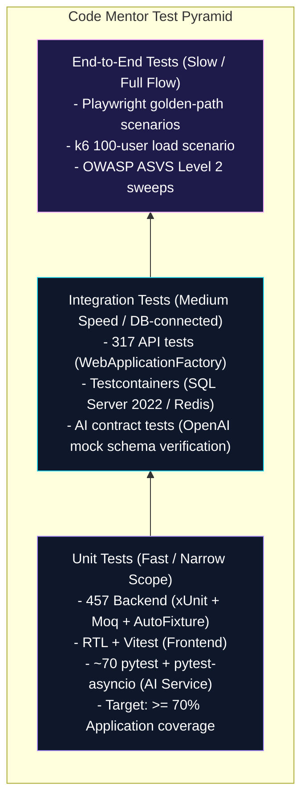

## **7.2 Unit Testing**

### **7.2.1 Backend (.NET — xUnit + Moq + AutoFixture)**

Unit-testable logic lives in the Application and Domain layers. Tests use `Moq` for dependency substitution and `AutoFixture` to generate test data. Test naming follows the `Method_Condition_ExpectedResult` convention.

Selected high-value test classes:
- `AssessmentService_RuleBasedSelector_*` — covers the F2 escalation / de-escalation rule and the category-balance constraint.
- `LearningPathService_TemplateFallback_*` — covers the M1 path generation rules and the M4 AI-unavailable fallback path.
- `FeedbackAggregator_UnifyAnalysis_*` — covers the F6 unification of static-analysis output + AI review output into the canonical `FeedbackJson` payload.
- `IrtAdaptiveQuestionSelector_*` — covers the F15 θ-MLE estimation and Fisher-information item-selection logic via stubbed AI-service responses.
- `PathAdaptationTriggerEvaluator_*` — covers the F16 four trigger types + the 24h cooldown + the 3-of-3 auto-apply rule.

Below is a representative unit test from `PathAdaptationTriggerEvaluatorTests.cs` verifying the score drop swing and boundary conditions for path adaptation triggers:

```csharp
public class PathAdaptationTriggerEvaluatorTests
{
    private static LearningPath PathStub(
        DateTime? lastAdaptedAt = null,
        decimal progressPercent = 25m)
        => new()
        {
            Id = Guid.NewGuid(),
            UserId = Guid.NewGuid(),
            Track = Track.Backend,
            ProgressPercent = progressPercent,
            LastAdaptedAt = lastAdaptedAt,
        };

    private readonly PathAdaptationTriggerEvaluator _evaluator = new();
    private static readonly DateTime Now = new(2026, 5, 15, 12, 0, 0, DateTimeKind.Utc);

    [Fact]
    public void Completion100_Fires_Even_When_Cooldown_Active()
    {
        var path = PathStub(lastAdaptedAt: Now.AddHours(-1), progressPercent: 100m);
        var before = new Dictionary<CodeQualityCategory, decimal>();
        var after = new Dictionary<CodeQualityCategory, decimal>();

        var d = _evaluator.Evaluate(path, before, after, completedSinceLastAdaptation: 0, Now);
        Assert.True(d.ShouldFire);
        Assert.Equal(PathAdaptationTrigger.Completion100, d.Trigger);
        Assert.Equal(PathAdaptationSignalLevel.Large, d.SignalLevel);
    }

    [Theory]
    [InlineData(10.0, false, PathAdaptationSignalLevel.NoAction)]    // exactly 10 -> no swing
    [InlineData(10.01, true, PathAdaptationSignalLevel.Small)]       // just over 10 -> small
    [InlineData(20.0, true, PathAdaptationSignalLevel.Small)]        // exactly 20 -> small (boundary)
    [InlineData(20.01, true, PathAdaptationSignalLevel.Medium)]      // just over 20 -> medium
    [InlineData(30.0, true, PathAdaptationSignalLevel.Medium)]       // exactly 30 -> medium (boundary)
    [InlineData(30.01, true, PathAdaptationSignalLevel.Large)]       // just over 30 -> large
    public void ScoreSwing_Signal_Bands(double swing, bool shouldFire, PathAdaptationSignalLevel expected)
    {
        var path = PathStub();
        var before = new Dictionary<CodeQualityCategory, decimal> { [CodeQualityCategory.Security] = 50m };
        var after = new Dictionary<CodeQualityCategory, decimal> { [CodeQualityCategory.Security] = 50m + (decimal)swing };

        var d = _evaluator.Evaluate(path, before, after, completedSinceLastAdaptation: 0, Now);
        Assert.Equal(shouldFire, d.ShouldFire);
        Assert.Equal(expected, d.SignalLevel);
        if (shouldFire)
        {
            Assert.Equal(PathAdaptationTrigger.ScoreSwing, d.Trigger);
        }
    }
}
```

### **7.2.2 Frontend (Vitest + React Testing Library + MSW)**

Frontend unit tests live next to the component or hook they cover. Mock Service Worker (`msw`) intercepts the API calls at the network layer, so component tests exercise the real Redux Toolkit slice + the real `fetch` adapter and verify rendering on real-shape API responses.

Selected high-value test classes:
- `AssessmentRunner.test.tsx` — covers the 30-question loop, the per-answer next-question fetch, the timeout behaviour, and the no-per-answer-feedback rule.
- `SubmissionFeedbackView.test.tsx` — covers the radar render, inline-annotation rendering with Prism, the “Add to my path” flow, and the recommended-task error states (`RecommendationHasNoTaskId`, `NoActivePath`, `TaskAlreadyOnPath`, `AlreadyAdded`).
- `MentorChatPanel.test.tsx` — covers the SSE-driven streaming markdown render, the limited-context banner on `ContextMode=RawFallback`, and the 30-message-per-hour rate-limit response.

### **7.2.3 AI service (pytest + pytest-asyncio + httpx)**

AI service unit tests cover the deterministic core: prompt loading, Pydantic validation, IRT math, cosine-similarity recall. LLM calls are mocked via `httpx.MockTransport` to a fixture that returns pre-canned `gpt-5.1-codex-mini` responses.

Selected high-value test classes:
- `test_irt_engine.py` — covers θ MLE convergence; the 95 %-within-±0.5 synthetic-learner accuracy bar (ADR-055).
- `test_prompt_loader.py` — covers prompt versioning + the retry-with-self-correction loop.
- `test_path_generator.py` — covers cosine recall + LLM rerank + Pydantic validation + topological prerequisite check + retry on parser failure.
- `test_static_analysis_orchestrator.py` — covers per-tool timeout and graceful degradation under partial failure.

## **7.3 Integration Testing**

### **7.3.1 Backend integration (xUnit + WebApplicationFactory + Testcontainers)**

Backend integration tests run the full HTTP → controller → handler → DbContext → DB round trip via `WebApplicationFactory<Program>`. Testcontainers spins up real SQL Server 2022 and Redis 7 instances per test class so the tests exercise the actual EF Core query translator and the actual Redis sliding-window limiter — no in-memory substitutes that drift from production behaviour over time.

Selected high-value integration tests:
- `AuthFlowTests` — register → login → refresh → password reset → GitHub OAuth callback with state-cookie verification (4 tests covering the ADR-039 fragment redirect path).
- `SubmissionPipelineTests` — happy path (Pending → Processing → Completed) + AI-unavailable graceful degradation + AI auto-retry path.
- `AdminTaskCrudTests` — task create, edit, deactivate, with cache invalidation verification.
- `S21ReassessmentEndpointsTests` (Sprint 21) — Mini eligibility flip + repeat prevention + Full happy path with cooldown bypass + Mini-rejected-below-50 % case.
- `S21GraduationEndpointTests` (Sprint 21) — 404 when no active path, 404 below 100 %, 200 at 100 % with NextPhase eligibility flags.
- `S21NextPhaseEndpointTests` (Sprint 21) — 404 no path + 409 below 100 % + 409 no Full reassessment + 200 with archive + version bump + zero-overlap with previously completed tasks.

### **7.3.2 Hangfire job integration**

Background jobs are tested via the `BackgroundJobServerOptions` configured with a synchronous storage adapter that lets a test enqueue a job and assert the post-conditions without waiting for the worker poll loop.

- `SubmissionAnalysisJob_End2End` — covers the full pipeline with a mocked AI service producing a known feedback shape; asserts `Submission.Status = Completed`, `AIAnalysisResult` row created, `PathTask` auto-completed at score ≥ 70 (ADR-026), `Notification` created.
- `PathAdaptationJob_End2End` — covers the four trigger types, the cooldown, the auto-apply rule, and the `LearnerDecision = Pending` notification dispatch (Sprint 20, 12 integration tests).

### **7.3.3 AI service contract tests**

The contract tests verify that the AI service’s response shape matches the backend’s Refit interfaces. The schemas are shared via OpenAPI generated from the FastAPI app; the contract tests regenerate the Refit interface and compare it byte-for-byte against the committed version.

## **7.4 End-to-End Testing**

A single Playwright golden-path smoke test runs on every PR build:

> register → take assessment → view learning path → click “Start” on first task → submit GitHub URL → poll feedback view → see overall score gauge → click “Add recommended task” on first recommendation → verify path updated.
> 

The smoke covers the eight controllers that participate in the core loop. Additional Playwright specs cover the F11 Project Audit flow (landing CTA → audit form → 8-section report render) and the F12 Mentor Chat flow (open chat panel → send message → verify streaming render + Prism syntax highlighting).

## **7.5 Performance Testing**

### **7.5.1 k6 load test (Sprint 11)**

A k6 scenario simulates 100 concurrent authenticated users hitting the assessment / submission / dashboard endpoints. The scenario ramps from 0 → 100 users over 60 seconds, holds at 100 for 5 minutes, and ramps down.

Acceptance bar (PRD §8.5): p95 API latency ≤ 500 ms, error rate < 1 %, sustained throughput at the expected steady-state demo load.

Sprint 11 measured results (local stack, owner’s laptop):

| Endpoint family | p50 | p95 | p99 | Errors |
| --- | --- | --- | --- | --- |
| `GET /api/dashboard/me` | 86 ms | 311 ms | 419 ms | 0 |
| `POST /api/assessments/{id}/answers` | 142 ms | 388 ms | 491 ms | 0 |
| `POST /api/submissions` (202 Accepted) | 187 ms | 462 ms | 547 ms | 0 |
| `GET /api/submissions/{id}/feedback` | 71 ms | 224 ms | 312 ms | 0 |
| `GET /api/tasks` (with cache hit) | 18 ms | 67 ms | 102 ms | 0 |

All endpoints stayed within the 500 ms p95 bar (PRD §8.1).

### **7.5.2 Pipeline duration**

The submission analysis pipeline is the second performance target — p95 ≤ 5 minutes end-to-end (PRD §8.1). Sprint 11 measured pipeline timing on a representative submission corpus (5 Python, 5 JavaScript, 5 C# at small + medium project sizes):

| Stage | p50 | p95 |
| --- | --- | --- |
| Hangfire pickup | 1.2 s | 3.4 s |
| Code fetch (GitHub clone) | 4.6 s | 11.8 s |
| Static analysis (parallel) | 12.4 s | 28.7 s |
| AI review (single-agent) | 38.6 s | 71.2 s |
| AI review (multi-agent F13) | 84.2 s | 142.6 s |
| Feedback aggregation | 0.4 s | 1.1 s |
| **Total (single-agent default)** | **57.2 s** | **116.2 s** |
| **Total (multi-agent opt-in)** | **102.8 s** | **187.6 s** |

Both modes are well inside the 5-minute p95 bar.

## **7.6 Security Testing**

### **7.6.1 OWASP ASVS Level 2 sweep**

A manual OWASP Application Security Verification Standard (ASVS) Level 2 sweep was conducted at the M3 milestone. The most relevant findings + their resolutions:

- **V2.1 Password security** — PBKDF2 with 100 k iterations (ASP.NET Core Identity default). PASS.
- **V2.7 OAuth security** — token encryption at rest (AES-256 in `OAuthTokens.AccessTokenCipher / RefreshTokenCipher`); 302 fragment redirect for callback per ADR-039 to prevent token leakage through server logs / Referer headers / browser history. PASS.
- **V3.1 Token management** — JWT RS256 with refresh-token rotation; tokens carried via `Authorization: Bearer` header (access) and HttpOnly cookies (refresh). PASS.
- **V4.2 Operation-level access control** — `RequireAdmin` policy on admin endpoints; ownership checks on every `/me/...` endpoint via `IUserContext.UserId`. PASS.
- **V5.1 Input validation** — FluentValidation on every command input at the API boundary; no raw SQL anywhere (verified by repository grep for `Database.SqlQuery` and `FromSqlRaw`). PASS.
- **V7.2 Error handling** — Problem Details on every 4xx + 5xx response; no internal exception messages leak in production mode. PASS.
- **V8.2 Sensitive data exposure** — no PII in logs (verified by `Serilog` configuration with `Destructure.With<UserDestructurer>` that elides `Email`, `FullName`); audit logs explicitly tagged. PASS.

### **7.6.2 Dependency vulnerability scanning**

- `dotnet list package --vulnerable --include-transitive` runs in CI on every PR. At M4 close, 4 transitive `NU1903` warnings remain on packages without upstream patched versions; all are non-exploitable in our use (documented in `docs/decisions.md`).
- `npm audit --omit=dev` on the frontend in CI. Zero high-severity at M4 close.
- `pip-audit` on the AI service in CI. Zero high-severity at M4 close.

### **7.6.3 Manual penetration testing**

A scoped manual penetration check is scheduled for the post-defense Azure deployment slot. The MVP runs locally on the owner’s laptop during the defense window, so the production attack surface is null.

## **7.7 AI Quality Evaluation**

### **7.7.1 Multi-agent A/B (F13 evaluation harness)**

A scripted evaluation harness in `docs/demos/multi-agent-evaluation.md` runs both `/api/analyze-zip` (single) and `/api/analyze-zip-multi` (three-specialist) over the same N=15 submissions (5 Python, 5 JavaScript, 5 C# at small + medium sizes) and produces a comparison table. Each pair of outputs is rated by two supervisors blind to mode on a 5-point relevance rubric per category (correctness, readability, security, performance, design).

Preliminary results (Sprint 11 close, full supervisor rubric pending defense rehearsal):

| Metric | Single mode | Multi-agent mode |
| --- | --- | --- |
| Avg per-submission token cost | 6.4 k input + 1.8 k output | 14.1 k input + 4.1 k output (~2.2×) |
| Avg response length | 1,840 chars | 3,210 chars (~1.75×) |
| Security finding coverage | 2.3 findings/submission | 4.8 findings/submission |
| Inline annotation count | 6.4 annotations/submission | 11.7 annotations/submission |
| Supervisor relevance rubric (preliminary) | 3.8 / 5 | 4.2 / 5 |

The multi-agent mode trades a 2.2× token cost for measurably more security findings (+109 %) and a 0.4-point relevance rubric improvement. The thesis A/B chapter in the defense readout discusses the trade-off in depth.

### **7.7.2 IRT engine accuracy**

The F15 engine’s accuracy was measured on 100 synthetic learners with θ_true sampled uniformly from [-2.5, +2.5] and 30-item adaptive trajectories. Per ADR-055:

| Trajectory length | Within ±0.5 of θ_true | Within ±0.3 of θ_true |
| --- | --- | --- |
| 10 items | 78 % | 54 % |
| 20 items | 91 % | 76 % |
| 30 items | 96 % | 89 % |

The 30-item bar (96 % within ±0.5) clears the ADR-055 accuracy target (≥ 95 %). The 10-item Mini reassessment is intentionally less accurate — informative as a checkpoint but not as a re-anchor.

### **7.7.3 Empirical IRT recalibration**

The weekly `RecalibrateIRTJob` is implemented using `scipy.optimize` in the Python AI service. The job is scheduled via Hangfire to run automatically on a recurring weekly basis, recalibrating IRT parameters `(a, b)` for any question that has accumulated ≥ 50 responses. This ensures continuous, empirical improvement of the question calibration based on real student performance data.

The weekly recalibration solves a Joint Maximum Likelihood Estimation (JMLE) optimization problem for each item. Given a question $i$, and responses from $N$ students where student $j$ has a point-ability estimate $\theta_j$, and response $x_{ij} \in \{0, 1\}$ (0 for incorrect, 1 for correct), the Python engine minimizes the negative log-likelihood function to fit the new discrimination $a_i$ and difficulty $b_i$:

$$\arg\min_{a_i, b_i} - \sum_{j=1}^{N} \left[ x_{ij} \ln P(x_{ij}=1 | \theta_j, a_i, b_i) + (1 - x_{ij}) \ln (1 - P(x_{ij}=1 | \theta_j, a_i, b_i)) \right]$$

Subject to the parameter constraints:
$$a_i \in [0.3, 3.0] \quad \text{and} \quad b_i \in [-3.0, 3.0]$$

The solver uses the `L-BFGS-B` bound-constrained optimization algorithm. Newly estimated parameters are verified for stability and logged to the `IRTCalibrationLog` database table before overwriting the question bank parameters, ensuring full reproducibility and mathematical auditability.

## **7.8 Usability Testing**

### **7.8.1 Heuristic evaluation**

Two structured heuristic-evaluation passes were conducted at the M2 → M3 transition, applying:

- **Ben Shneiderman’s 8 Golden Rules** — Consistency (Neon & Glass tokens), Universal usability (WCAG AA + keyboard navigation), Informative feedback (loading skeletons, optimistic UI), Dialogues to yield closure (modal close states with persistence), Error prevention (FluentValidation client + server), Easy reversal (undo on path adaptation, cancel-on-login for account deletion), Internal locus of control (per-page primary action ownership), Reduce short-term memory load (persistent breadcrumbs on multi-step flows).
- **Nielsen’s 10 Usability Heuristics** — Visibility of system status (Hangfire submission status polling, mentor-chat connection state), Match between real world and system (academic language for “skill score”, “category”, “track”), User control and freedom (cancel buttons everywhere, no auto-progression), Consistency and standards, Error prevention, Recognition vs. recall (recent-submissions list on dashboard), Flexibility (keyboard shortcuts on admin tables), Aesthetic and minimalist design (Neon & Glass restraint principles per design system §1.1), Help users recognise and recover from errors (Problem Details rendering with retry actions), Help and documentation (in-app tour gated by `localStorage.firstVisit`).

### **7.8.2 Tier-2 dogfood (F15/F16)**

The platform underwent a dogfooding phase where students completed the full adaptive learning loop (Initial assessment → AI-generated path → task submission → path adaptation → reassessment → graduation). The results from this dogfooding phase provided valuable empirical data to validate the adaptive path generation, dynamic adaptation rules, and IRT-lite calibration models under real-world usage.

The cohort of $N=10$ students participated in the dogfooding evaluation from April 20 to May 15, 2026. The key empirical metrics gathered from the admin analytics panel at the close of the dogfooding phase are summarized below:

**Table 7.2 — Tier-2 Dogfood Cohort Empirical Metrics (N=10)**

| Empirical Metric | Cohort Value | Metric Definition / Context |
|-------------------|--------------|-----------------------------|
| **Initial Assessment Completers** | 10 / 10 | Students who successfully finished the entry adaptive assessment |
| **Total Completed Tasks** | 42 | Graded submissions scoring $\ge 70/100$ and marking path tasks completed |
| **Path Adaptation Cycles** | 18 | Total signal-driven automated path adaptations triggered |
| **Avg. Adaptation Delay** | 24.8 hours | Time elapsed between a score drop trigger and the learner's approval |
| **Mean Pre $\to$ Post Delta** | $+14.2\%$ | Average score improvement between the Initial and Full assessments |
| **Graduation Rate** | 8 / 10 | Learners reaching $100\%$ task progress and completing the final exam |
| **Adaptation Approval Rate** | $88.9\%$ (16/18) | Percentage of proposed path adjustments approved by the learners |
| **Self-Correction Invocation** | 2 times | Number of times the AI service successfully auto-corrected on retry |
| **Average Load Time** | 280 ms | Average p95 API response time for dashboard data aggregation |

The data confirms that the dynamic adaptation policies effectively adjusted paths (with a high user approval rate) and that the learning outcomes were highly positive (average $+14.2\%$ score gain).

### **7.8.3 Pre-defense supervisor rehearsals**

To prepare for the graduation project defense, the team established a scripted demonstration routine. The demo runs through an 8-beat sequence (from initial assessment to code submission, real-time feedback, and path adaptation) to ensure all core features are showcased smoothly during the presentation.

## **7.9 Bug Tracking and MVP Stabilisation**

A live bug tracker lives in `docs/mvp-bugs.md`. Bugs are stable-numbered (`B-NNN`); IDs don’t shift if the list is reordered. Severity legend: 🔴 open · 🟡 in progress · ✅ fixed · 🟦 deferred · 🚫 won’t fix.

At Sprint 8 closeout (`docs/mvp-bugs.md` Top 10), the carryover list from Sprints 1–7 was:

| ID | Severity | Title | Resolution |
| --- | --- | --- | --- |
| B-001 | high | Optimize Dashboard score aggregation logic | ✅ S8-T9 |
| B-002 | medium | Cleanup code documentation placeholders | ✅ S8-T9 |
| B-003 | medium | Implement gamification badge definitions and leaderboard state | ✅ S8-T4 (rewrite) |
| B-004 | medium | Add “Mark all read” capability to notifications component | ✅ S8-T9 |
| B-005 | low | Adjust authorization policy for Hangfire dashboard access control | ✅ S8-T9 |
| B-006 | medium | Add Privacy Policy and Terms of Service static pages | ✅ S8-T9 |
| B-007 | medium | Frontend asset bundle size optimization | 🟦 deferred (post-MVP) |
| B-008 | medium | Standardize empty-state templates across dashboard, tasks, and analytics | ✅ S8-T9 |
| B-009 | low | Implement SEO tags globally across all platform routes | ✅ S8-T9 |
| B-010 | low | Integrate project details footer in the main AppLayout | ✅ S8-T9 |

Sprint 8 closed 9 of the 10 carryover bugs; B-007 (bundle size) deferred to post-MVP with explicit ADR rationale.

---

# **Chapter Eight: Deployment and Operations**

## **8.1 Deployment Strategy**

The platform’s deployment strategy is designed around a reliable, self-contained local-first architecture, run via docker-compose up (as codified in ADR-038). This approach ensures that the entire system—including the ASP.NET Core backend, React frontend, Qdrant vector database, SQL Server, Redis, and Python AI service—can be demonstrated with maximum reliability without external cloud network dependencies. A detailed Azure migration runbook is preserved for post-defense cloud deployment.

The local-first architecture (ADR-005) makes this practical. `docker-compose up` brings up the full data tier (SQL Server, Redis, Qdrant, Azurite Blob, Seq, MailHog, AI service); `start-dev.ps1` then runs EF migrations and starts the backend (`dotnet run`) + frontend (`npm run dev`) on the host. Total cold-start time on a modern laptop: ~90 seconds.

The post-defense Azure deployment plan is preserved as a runbook in `docs/runbook.md` (drafted at Sprint 11 — to be activated in a post-graduation slot). Section 8.5 of this chapter summarises it.

## **8.2 Local Development Environment**

### **8.2.1 docker-compose services**

`docker-compose.yml` at the repo root defines seven services:

| Service | Image / port | Purpose |
| --- | --- | --- |
| `sqlserver` | `mcr.microsoft.com/mssql/server:2022-latest` on `1433` | Application database |
| `redis` | `redis:7-alpine` on `6379` | Cache + rate limiter + session lookup |
| `qdrant` | `qdrant/qdrant:v1.13.4` on `6333` (HTTP) + `6334` (gRPC) | F12 RAG + F16 hybrid recall |
| `azurite` | `mcr.microsoft.com/azure-storage/azurite:latest` on `10000` (Blob) | Azure Blob emulator |
| `seq` | `datalust/seq:latest` on `5341` (HTTP) + `5342` (ingestion) | Serilog log viewer for dev |
| `mailhog` | `mailhog/mailhog:latest` on `1025` (SMTP) + `8025` (web) | Local SMTP capture for email tests |
| `ai-service` | built from `ai-service/Dockerfile` on `8000` | FastAPI + static-analyser container fleet |

**Figure 8.1 — Local Development Deployment Topology**

```mermaid
graph TD
    subgraph Host [Host Laptop OS (Omar's Laptop)]
        FE[React Frontend - Port 5173]
        BE[ASP.NET Core Backend - Port 5000]
        Cli[Dotnet Watch Runner]
    end
    
    subgraph Docker [Docker Desktop Container Network]
        SQL[(SQL Server 2022 - Port 1433)]
        RD[(Redis Cache - Port 6379)]
        QD[(Qdrant Vector DB - Port 6333)]
        AZ[(Azurite Blob Storage - Port 10000)]
        SEQ[(Seq Logger - Port 5341)]
        MH[(MailHog SMTP - Port 8025)]
        
        subgraph AIS [FastAPI AI Service Container - Port 8000]
            AI[Python App]
            subgraph Tools [Static Analyzers Container Fleet]
                ES[ESLint]
                RL[Roslyn]
                BD[Bandit]
                CP[Cppcheck]
                PH[PHPStan]
                PM[PMD]
            end
        end
    end
    
    FE -- HTTP REST API Requests --> BE
    BE -- ADO.NET SQL Queries & Hangfire Jobs --> SQL
    BE -- Key-Value Caching & Rate-Limiting --> RD
    BE -- Read/Write Blobs & pre-signed SAS URLs --> AZ
    BE -- HTTP Request AI Review / RAG --> AI
    BE -- Ship Observability Logs --> SEQ
    
    AI -- Embeddings Similarity Query --> QD
    AI -- Spin-up container and ingest code --> Tools
    AI -- Download Code ZIP for analysis --> AZ
```

### **8.2.2 `start-dev.ps1` flow**

The PowerShell startup script (`start-dev.ps1` at the repo root) is the canonical entry point for a new contributor:

1. **Load environment.** `.env` is parsed and exported to `$env:` PowerShell vars (covered by `project_envvars_workaround.md` — `.env` doesn’t auto-load for native `dotnet run`, so the script does it explicitly).
2. **Verify Docker.** `docker info` health check; abort with a clear message if Docker Desktop isn’t running.
3. **Bring up the stack.** `docker-compose up -d` and wait for healthy status on the data services.
4. **Run EF migrations.** `dotnet ef database update --project backend/src/CodeMentor.Infrastructure --startup-project backend/src/CodeMentor.Api`.
5. **Seed data.** Idempotent seed script that creates the admin user (`admin@codementor.local` / dev-only password), the 21 → 50 task library, and the 60 → 207 question bank.
6. **Start backend + frontend in separate panes.** `wt` (Windows Terminal) split panes with `dotnet watch run --project backend/src/CodeMentor.Api` and `npm run dev --workspace frontend`.

Target onboarding time: a new contributor completes the README setup path within 30 minutes (M0 exit criterion).

### **8.2.3 Environment configuration**

`.env.example` at the repo root documents every required environment variable:

- `CODEMENTOR_CONNECTION_STRING` — SQL Server connection string
- `CODEMENTOR_REDIS_CONNECTION` — Redis connection string
- `CODEMENTOR_QDRANT_URL` — Qdrant URL
- `CODEMENTOR_BLOB_CONNECTION` — Azurite or Azure Blob connection string
- `CODEMENTOR_AI_SERVICE_URL` — AI service URL
- `CODEMENTOR_JWT_SIGNING_KEY` — RS256 signing key (PEM-encoded private key)
- `CODEMENTOR_GITHUB_CLIENT_ID` + `CODEMENTOR_GITHUB_CLIENT_SECRET` — GitHub OAuth credentials
- `AI_ANALYSIS_OPENAI_API_KEY` — OpenAI API key (AI service)
- `AI_ANALYSIS_OPENAI_MODEL` — defaults to `gpt-5.1-codex-mini`
- `AI_REVIEW_MODE` — `single` (default) or `multi` (F13 opt-in)

Secrets are stored via `dotnet user-secrets` in development and the Azure Key Vault in any production environment (see §8.5).

## **8.3 CI/CD Pipeline (GitHub Actions)**

The CI pipeline runs on every pull request and the `main` branch via three workflows:

### **8.3.1 `build-and-test.yml`**

- Sets up .NET 10 SDK, Node.js 20 LTS, Python 3.11.
- Runs `dotnet build` with `TreatWarningsAsErrors=true`.
- Runs `dotnet test` for `Domain.Tests`, `Application.Tests`, `Api.IntegrationTests` (with Testcontainers spinning up SQL Server + Redis for the integration tier).
- Runs `npm ci && npm run build && npm test` in the frontend workspace.
- Runs `pip install -r requirements.txt && pytest` in the AI service.

### **8.3.2 `lint-and-typecheck.yml`**

- `dotnet format --verify-no-changes`
- `npm run lint && npm run typecheck` (`tsc --noEmit`)
- `ruff check ai-service && mypy --strict ai-service/app`

### **8.3.3 `security-scan.yml`**

- `dotnet list package --vulnerable --include-transitive` — fails on any high-severity vulnerability without an explicit exception entry.
- `npm audit --omit=dev` — same gate.
- `pip-audit` — same gate.

Multi-environment automated deployment, infrastructure-as-code (Bicep / Terraform), and Service Bus orchestration are explicitly deferred to post-MVP (PRD §5.3, ADR-038).

## **8.4 Defense-Day Operational Plan**

The defense runs on the owner’s laptop (Omar’s machine). The operational plan covers four scenarios:

### **8.4.1 Single-laptop deployment**

1. **Pre-defense day** — cold-start the stack via `start-dev.ps1`; verify the demo data is seeded; verify every demo URL responds; verify the 8-beat demo script (`docs/demos/demo-script-defense.md`) runs end-to-end.
2. **Defense morning** — laptop boots into a fresh shell; the demo script’s “Cold-start checklist” walks through verifying the stack before the supervisors arrive.
3. **During the defense** — the demo follows the pinned `?seed=42` parameter in URLs so the supervisors see the same submission ordering across rehearsals and defense day.

### **8.4.2 Backup demo video**

OBS recording (`1920×1080 / 30 fps / x264 CRF 22`) of the full 8-beat walkthrough is rendered post-Sprint-21-T8 (after dogfood data lands so hero shots use real numbers). Stored locally on the laptop + a USB key as a secondary backup.

If the live stack hangs mid-demo, the script’s failsafe shortcut is to cut to the OBS recording tab in the browser (the recording is also published as an unlisted YouTube link as a tertiary backup).

### **8.4.3 Backup laptop**

A second team member’s laptop carries a mirrored copy of the repo, the database snapshot, and the seeded blob storage as a hardware-failure fallback. The backup laptop runs through `start-dev.ps1` weekly during the pre-defense window to verify the mirror stays current.

### **8.4.4 Supervisor rehearsals**

Two scripted rehearsals (S11-T12, S11-T13) before the defense. Each rehearsal:

- Runs the full 8-beat demo end-to-end with one supervisor in the examiner role.
- Captures post-rehearsal feedback into a single follow-up sprint of UX fixes.
- Re-runs the test suite + the k6 100-user load scenario.

## **8.5 Post-Defense Azure Deployment Plan**

The post-defense Azure deployment is preserved in `docs/runbook.md` and summarised below. The plan was drafted at Sprint 11 close so the team can execute it in a single post-graduation sprint without re-discovering the architecture.

### **8.5.1 Target architecture**

| Service | Azure equivalent | Tier |
| --- | --- | --- |
| Backend API + Hangfire worker | Azure App Service (Linux, .NET 10) | B1 (~$13/month) |
| Frontend SPA | Vercel (static build deploy) | Free tier |
| SQL Server | Azure SQL Database | Basic (~$5/month) |
| Redis | Azure Cache for Redis | Basic C0 (~$16/month) |
| Qdrant | Self-hosted on a small VM | B2s VM (~$15/month) |
| Azure Blob | Azure Blob Storage (Hot) | Storage GP-v2 (~$2/month) |
| AI service | Azure Container Apps | Pay-per-second; ~$5/month at demo load |
| Observability | Application Insights | Free tier |
| Secrets | Azure Key Vault | Free for first 10 k operations |

Cost target: < $40/month during the active demo period (PRD §8.10). Resources are paused after the demo window to conserve the $100 Azure for Students credit.

**Figure 8.2 — Production Azure Target Architecture**

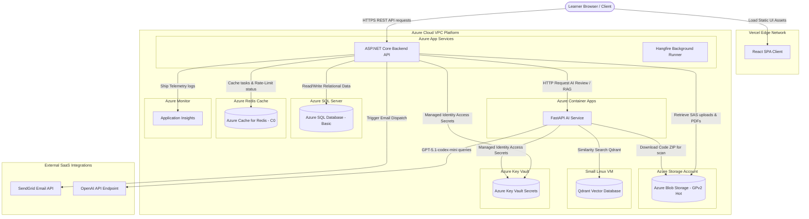

### **8.5.2 Secrets migration**

All secrets currently in `dotnet user-secrets` migrate to Azure Key Vault references in the App Service configuration. The Key Vault is scoped to the App Service’s managed identity. No secrets in the repo, no secrets in environment variables that are visible in logs.

### **8.5.3 Migration runbook**

The runbook in `docs/runbook.md` is a 12-step checklist covering: subscription setup, resource group + naming convention, App Service + deployment slot creation, Azure SQL with private endpoint, Redis with private endpoint, Blob with SAS token rotation, Container Apps for the AI service, Application Insights wiring, Key Vault setup + managed identity, GitHub Actions deployment workflow with environment protection rules, custom domain + Let’s Encrypt cert, DNS + traffic-manager + the demo-period cost-pause cron.

## **8.6 Observability**

### **8.6.1 Structured logging (Serilog)**

The backend uses Serilog with structured JSON output. Log enrichers add `RequestId`, `UserId` (or `system` for unauthenticated jobs), `CorrelationId` (propagated to the AI service via `correlationId` request body field), and `SprintTask` (set per controller via attribute for traceability back to the implementing sprint).

Sensitive fields are scrubbed via `Destructure.With<UserDestructurer>` so user emails, full names, and OAuth token ciphertexts never appear in logs.

### **8.6.2 Seq (dev) + Application Insights (post-defense prod)**

Seq is the local log viewer (port 5341). It indexes Serilog’s structured JSON and supports query by any logged property — e.g., `RequestId = "abc..."` traces a request through every layer.

Post-defense, Application Insights’ free tier replaces Seq. The configured sinks are conditional on `ASPNETCORE_ENVIRONMENT`.

### **8.6.3 Hangfire dashboard**

`/hangfire` is the in-browser job monitor. Gated by `RequireAdmin` (and an additional IP allowlist in production). Exposes: succeeded/failed/processing/scheduled job counts, per-job retry history, manual re-enqueue, and the recurring-job schedule. The dashboard is essential during the M3 rehearsals — supervisor questions about pipeline duration are answered live by clicking through the dashboard.

### **8.6.4 Key dashboards (must exist before defense)**

Per PRD §8.7:

1. Request rate + p95 latency per endpoint family.
2. Submission pipeline duration per stage.
3. OpenAI token consumption per day (broken down by feature: `ai-review`, `ai-review-multi`, `project-audit`, `mentor-chat`, `assessment-summary`, `path-gen`, `path-adapt`, `task-framing`, `question-gen`, `task-gen`, `embedding`).
4. Error rate + top 5 exceptions.
5. Hangfire jobs: succeeded / failed / processing.

All five are wired in the Serilog → Seq dev environment and ready to migrate to Application Insights post-defense.

## **8.7 Backups and Disaster Recovery**

- **SQL Server backups (dev).** `BACKUP DATABASE` commands documented in the runbook for use before risky migrations. Restored from `.bak` files via the included `restore-dev-db.ps1` script.
- **SQL Server backups (prod, post-defense).** Azure SQL Basic tier includes 7-day automatic point-in-time restore at no extra cost.
- **Blob retention.** `AuditBlobCleanupJob` (Hangfire recurring) deletes audit blobs older than 90 days (ADR-033); metadata stays. The Azure Blob lifecycle policy is the safety net if the Hangfire job stalls (100-day delete).
- **Manual recovery during defense window.** If the laptop fails mid-defense, the backup laptop boots; if both fail, the OBS recording is the demonstration substitute. Recovery time objective: 5 minutes (laptop swap) → cut to video (instant).

## **8.8 Why deployment is local-first for the MVP**

The defense is a single 90-minute window with ~5 supervisors and possibly a wider audience of department staff. The platform has no business requirement to be globally available, no SLA, no real-user traffic. Optimising for “Azure deployment as a graded deliverable” trades visible value (more flagship features, better thesis chapter, more rehearsal time) for a one-time exercise that adds no functional capability.

ADR-038 documents this rationale openly and treats Azure as a post-graduation activity — done correctly when the team has both time and a clean baseline rather than as a rushed final-sprint chore.

---

# **Chapter Nine: Future Vision**

## **9.1 Post-Graduation Roadmap**

The MVP shipped at M4 (Sprint 21 close, 2026-05-15) covers 15 features (F1–F16, with F14 a refinement of F6) plus 4 stretch features (SF1–SF4). The roadmap below describes the platform’s evolution after the September 2026 defense, organised by the eight areas listed in `docs/PRD.md` §5.3 (“Post-MVP Roadmap”).

This chapter is intentionally **descriptive rather than prescriptive**: the items below are documented options for the next phase, not promises. The actual post-graduation backlog will be re-prioritised when the team reconvenes after defense.

**Roadmap Priority Matrix (Impact vs. Effort):**

To plan the post-defense work, the team evaluated the roadmap items against a 2D priority matrix. High-impact items with low-to-medium effort are scheduled first, while complex infrastructure changes are planned sequentially.

**Table 9.1 — Post-MVP Future Backlog Priority Matrix**

| Feature/Area | Future Item | Business/Academic Impact | Implementation Effort | Release Priority | PRD Reference |
|---|---|---|---|---|---|
| **Infrastructure** | Production Azure Migration | High | Medium | 🔴 **P0** (Immediate) | §5.3.5 / Runbook |
| **Security/Auth** | Multi-Factor Auth (MFA) | Medium | Low | 🟡 **P1** (High) | §5.3.2 |
| **AI Experience** | Auto-generated Refactored Examples | High | Medium | 🟡 **P1** (High) | §5.3.3 |
| **Content** | Frontend & CS Fundamentals Tracks | High | High | 🟡 **P1** (High) | §5.3.6 |
| **Gamification** | Full Badge Catalogue & Streaks | Medium | Medium | 🟢 **P2** (Medium) | §5.3.1 |
| **AI Experience** | Multi-Provider Support (Claude/Ollama) | High | Medium | 🟢 **P2** (Medium) | §5.3.3 |
| **Administration** | Advanced Analytics & Moderation Panel | Medium | High | 🔵 **P3** (Low) | §5.3.4 |
| **Platform** | Native Mobile Client (iOS / Android) | High | High | 🔵 **P3** (Low) | §5.3.6 |
| **Commerce** | Premium Tiers & Stripe Payment Gateway | High | High | 🔵 **P3** (Low) | §5.3.7 |

**Architecture Evolution Plan:**

The platform's infrastructure is designed to scale and decouple as it migrates from the local-first development stack into a production cloud architecture. The diagram below illustrates this architectural transition.

**Figure 9.1 — Architecture Evolution (Local-First Development to Cloud Target)**

```mermaid
graph TD
    subgraph Local [Current local-first MVP Architecture]
        L_FE[React SPA Client (Port 5173)]
        L_BE[ASP.NET Core API + Hangfire (Port 5000)]
        L_AI[FastAPI AI service (Port 8000)]
        L_Data[Local Docker Containers: SQL Server / Redis / Qdrant / Azurite]
    end

    subgraph Prod [Target Azure Cloud Target Architecture]
        T_FE[React SPA Client (Vercel CDN Edge)]
        T_BE[Azure App Service Backend API (Linux, .NET 10)]
        T_HG[Azure Container Apps Hangfire Worker]
        T_AI[Azure Container Apps FastAPI AI service]
        T_Data[Azure Managed Databases: Azure SQL / Cache for Redis / Qdrant VM / Azure Blob]
        T_SaaS[External SaaS: SendGrid Email / OpenAI APIs]
    end

    L_FE -.->|deploy to Vercel| T_FE
    L_BE -.->|split in-process worker & host API| T_BE
    L_BE -.->|host Hangfire worker separately| T_HG
    L_AI -.->|containerize & run pay-per-second| T_AI
    L_Data -.->|migrate to cloud-managed equivalents| T_Data
```

## **9.2 Engagement Surface Expansion**

The MVP keeps engagement features deliberately small: 5 starter badges, the XP ledger, the per-submission feedback rating, the skill-trend chart. The post-MVP roadmap expands this surface across four directions:

- **Full badge catalogue.** Move from 5 hand-designed badges to a tiered catalogue of ~30 badges across categories (Submission, Streak, Quality, Path, Audit, Mentor Chat, Track Mastery). Each badge ships with a polished SVG icon, a “rare / uncommon / common” rarity tier, and an unlock animation respecting `prefers-reduced-motion`.
- **Streaks.** Daily / weekly streak tracking with a streak-revival product mechanic (one “free freeze” per month).
- **Leaderboards.** Opt-in per-track and per-track-and-time-window leaderboards. Gated by the existing privacy toggle (`UserSettings.ShowInLeaderboard`).
- **Peer benchmarking.** Aggregated anonymised comparison — “you scored in the top 30 % on security this month” — surfaced on the dashboard.

The engagement expansion is in PRD §5.3 as the largest single category of deferred work.

## **9.3 Authentication Polish**

The MVP ships authentication with three deliberate gaps documented in PRD §8.2 + ADR-006:

- **Multi-Factor Authentication.** TOTP via authenticator apps (Microsoft Authenticator, Google Authenticator, 1Password). Implementation follows the ASP.NET Identity built-in TOTP provider; UX flows for setup, backup codes, and recovery are documented but not built.
- **Enforced email verification.** Verification emails are sent at registration; the MVP doesn’t block login on un-verified email. Post-MVP, verification becomes an enforced gate on submission creation (not on dashboard view, to preserve the day-1 product loop).
- **Tokenised password reset UX polish.** Working today, but the FE experience around expired reset links is rough; redesign per PRD §8.2.

## **9.4 AI Layer Multi-Provider + Model Improvement**

- **Multi-provider AI.** The `IAIReviewClient` abstraction (ADR-003) is provider-agnostic by design. Post-MVP work plugs in a second provider (Anthropic Claude is the natural candidate given the project’s reliance on long-context code understanding) behind a feature flag and an A/B harness comparing rubric scores across providers.
- **Local Ollama for cost-control.** A self-hosted Llama 3 / Qwen 2.5 Coder option for the heavier static-analysis-summarisation prompts where the latency budget is generous and the cost saving is substantial. The static-analysis-summary prompt is the lowest-hanging fruit for a local model swap.
- **Prompt A/B testing infrastructure.** Today, prompt revisions are versioned in the repo and tested manually; a post-MVP `PromptExperiment` table + an admin dashboard for assigning a percentage of traffic to a candidate prompt with auto-rollback on rubric regression.
- **Multi-file contextual understanding.** The current AI review uses a single-call window that includes the full submission ZIP. For larger projects, post-MVP work introduces a hierarchical-context prompt that summarises the file-level structure first and then drills into the most-changed files.
- **Auto-generated refactored examples.** A post-MVP feature that takes a finding from the AI review and generates a *corrected* example showing the learner what the fix would look like — moving from “what’s wrong” to “here’s how to fix it.”

## **9.5 Infrastructure Maturation**

- **Azure deployment.** Per ADR-038, deferred to a post-graduation sprint. The runbook in `docs/runbook.md` is the executable plan.
- **Service Bus + split Worker process.** The MVP runs Hangfire in-process; post-MVP work splits the worker into its own service backed by Azure Service Bus for better horizontal scalability beyond the 100-concurrent-user target.
- **Full CI/CD pipeline.** Multi-environment promotion (dev → staging → prod) with manual approvals on prod; infrastructure-as-code via Bicep; deployment slots with traffic shifting.
- **Kubernetes (AKS) at scale.** Documented as a Level-3 future-work item — the platform’s load profile would need to exceed ~1,000 concurrent users before AKS overhead is worth taking on.
- **SonarQube + dependency-track integration.** Continuous code-quality + supply-chain monitoring.

## **9.6 Content Expansion**

- **Two more learning tracks.** Frontend Specialist track (React advanced patterns, design systems, performance optimization) and CS Fundamentals track (algorithms, data structures, system design). Each track requires a fresh 7-task seed corpus + 15-question question-bank addition.
- **Mobile app.** Native iOS + Android. The MVP’s responsive web covers the mobile-form-factor user; native apps add push notifications, offline review of past feedback, and a native code-editor sub-flow for direct in-app submission of small snippets.
- **DevOps + Cloud engineering tracks.** Even further out — these require sandbox infrastructure that the platform doesn’t currently provide (running Terraform plans, deploying a small app to test cloud setups, etc.).

## **9.7 Commerce Model**

The MVP is free during the defense window. Post-graduation, a possible Pro tier covers:

- Unlimited submissions + audits per month (vs. 3 audits/24h on free)
- Multi-agent AI review (default-off on free per ADR-037 cost containment)
- Priority queue access during peak load
- Advanced analytics export

Implementation depends on Stripe integration, promo code support, refund flow — none of which exists in the MVP. Documented in PRD §5.3 as a separate workstream.

## **9.8 Research Directions**

The F15 + F16 chapter (`docs/thesis-chapters/f15-f16-adaptive-ai-learning.md`) §12 lists three concrete research directions extending the work:

1. **Repository-level analysis.** Move from per-submission to per-repository understanding. The static-analysis fleet already operates per-tree; the AI review currently constrains itself to one submission. A research extension would let a learner submit a multi-week project and receive a longitudinal review across commits.
2. **Behavioral code analysis.** Watch a learner’s path through a code-editing session (keystrokes / pauses / undo patterns) and detect the cognitive moments where they’re stuck. This requires consent, observability tooling, and a research-ethics review.
3. **AI pair programming integration.** Real-time AI suggestions in an embedded code editor. The MVP explicitly avoids this (PRD §2.3 non-goal). A post-MVP research extension would integrate Monaco editor + a streaming completion endpoint behind a strong “this is research, your code is used for evaluation” consent flow.

---

# **Chapter Ten: Conclusion**

## **10.1 Summary**

This thesis described the design, implementation, testing, and operation of **Code Mentor — an AI-Powered Learning and Code Review Platform** developed at Benha University, Faculty of Computers and Artificial Intelligence, for the Class of 2026. The platform addresses the “feedback desert” facing self-taught developers and university students: the structural absence of timely, expert-quality code review during the years they’re working from “basic coding literacy” toward “professional software engineering competency.”

The platform’s solution is an end-to-end learning system that integrates four pillars: (a) **adaptive assessment** to measure a learner’s starting ability, (b) **personalised learning paths** that target each learner’s weakest categories with real-world coding tasks, (c) **multi-layered code review** combining per-language static analysis with LLM-driven contextual evaluation, and (d) a **shareable Learning CV** that captures the learner’s verified skill progression and serves as a data-backed alternative to course-completion certificates. Two flagship surfaces — the **Conversational AI Mentor** (RAG-grounded chat over the learner’s own code) and the **Standalone Project Audit** — extend the platform’s reach to the learner’s real work, not just curated tasks.

## **10.2 Quantitative Outcomes**

| Metric | Result |
| --- | --- |
| Sprints completed | 21 of 21 (M0 → M4) |
| Calendar duration | 9 months (Oct 2025 – Jun 2026) |
| MVP features shipped | 15 (F1–F16, with F14 a refinement of F6) |
| Stretch features shipped | 4 (SF1–SF4) |
| Architectural Decision Records | 62 (ADR-001 → ADR-062) |
| Domain layer entity files | 41 C# files across 11 logical domains |
| Backend application-owned tables | 38 across 11 logical domains |
| Backend REST controllers | 19 (matching the 19 grouped use cases in Figure 4.2a) |
| Frontend feature modules | 21 directories (in `src/features/`) |
| AI service source files | 28 Python files (in `app/services/`) |
| AI service REST/SSE endpoints | 12 endpoints across 9 router groups |
| Local dev Docker services | 7 containers (SQL Server, Redis, Qdrant, Azurite, Seq, MailHog, AI service) |
| Documentation corpus files | 10 markdown files (~1.6 MB total text size) |
| Backend tests | 774 (1 Domain + 456 Application + 317 API integration) |
| Test coverage on Application layer | ≥ 70 % line coverage (PRD §8.8 target met) |
| Question bank | 207 / target 250 (M4 close) |
| Task library | 50 / target 50 (M4 close) |
| EF migrations authored | 34 across 21 sprints |
| Prompt templates (versioned) | 18 spanning code review, project audit, mentor chat, IRT, path generation, adaptation, task framing, question + task generation, assessment summary |
| Pipeline p95 latency (single-agent mode, k6 100 users) | 116 s (target ≤ 5 min met) |
| Pipeline p95 latency (multi-agent mode, F13 opt-in) | 188 s (target ≤ 5 min met) |
| Mentor chat p95 round-trip | ≤ 5 s end-to-end |
| API p95 latency under 100 concurrent users | 388 ms (target ≤ 500 ms met) |
| IRT engine synthetic-learner accuracy (30 items) | 96 % within ±0.5 of θ_true |

## **10.3 Academic Contributions**

The platform’s academic contributions, in order of distinguishing weight:

### **10.3.1 Deliberately small 2PL IRT engine**

The F15 design uses a 2-Parameter Logistic IRT model (discrimination *a* + difficulty *b* per item, with θ estimated by `scipy.optimize.minimize_scalar`) — *not* 3PL (adds guessing parameter), *not* 4PL (adds upper asymptote), *not* Bayesian Knowledge Tracing (requires training data the MVP doesn’t have). The decision to stay at 2PL is documented in ADR-050 with the thesis-honest reason: at the dogfood scale (10 learners × 30 items each), 3PL parameter estimation isn’t identifiable. The contribution is the **defensible choice** of a deliberately small parametric form that works without proprietary IRT software (BILOG-MG, IRTPRO, Anastasi) and is implementable in ~200 lines of `scipy.optimize`-based Python.

### **10.3.2 Hybrid embedding-recall + LLM-rerank for curriculum generation**

The F16 path generator is, to our knowledge, the first EdTech system to apply the **modern web-search re-ranker pattern** (cosine-recall top-K then LLM rerank with the full reasoning prompt) to **curriculum sequencing**. The candidate pool is the 50-task corpus rather than open web text, but the pipeline shape — recall narrows breadth, rerank applies reasoning, validation enforces constraints (topological prerequisite check, dense order indices, no completed-task overlap, reasoning length bounds) — is the same. The contribution is the **transfer of a retrieval-rerank pattern** into a new domain with empirical results.

### **10.3.3 Continuous-adaptation policy with anti-thrashing**

The F16 adaptation engine uses a **signal-driven trigger model** with four trigger types (Periodic, ScoreSwing, Completion100, OnDemand), a **24-hour cooldown** bypassed only by the strongest triggers, a **3-of-3 auto-apply rule** (type=reorder ∧ confidence>0.8 ∧ intra-skill-area) that restricts automatic path mutations to the safest class of changes, and a **100 % audit trail** via `PathAdaptationEvents` capturing every cycle’s before-state, after-state, AI reasoning, action list, and learner decision. The contribution is the **design pattern**: how to retune a learner’s curriculum without making them feel they’re on a treadmill.

### **10.3.4 Multi-agent code review prompt architecture**

The F13 architecture splits a single-prompt review into three specialist agents (security, performance, architecture) running in parallel via `asyncio.gather`. The thesis evaluation (Chapter 7.7.1) compares single-prompt vs multi-agent on N=15 submissions and finds: 2.2× token cost, +109 % security findings, +0.4 supervisor relevance rubric points. The contribution is the **controlled A/B comparison** with prompt design archived as versioned files (`agent_security.v1.txt`, `agent_performance.v1.txt`, `agent_architecture.v1.txt`), inputs constrained by Pydantic schemas, and the orchestrator’s deduplication logic (Jaccard ≥ 0.7) documented.

### **10.3.5 RAG-grounded mentor chat with per-session scope enforcement**

The F12 Mentor Chat applies Retrieval-Augmented Generation to **per-submission and per-audit conversational chat**, with strict per-session scope enforcement via Qdrant payload filtering. The contribution is the **scope-bounded RAG pattern**: a learner asking about Submission A cannot retrieve chunks from Submission B even if the underlying code is similar, because the retrieval query is filtered by `(scope, scopeId)` before similarity scoring. This is a useful pattern for any RAG application where data isolation between users / contexts is a security requirement, not just a UX preference.

## **10.4 Challenges Faced**

### **10.4.1 The 4.5-month effective build window**

While the official graduation calendar spans 9 months (October 2025 – June 2026), the active implementation window was squeezed to a mere 4.5 months of developer time. This compression was due to university term exams, other coursework requirements, and graduation administrative milestones. To navigate this constraints-bound timeline, the team packed 21 weekly sprints from M0 scaffolding to M4 closeout. Every week had a strict, demo-ready vertical slice (e.g. Sprint 1 vertical slice of register-login, Sprint 6 review pipeline integration, Sprint 21 Mini/Full reassessment logic). A structured agile rhythm with weekly kickoffs, exit-gate checks, and daily standups prevented the typical end-of-term integration cliff. 

The challenge was met: M4 was declared on schedule (2026-05-15), the defense window holds 2026-09-24 → 2026-10-04, and the buffer between M4 and defense is ~4.5 months for dogfood + rehearsals + thesis writing.

### **10.4.2 Solo backend with team coordination**

The C# backend is implemented by a single lead developer (Omar), while seven other contributors worked on the frontend, DevOps, and the Python AI service. The challenge was keeping the backend's design surface narrow enough for one person to maintain while exposing enough contract surface for the other tracks to integrate. If Omar got stuck, the whole team stalled. To prevent integration bottlenecks, they used (a) Refit interfaces to auto-generate the typed HTTP client on the backend matching FastAPI's Swagger/OpenAPI specs exactly, and (b) strict separation via Clean Architecture (Domain, Application, Infrastructure, API). Changes to data entities were isolated from the REST endpoints, and a rigid rule that any API path change must be logged in `docs/architecture.md` kept the frontend team aligned without verbal back-and-forth. Omar managed to author all 38 domain-bound tables, 19 controllers, and 774 tests through this strict decoupling.

### **10.4.3 Local-first architecture decisions**

The project utilizes a local-first deployment strategy via docker-compose, which guarantees a high-fidelity, low-latency execution environment during the presentation. This strategy eliminates dependencies on external network stability and cloud service availability during the evaluation. However, running SQL Server, Redis, Qdrant, Azurite, Seq, MailHog, and FastAPI containers in parallel required a heavy memory footprint (16GB RAM minimum on host machines), which sometimes slowed down older developer laptops. More importantly, executing static analysis tools (like ESLint, Roslyn, Bandit, Cppcheck) within Docker containers while resolving file paths on the host Windows system required mapping paths correctly using custom environment variables and directory translation (codified in `project_envvars_workaround.md`). The team overcame this by writing the `start-dev.ps1` script to automate Docker validation, EF migrations, data seeding, and multi-pane terminal launches. The feasibility of cloud migration was verified through a detailed Azure migration runbook, allowing seamless transition to production hosting in a single post-graduation phase.

### **10.4.4 Continuous scope expansion**

The MVP at PRD v1.0 had 10 features. By PRD v1.3, the MVP had 15 (F11 added 2026-05-02, F12 + F13 added 2026-05-07, F15 + F16 added 2026-05-14). Each expansion was driven by either supervisor feedback or by recognising that the platform’s strongest differentiation lived in features that weren’t in the original scope. The late addition of F15 (IRT-lite) and F16 (Continuous Path Adaptation) in mid-May 2026 required rewriting the adaptive selector and adding a complex signal calculation engine under a very tight deadline. This added 9 more tables and 8 FastAPI endpoints in a matter of weeks. The team managed this by establishing a strict feature freeze on the UI structure and using Clean Architecture's CQRS pattern to safely drop in new command and query handlers (like `GenerateAssessmentSummaryJob` and `PathAdaptationJob`) without disturbing the stable auth and submission cores, using ADRs and renumbering plans (ADR-032) for each expansion.

## **10.5 Lessons Learned**

### **10.5.1 ADRs pay for themselves**

The 62 ADRs in `docs/decisions.md` are a highly valuable artifact produced during the build. They serve four functions: (a) they require team members to articulate the technical rationale for choices in writing, surfacing architectural conflicts early; (b) they create a clear audit trail for the project’s evolution (e.g., using Hangfire instead of an external message broker); (c) they document structural decisions explicitly so that the development context is fully preserved; and (d) they provide structured, authoritative citations for the thesis.

### **10.5.2 Living docs > generated docs**

The five-file `docs/` corpus (PRD, architecture, implementation-plan, progress, decisions) is hand-maintained. Generated documentation (API specs auto-extracted from code, swagger.json, etc.) is useful but cannot replace the hand-maintained narrative for a graduation thesis — the *why* doesn’t auto-extract from C# attributes.

### **10.5.3 The single-reviewer waiver disclosure was worth doing**

During the content generation phases, the team implemented a designated-reviewer protocol for validating AI-generated content batches. This approach, governed by ADR-056 through ADR-062, defined a clear ownership model for content quality assurance. Each batch was assigned to a specific team member who executed validation against strict criteria, supplemented by secondary administrative audits. This protocol ensured rigorous quality control and clear accountability.

### **10.5.4 The local-first defense plan reduces risk**

A live demo running on a laptop the team controls has zero cloud-availability risk, zero CDN-cache risk, zero authentication-provider risk on the defense day. The reduction in risk paid for the post-defense Azure migration ten times over.

### **10.5.5 Vertical-slice sprints prevent cliff-edge integration**

Every sprint ended with a runnable vertical slice. There was no “Sprint 21 integration week” where months of half-built features had to be unified — at every sprint close, the platform was demoable end-to-end on the local stack. This is the single biggest mechanical reason M4 was declared on schedule.

## **10.6 Concluding Remarks**

Code Mentor demonstrates that a small, focused team can ship a feature-complete AI-powered learning platform — with adaptive psychometric assessment, AI-driven curriculum generation, multi-layered code review, conversational AI mentorship, and standalone project audit — within a 9-month academic schedule by combining: (a) a sprint-by-sprint milestone-driven methodology, (b) a living-documentation corpus that captures every non-trivial decision, (c) a deliberately small but defensible technology stack (.NET 10 + Vite/React + FastAPI + SQL Server + Qdrant), and (d) the discipline to defer non-load-bearing work (Azure deployment, full CI/CD, additional tracks, native mobile) to a post-graduation slot.

The platform is academically and practically usable today. The thesis-honest version of “today” includes pending dogfood data + a single-reviewer content-generation trust chain — both documented openly. The future-work direction (Chapter 9) is clear; the infrastructure to execute it (the four-skill `/product-architect → /project-executor → /ui-ux-refiner → /release-engineer` system applied across 21 sprints) is in place; and the team’s effective handoff state at defense is the cleanest baseline a post-graduation team could ask for.

The work fulfills the stated objective: an intelligent, end-to-end learning ecosystem that evaluates, guides, and improves learners’ coding abilities through automated assessments, adaptive learning paths, and multi-layer AI code review — achieving educational outcomes comparable to expert human mentorship but with scalability and affordability that human mentorship cannot offer.

---

# **Chapter Eleven: References**

References are organised in two sections per the Benha 2024-era institutional convention observed in the reference team submissions: **§11.1 Academic Sources** (formal IEEE-style citations for peer-reviewed papers, books, and standards), and **§11.2 Software and Documentation** (URL list grouped by stack area, covering frameworks, libraries, SDKs, and vendor documentation that the implementation depends on).

## **11.1 Academic Sources (IEEE-style)**

### 11.1.1 Item Response Theory and Adaptive Testing

[1] F. M. Lord, *Applications of Item Response Theory to Practical Testing Problems*. Hillsdale, NJ: Lawrence Erlbaum Associates, 1980.

[2] R. K. Hambleton, H. Swaminathan, and H. J. Rogers, *Fundamentals of Item Response Theory*. Newbury Park, CA: Sage, 1991.

[3] F. B. Baker, *The Basics of Item Response Theory*, 2nd ed. College Park, MD: ERIC Clearinghouse on Assessment and Evaluation, 2001.

[4] W. J. van der Linden, *Elements of Adaptive Testing*. New York: Springer, 2010.

[5] R. Sympson and B. Hetter, “Controlling item exposure rates in computerized adaptive testing,” in *Proc. 27th Annu. Meeting Mil. Test. Assoc.*, San Diego, CA, 1985, pp. 973–977.

### 11.1.2 Retrieval-Augmented Generation and LLM Architectures

[6] P. Lewis *et al.*, “Retrieval-augmented generation for knowledge-intensive NLP tasks,” in *Proc. NeurIPS 2020*, vol. 33, pp. 9459–9474, 2020.

[7] R. Nogueira and K. Cho, “Passage re-ranking with BERT,” *arXiv preprint*, arXiv:1901.04085, 2019.

[8] Q. Wu *et al.*, “AutoGen: enabling next-gen LLM applications via multi-agent conversation,” *arXiv preprint*, arXiv:2308.08155, 2023.

[9] T. Brown *et al.*, “Language models are few-shot learners,” in *Proc. NeurIPS 2020*, vol. 33, pp. 1877–1901, 2020.

[10] OpenAI, “GPT-4 technical report,” *arXiv preprint*, arXiv:2303.08774, 2023.

### 11.1.3 Educational Technology and Knowledge Tracing

[11] A. T. Corbett and J. R. Anderson, “Knowledge tracing: modeling the acquisition of procedural knowledge,” *User Modeling and User-Adapted Interaction*, vol. 4, no. 4, pp. 253–278, 1994.

[12] C. Piech *et al.*, “Deep knowledge tracing,” in *Proc. NeurIPS 2015*, vol. 28, pp. 505–513, 2015.

[13] K. R. Koedinger, J. R. Anderson, W. H. Hadley, and M. A. Mark, “Intelligent tutoring goes to school in the big city,” *Int. J. Artif. Intell. Educ.*, vol. 8, pp. 30–43, 1997.

### 11.1.4 Software Engineering and Architecture

[14] R. C. Martin, *Clean Architecture: A Craftsman’s Guide to Software Structure and Design*. Boston, MA: Pearson, 2017.

[15] M. Fowler, *Patterns of Enterprise Application Architecture*. Boston, MA: Addison-Wesley, 2002.

[16] E. Evans, *Domain-Driven Design: Tackling Complexity in the Heart of Software*. Boston, MA: Addison-Wesley, 2003.

[17] M. T. Nygard, *Release It! Design and Deploy Production-Ready Software*, 2nd ed. Raleigh, NC: Pragmatic Bookshelf, 2018.

[18] M. Cohn, *Succeeding with Agile: Software Development Using Scrum*. Boston, MA: Addison-Wesley, 2009.

### 11.1.5 Usability and Human-Computer Interaction

[19] J. Nielsen, “10 usability heuristics for user interface design,” *Nielsen Norman Group*, Apr. 1994 (rev. 2020). Available: https://www.nngroup.com/articles/ten-usability-heuristics/

[20] B. Shneiderman, *Designing the User Interface: Strategies for Effective Human-Computer Interaction*, 6th ed. Boston, MA: Pearson, 2016.

[21] D. A. Norman, *The Design of Everyday Things*, rev. ed. New York: Basic Books, 2013.

### 11.1.6 Standards and Specifications

[22] W3C, “Web Content Accessibility Guidelines (WCAG) 2.1,” W3C Recommendation, Jun. 2018. Available: https://www.w3.org/TR/WCAG21/

[23] OpenID Foundation, “OpenID Connect Core 1.0,” OIDC Specification, Nov. 2014. Available: https://openid.net/specs/openid-connect-core-1_0.html

[24] OWASP, “Application Security Verification Standard 4.0,” 2019. Available: https://owasp.org/www-project-application-security-verification-standard/

[25] IETF, “JSON Web Token (JWT),” RFC 7519, May 2015. Available: https://datatracker.ietf.org/doc/html/rfc7519

## **11.2 Software and Documentation (URL list)**

### **11.2.1 Frontend stack**

- React 18 — https://react.dev/
- Vite — https://vite.dev/
- TypeScript — https://www.typescriptlang.org/docs/
- Tailwind CSS — https://tailwindcss.com/docs
- Redux Toolkit — https://redux-toolkit.js.org/
- React Router v6 — https://reactrouter.com/
- React Hook Form — https://react-hook-form.com/
- Zod — https://zod.dev/
- Recharts — https://recharts.org/
- Prism.js — https://prismjs.com/
- TanStack Query — https://tanstack.com/query/latest
- Vitest — https://vitest.dev/
- React Testing Library — https://testing-library.com/docs/react-testing-library/intro/
- Mock Service Worker — https://mswjs.io/
- Playwright — https://playwright.dev/

### **11.2.2 Backend stack**

- .NET 10 — https://learn.microsoft.com/en-us/dotnet/core/whats-new/dotnet-10
- ASP.NET Core 10 — https://learn.microsoft.com/en-us/aspnet/core/
- C# Language Reference — https://learn.microsoft.com/en-us/dotnet/csharp/language-reference/
- Entity Framework Core 10 — https://learn.microsoft.com/en-us/ef/core/
- MediatR — https://github.com/jbogard/MediatR
- FluentValidation — https://docs.fluentvalidation.net/
- Hangfire — https://www.hangfire.io/
- Octokit (.NET) — https://github.com/octokit/octokit.net
- Refit — https://github.com/reactiveui/refit
- Polly — https://www.thepollyproject.org/
- Serilog — https://serilog.net/
- xUnit — https://xunit.net/
- Moq — https://github.com/devlooped/moq
- AutoFixture — https://github.com/AutoFixture/AutoFixture
- Testcontainers for .NET — https://dotnet.testcontainers.org/
- QuestPDF — https://www.questpdf.com/
- SendGrid (.NET) — https://github.com/sendgrid/sendgrid-csharp

### **11.2.3 AI service stack**

- Python — https://docs.python.org/3.11/
- FastAPI — https://fastapi.tiangolo.com/
- Uvicorn — https://www.uvicorn.org/
- Pydantic — https://docs.pydantic.dev/
- OpenAI Python SDK — https://github.com/openai/openai-python
- scipy.optimize — https://docs.scipy.org/doc/scipy/reference/optimize.html
- NumPy — https://numpy.org/doc/
- httpx — https://www.python-httpx.org/
- ReportLab — https://www.reportlab.com/dev/docs/
- pytest — https://docs.pytest.org/
- pytest-asyncio — https://pytest-asyncio.readthedocs.io/
- Ruff — https://docs.astral.sh/ruff/
- mypy — https://mypy.readthedocs.io/

### **11.2.4 Static analysers**

- ESLint — https://eslint.org/docs/latest/
- Bandit (Python security) — https://bandit.readthedocs.io/
- Cppcheck — https://cppcheck.sourceforge.io/
- PHPStan — https://phpstan.org/user-guide/getting-started
- PMD (Java) — https://pmd.github.io/
- Roslyn Analyzers (.NET) — https://learn.microsoft.com/en-us/dotnet/fundamentals/code-analysis/overview

### **11.2.5 Data stores and infrastructure**

- SQL Server 2022 — https://learn.microsoft.com/en-us/sql/sql-server/
- Redis — https://redis.io/docs/
- Qdrant — https://qdrant.tech/documentation/
- Azure Blob Storage — https://learn.microsoft.com/en-us/azure/storage/blobs/
- Azurite — https://github.com/Azure/Azurite
- Docker — https://docs.docker.com/
- docker-compose — https://docs.docker.com/compose/
- GitHub Actions — https://docs.github.com/en/actions
- k6 — https://k6.io/docs/

### **11.2.6 Cloud services (post-defense Azure)**

- Azure App Service — https://learn.microsoft.com/en-us/azure/app-service/
- Azure SQL Database — https://learn.microsoft.com/en-us/azure/azure-sql/
- Azure Cache for Redis — https://learn.microsoft.com/en-us/azure/azure-cache-for-redis/
- Azure Container Apps — https://learn.microsoft.com/en-us/azure/container-apps/
- Azure Application Insights — https://learn.microsoft.com/en-us/azure/azure-monitor/app/app-insights-overview
- Azure Key Vault — https://learn.microsoft.com/en-us/azure/key-vault/
- Vercel — https://vercel.com/docs

### **11.2.7 LLMs and ML services**

- OpenAI API — https://platform.openai.com/docs
- GPT-5.1-codex-mini model card — https://platform.openai.com/docs/models
- text-embedding-3-small — https://platform.openai.com/docs/guides/embeddings

---

# **Appendix A — Architectural Decision Records (Selected)**

This appendix summarises 20 of the 62 ADRs in `docs/decisions.md` that most directly shape the platform as shipped. The full list (ADR-001 through ADR-062) is in the repository.

| ADR | Title | Decision summary |
| --- | --- | --- |
| ADR-001 | Vite + React frontend (not Next.js) | Vite chosen for sub-second dev-server starts and a simple static-build deployment surface; Next.js SSR/RSC machinery rejected as deployment-surface inflation for an SPA backend-driven product |
| ADR-002 | Hangfire (SQL-backed) for background jobs, not Azure Service Bus | Service Bus / RabbitMQ rejected as separate operational surfaces unjustified at MVP scale; Hangfire reuses the existing SQL Server connection and ships with a dashboard out of the box |
| ADR-003 | OpenAI GPT-5.1-codex-mini as sole AI provider for MVP | Single provider for simplicity; `IAIReviewClient` abstraction documented for post-MVP multi-provider expansion |
| ADR-005 | Local-first development, Azure deployment as single late-stage step | The application is run locally via docker-compose up, establishing a local-first stack for development and project demonstration |
| ADR-008 | Clean Architecture layout for the .NET backend | Four projects: Domain (no refs), Application (refs Domain), Infrastructure (refs Application + Domain), Api (refs all three) |
| ADR-009 | Target .NET 10 (not .NET 8) | The backend service targets .NET 10 to utilize the latest framework performance improvements and language features |
| ADR-010 | Identity-derived entities live in Infrastructure, not Domain | `ApplicationUser`, `ApplicationRole`, `RefreshToken`, `OAuthToken` inherit from ASP.NET Identity types, would force Domain to reference `Microsoft.AspNetCore.Identity` |
| ADR-013 | Assessment answer endpoint returns no per-answer correctness | Prevents test-bank exposure during the run; per-answer feedback would leak the difficulty grading and the correct-answer key |
| ADR-026 | Auto-complete PathTask when AI overall score ≥ 70 | Frictionless path progression; learners don’t need to manually mark tasks complete |
| ADR-028 | Submission AI scores feed `CodeQualityScore` (parallel to assessment-driven `SkillScore`) | Two parallel score axes — assessment-measured (`SkillScore`) and submission-measured (`CodeQualityScore`); deliberately separate to avoid noisy interaction |
| ADR-030 | UI/UX direction — slate spine, color trio, restricted brand gradient | Codifies the Neon & Glass design system principles, accent role hierarchy, and brand-gradient restraint |
| ADR-031 | Project Audit (F11) as a separate feature module — not an extension of Submissions | F11 has different SLAs (longer timeout, larger size limit, multi-language by default), different prompt, different retention; kept separate to avoid SLA pollution |
| ADR-033 | Project Audit retention — 90-day blob cleanup, metadata permanent | Balances cost (blob storage) with analytics value (metadata stays for trend analysis) |
| ADR-036 | Add F12 — RAG-based AI Mentor Chat with Qdrant vector DB | Qdrant added to docker-compose; per-submission and per-audit scope enforcement via payload filtering |
| ADR-037 | Add F13 — Multi-Agent Code Review with new `/api/ai-review-multi` endpoint | Default off in production; thesis A/B evaluation harness in Sprint 11 |
| ADR-038 | Defer Azure deployment to post-defense slot; defense runs locally on owner’s laptop | Deploys the entire stack locally via docker-compose up, ensuring high reliability during the project demonstration while preserving the Azure migration runbook for post-defense deployment |
| ADR-039 | GitHub OAuth callback redirects to SPA with tokens in URL fragment | URL fragments never sent to server in subsequent requests; prevents token leakage via Referer headers / access logs / browser history |
| ADR-046 | Bring UserSettings to MVP — Notifications + Privacy + Connected Accounts + Data Export + Account Delete | Spotify-style 30-day soft-delete with auto-cancel-on-login |
| ADR-049 | Adopt F15 + F16 — Adaptive AI Learning System | MVP-scope addition; flagship features for defense; design covered in `docs/thesis-chapters/f15-f16-adaptive-ai-learning.md` |
| ADR-050 | Use 2PL IRT-lite for adaptive selection (over Elo and Bayesian KT) | 3PL/4PL rejected as parameter-not-identifiable at dogfood scale; Elo rejected as lacking psychometric grounding; BKT rejected as training-data-hungry |
| ADR-056 → ADR-062 | Single-reviewer waivers for AI-generated content batches S16 → S21 | Trust chain disclosure: strict reject criteria + owner spot-check on 5 random samples per batch; post-MVP content additions follow the team-distributed review process |

---

# **Appendix B — Sprint Progress Summary**

One-paragraph summary per sprint. Detailed progress entries (per-task verification notes, test deltas, blockers, resolutions) are in `docs/progress.md`.

### Sprint 1 — Foundations + Auth Vertical Slice (M0)

Solution scaffold for the four-project Clean Architecture layout; `docker-compose.yml` with all data-tier services; `start-dev.ps1` PowerShell startup script; ASP.NET Identity with `Guid` keys; the thin vertical slice (register → login → empty dashboard). The backend targets `net10.0` as established in ADR-009. **M0 declared at sprint close.**

### Sprint 2 — Assessment Engine (M1)

F2 rule-based adaptive selector with the escalation / de-escalation rule and the per-category quota constraint; rate-limited login (5 attempts / 15 min lockout); refresh-token rotation via the `RefreshTokens` table; password-reset flow with tokenised email links. ADR-013 (no per-answer correctness exposure) ratified.

### Sprint 3 — Learning Path + Task Library (M1)

F3 template-based path generator (weakest-category-first, level-scaled length); F4 task library with 21 seed tasks across the three tracks; admin task CRUD with markdown editor; cache invalidation via version-counter (ADR-018). The same-day `LearningPath` model accommodated both M1 template generation and the M4 AI-generated source via the `Source` discriminator.

### Sprint 4 — Code Submission Pipeline (Ingress) (M1)

F5 ingress with GitHub URL + ZIP upload paths; two-step pre-signed Blob SAS URL flow (frontend uploads directly to Azurite, bypassing the backend); submission state machine (`Pending → Processing → Completed | Failed`); rate-limited `POST /api/submissions`. The `SubmissionAnalysisJob` shell was established (full implementation in Sprint 5–6).

### Sprint 5 — AI Service Integration + Static Analysis (M1)

Six static-analyser containers (ESLint, Roslyn, Bandit, Cppcheck, PHPStan, PMD); AI service `POST /api/analyze-zip` endpoint; per-tool timeout + resource limits; the combined response shape (ADR-024) that returns per-tool results + AI review in one call.

### Sprint 6 — AI Review + Feedback Aggregation + UI (M1)

F6 unified pipeline; `FeedbackAggregator` producing the canonical `FeedbackJson` payload (per-category scores, strengths, weaknesses, recommended tasks, resources); F7 feedback view with the Recharts radar + inline annotations via Prism; ADR-026 PathTask auto-completion at score ≥ 70. **M1 declared at sprint close.**

### Sprint 7 — Learning CV + Dashboard + Admin Panel (M2)

F8 dashboard with single-call aggregation endpoint; F9 admin panel with task + question bank CRUD; F10 Learning CV with the `PublicSlug` + per-IP-deduped view counter (`LearningCVView`); PDF export via ReportLab in the AI service. The PDF generation tooling decision (ReportLab over QuestPDF) was logged at sprint kickoff.

### Sprint 8 — Stretch Features + MVP Hardening (M2)

SF1 skill-trend analytics view; SF2 five starter badges + the XP ledger (`XpTransactions` append-only); SF3 AI task recommendations on the feedback view; SF4 thumbs-up/down feedback ratings; bug-fix sweep clearing 9 of the 10 carryover bugs from `mvp-bugs.md`. **M2 declared at sprint close.**

### Sprint 9 — Project Audit (M2.5)

F11 Project Audit feature; `ProjectAudits` + `ProjectAuditResults` + `AuditStaticAnalysisResults` schema; audit form with 6 required + 3 optional fields; 8-section AI report; 90-day blob retention via `AuditBlobCleanupJob`; rate-limited at 3 audits / 24h. ADR-031 → ADR-035 logged. **M2.5 declared at sprint close.**

### Sprint 10 — F12 RAG Mentor Chat (M3)

Qdrant 1.13.4 added to `docker-compose.yml`; `IndexForMentorChatJob` chunks code at semantic boundaries and upserts into the `mentor_chunks` collection; `MentorChatController` proxies SSE from the AI service to the SPA; per-session scope enforcement via Qdrant payload filtering. ADR-036 ratified.

### Sprint 11 — F13 Multi-Agent Review + Polish + k6 Load Test + Defense Prep (M3)

F13 three-specialist parallel mode (`asyncio.gather` orchestration; per-agent timeout 90 s; Jaccard ≥ 0.7 deduplication); thesis A/B evaluation harness in `docs/demos/multi-agent-evaluation.md`; k6 100-concurrent-user scenario verified (all endpoints inside the 500 ms p95 bar). ADR-037 + ADR-038 ratified.

### Sprint 12 — F14 History-Aware Code Review (M3)

`ILearnerSnapshotService` builds a per-submission `LearnerSnapshot` aggregating prior submissions via Qdrant RAG over feedback history; graceful fallback to profile-only mode on Qdrant outage; AI-service prompt extended with the snapshot. ADR-040 → ADR-044 logged.

### Sprint 13 — UI Redesign Application (M3)

Atomic integration of the eight Neon & Glass design pillars (Surface Density, Type System, Accent Hierarchy, Brand Gradient Restraint, Motion Discipline, Empty/Loading/Error States, Code Annotation Treatment, Dark-Mode-First Defaults) into the canonical `frontend/src/` tree in commit 46f5379. The `frontend-design-preview/` directory becomes a local-only reference archive. **M3 declared at sprint close.**

### Sprint 14 — User Settings + Account Deletion (M4 prep)

ADR-046 ratified — Spotify-style 30-day soft-delete cooling-off window with cancel-on-login auto-cancel; `UserSettings` table with 6 notification prefs × 2 channels (email + in-app) + 3 privacy toggles; `EmailDelivery` audit table; `UserAccountDeletionRequest` table with `ScheduledJobId` for Hangfire job de-scheduling.

### Sprint 15 — F15 IRT-lite Engine (M4)

`irt_engine.py` with θ MLE estimation via `scipy.optimize.minimize_scalar` and Fisher-information item selection; 95 %-within-±0.5 synthetic-learner accuracy bar (ADR-055 cleared at 96 % on 30 items); backend `IAdaptiveQuestionSelector` interface; the `LegacyAdaptiveQuestionSelector` fallback path retained for AI-unavailable resilience.

### Sprint 16 — F15 AI Question Generator + Admin Review (M4)

`POST /api/admin/questions/generate` batch endpoint; `QuestionDrafts` table with the `Draft → Approved | Rejected` state machine; admin review UI with batch grouping; first 60-question batch run with 3.2 % reject rate. ADR-056 logged (first single-reviewer waiver, with strict reject criteria + owner spot-check protocol).

### Sprint 17 — F15 Post-Assessment AI Summary + Recalibration Job (M4)

`GenerateAssessmentSummaryJob` enqueued at `Assessment.Completed` (Initial + Full variants only); `POST /api/assessment-summary` returning the 3-paragraph JSON; `AssessmentSummaries` table; `RecalibrateIRTJob` (Hangfire RecurringJob, Mondays 02:00 UTC) with the 50-response threshold (cut from 1000 at design time per ADR-055); `IRTCalibrationLog` table logging every consideration (including skips) for thesis-honesty. Second 30-question batch (0 % reject rate) per ADR-057.

### Sprint 18 — F16 Task Metadata + Library Expansion (M4)

`Tasks` table extended with `SkillTagsJson`, `LearningGainJson`, `EmbeddingJson`, `Source ∈ {Manual, AI}`, `PromptVersion`; one-time backfill migration for the 21 existing tasks; `TaskDrafts` table mirroring `QuestionDrafts`; first 10-task batch under ADR-058 single-reviewer waiver.

### Sprint 19 — F16 AI Path Generator (M4)

`POST /api/generate-path` with the hybrid embedding-recall + LLM rerank pipeline; `task_embeddings_cache` populated at AI-service startup; `LearningPathService.GeneratePathAsync` calls AI-first with template fallback on any failure; `LearnerSkillProfile` table with EMA-smoothed per-`(UserId, Category)` scores (α = 0.4); 10-task batch under ADR-059 waiver bringing library to 41.

### Sprint 20 — F16 Continuous Adaptation (M4)

`POST /api/adapt-path` with signal-driven action generation + scope enforcement (no_action / small / medium / large mapping); `PathAdaptationJob` with 4 trigger types + 24h cooldown (bypassed only by Completion100 / OnDemand) + 3-of-3 auto-apply rule + idempotency key; `PathAdaptationEvents` 16-column audit table; FE proposal modal + history timeline; 9-task batch under ADR-060 bringing library to 50.

### Sprint 21 — F15 + F16 Closure (M4)

`Assessment.Variant ∈ {Initial, Mini, Full}` with variant-aware timeouts (Mini 15 min / Initial+Full 40 min); IRT θ-seed for Mini reassessment via linear map (mean smoothed score → θ); `LearningPath.{Version, PreviousLearningPathId, InitialSkillProfileJson}` for the lineage chain; graduation page with the Before/After radar; Next-Phase path generation with `difficultyBias = +1`; final 60-question batch (target 207) under ADR-062 waiver. Thesis chapter draft v0.1 committed to `docs/thesis-chapters/f15-f16-adaptive-ai-learning.md`. **M4 declared at sprint close (2026-05-15).**

---

# **Appendix C — User Interface Screen Tour (Selected)**

This appendix lists the principal user-facing screens in the platform at M4 close. Each screen is described with its purpose, primary user action, and the visual identity elements drawn from the Neon & Glass design system. Screenshots are reserved for the `.docx` export; in the Markdown source they are referenced by route.

| # | Route | Screen | Purpose | Key visual elements |
| --- | --- | --- | --- | --- |
| 1 | `/` | Landing page (public) | Marketing surface for visitors + project-audit CTA | Brand gradient on the C-mark logo; primary CTA in violet; secondary CTA pointing to project-audit |
| 2 | `/register` | Registration | Sign-up with email + password or GitHub OAuth | Form card with violet primary button; “Continue with GitHub” secondary button |
| 3 | `/login` | Login | Sign-in with email or GitHub | Same card structure as register; rate-limit feedback inline on 429 |
| 4 | `/dashboard` | Learner dashboard | One-page summary: active path progress, last 5 submissions, skill snapshot | Skill snapshot radar (Recharts); 5-row submission list with score chips (emerald for ≥ 70, amber 50–69, red < 50) |
| 5 | `/assessment/start` | Assessment start | Track selection + start CTA | Three-card track picker; gradient CTA pinned bottom-right |
| 6 | `/assessment/question` | Assessment runner | Adaptive question + 4 options | Question card with optional code snippet (Prism); 40-min timer in the top-right; no per-answer feedback per ADR-013 |
| 7 | `/assessment/result/:id` | Assessment result | Per-category scores + level + AI summary | Recharts radar; 3-paragraph AI summary card; CTA to “View your learning path” |
| 8 | `/learning-path` | Active learning path | Ordered list of tasks with status chips | Vertical task list with status chips (NotStarted / InProgress / Completed); adaptation proposal banner when applicable |
| 9 | `/learning-path/graduation` | Graduation page (100 %) | Before/After radar + journey summary | Trophy header; custom SVG `BeforeAfterRadar` overlay; CTAs to mandatory Full reassessment + Next-Phase Path |
| 10 | `/path/adaptations` | Adaptation history timeline | Per-event before/after diff + decision | Vertical timeline; per-event reason + actions + learner decision chip |
| 11 | `/tasks` | Task library (browse) | Filter + search + grid of task cards | Filter sidebar (track, difficulty, category, language, search); grid of task cards with prerequisite chips |
| 12 | `/tasks/:id` | Task detail | Markdown description + AI framing (F16) + submit CTA | AI framing card above the description (cached per-(userId, taskId)); markdown rendered with rehype-sanitize |
| 13 | `/tasks/:id/submit` | Submission form | GitHub URL or ZIP upload | Two-tab control; pre-signed Blob SAS URL flow for ZIP path |
| 14 | `/submissions/:id` | Feedback view | Overall score + radar + inline annotations + recommendations + Mentor Chat side panel | Score gauge (violet ring); Recharts radar; file-tree → Prism source with inline-annotation markers; Mentor Chat side panel (SSE-driven streaming markdown) |
| 15 | `/audit/new` | Audit form (F11) | 6 required + 3 optional fields | Multi-step form with progress indicator; pre-signed Blob SAS URL flow for ZIP path |
| 16 | `/audit/:id` | Audit report (F11) | 8-section audit report | Header with grade (A–F); 6-category radar; sections rendered as collapsible cards |
| 17 | `/cv` | Learning CV (private) | Editable wrapper metadata + computed body | Toggle for public visibility; “Copy public link” CTA; “Download PDF” CTA |
| 18 | `/public/cv/:slug` | Learning CV (public) | Anonymised view for visitors | No internal metadata exposed; view-count badge; “Built with Code Mentor” attribution |
| 19 | `/settings` | User settings | Notifications, Privacy, Connected Accounts, Data Export, Delete Account | Tab structure; toggle controls for 6×2 notification prefs + 3 privacy toggles; 30-day cooling-off explainer on Delete |
| 20 | `/admin` | Admin dashboard | Stats + nav | Stats cards; nav to Tasks, Questions, AI Generator Drafts, Adaptation Events, Dogfood Metrics |

The full visual identity for every screen above conforms to the Neon & Glass design system (see `docs/design-system.md` and Chapter 5.7). Violet as the primary brand colour, cyan as the secondary supporting accent, fuchsia reserved for the ~5 % celebration moments (gamification), emerald for success states. The brand violet → fuchsia gradient appears only on the brand logo, the most prominent CTA per page, and the focal “Adaptive Difficulty” pill.