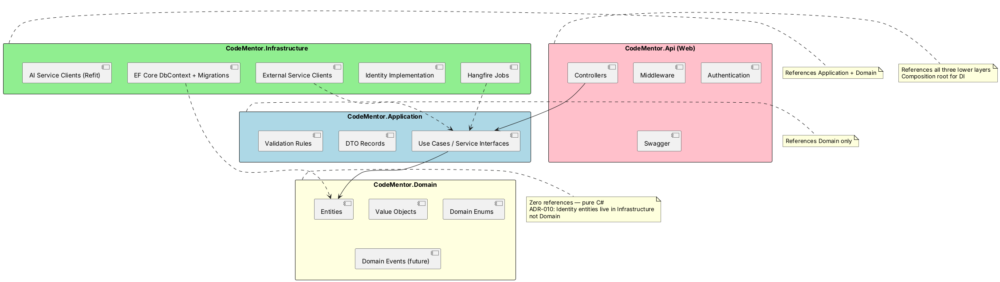
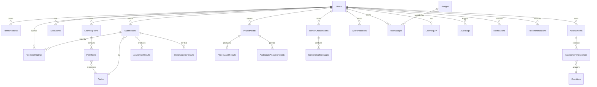
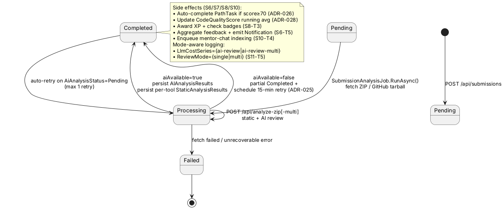
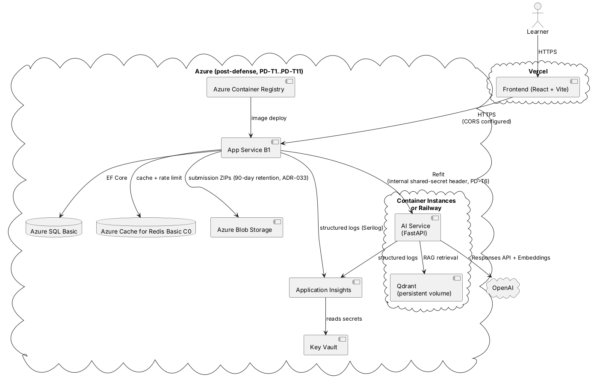

# Thesis Technical Appendix (S11-T15 / F13 / ADR-038)

This appendix consolidates the system-design + implementation-state
diagrams referenced in the main thesis document
([`project_details.md`](../project_details.md)). Generated at the close
of Sprint 11 — reflects the shipped MVP through Sprint 11 inclusive
(13 features, 38 ADRs).

When viewing in a Markdown renderer that supports PlantUML and Mermaid
inline (most modern viewers including VS Code preview, GitHub, GitLab),
the diagrams render directly. When exporting to PDF for submission,
each diagram block can be rendered separately via
`https://www.plantuml.com/plantuml/` or any local PlantUML installation.

---

## 1. Clean Architecture — backend layering

The .NET 10 backend follows Clean Architecture with three concentric layers:



**Verified by static analysis:**

- `Domain.csproj` has zero `ProjectReference` entries
- `Application.csproj` references only `Domain`
- `Infrastructure.csproj` references `Application` + `Domain`
- `Api.csproj` references all three

---

## 2. ERD — final entity-relationship diagram (post-Sprint 10)

23 entities across 7 domains. Sprint 11 ships no schema additions
(F13 is purely an opt-in code path; reuses existing `AIAnalysisResults`
table via the `PromptVersion` discriminator).



**Key columns added across Sprints 1–11:**

| Sprint | Entity / column | ADR | Rationale |
|---|---|---|---|
| 5 | `AIAnalysisResults.PromptVersion` | ADR-027 | Trace AI feedback rows back to prompt that produced them |
| 5 | `Submissions.AiAutoRetryCount` | ADR-025 | Separate auto-retry count from user-initiated `AttemptNumber` |
| 7 | `CodeQualityScores.*` | ADR-028 | Running average of AI per-category scores (separate from assessment SkillScores) |
| 9 | `ProjectAudits.*` + `ProjectAuditResults.*` + `AuditStaticAnalysisResults.*` | ADR-031..035 | F11 entity tree |
| 10 | `Submissions.MentorIndexedAt` + `ProjectAudits.MentorIndexedAt` | ADR-036 | Readiness gate for FE chat panel |
| 10 | `MentorChatSessions.*` + `MentorChatMessages.*` | ADR-036 | F12 entity tree, polymorphic `ScopeId` over Submissions/ProjectAudits |
| 11 | `AIAnalysisResults.PromptVersion = 'multi-agent.v1'` (or `.partial`) | ADR-037 | F13 multi-mode discriminator — no schema change, reuse existing column |

---

## 3. API reference

Authoritative source: Swagger at `http://localhost:5000/swagger` when
the backend runs in Development. The 14k+ JSON spec is exported per
release; below is the high-level catalog organized by feature.

### 3.1 Endpoint catalog (post-Sprint 11)

| Feature | Method | Path | Auth |
|---|---|---|---|
| F1 Auth | POST | `/api/auth/register` | none |
| F1 Auth | POST | `/api/auth/login` | none |
| F1 Auth | POST | `/api/auth/refresh` | none |
| F1 Auth | POST | `/api/auth/logout` | learner |
| F1 Auth | GET | `/api/auth/me` | learner |
| F1 Auth | PATCH | `/api/auth/me` | learner |
| F1 Auth | GET | `/api/auth/github/login` | none |
| F1 Auth | GET | `/api/auth/github/callback` | none |
| F2 Assessment | POST | `/api/assessments` | learner |
| F2 Assessment | POST | `/api/assessments/{id}/answers` | learner |
| F2 Assessment | GET | `/api/assessments/{id}` | learner |
| F2 Assessment | GET | `/api/assessments/me/latest` | learner |
| F2 Assessment | POST | `/api/assessments/{id}/abandon` | learner |
| F3 Path | GET | `/api/learning-paths/me/active` | learner |
| F3 Path | POST | `/api/learning-paths/me/tasks/{id}/start` | learner |
| F3 Path | POST | `/api/learning-paths/me/tasks/from-recommendation/{id}` | learner |
| F4 Tasks | GET | `/api/tasks` | learner |
| F4 Tasks | GET | `/api/tasks/{id}` | learner |
| F5 Submission | POST | `/api/submissions` | learner |
| F5 Submission | GET | `/api/submissions/{id}` | learner |
| F5 Submission | GET | `/api/submissions/me?page=&size=` | learner |
| F5 Submission | POST | `/api/submissions/{id}/retry` | learner |
| F5 Submission | POST | `/api/submissions/{id}/rating` | learner |
| F5 Submission | GET | `/api/submissions/{id}/rating` | learner |
| F6 Feedback | (consumed by submission detail; no separate endpoint) | | |
| F6 Notifications | GET | `/api/notifications/me` | learner |
| F6 Notifications | POST | `/api/notifications/{id}/read` | learner |
| F6 Notifications | POST | `/api/notifications/me/mark-all-read` | learner |
| F7 CV | GET | `/api/learning-cv/me` | learner |
| F7 CV | PATCH | `/api/learning-cv/me` | learner |
| F7 CV | GET | `/api/learning-cv/me/pdf` | learner |
| F7 CV | GET | `/api/public/cv/{slug}` | none |
| F7 Admin | GET | `/api/admin/dashboard` | admin |
| F7 Admin | various | `/api/admin/tasks/*` | admin |
| F7 Admin | various | `/api/admin/questions/*` | admin |
| F7 Admin | various | `/api/admin/users/*` | admin |
| SF1 Analytics | GET | `/api/analytics/me` | learner |
| SF2 Gamification | GET | `/api/gamification/me` | learner |
| SF2 Gamification | GET | `/api/gamification/badges` | learner |
| F11 Audit | POST | `/api/audits` | learner |
| F11 Audit | GET | `/api/audits/{id}` | learner |
| F11 Audit | GET | `/api/audits/{id}/report` | learner |
| F11 Audit | DELETE | `/api/audits/{id}` | learner |
| F11 Audit | GET | `/api/audits/me?page=&size=&status=` | learner |
| F11 Audit | POST | `/api/audits/{id}/retry` | learner |
| F12 Mentor Chat | GET | `/api/mentor-chat/{sessionId}` | learner |
| F12 Mentor Chat | POST | `/api/mentor-chat/sessions` | learner |
| F12 Mentor Chat | POST | `/api/mentor-chat/{sessionId}/messages` | learner (SSE) |
| F12 Mentor Chat | DELETE | `/api/mentor-chat/{sessionId}/messages` | learner |
| Health | GET | `/health` | none |
| Health | GET | `/ready` | none |
| Hangfire | UI | `/hangfire` | admin |

**F13 is opt-in via env var** — does not surface as a separate
backend endpoint. The AI service exposes:

| Path | Method | Purpose |
|---|---|---|
| `/api/ai-review` | POST | Single-prompt review (F6, ADR-022) |
| `/api/ai-review-multi` | POST | Multi-agent review (F13, ADR-037) |
| `/api/analyze-zip` | POST | Combined static + single AI |
| `/api/analyze-zip-multi` | POST | Combined static + multi-agent AI |
| `/api/project-audit` | POST | Audit pipeline (F11, ADR-034/035) |
| `/api/embeddings/upsert` | POST | Mentor-chat indexing (F12, ADR-036) |
| `/api/mentor-chat` | POST | Mentor-chat SSE stream (F12, ADR-036) |
| `/health` | GET | Liveness |

---

## 4. AI service architecture (multi-agent + RAG)

```plantuml
@startuml
skinparam defaultFontName "Inter"

actor Backend as "Backend\n(SubmissionAnalysisJob)"

package "AI Service (FastAPI)" {
  [analysis_orchestrator.py\n(static fan-out)] as static_orch
  [ai_reviewer.py\n(single-prompt)] as single
  [multi_agent.py\n(orchestrator)] as multi_orch

  package "Static Analyzers" {
    [ESLint] [Bandit] [Cppcheck] [PHPStan] [PMD] [Roslyn]
  }

  package "Multi-Agent (F13)" {
    [SecurityAgent] as sec
    [PerformanceAgent] as perf
    [ArchitectureAgent] as arch
  }

  [embeddings_indexer.py\n(F12)] as idx
  [mentor_chat.py\n(F12 RAG + SSE)] as chat
  [project_auditor.py\n(F11)] as audit
}

cloud "OpenAI" as openai {
  [gpt-5.1-codex-mini]
  [text-embedding-3-small]
}

database "Qdrant\n(F12 vector store)" as qdrant

' ---- Single-prompt path (F6) ----
Backend --> static_orch : POST /api/analyze-zip\n(or /api/ai-review)
static_orch --> ESLint
static_orch --> Bandit
static_orch --> Cppcheck
static_orch --> PHPStan
static_orch --> PMD
static_orch --> Roslyn
static_orch --> single : "review_code()"
single --> openai : Responses API\n(SYSTEM_PROMPT + 1 user prompt)

' ---- Multi-agent path (F13) ----
Backend --> multi_orch : POST /api/analyze-zip-multi\n(or /api/ai-review-multi)
multi_orch --> sec : asyncio.gather
multi_orch --> perf : asyncio.gather
multi_orch --> arch : asyncio.gather
sec --> openai : agent_security.v1.txt
perf --> openai : agent_performance.v1.txt
arch --> openai : agent_architecture.v1.txt
sec --> multi_orch : SecurityFindings
perf --> multi_orch : PerformanceFindings
arch --> multi_orch : ArchitectureFindings + Strengths/Weaknesses/Resources
note right of multi_orch
  Per-agent timeout: 90s
  Partial-failure: PromptVersion = "multi-agent.v1.partial"
  Token cost: ~2.2× single (ADR-037)
end note

' ---- F12 RAG path ----
Backend --> idx : POST /api/embeddings/upsert
idx --> openai : embed chunks
idx --> qdrant : upsert points (UUID5 deterministic IDs)

Backend --> chat : POST /api/mentor-chat (SSE)
chat --> qdrant : retrieve top-5
chat --> openai : Responses API streaming
note right of chat
  Raw-fallback mode when no chunks retrieved
  (ADR-036 — chat works even if Qdrant down)
end note

' ---- F11 Audit path ----
Backend --> audit : POST /api/project-audit
audit --> static_orch : same fan-out as F6
audit --> openai : project_audit.v1 prompt
@enduml
```

**Per-agent token budgets (ADR-037):**
- Single-prompt: 6k input + 2k output (one call)
- Multi-agent: 6k input + 1.5k output × 3 agents = 18k input + 4.5k output total
- ~2.2× single-prompt cost; default off in production

---

## 5. Submission analysis pipeline (Hangfire job state machine)



---

## 6. Domain decomposition (entities by domain)

| Domain | Entities | Tables |
|---|---|---|
| **Identity** | ApplicationUser, ApplicationRole, RefreshToken, OAuthToken | Users, Roles, UserRoles, RefreshTokens, OAuthTokens |
| **Assessments** | Question, Assessment, AssessmentResponse | Questions, Assessments, AssessmentResponses |
| **Skills** | SkillScore, CodeQualityScore | SkillScores, CodeQualityScores |
| **Tasks** | TaskItem, LearningPath, PathTask | Tasks, LearningPaths, PathTasks, TaskPrerequisites |
| **Submissions** | Submission, AIAnalysisResult, StaticAnalysisResult | Submissions, AIAnalysisResults, StaticAnalysisResults, FeedbackRatings, Recommendations |
| **ProjectAudits** | ProjectAudit, ProjectAuditResult, AuditStaticAnalysisResult | ProjectAudits, ProjectAuditResults, AuditStaticAnalysisResults |
| **MentorChat** | MentorChatSession, MentorChatMessage | MentorChatSessions, MentorChatMessages |
| **Gamification** | XpTransaction, Badge, UserBadge | XpTransactions, Badges, UserBadges |
| **LearningCV** | LearningCV | LearningCVs, LearningCVViewLog |
| **Notifications** | Notification | Notifications |
| **Audit** | AuditLog | AuditLogs |

---

## 7. Deployment diagram (post-defense Azure target per ADR-038)

The defense itself runs locally (ADR-038); the diagram below describes
the **post-defense** Azure target captured for the Future Work
appendix:



**Cost estimate (ADR-038 baseline):**
- App Service B1: ~$13/mo
- Azure SQL Basic: ~$5/mo
- Azure Cache for Redis Basic C0: ~$17/mo
- Blob: ~$1/mo for MVP traffic
- Container Instances (Qdrant + AI service): ~$5–10/mo
- **Total: ~$40/mo**, comfortably inside the Azure-for-Students $100 credit window for 2.5 months of post-defense hosting.

The local-defense path uses the same composition without the cloud
plane, replacing each Azure box with the corresponding docker-compose
service (mssql, redis, azurite, ai-service, qdrant, seq).

---

## 8. Reference: 38 ADRs at a glance

Full text in `docs/decisions.md`. Compact mapping:

| Range | Sprint | Theme |
|---|---|---|
| ADR-001..014 | 1 | Foundations: tech stack, identity, auth, deferred OAuth/rate-limit |
| ADR-015..019 | 3 | Learning path: scheduler, weakest-first selection, cache invalidation, safe markdown |
| ADR-020, ADR-021 | 4 | Submission pipeline: path-update rules, scheduler abstraction |
| ADR-022..025 | 5 | AI integration: endpoint rename, per-tool shape, graceful degradation, retry counter |
| ADR-026, ADR-027 | 6 | PathTask auto-completion threshold, prompt versioning + 5 PRD F6 score names |
| ADR-028 | 7 | CodeQualityScore axis (supersedes ADR-026 stance on submission scores into SkillScore) |
| ADR-029 | 8 | XP curve + 5 starter badges |
| ADR-030 | 8 | Reverted (Neon & Glass identity stays — not changed) |
| ADR-031..035 | 9 | F11 audit feature: separation, sprint renumbering, retention, distinct prompt, combined response |
| ADR-036 | 10 | F12 RAG mentor chat: Qdrant, raw-fallback, indexing job |
| ADR-037 | 11 | F13 multi-agent review: parallel agents, separate endpoint, prompt-version discriminator |
| ADR-038 | 11 | Defer Azure deploy to post-defense; defense runs locally |

---

**Generated:** 2026-05-08, Sprint 11 closing pass.
**Maintainer:** owner — update on each new ADR or schema migration.
