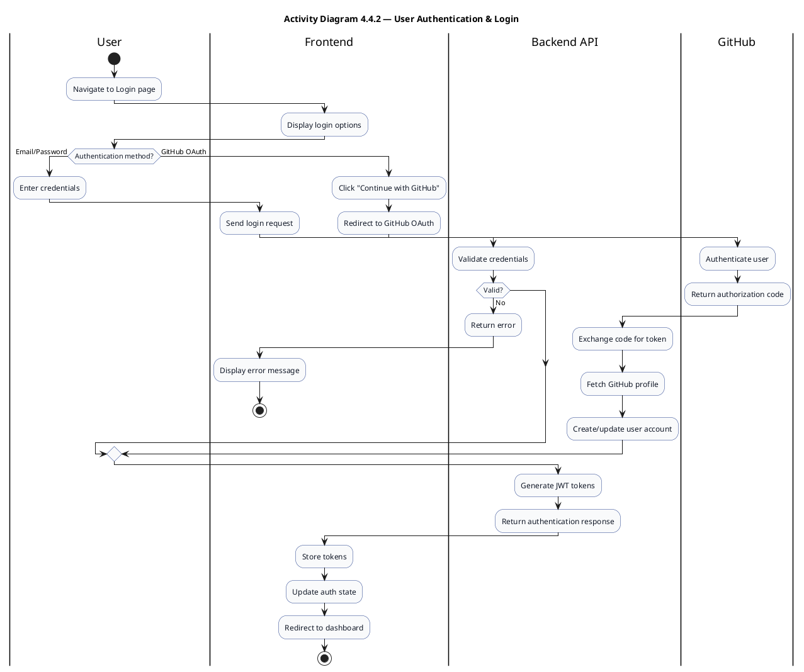
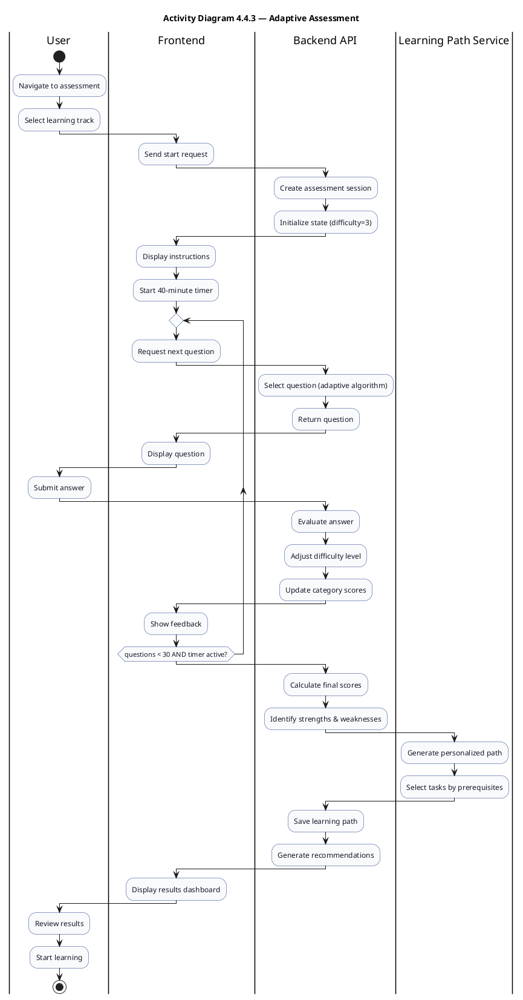
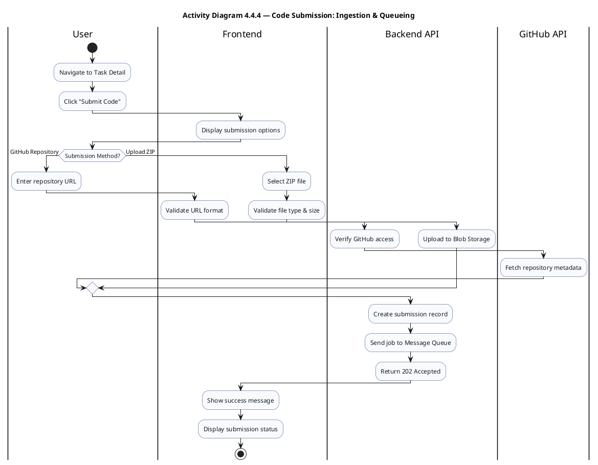
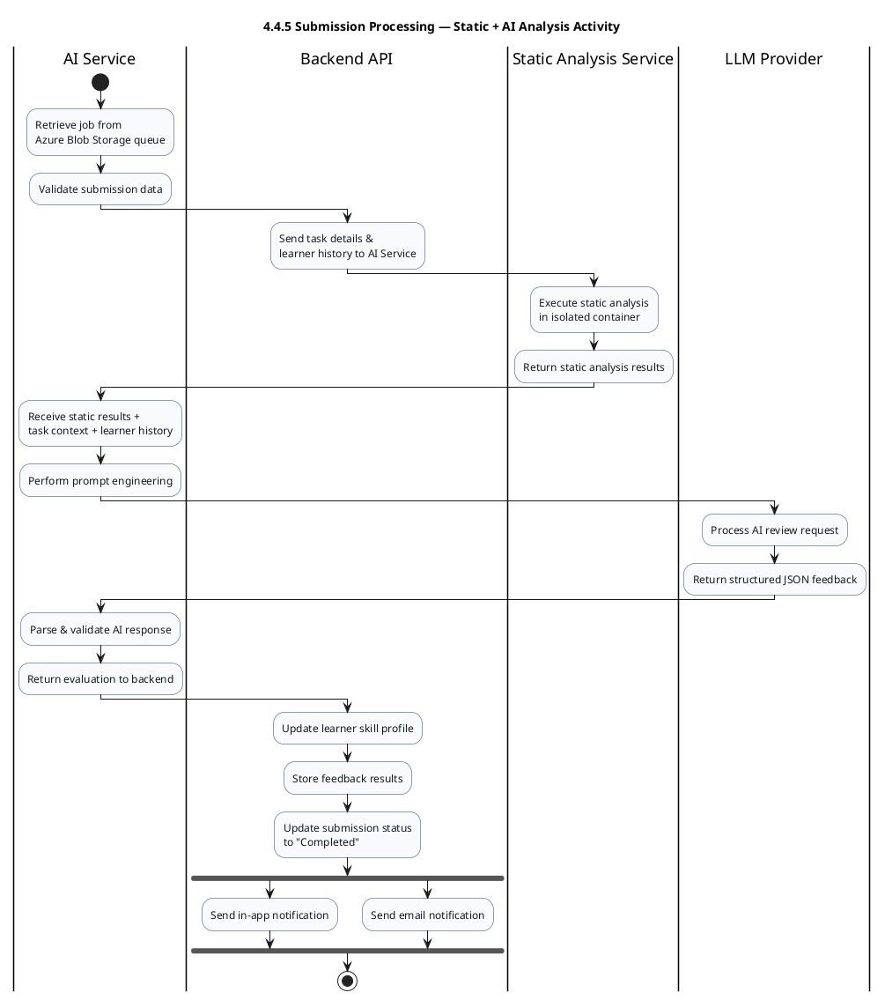
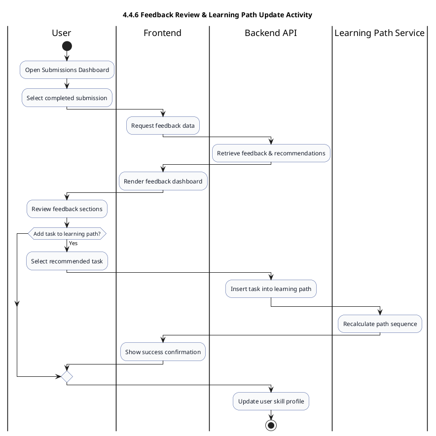
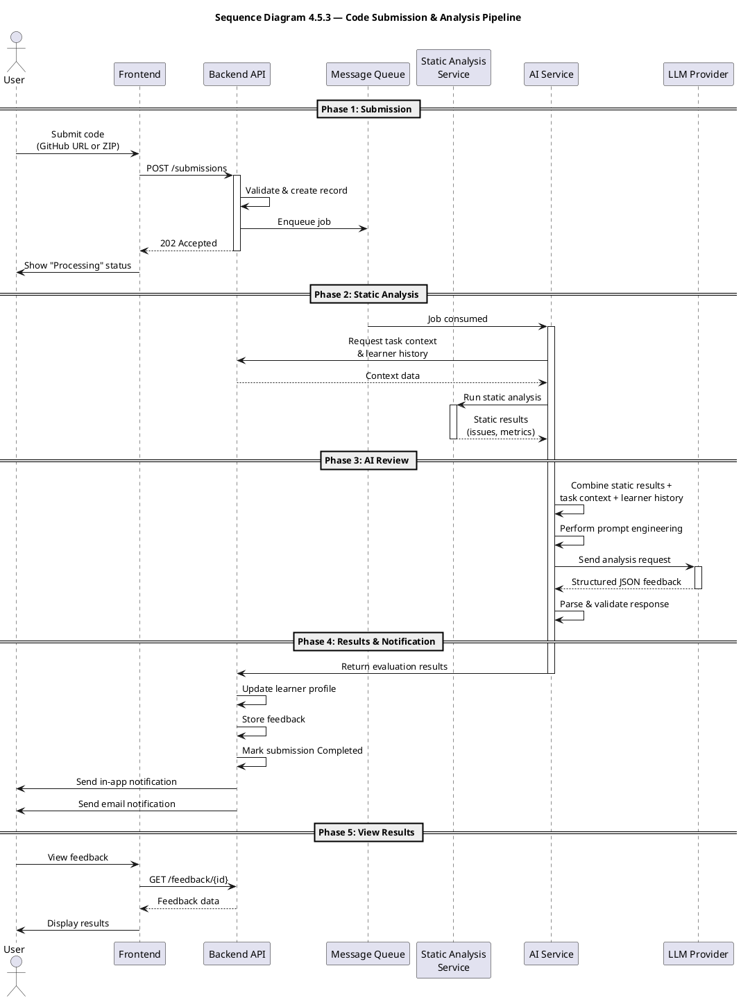

**AI-Powered Learning & Code Review Platform**

A senior project submitted partial fulfillment of the requirements for the degree of Bachelor of Computers and Artificial Intelligence.

**“Computer Science” Program, Benha 2026**

---

> ## Implementation Sync — Sprint 11 (2026-05-08)
>
> This doc was authored during planning. The implementation across Sprints 1–11
> logged **38 ADRs** capturing decisions and deviations. Read this preface first
> for material differences between the thesis text and the shipped MVP. Full
> ADR text: [`docs/decisions.md`](docs/decisions.md). Sprint progress:
> [`docs/progress.md`](docs/progress.md). The companion document
> [`project_details.md`](project_details.md) carries the full sync changelog
> and section-level deviation list — this preface is the compact version.
>
> ### Headline deviations
>
> 1. **Tech stack:** .NET 10 + Hangfire + Redis + SQL Server 2022 + Azurite + Seq + Qdrant + FastAPI. The architecture document at [`docs/architecture.md`](docs/architecture.md) is authoritative when this doc says otherwise.
> 2. **Score categories** (since Sprint 6 / ADR-027): `correctness / readability / security / performance / design`. Older names (`functionality`, `bestPractices`) are remapped at parse time for backward compatibility but the canonical contract is the 5 above.
> 3. **MVP feature count: 13** (was 10 in original thesis): F1–F10 + **F11 Project Audit** (added Sprint 9 / ADR-031) + **F12 RAG Mentor Chat** (added Sprint 10 / ADR-036) + **F13 Multi-Agent Code Review** (added Sprint 11 / ADR-037).
> 4. **Multi-agent review is opt-in via `AI_REVIEW_MODE` env var** (default `single`). Multi-agent path runs three specialist agents in parallel via `asyncio.gather` (security / performance / architecture), merged into the same response shape. Cost ≈2.2× single per ADR-037; default off in production.
> 5. **Mentor Chat** runs over a Qdrant vector store with `text-embedding-3-small` (1536 dims), SSE-streamed responses, raw-fallback mode when no chunks retrieved (ADR-036).
> 6. **Azure deployment is deferred to a Post-Defense slot** (ADR-038). Defense runs locally on the owner's laptop. The deployment plan is preserved as the post-graduation continuation backlog.
>
> The Future Work appendix at the end of this document consolidates everything
> consciously deferred (Azure deployment, full badge catalog, multi-provider AI,
> k8s, mobile, more tracks, …).
>
> **A complete section-by-section reconciliation pass is the carryover work
> with supervisors before defense rehearsal (S11-T7 owner-led). The skeleton
> (this preface + Future Work appendix) is in place; deeper edits land
> iteratively as supervisors flag specific text.**

---

**Under Supervision**

**Dr. Mostafa Elgendy**

**Eng. Fatma Ebrahim**

**Eng: Doaa Mohamed**

**Project Team Members**

> Ahmed Khaled Yassin Ahmed
> 
> 
> Eslam Emad Ebrahim Medny
> 
> Mohamed Ahmed Hassbo Ahmed
> 
> Mahmoud Ahmed Mostafa Abdelmoaty
> 
> Mahmoud Mohamed Mahmoud Abdelhamid
> 
> Omar Anwar Helmy Ahmed
> 
> Ziad Ahmed Mohamed Salem
> 

TABLE OF CONTENTS

[Declaration 5](about:blank#declaration)

[Acknowledgment 5](about:blank#acknowledgment)

[Abstract 5](about:blank#abstract)

[Chapter One: Project Introduction & Background 6](about:blank#chapter-one-project-introduction-background)

[1.1 Introduction 6](about:blank#introduction)

[1.2 Problem Definition 7](about:blank#problem-definition)

[**1.2.1 The Feedback Desert in Self-Learning** 7](about:blank#the-feedback-desert-in-self-learning)

[**1.2.2 The Prohibitive Cost Barrier of Bootcamps** 8](about:blank#the-prohibitive-cost-barrier-of-bootcamps)

[**1.2.3 The Scalability Challenge of Human Mentorship** 8](about:blank#the-scalability-challenge-of-human-mentorship)

[**1.2.4 The Lack of Credible Credentials** 8](about:blank#the-lack-of-credible-credentials)

[1.3 Proposed Solution 9](about:blank#proposed-solution)

[**1.3.1 Personalized, Adaptive Learning Path** 9](about:blank#personalized-adaptive-learning-path)

[**1.3.2 Multi-Layered AI Code Review** 9](about:blank#multi-layered-ai-code-review)

[**1.3.3 Shareable Learning CV** 9](about:blank#shareable-learning-cv)

[**1.3.4 Gamification and Engagement** 9](about:blank#gamification-and-engagement)

[1.4 Literature Review 10](about:blank#literature-review)

[**1.4.1 Competitor Landscape** 10](about:blank#competitor-landscape)

[**1.4.2 Feature Comparison Matrix** 11](about:blank#feature-comparison-matrix)

[**1.4.3 Strategic Competitive Advantages** 12](about:blank#strategic-competitive-advantages)

[1.5 Project Objectives 13](about:blank#project-objectives)

[**1.5.1 Primary Objective** 13](about:blank#primary-objective)

[**1.5.2 Secondary Objectives** 13](about:blank#secondary-objectives)

[**1.5.3 Long-Term Research Goals** 13](about:blank#long-term-research-goals)

[1.6 Scope of the Project 14](about:blank#scope-of-the-project)

[**1.6.1 Core Learning & Assessment Scope** 14](about:blank#core-learning-assessment-scope)

[**1.6.2 Code Analysis & Feedback Scope** 15](about:blank#code-analysis-feedback-scope)

[**1.6.3 Career & Progress Tracking Scope** 16](about:blank#career-progress-tracking-scope)

[1.7 Scope Exclusions and Constraints 16](about:blank#scope-exclusions-and-constraints)

[**1.7.1 Scope Exclusions** 17](about:blank#scope-exclusions)

[**1.7.2 Constraints** 18](about:blank#constraints)

[1.8 Project Methodology Overview 19](about:blank#project-methodology-overview)

[**1.8.1 Phased Rollout Strategy** 19](about:blank#phased-rollout-strategy)

[**1.8.2 Core Agile Practices** 19](about:blank#core-agile-practices)

[**1.8.3 Communication & Transparency** 20](about:blank#communication-transparency)

[Chapter Two: Project Management 20](about:blank#chapter-two-project-management)

[2.1 Project Organization 20](about:blank#project-organization)

[2.2 Risk Management 22](about:blank#risk-management)

[**2.2.1 Risk Assessment Approach** 22](about:blank#risk-assessment-approach)

[**2.2.2 Technical Risks — Matrix & Mitigations** 22](about:blank#technical-risks-matrix-mitigations)

[**2.2.3 Product Risks — Matrix & Mitigations** 25](about:blank#product-risks-matrix-mitigations)

[2.3 Project Communication Plan 26](about:blank#project-communication-plan)

[**2.3.1 Communication Structure** 26](about:blank#communication-structure)

[2.4 Work Breakdown Structure (WBS) 27](about:blank#work-breakdown-structure-wbs)

[**2.4.1 WBS Structure** 27](about:blank#wbs-structure)

[**2.4.2 Work Breakdown** 27](about:blank#work-breakdown)

[2.5 Time Management (PERT, Gantt Chart) 28](about:blank#time-management-pert-gantt-chart)

[**2.5.1 PERT Estimation** 28](about:blank#pert-estimation)

[**2.5.2 Network Diagram** 30](about:blank#network-diagram)

[**2.5.3 Gantt Chart** 31](about:blank#gantt-chart)

[Chapter Three: System Analysis 32](about:blank#chapter-three-system-analysis)

[3.1 Introduction 32](about:blank#introduction-1)

[3.2 Planning 32](about:blank#planning)

[3.3 System Requirements 34](about:blank#system-requirements)

[**3.3.1 Functional Requirements (FR)** 34](about:blank#functional-requirements-fr)

[**3.3.2 Non-Functional Requirements (NFR)** 42](about:blank#non-functional-requirements-nfr)

[3.5 Stakeholders 51](about:blank#stakeholders)

[**Primary Stakeholders (Direct Users)** 51](about:blank#primary-stakeholders-direct-users)

[**Secondary Stakeholders (Indirect Beneficiaries)** 51](about:blank#secondary-stakeholders-indirect-beneficiaries)

[**Stakeholder Analysis Matrix** 52](about:blank#stakeholder-analysis-matrix)

[Chapter Four: System Design 53](about:blank#chapter-four-system-design)

[4.1 Introduction 53](about:blank#introduction-2)

[4.2 Block Diagram 55](about:blank#block-diagram)

[**4.2.1 Overview** 55](about:blank#overview)

[**4.2.2 Block Diagram** 56](about:blank#block-diagram-1)

[**4.2.3 Explanation of the Block Diagram** 57](about:blank#explanation-of-the-block-diagram)

[4.3 Use Case Diagram 60](about:blank#use-case-diagram)

[**4.3.1 Overview** 60](about:blank#overview-1)

[**4.3.3 Use Case Diagram** 61](about:blank#use-case-diagram-1)

[4.4 Activity Diagrams 62](about:blank#activity-diagrams)

[**4.4.1 Overview** 62](about:blank#overview-2)

[**4.4.2 User Authentication & Login Activity** 63](about:blank#user-authentication-login-activity)

[**4.4.3 Adaptive Assessment Activity** 65](about:blank#adaptive-assessment-activity)

[**4.4.4 Code Submission — Ingestion & Queueing Activity** 67](about:blank#code-submission-ingestion-queueing-activity)

[**4.4.5 Submission Processing — Static + AI Analysis Activity** 68](about:blank#submission-processing-static-ai-analysis-activity)

[**4.4.6 Feedback Review & Learning Path Update Activity** 70](about:blank#feedback-review-learning-path-update-activity)

[**4.4.7 Activity Diagram: Admin Task & Analytics Management** 71](about:blank#activity-diagram-admin-task-analytics-management)

[4.5 Sequence Diagrams 72](about:blank#sequence-diagrams)

[**4.5.1 Sequence Diagram: User Authentication (Email/Password + GitHub OAuth)** 72](about:blank#sequence-diagram-user-authentication-emailpassword-github-oauth)

[**4.5.2 Sequence Diagram: Adaptive Assessment & Learning Path Generation** 74](about:blank#sequence-diagram-adaptive-assessment-learning-path-generation)

[**4.5.3 Sequence Diagram: Full Code Submission + Static & AI Analysis Pipeline** 76](about:blank#sequence-diagram-full-code-submission-static-ai-analysis-pipeline)

[**4.5.4 Sequence Diagram: Viewing AI Feedback & Adding Recommended Tasks** 78](about:blank#sequence-diagram-viewing-ai-feedback-adding-recommended-tasks)

[**4.5.5 Sequence Diagram: Viewing AI Feedback & Adding Recommended Tasks** 80](about:blank#sequence-diagram-viewing-ai-feedback-adding-recommended-tasks-1)

[**4.5.6 Sequence Diagram: Admin Management Flow** 82](about:blank#sequence-diagram-admin-management-flow)

[4.6 Context Diagram 85](about:blank#context-diagram)

[**4.6.1 Overview** 85](about:blank#overview-3)

[**4.6.2 Context Diagram** 86](about:blank#context-diagram-1)

[**4.6.3 Context Diagram Explanation** 86](about:blank#context-diagram-explanation)

[**4.7 Data Flow Diagrams (DFD)** 87](about:blank#data-flow-diagrams-dfd)

[**4.7.1 Overview** 87](about:blank#overview-4)

[**4.7.2 DFD Hierarchy** 87](about:blank#dfd-hierarchy)

[**4.7.4 Level 0 DFD – Context-Level Overview** 88](about:blank#level-0-dfd-context-level-overview)

[**4.7.5 Level 1 DFD – Major Subsystem Decomposition** 89](about:blank#level-1-dfd-major-subsystem-decomposition)

[4.8 Database Design 91](about:blank#database-design)

[**4.8.1 Overview** 91](about:blank#overview-5)

[**4.8.2 Entity-Relationship Diagram (ERD)** 92](about:blank#entity-relationship-diagram-erd)

[**4.8.4 Relationships & Cardinality** 93](about:blank#_Toc220861221)

[**4.8.5 Complete Database Statistics** 95](about:blank#_Toc220861222)

[**4.8.6 Data Integrity Constraints** 97](about:blank#_Toc220861223)

[**4.8.8 Security Considerations** 98](about:blank#_Toc220861224)

[Chapter Five: Methodology 99](about:blank#chapter-five-methodology)

# **Declaration**

We, hereby declare that this graduation project, titled **“AI-Powered Learning & Code Review Platform,”** is our own original work. All sources used have been appropriately cited and acknowledged. This work has not been previously submitted for any other degree or qualification at this or any other institution.

# **Acknowledgment**

We would like to express our deepest gratitude to our project supervisor, **Dr. Mostafa Elgendy**, for their invaluable guidance, patience, and expert advice throughout this project. Their insights and constructive feedback were instrumental in shaping our research and development.

We also extend our sincere thanks to our teaching assistant, **Eng. Fatma Ibrahim**, for her continuous support and follow-up.

We also extend our sincere thanks to the faculty and staff of the **Computer Science Department, Faculty of Computers and Artificial Intelligence at Benha University,** for providing the academic foundation and resources necessary to complete this work.

Our heartfelt appreciation goes to our fellow team members for the collaborative spirit, late-night brainstorming sessions, and shared dedication that made this project a reality. We are also grateful to our families and friends for their unwavering support and encouragement during this challenging journey.

# Abstract

The landscape of coding education is marked by a significant gap: aspiring developers, particularly self-learners and career-switchers, lack access to the personalized, expert-quality feedback that is crucial for achieving professional competency. High-cost coding bootcamps provide this mentorship but remain financially inaccessible to many, while generic online courses offer scalability but minimal feedback, creating a **“feedback desert.”** Furthermore, graduates of self-study lack the verifiable credentials employer’s trust.

This project introduces an **“AI-Powered Learning & Code Review Platform,”** an intelligent learning ecosystem designed to democratize expert-quality coding education. The platform addresses these challenges by providing a comprehensive journey from skill assessment to employment readiness.

Upon joining, learners undergo an adaptive assessment to determine their current skill level, which then generates a personalized learning track (e.g., Full Stack, Backend). Learners progress by building real-world projects and submitting their code via GitHub. The core of the solution is a **multi-layered analysis engine** that combines static analysis tools (like ESLint and SonarQube) with advanced AI models. This engine delivers instant, comprehensive feedback covering functionality, code quality, security, performance, and design patterns—emulating the review of a senior developer.

A key innovation is the **“Shareable Learning CV,”** a dynamic profile that showcases a learner’s verified skill progression, AI-assessed code quality, and project history, providing employers with credible, data-backed evidence of their capabilities. By combining the personalized attention of a bootcamp with the scalability and affordability of online education, this platform aims to bridge the learning gap and produce job-ready developers at a fraction of the traditional cost.

# **Chapter One: Project Introduction & Background**

## **1.1 Introduction**

Software development has become one of the most critical professional skills in the modern digital economy. As industries increasingly rely on software-driven systems, the demand for developers who can build secure, maintainable, and scalable applications continues to grow. Each year, millions of learners, including university students, self-taught developers, and career-switchers—enter the field seeking to acquire these skills.

Despite the abundance of online learning resources, a persistent gap remains between **basic coding literacy** and **professional software engineering competency**. While many learners can write code that functions correctly, far fewer develop the ability to produce production-quality software that meets industry standards for architecture, security, performance, and maintainability. Bridging this gap requires more than instructional content; it requires continuous evaluation, guided improvement, and credible validation of skill development.

This project introduces the **AI-Powered Learning & Code Review Platform**, an intelligent educational ecosystem designed to support learners throughout their progression from novice to job-ready developer. By combining adaptive assessment, automated multi-layered code review, and data-driven skill validation, the platform aims to deliver scalable, high-quality learning support that aligns closely with real-world software engineering practices.

This chapter establishes the academic and practical foundation of the project by defining the underlying problem, presenting the proposed solution, reviewing related work, and clarifying the project’s objectives and scope.

## **1.2 Problem Definition**

Although access to programming education has expanded significantly, several structural limitations continue to hinder learners’ progression toward professional competency. These limitations are systemic rather than incidental and affect the majority of self-directed and early-career developers.

### **1.2.1 The Feedback Desert in Self-Learning**

Self-taught developers predominantly rely on free or low-cost platforms such as YouTube, Udemy, Codecademy, and freeCodeCamp. While these platforms deliver structured curricula, they fundamentally fail to provide meaningful, individualized code evaluation—leaving learners without the expert feedback essential for developing industry-ready competencies.

**Critical Deficiencies:**

- **Absence of Quality Assurance:** Learners can verify functional correctness (i.e., whether code *executes*) but cannot assess adherence to best practices, identification of security vulnerabilities, or evaluation of readability and maintainability standards.
- **Generic Learning Pathways:** These platforms deliver one-size-fits-all curricula that fail to adapt to individual learner strengths, weaknesses, or progression rates. A student struggling with exception handling receives identical instruction as one who has already mastered the concept.
- **Overemphasis on Functionality Over Craftsmanship:** Algorithm-focused platforms like LeetCode and HackerRank prioritize functional correctness almost exclusively. Professional competencies—including software architecture, code structure, performance optimization, design patterns, and naming conventions—remain largely unaddressed.

This educational paradigm creates an environment where "knowing how to write code" diverges substantially from "knowing how to write professional, maintainable, industry-standard code."

### **1.2.2 The Prohibitive Cost Barrier of Bootcamps**

Coding bootcamps attempt to address the feedback deficit through human mentorship and comprehensive code review. However, their financial model introduces a severe accessibility barrier.

Programs typically cost between **$5,000 and $20,000+**, rendering them inaccessible to most learners—including students, self-funded individuals, and career-switchers. This cost structure transforms expert feedback from an educational resource into a socioeconomic privilege, thereby perpetuating educational inequality.

A vast population of motivated, capable learners remains unable to access the level of guidance necessary to transition successfully into professional software development roles.

### **1.2.3 The Scalability Challenge of Human Mentorship**

Human mentorship delivers high-quality coaching, but it **does not scale**:

- Mentors can support only small cohorts.
- Platforms like Exercism suffer from **24–72 hour review delays**, leading to:
    - Loss of momentum
    - Fragmented context
    - Inconsistent feedback
    - Slow learning cycles

These limitations prevent timely, reliable, and scalable expert review—something AI systems can uniquely provide.

### **1.2.4 The Lack of Credible Credentials**

Self-taught developers face significant challenges in demonstrating competence through mechanisms that employers recognize and trust.

**Credibility Gaps:**

- **Low-Value Certificates:** Course completion certificates indicate participation rather than mastery, offering minimal signal of actual competency.
- **Unverifiable Skill Claims:** Résumé statements such as "Proficient in React" remain subjective and unsupported by objective evidence.
- **Opaque Skill Development:** GitHub repositories showcase completed projects but fail to reveal the developer's learning trajectory, coding practices, problem-solving methodology, or skill evolution over time.

This credibility deficit forces self-taught learners to repeatedly "prove themselves" in competitive hiring processes, whereas graduates of structured bootcamp programs inherently benefit from institutionally validated credentials. This platform aims to eliminate this disparity by producing transparent, data-backed, verifiable learning credentials.

## **1.3 Proposed Solution**

To address these challenges, this project proposes an **AI-Powered Learning & Code Review Platform** that delivers expert-level guidance, adaptive learning, and verifiable credentials at scale. The platform is designed as an end-to-end learning system that integrates assessment, practice, feedback, and progress validation into a unified workflow.

The solution is structured around five core pillars.

### **1.3.1 Personalized, Adaptive Learning Path**

Learners begin with an automated assessment that evaluates their current proficiency across key development domains. Based on assessment results, the system generates a personalized learning path composed of practical, real-world projects. The learning path evolves dynamically as the learner progresses, continuously adjusting task recommendations to reflect demonstrated strengths and weaknesses.

### **1.3.2 Multi-Layered AI Code Review**

Submitted code undergoes a structured review pipeline consisting of:

- **Static Analysis:** Automated tools detect code smells, security issues, style violations, and maintainability concerns.
- **AI Contextual Analysis:** Advanced language models evaluate architectural decisions, logic correctness, performance implications, and adherence to best practices.

This layered approach enables comprehensive feedback that approximates senior-level code review while remaining scalable and responsive.

### **1.3.3 Shareable Learning CV**

The platform generates a dynamic **Learning CV** that aggregates validated skill metrics, historical performance data, and project-based evidence. Unlike traditional certificates, this CV provides employers with transparent, data-backed insight into a learner’s capabilities and progression over time.

### **1.3.4 Gamification and Engagement**

Gamification mechanisms—including badges, skill tiers, and learning streaks—are integrated to promote consistency and motivation. These elements reinforce progress visibility and support long-term engagement without compromising educational rigor.

## **1.4 Literature Review**

An extensive review of existing learning platforms, mentorship models, and AI-based development tools was conducted to contextualize the proposed system and identify gaps in current solutions.

### **1.4.1 Competitor Landscape**

Existing platforms can be broadly categorized into:

- **Algorithm-focused platforms** (e.g., LeetCode, HackerRank), which emphasize problem-solving but lack holistic code evaluation.
- **Interactive course platforms** (e.g., Codecademy, Scrimba), which provide guided instruction with limited adaptivity.
- **Mentorship-driven platforms** (e.g., Exercism), which offer personalized feedback but suffer from scalability constraints.
- **Coding bootcamps**, which provide comprehensive mentorship at high financial cost.
- **Professional AI code review tools**, which are not designed for structured learning or credentialing.

Each category addresses specific aspects of developer education but fails to provide an integrated, scalable solution that combines adaptive learning, deep feedback, and credential validation.

### **1.4.2 Feature Comparison Matrix**

| Feature | LC | HR | CC | SC | EX | BC | AI | ours |
| --- | --- | --- | --- | --- | --- | --- | --- | --- |
| AI Code Review | ✘ | ✘ | ✘ | ✘ | ✘ | 🔷 | ✔ | ✔ |
| Code Quality Check | ✘ | ✘ | ✘ | ✘ | ✔ | ✔ | ✔ | ✔ |
| Security Analysis | ✘ | ✘ | ✘ | ✘ | ✘ | 🔷 | ✔ | ✔ |
| Design Patterns Review | ✘ | ✘ | ✘ | ✘ | ✘ | 🔷 | ✔ | ✔ |
| Personalized Path | ✘ | ✘ | ✘ | ✘ | ✘ | 🔷 | ✘ | ✔ |
| Adaptive Learning | ✘ | ✘ | ✘ | ✘ | ✘ | ✘ | ✘ | ✔ |
| Instant Feedback | ✔ | ✔ | ✔ | ✔ | ✘ | ✘ | ✔ | ✔ |
| Progress Analytics | 🔷 | 🔷 | 🔷 | 🔷 | ✘ | ✔ | ✘ | ✔ |
| Learning CV | ✘ | ✘ | ✘ | ✘ | ✘ | ✔ | ✘ | ✔ |
| Community | ✔ | ✔ | ✔ | ✔ | ✔ | ✔ | ✘ | ✔ |
| Real-World Projects | ✘ | ✘ | 🔷 | 🔷 | ✘ | ✔ | ✘ | ✔ |
| Adaptive Assessment | ✘ | ✘ | ✘ | ✘ | ✘ | ✘ | ✘ | ✔ |
| AI Code Recommendations | ✘ | ✘ | ✘ | ✘ | ✘ | ✘ | ✘ | ✔ |
| 24/7 Availability | ✔ | ✔ | ✔ | ✔ | ✘ | ✘ | ✔ | ✔ |
| Gamification | 🔷 | 🔷 | 🔷 | 🔷 | 🔷 | 🔷 | ✘ | ✔ |
| GitHub Integration | 🔷 | 🔷 | 🔷 | 🔷 | ✔ | 🔷 | ✔ | ✔ |
| Beginner Friendly | ✘ | ✘ | ✔ | ✔ | 🔷 | 🔷 | ✘ | ✔ |
| Pricing Per month | **$35** | **$40** | **$20-40** | **$20-30** | **Free** | **$5k-20k** | **$20-10** | **$20-50** |

**Legend:**

- ✔ Full Support / Best-in-Class
- 🔷 Partial Support / Limited Functionality
- ✘ Not Available / Not Applicable
- LC = LeetCode, HR = HackerRank, CC = Codecademy Pro, SC = Scrimba, EX = Exercism, BC = Bootcamps, AI = AI Tools

### **1.4.3 Strategic Competitive Advantages**

This platform *does not replicate competitors*. Instead, it merges their strengths while addressing their weaknesses.

**Borrowed Strengths, Enhanced Through AI**

- **From Bootcamps:** Expert-level review → delivered instantly and affordably via AI
- **From Codecademy/Scrimba:** Beginner accessibility → combined with deep analysis and adaptivity
- **From Exercism:** Iterative improvement → without delays or inconsistent mentor quality
- **From LeetCode:** Instant validation → extended to real-world project evaluation

**Unique Value Proposition (UVP)**

“Bootcamp-quality mentorship powered by scalable AI, enabling learners to achieve verifiable, job-ready skills at a fraction of traditional cost.”

**Key Differentiators:**

- Multi-layer, AI + static code review
- Personalized, adaptive learning paths
- Verifiable Learning CV with data-backed skill metrics
- 24/7 expert-level feedback, fully scalable

## **1.5 Project Objectives**

The objective of this research is to design and develop an **AI-powered learning and code review platform** that bridges the gap between self-learning limitations and industry-required software engineering skills. The system aims to deliver scalable, personalized, and expert-grade feedback that empowers learners to progress toward professional competency.

The following are the primary research objectives, structured to align with the project’s technical, educational, and AI-driven goals.

### **1.5.1 Primary Objective**

To build an intelligent, end-to-end learning ecosystem that evaluates, guides, and improves learners’ coding abilities through automated assessments, adaptive learning paths, and multi-layer AI code review—achieving educational outcomes comparable to expert human mentorship but with scalability and affordability.

### **1.5.2 Secondary Objectives**

- Develop an adaptive learning framework tailored to individual learner profiles.
- Implement a multi-layer AI code review system combining static and contextual analysis.
- Produce verifiable, data-driven learning credentials.
- Enhance learner engagement through structured gamification.

### **1.5.3 Long-Term Research Goals**

- Explore advanced AI reasoning such as repository-level analysis, multi-file understanding, and behavioral code analysis.
- Integrate ML models that predict a learner’s future performance, recommending career paths or specialization tracks.
- Introduce AI-assisted project building (e.g., AI pair programming for guided development).
- Expand into testing, cloud engineering, DevOps, system design, and other advanced engineering fields.

## **1.6 Scope of the Project**

The scope of this project encompasses the complete **design, development, validation, and deployment** of the **AI-Powered Learning & Code Review Platform**. The system is implemented using an enterprise-grade technology stack comprising **ASP.NET Core**, **SQL Server**, **React**, and **Python-based AI microservices**.

The defined scope aligns directly with the platform’s core pedagogical and technical pillars, ensuring the delivery of a cohesive intelligent learning environment that integrates assessment, guided practice, automated feedback, and progress validation. The scope is structured into three primary domains: learning and assessment, code analysis and feedback, and career and progress tracking.

### **1.6.1 Core Learning & Assessment Scope**

**User Authentication System**

A secure authentication layer using [ASP.NET](http://asp.net/) Core Identity, supporting:

- Email/password registration and login
- GitHub OAuth for simplified onboarding
- JWT-based session and token handling
- Password reset via verified email

**Adaptive Assessment Engine**

A 30-question adaptive exam that adjusts difficulty in real time to determine accurate proficiency levels (Beginner → Intermediate → Advanced).

**Technical Implementation:**

- Bayesian inference / Item Response Theory (IRT)
- Real-time question difficulty selection
- Dashboard for scoring visualization

**Personalized Learning Tracks**

Tailored, project-based learning paths targeting real-world development roles, including:

- **Full Stack Development** (Beginner → Advanced)
- **Backend Specialist** (.NET, Node.js)
- **Frontend Specialist** (React ecosystem)
- **Python Developer** (Django, Flask, data workflows)
- **CS Fundamentals** (DSA, System Design)

**Task Library**

A curated repository of **40–50 practical, real-world tasks** covering:

- Architecture & design patterns
- RESTful API design and integration
- Debugging and error handling
- Unit, integration, and E2E testing
- Security best practices
- UI development and responsive design

**AI-Driven Recommendation Engine**

A machine-learning-based engine that analyzes performance trends and recommends targeted tasks addressing specific weaknesses, enabling more efficient progression.

### **1.6.2 Code Analysis & Feedback Scope**

**GitHub Integration**

Enables users to:

- Connect GitHub via OAuth
- Submit repositories for automated review
- Trigger the multi-layer review pipeline
- Track submission versions and history

**Static Code Analysis Engine**

Industry-standard static analysis covering maintainability, style, and security using:

- **ESLint:** JS/TS linting
- **Prettier:** Code formatting
- **SonarQube:** Code smells, complexity, maintainability
- **Bandit:** Python security scanning
- **Roslyn:** .NET analyzers and security validation

**Output:** Structured JSON with severity categories, locations, and recommended fixes.

**AI Code Review Engine**

Python FastAPI microservice powered by LLaMA 3 / GPT-4 for deep contextual review:

- Functional correctness & edge-case detection
- Readability and naming assessment
- Performance & complexity evaluation
- Security flaw identification
- Design pattern and anti-pattern detection
- Inline annotated suggestions with refactored examples
- Multi-submission comparison to track improvements

### **1.6.3 Career & Progress Tracking Scope**

**Advanced Analytics Dashboard**

Displays detailed insights including:

- **Skill-level breakdowns** (20+ domains)
- **Trend graphs** showing long-term improvement
- **Peer benchmarking** using anonymized aggregates
- **Submission analytics** (scores, rates, category performance)

**Shareable Learning CV**

A data-driven, verifiable, AI-backed professional profile with:

- Public shareable URL
- PDF export
- Structured project showcase with feedback summaries
- Verified skill scores and competency indicators
- Visual quality metrics (readability, maintainability, security, performance)

## **1.7 Scope Exclusions and Constraints**

This section clarifies the features and components **not included** in the current project scope, as well as the **technical and operational constraints** governing the platform’s implementation. These boundaries ensure focused development, prevent scope creep, and maintain alignment with the project’s core objectives.

### **1.7.1 Scope Exclusions**

The following elements are intentionally out of scope for the initial release. They may be considered in future expansion phases but are **not** part of Version 1:

**A. Payment & Billing Infrastructure**

- No subscription management backend (Stripe, PayPal, etc.)
- No invoicing, receipts, promo codes, or financial tracking
- Monetization logic is defined conceptually but not implemented at system level

**B. Live Mentorship or Human-In-The-Loop Review**

- No live chat with experts
- No video-based mentorship
- No hybrid AI–human review models
- All feedback is machine-generated

**C. Full AI Pair-Programming Capabilities**

- No real-time AI code generation inside the editor
- No autocomplete or IDE-like suggestions similar to GitHub Copilot
- No repository-level auto-refactoring

**D. Institutional/Enterprise Features**

- No dashboards for universities or companies
- No multi-tenant organizational accounts
- No admin-level analytics for cohorts or classrooms

**E. Advanced DevOps & Cloud Automation**

- No CI/CD pipeline automation
- No cloud infrastructure management tools
- No performance auto-scaling orchestrated by the project

**G. Broader Specialization Tracks**

Outside the initial software development focus, the platform does **not** include:

- DevOps professional tracks
- Cloud engineering certifications
- AI/ML engineering programs
- Data science bootcamp–style curricula

**H. Multilingual or Localization Support**

- English-only interface
- No RTL adjustments or multi-language content authoring

### **1.7.2 Constraints**

The platform is designed within several operational, architectural, and technical constraints that guide system behavior and define performance baselines.

**A. AI Model Limitations**

- LLM output depends on prompt structure and model capabilities
- Multi-file / repository-wide reasoning is limited to contextual windows
- Code execution or sandboxed dynamic analysis is not included (static + AI only)

**B. Performance & Response-Time Requirements**

- AI review must remain near-instant (few seconds)
- Static analysis should execute efficiently under high-load conditions
- API gateway must handle concurrent submissions with minimal latency

**C. Security & Data Protection**

- User code must be processed securely with strict input sanitization
- No remote code execution to avoid sandbox vulnerabilities
- OAuth and JWT must follow best practices to prevent token misuse

**D. Database & Storage Constraints**

- High-write workloads (frequent submissions, analytics logs)
- Relational SQL schema optimized with indexing and caching
- Storage constraints for storing historical submissions and AI feedback reports

**E. Frontend Limitations**

- Browser-based experience means no local runtime execution
- Heavy operations delegated to backend/AI microservices
- Editor limited to browser capabilities (syntax highlighting, linting, formatting)

**F. Scalability Constraints**

- Horizontal scaling limited to [ASP.NET](http://asp.net/) Core load balancers
- AI microservices constrained by available compute resources
- ML-based recommendations depend on future data volume

## 1.8 Project Methodology Overview

To manage the technical complexity and uncertainty inherent in AI-driven educational systems, the project adopts an **Agile development methodology** based on iterative, Scrum-inspired cycles. Agile was selected due to its suitability for systems involving evolving requirements, distributed architectures, and experimental AI components.

The development lifecycle is organized into three major phases, each defined by explicit objectives, deliverables, validation metrics, and risk checkpoints.

### **1.8.1 Phased Rollout Strategy**

The rollout strategy prioritizes validation of the platform’s **core learning-feedback loop** before expanding into engagement and retention features.

**Phase 1 — MVP: Core Loop Validation (Months 1–6)**

**Objective:**

Validate the end-to-end workflow:

**Assessment → Task Assignment → Code Submission → Multi-Layered Feedback**

**Key Deliverables include:** authentication services, adaptive assessment, learning path generation, code submission pipelines, static and AI analysis engines, and initial feedback delivery interfaces.

**Validation Metrics:** AI feedback quality, user journey completion rate, system reliability, and feedback latency.

**Decision Outcome:** GO / PIVOT / NO-GO

**Phase 2 — Engagement & Retention (Months 7–12)**

**Objective:**

Enhance learner retention through gamification, analytics, and advanced recommendations.

**Key Deliverables:** gamification systems, expanded analytics dashboards, extended task libraries, improved recommendation models, and a fully featured Learning CV.

**Success Metrics:** retention rates, engagement levels, task completion ratios, CV adoption, and monthly growth.

### **1.8.2 Core Agile Practices**

- Two-week sprint cycles
- Structured sprint planning, reviews, and retrospectives
- User stories with acceptance criteria and definitions of done
- Continuous feedback from beta users and analytics-driven iteration
- Incremental feature delivery validated through real usage

### **1.8.3 Communication & Transparency**

**Internal Communication**

- Daily standups and weekly synchronization meetings
- Shared collaboration tools (Notion, Jira, GitHub)

**External Communication**

- Bi-weekly meetings with academic supervisors
- Monthly public development updates
- Transparent changelogs and user newsletters

# **Chapter Two: Project Management**

## **2.1 Project Organization**

Effective project organization establishes the foundational structure for successful software development, ensuring clear role definition, efficient communication channels, and appropriate authority delegation. This section delineates the organizational hierarchy, individual responsibilities, and collaborative frameworks governing the **AI-Powered Learning & Code Review Platform** development initiative.

The project is conducted under the academic supervision of **Dr. Mostafa Elgendy** from the Faculty of Computers and Artificial Intelligence, Benha University. The development team employs an **Agile-Scrum methodology** to support iterative development cycles, transparent task ownership, and continuous stakeholder engagement throughout the project lifecycle.

**Backend & Database Team**

**Team Members:**

- *Omar Anwar Helmy Ahmed*
- *Mohammed Ahmed Hasabo Ahmed*

**Responsibilities:**

- Oversees the full project lifecycle and ensures alignment with objectives, scope, and deadlines
- Leads sprint planning, weekly meetings, and coordination with supervisors
- Manages the Work Breakdown Structure (WBS), timeline, and milestone tracking
- Designs and implements backend services using [ASP.NET](http://asp.net/) Core
- Develops SQL Server database schema, relationships, and EF Core models
- Builds core APIs for authentication, tasks, submissions, analytics, and Learning CV data
- Ensures performance, scalability, and security standards
- Oversees project documentation and quality assurance efforts

**Frontend Development Team**

**Team Members:**

- *Mahmoud Ahmed Mostafa Abdelmoaty*
- *Ahmed Khaled Yassin Ahmed*

**Responsibilities:**

- Develops the platform’s user interface using React (Next.js)
- Implements dashboards, assessment screens, task browser, and feedback views
- Ensures responsive layouts, accessibility standards, and intuitive user experience
- Integrates frontend views with backend APIs and authentication flows
- Optimizes performance and supports interface testing

**AI & Analysis Team**

**Team Members:**

- *Mahmoud Mohamed Mahmoud Abdelhamid*
- *Ziad Ahmed Mohamed Salem*

**Responsibilities:**

- Implements the Python-based AI microservice using FastAPI
- Conducts prompt engineering and ensures accurate, structured AI feedback
- Integrates static analysis tools (ESLint, Prettier, SonarQube, Bandit)
- Develops algorithms that combine AI output with static analysis metrics
- Evaluates AI models (LLaMA, GPT-based, Claude) to optimize accuracy and cost
- Maintains backend–AI communication pipelines

**DevOps Lead**

**Team Member:** E*slam Emad Ebrahim Madani*

**Responsibilities:**

- Support deployment and runtime configuration required for system testing and demonstration
- Manage basic containerization, environment setup, and service hosting
- Assist in monitoring system availability during evaluation phases

## **2.2 Risk Management**

Risk management ensures that potential issues are identified early and resolved before they affect project progress. Risks are evaluated based on **probability**, **impact**, and **overall severity**, and appropriate mitigation strategies are defined.

### **2.2.1 Risk Assessment Approach**

- **Review cadence:** Risk reviews at the end of each phase and ad-hoc if any critical alert is raised.
- Risks are categorized into **Technical**, **Product**, and **Operational** types
- Each risk is evaluated on:
    - **Probability:** Low / Medium / High
    - **Impact:** Low / Medium / High
    - **Severity:** Combined rating used for prioritization
- Risks are reviewed at major project milestones or when triggered by alerts
- Each risk is assigned an **owner responsible** for monitoring and mitigation

### **2.2.2 Technical Risks — Matrix & Mitigations**

**Risk Matrix (Technical)**

| ID | Risk | Probability | Impact | Severity | Owner |
| --- | --- | --- | --- | --- | --- |
| T-01 | AI provider outage or severe degradation | Medium → High | High | Critical | AI Lead |
| T-02 | Scalability bottlenecks (API, queues, DB) | Medium | High | Critical | Backend Lead |
| T-03 | Security breach / data leak (user data, source code) | Low → Medium | High | Critical | Backend Lead / PM |
| T-04 | Static analysis pipeline failures / container issues | Medium | Medium | Moderate | AI Lead |
| T-05 | Database performance or corruption | Medium | High | Critical | Backend Lead |
| T-06 | Third-party API limits (GitHub rate limits, OAuth) | Medium | Medium | Moderate | Backend Lead |
| T-07 | Code execution sandbox escape or unsafe execution | Low | High | Critical | AI Lead / Backend Lead |

**Risk Details & Mitigation (Technical)**

**T-01 — AI Provider Outage / Degradation**

**Why it matters:** The AI review is user-visible core functionality; outages break the primary feedback loop.

**Mitigations (technical + process):**

- **Provider-agnostic AI layer:** Abstract AI calls behind a service interface in .NET; support multiple providers (primary cloud LLM + secondary cloud + local Ollama for fallback).
- **Queued processing:** Use durable job queue (e.g., RabbitMQ / Azure Service Bus + Hangfire for .NET) so requests are retried and not lost.
- **Graceful degradation:** Show static-analysis results immediately; mark AI review as “pending” with estimated ETA.
- **SLA / Circuit breaker:** Implement circuit-breaker logic and fast-fail with exponential backoff.
- **Monitoring & Alerts:** Track AI latency/error rate; auto-notify the team and trigger fallback policies.

**Verification:** Automated smoke tests and synthetic requests every 5–10 minutes.

**T-02 — Scalability Bottlenecks**

**Why it matters:** Poor scaling results in high latency, timeouts, and poor UX.

**Mitigations:**

- **Containerized services & auto-scaling:** Host backend APIs and workers in containers (Azure App Service / AKS) with horizontal scaling policies.
- **Job sharding & backpressure:** Limit concurrent AI jobs per worker; implement rate limiting and backpressure in the API gateway.
- **DB scaling:** Use read replicas for analytics, partition large tables, optimize indices, and monitor connection pools. SQL Server configuration tuning (MAXDOP, tempdb) for heavy workloads.
- **Caching:** Use Redis / Azure Cache to reduce DB load for hot reads (dashboards, summaries).
- **Pre-production load testing:** k6/JMeter scenarios simulating expected and 10x load to find bottlenecks early.

**Verification:** Regular load-tests and performance benchmarks included in CI pipeline.

**T-03 — Security Breach / Data Leak**

**Why it matters:** Exposure of user credentials or private code is highly damaging legally and reputationally.

**Mitigations:**

- **Defense-in-depth:** Network-level security (VNet, firewalls), API gateway with rate limits, and RBAC.
- **Encryption:** TLS in transit, TDE / Always Encrypted for sensitive columns in SQL Server where applicable.
- **Secure auth:** [ASP.NET](http://asp.net/) Core Identity with MFA for admin accounts; JWT best-practices for sessions.
- **Secure coding & scanning:** Static code analysis, dependency scanning, and SAST/DAST in CI/CD.
- **Least privilege & secrets management:** Use Azure Key Vault or equivalent for secrets; enforce least privilege on DB and services.
- **Incident plan:** Formal incident response playbook, notification templates, and periodic tabletop exercises.

**Verification:** Quarterly security audits and penetration testing for critical releases.

**T-04 — Static Analysis Pipeline Failures**

**Mitigations:**

- Containerize each static tool with health checks; test containers in CI; fall back to simpler lint checks if the advanced tool fails; alert owner on failures.

**T-05 — Database Performance / Corruption**

**Mitigations:**

- Regular automated backups, point-in-time restore enabled (Azure SQL / SQL Server backup policies).
- DB migration scripts in CI with dry-run tests.
- Read replicas for analytics; archive old data periodically.
- Monitor long-running queries and index usage.

**T-06 — Third-party API Limits (GitHub)**

**Mitigations:**

- Use server-side OAuth tokens with caching and respectful rate usage.
- Implement webhooks rather than polling, and exponential backoff on failures.
- Provide UI guidance when user’s GitHub repo is private or large (reduce clone size).

**T-07 — Code Execution Sandbox Escape**

**Why it matters:** Running user code (if needed for dynamic checks) can be dangerous.

**Mitigations:**

- Isolate execution in hardened sandboxes (containerized, limited CPU/memory, seccomp/AppArmor) or use language-specific static-only checks where possible.
- No direct access from sandbox to internal network or storage.
- Timeouts, resource limits, and continuous monitoring of container behavior.
- Prefer instrumentation and static analysis over full execution when risk is unacceptable.

### **2.2.3 Product Risks — Matrix & Mitigations**

| ID | Risk | Probability | Impact | Severity | Owner |
| --- | --- | --- | --- | --- | --- |
| P-01 | Feature complexity overwhelms new users | Medium | High | Critical | PM / Frontend Lead |
| P-02 | AI feedback quality not meeting user expectations | High | High | Critical | AI Lead |
| P-03 | Strong competition / market noise | High | Medium | Moderate | PM / Growth |
| P-04 | Low initial user adoption | High | High | Critical | PM / Growth |
| P-05 | Pricing model mismatch | Medium | Medium | Moderate | PM / Product |

**P-01 — Feature Overwhelm**

**Mitigations:**

- Prioritize the core loop for Phase 1 and use progressive disclosure in the UI.
- Guided onboarding (interactive tutorial) and contextual help tips.
- Measure drop-off funnels and iterate UX using real user data.

**P-02 — AI Feedback Quality**

**Mitigations:**

- **Layered feedback:** Combine deterministic static analysis with LLM-based insights to improve reliability.
- **Prompt engineering & versioning:** Keep prompt templates in version control; A/B test prompt variations and track user ratings.
- **Human-in-the-loop for early users:** Manually review and correct AI outputs for the first N beta users and use the corrections to improve prompts/scoring.
- **Feedback telemetry:** Collect per-review ratings and comment metadata to prioritize problematic patterns.

**P-03 — Competition**

**Mitigations:**

- Focus on a clear UVP: instant, educative code feedback + shareable Learning CV.
- Niche targeting and content-led organic growth (technical blog posts, case studies).
- Rapid iteration on features that directly affect retention and referrals.

**P-04 — Low Adoption**

**Mitigations:**

- Generous free tier to reduce friction and demonstrate value.
- Early community building and partnerships (student groups, local meetups).
- Simplified onboarding flows and referral incentives.

**P-05 — Pricing**

**Mitigations:**

- Test pricing via controlled experiments and surveys; start with a low-cost Pro tier and iteratively adjust.
- Monitor conversion funnel and elasticity; offer scholarships or discounts for students.

## **2.3 Project Communication Plan**

Effective communication ensures coordination among team members and transparency with academic supervisors.

### **2.3.1 Communication Structure**

| Method | Purpose | Participants | Frequency |
| --- | --- | --- | --- |
| Daily Stand-up (Slack) | Quick status updates and identifying blockers | Entire team | Daily |
| Sprint Meeting (Online) | Review progress, plan next sprint | All team members | Weekly |
| Supervisor Meeting (Online/In-person) | Present progress and gather academic feedback | PM + Supervisors + Leads | Bi-weekly |
| Documentation Workspace (Notion) | Central hub for meeting notes, diagrams, and reports | Whole team | Continuous |
| GitHub | Source control, PR reviews, CI/CD | Developers | Continuous |

Primary tools include **Slack**, **GitHub**, **Notion**, and **Zoom**, selected for accessibility and academic suitability rather than enterprise complexity.

## **2.4 Work Breakdown Structure (WBS)**

The WBS provides hierarchical decomposition of project deliverables organized for task assignment, effort estimation, and progress monitoring.

### **2.4.1 WBS Structure**

**Four-level hierarchy:**

1. Project (root)
2. Major phases (MVP, Engagement, Monetization, Cross-Cutting)
3. Functional components/subsystems
4. Work packages and tasks

**Numbering:** Phase.Component.Task (e.g., 1.2.3)

### **2.4.2** Work Breakdown


## **2.5 Time Management (PERT, Gantt Chart)**

Time management is a critical element of project success, providing structured approaches to activity scheduling, dependency management, duration estimation, and timeline visualization. This section presents comprehensive time management artifacts including **PERT (Program Evaluation and Review Technique)**, **Network Diagrams**, **Critical Path Method (CPM)**, and **Gantt Charts**.

### **2.5.1 PERT Estimation**

PERT is a probabilistic scheduling technique that accounts for uncertainty in task duration by using three time estimates to calculate expected completion time.

**PERT Formula:**

$$Expected\ Time\ (ET) = \frac{O\  + \ 4R\  + \ P}{6}$$

Where:

- **O** = Optimistic time (best-case scenario, everything goes perfectly)
- **R** = Realistic time (most likely scenario, normal conditions)
- **P** = Pessimistic time (worst-case scenario, maximum delays)
- **ET** = Expected Time (weighted average)

**PERT Estimation Table for Major Activities:**

| No. | Task | Predecessor | O | M | P | ET |
| --- | --- | --- | --- | --- | --- | --- |
| 1. | Define Project Scope & Objectives | - | 5 | 7 | 9 | 7 |
| 1. | Requirements Analysis & Gathering | T1 | 10 | 14 | 18 | 14 |
| 1. | Risk identification & Mitigation planning | T2 | 4 | 8 | 12 | 8 |
| 1. | Develop Detailed Project Plan (WBS & Timeline) | T3 | 5 | 7 | 9 | 7 |
| 1. | Resource Allocation & Environment Setup | T4 | 3 | 5 | 7 | 5 |
| 1. | System Architecture & Database Design | T5 | 10 | 12 | 14 | 12 |
| 1. | Database Implementation & Optimization | T6 | 4 | 8 | 12 | 8 |
| 1. | Frontend UI & Development | T6 | 26 | 30 | 34 | 30 |
| 1. | Static Analysis & Tool Integration | T6 | 8 | 10 | 12 | 10 |
| 1. | AI Microservice Implementation | T6 | 8 | 10 | 12 | 10 |
| 1. | Backend API Development | T7 | 25 | 30 | 35 | 30 |
| 1. | Code Submission Pipeline Development | T9, T10, T11 | 9 | 12 | 15 | 12 |
| 1. | Testing plan creation & Test case development | T6 | 5 | 6 | 7 | 6 |
| 1. | Functional & Integration Testing | T8, T12, T13 | 6 | 8 | 10 | 8 |
| 1. | Bug fixing & refinement | T14 | 4 | 8 | 12 | 8 |
| 1. | Phase 1 review & Go/No-Go decision | T15 | 1 | 2 | 3 | 2 |
| 1. | Community Platform Development | T16 | 8 | 12 | 16 | 12 |
| 1. | Gamification System Implementation | T16 | 6 | 8 | 10 | 8 |
| 1. | Advanced Analytics Dashboard | T16 | 8 | 10 | 12 | 10 |
| 1. | Learning CV System Development | T16 | 8 | 10 | 12 | 10 |
| 1. | Learning Track Expansion (New Tracks) | T16 | 6 | 10 | 14 | 10 |
| 1. | Mock Payment Integration | T16 | 5 | 8 | 11 | 8 |
| 1. | Phase 2 Testing & UAT (User Acceptance Testing) | T17, T18, T19, T20, T21, T22 | 5 | 6 | 7 | 6 |
| 1. | Mobile Application Development | T16 | 20 | 25 | 30 | 25 |
| 1. | Infrastructure Scaling & Optimization | T23 | 5 | 6 | 7 | 6 |
| 1. | AI Cost Optimization | T23 | 5 | 6 | 7 | 6 |
| 1. | Phase 3 Testing & Production Launch | T24, T25, T26 | 6 | 9 | 12 | 9 |
| 1. | Final Documentation & Presentation Preparation | T27 | 8 | 12 | 16 | 12 |
| 1. | Project Defense & Final | T28 | 6 | 8 | 10 | 8 |

### **2.5.2 Network Diagram**

The Network Diagram (also known as Activity-on-Node diagram) illustrates the **logical relationships and dependencies** between project activities. It identifies:

- Sequential dependencies (Task B cannot start until Task A completes)
- Parallel activities (Tasks that can occur simultaneously)
- Critical path (longest sequence determining minimum project duration)

**Network Diagram Description:**

The following network diagram represents the major activity sequences across all three project phases. Each node represents a significant activity, and directed edges indicate precedence relationships. Activities are labeled with their task number and expected time (ET).


### **2.5.3 Gantt Chart**

The Gantt Chart provides a **visual timeline representation** of the project schedule, displaying:

- Task durations (horizontal bars)
- Start and end dates
- Dependencies between tasks
- Milestones and phase boundaries
- Resource allocation periods
- Current progress status

**Gantt Chart Description:**

The following Gantt chart visualizes the 18-month project timeline across all three phases. Each horizontal bar represents a task or work package, with its length proportional to estimated duration. Dependencies are shown through connecting lines, and critical path activities are highlighted in red for emphasis.


# **Chapter Three: System Analysis**

## **3.1 Introduction**

System analysis constitutes a critical phase in the software development lifecycle, serving as the bridge between problem identification and solution design. This chapter presents a comprehensive analytical examination of the **AI-Powered Learning & Code Review Platform**, establishing the foundational requirements, constraints, and specifications that govern subsequent design and implementation decisions.

The system analysis process encompasses multiple dimensions:

**Requirements Engineering:** Systematic elicitation, documentation, and validation of functional and non-functional requirements that define system capabilities and quality attributes.

**Stakeholder Analysis:** Identification and characterization of all individuals and entities affected by or influencing the platform's development and operation.

## **3.2 Planning**

The planning phase establishes the strategic direction and operational framework for the **AI-Powered Learning & Code Review Platform**. This section synthesizes insights from the problem definition (Chapter 1) and project management framework (Chapter 2) to define the analytical approach governing requirements elicitation and system specification.

**Planning Objectives:**

1. **Establish Requirements Baseline:** Define a complete, consistent, and validated set of functional and non-functional requirements serving as the contractual foundation for development.
2. **Identify System Boundaries:** Clearly delineate what functionality resides within the system scope versus external dependencies and integrations.
3. **Define Success Criteria:** Establish measurable acceptance criteria for each requirement, enabling objective verification during testing and validation.
4. **Prioritize Requirements:** Classify requirements by criticality (Must-Have, Should-Have, Could-Have, Won't-Have) to support phased delivery and resource allocation.
5. **Validate Feasibility:** Ensure all specified requirements are technically achievable within project constraints (timeline, budget, technology stack, team expertise).

**Analytical Methodology:**

The requirements analysis follows a **structured, iterative approach**:

**Phase 1 — Requirements Elicitation:**

- Stakeholder interviews with supervisors, potential users, and domain experts
- Analysis of competitor platforms to identify feature gaps and opportunities
- Review of academic literature on educational technology and AI-assisted learning
- User journey mapping to understand end-to-end workflows

**Phase 2 — Requirements Specification:**

- Documentation of functional requirements using structured use case narratives
- Definition of non-functional requirements using quality attribute scenarios
- Creation of requirements traceability matrix linking requirements to design elements

**Phase 3 — Requirements Validation:**

- Technical feasibility assessment by development team leads
- Consistency checking to identify conflicts or ambiguities
- Completeness verification ensuring all critical functionality is specified
- Supervisor review and approval

**Requirements Management:**

Requirements are managed as living artifacts throughout the project lifecycle:

- **Version Control:** All requirements documents maintained in Git with change tracking
- **Traceability:** Each requirement linked to design elements, test cases, and implementation artifacts
- **Change Management:** Formal change request process for requirement modifications post-baseline
- **Continuous Refinement:** Requirements elaborated incrementally as understanding deepens during development

**Alignment with Project Phases:**

The planning approach directly supports the three-phase development strategy:

- **Phase 1 (MVP):** Focus on core functional requirements enabling the basic learning loop
- **Phase 2 (Engagement):** Incorporate gamification, and analytics requirements
This phased approach balances the need for comprehensive planning with Agile principles of iterative refinement and responsiveness to emerging insights.

## **3.3 System Requirements**

System requirements define the complete set of capabilities, constraints, and quality attributes the platform must satisfy. Requirements are organized into two primary categories: **Functional Requirements (FR)** specifying observable system behaviors, and **Non-Functional Requirements (NFR)** defining quality characteristics and operational constraints.

### **3.3.1 Functional Requirements (FR)**

Functional requirements describe **what the system must do**—the specific features, operations, and behaviors users will observe and interact with. Each requirement is uniquely identified, precisely specified, and includes explicit acceptance criteria for validation.

**Requirements are organized by functional domain**, corresponding to the system's architectural modules:

**3.3.1.1 User Authentication & Profile Management**

| ID | Requirement | Description | Priority | Dependencies |
| --- | --- | --- | --- | --- |
| FR-AUTH-01 | **User Registration** | The system must allow users to register via email and password. The registration form will include full name, email, password, and optional GitHub username. Passwords are hashed using [**ASP.NET](http://asp.net/) Core Identity** and stored securely in **SQL Server**. | High | None |
| FR-AUTH-02 | **GitHub OAuth Login** | The system must support GitHub OAuth2 login to simplify onboarding and link code submissions automatically. OAuth tokens will be stored securely (encrypted) in the database. | High | GitHub API |
| FR-AUTH-03 | **Email Verification** | Upon registration, the system must send a verification email using the **SendGrid API** before account activation. | Medium | Notification Service |
| FR-AUTH-04 | **User Login** | Users must log in using either email/password or GitHub OAuth. JWT tokens will be issued by the .NET API for authenticated access. | High | [ASP.NET](http://asp.net/) Core Identity |
| FR-AUTH-05 | **Password Reset** | Users can request a password reset link, sent via email. The token is valid for 10 minutes. | Medium | Notification Service |
| FR-AUTH-06 | **Profile Management** | Users can update personal information (name, GitHub username, profile picture). Changes are reflected immediately in the database. | Medium | SQL Server |
| FR-AUTH-07 | **Role-Based Access Control (RBAC)** | The system must distinguish between **Admin** and **Learner** roles using claims-based authorization. | High | Identity Middleware |
| FR-AUTH-08 | **Session Management** | Active sessions are cached using **Redis**, with automatic expiration and rate limiting to prevent abuse. | Medium | Redis Cache |

**3.3.1.2 Adaptive Assessment Module**

| ID | Requirement | Description | Priority | Dependencies |
| --- | --- | --- | --- | --- |
| FR-ASSESS-01 | **Assessment Start** | A learner can begin an adaptive assessment (30 questions). The difficulty adjusts dynamically based on previous answers. | High | React Frontend, .NET API |
| FR-ASSESS-02 | **Question Bank** | The assessment uses a curated question bank stored in SQL Server. Questions are categorized by difficulty and topic. | High | SQL Server |
| FR-ASSESS-03 | **Adaptive Algorithm** | The backend (.NET) calculates difficulty progression and selects the next question dynamically based on prior performance. | High | Adaptive Logic Engine |
| FR-ASSESS-04 | **Timer & Auto-Submit** | The assessment is time-bound (e.g., 40 minutes). Unanswered questions are auto-submitted. | Medium | React Timer |
| FR-ASSESS-05 | **Score Calculation** | After completion, the system computes the learner’s skill level and stores the score, completion time, and performance summary in SQL Server. | High | .NET API |
| FR-ASSESS-06 | **AI Feedback Integration** | The **Python FastAPI** service may later enhance this module by generating personalized advice (“You’re strong in data structures, weak in security”). | Low (Phase 2) | FastAPI |
| FR-ASSESS-07 | **Result Visualization** | The frontend displays a result dashboard showing percentage scores and categorized skill levels. | High | React Charts |
| FR-ASSESS-08 | **Reattempt Policy** | Users can retake the assessment after 30 days . | Medium | .NET Policy Logic |

**3.3.1.3 Personalized Learning Path Management**

| ID | Requirement | Description | Priority | Dependencies |
| --- | --- | --- | --- | --- |
| FR-PATH-01 | **Path Generation** | Based on assessment results, the system generates a personalized learning path from predefined templates (Full Stack, Backend, etc.). | High | SQL Server, .NET |
| FR-PATH-02 | **Path Storage** | Each user’s path is stored in the LearningPath table, linked to their UserId. | High | SQL Server |
| FR-PATH-03 | **Task Linking** | Each path includes ordered tasks linked through the PathTasks junction table. | High | ERD: PathTasks |
| FR-PATH-04 | **Add Custom Task** | Users can manually add a recommended task from feedback to their learning path. | Medium | Recommendation Module |
| FR-PATH-05 | **Path Progress Tracking** | The backend calculates path progress (e.g., tasks completed / total tasks) and updates in real-time. | Medium | .NET Worker |
| FR-PATH-06 | **Modify Path** | Users can re-order or remove tasks within their path; updates are persisted. | Low | SQL Update Logic |

**3.3.1.4 Code Submission & Multi-Layered Analysis**

| ID | Requirement | Description | Priority | Dependencies |
| --- | --- | --- | --- | --- |
| FR-SUB-01 | Code Submission via GitHub Repository | Accept code submissions by linking GitHub repositories and automatically fetching contents via GitHub API. | High | GitHub REST API, OAuth token management |
| FR-SUB-02 | Code Submission via File Upload | Accept direct file uploads (ZIP) for users without GitHub or preferring local development. | High | Azure Blob Storage, file validation service |
| FR-SUB-03 | Submission Metadata Management | Capture and store metadata for each submission including status, timestamps, and task linkage. | High | SQL Server Submissions table, audit logging |
| FR-SUB-04 | Repository Fetching Service | Background Worker fetches GitHub repos or uploaded files, extracts them, and handles cleanup. | High | .NET Background Worker, GitHub API, temp file isolation |
| FR-SUB-05 | Static Analysis Execution | Execute ESLint, SonarQube, Bandit, etc. inside Docker containers with timeouts and resource limits. | High | Docker containers, static analysis tools |
| FR-SUB-06 | Static Analysis Results Storage | Normalize & store static analysis outputs in SQL for later aggregation with AI results. | High | SQL Server StaticAnalysis table, JSON parsing |
| FR-SUB-07 | AI Analysis Invocation | Worker sends code + static analysis results + task context to Python FastAPI microservice. | High | FastAPI AI microservice, HTTP schema validation |
| FR-SUB-08 | AI Analysis Results Storage | Store AI-generated scores, raw JSON feedback, timestamps, and model metadata. | High | SQL Server AIAnalysis table |
| FR-SUB-09 | Feedback Aggregation | Combine static + AI output into a unified report with insights and recommendations. | High | Report generation engine, frontend renderer |
| FR-SUB-10 | Job Queue Management | Manage queued submission processing with durable, reliable job handling. | High | Azure Service Bus or Hangfire |
| FR-SUB-11 | Version Control & Resubmission | Support multiple attempts per task and track version history and improvement. | Medium | SQL optimization, diff comparison algorithms |
| FR-SUB-12 | Submission Status Tracking & Notifications | Provide real-time updates, notifications, and fail/retry options. | Medium | Email service, notification system, status polling API |

**3.3.1.5 Feedback, Recommendation & Resource Engine**

| ID | Requirement | Description | Priority | Dependencies |
| --- | --- | --- | --- | --- |
| FR-FEED-01 | Structured Feedback Generation | AI microservice generates structured educational feedback as JSON with scores, strengths, weaknesses, and recommendations. | High | AI prompt engineering, output validation service |
| FR-FEED-02 | Feedback Report Rendering | Frontend renders feedback in a clear, organized, interactive interface with actionable insights. | High | React components, Prism.js syntax highlighting |
| FR-FEED-03 | Task Recommendations | System generates 3–5 task recommendations based on skill gaps and stores them per submission. | High | Task database, AI recommendation logic, Recommendations table |
| FR-FEED-04 | Learning Resource Links | Provide curated learning resources tailored to weaknesses, stored and categorized by topic. | High | AI resource recommendation logic, Resources table, link validation service |
| FR-FEED-05 | Feedback Quality Rating | Collect user ratings and comments on feedback quality to improve AI prompts continuously. | Medium | Rating UI components, analytics database |
| FR-FEED-06 | Notification Delivery | Notify users when analysis completes via email, push, and in-app notifications. | Medium | SendGrid email service, notification templates, mobile push service |

**3.3.1.6 Gamification, Analytics & Learning CV**

| ID | Requirement | Description | Priority | Dependencies |
| --- | --- | --- | --- | --- |
| FR-GAME-01 | Achievement Badge System | Award badges for milestones to boost engagement and skill development. | Medium | Badge database, achievement tracking logic, UI badge components |
| FR-GAME-02 | Learning Streak Tracking | Track daily/weekly learning streaks and reward consistent activity. | Medium | Daily cron job, streak calculation service, timezone management |
| FR-GAME-03 | Experience Points (XP) & Level Progression | Award XP for activities and enable users to progress through skill levels. | Medium | XP calculation rules, level thresholds, database schema |
| FR-GAME-04 | Advanced Analytics Dashboard | Provide analytics visualizing skill development, trends, and performance comparisons. | High | Charting library, analytics aggregation service, PDF export tools |
| FR-GAME-05 | Shareable Learning CV – Core Functionality | Generate dynamic CVs showcasing verified skills, project history, and progress. | High | CV generation service, URL routing, privacy management |
| FR-GAME-06 | Learning CV – PDF Export | Allow users to export a professional PDF version of their Learning CV. | Medium | PDF generation library, cloud storage |
| FR-GAME-07 | Learning CV – Privacy Controls | Provide granular privacy settings to manage CV visibility and access. | Low | Authorization middleware, access logging |

**3.3.1.7 Administrative Functions**

| ID | Requirement | Description | Priority | Dependencies |
| --- | --- | --- | --- | --- |
| FR-ADMIN-01 | User Management | Provide comprehensive user management capabilities including viewing, editing, deactivating, and auditing users. | High | Admin panel UI, authorization middleware, audit logging |
| FR-ADMIN-02 | Task Library Management | Enable administrators to create, edit, organize, version, preview, and import/export learning tasks. | High | Admin panel, rich text editor, database schema |
| FR-ADMIN-03 | Learning Track Management | Allow administrators to define learning tracks, order tasks, visualize dependencies, and manage track lifecycle. | High | Admin panel, drag-and-drop library, visualization component |
| FR-ADMIN-04 | Analytics Dashboard | Provide platform analytics including user metrics, engagement, performance, and financial reporting. | Medium | Analytics aggregation service, charting library, alerting system |
| FR-ADMIN-05 | Content Moderation Queue | Offer a centralized moderation interface for reviewing and acting on flagged community content. | Low | Moderation UI, authorization system, email service |
| FR-ADMIN-06 | System Configuration Management | Allow administrators to configure platform settings, manage AI models, and track configuration history. | Low | Configuration management service, database schema |
| FR-ADMIN-07 | System Health Monitoring | Provide real-time health metrics, alerts, and historical trends for operational oversight. | Medium | Azure Application Insights, monitoring dashboards, alerting infrastructure |

### **3.3.2 Non-Functional Requirements (NFR)**

Non-functional requirements define the quality attributes, operational constraints, and system characteristics that govern **how** the platform performs its functions. These requirements are organized by quality attribute category following the ISO/IEC 25010 quality model.

**3.3.2.1 Performance Requirements**

| ID | Requirement | Description | Target Metrics |
| --- | --- | --- | --- |
| NFR-PERF-01 | API Response Time | Core API endpoints must remain responsive under normal and peak load conditions. | Read: ≤200ms (p95), Write: ≤500ms (p95), Complex queries: ≤1000ms (p95) |
| NFR-PERF-02 | Code Analysis Processing Time | Full code analysis pipeline (static + AI) must complete within acceptable time limits. | Static ≤3 min, AI ≤2 min, Total ≤5 min typical / ≤10 min max |
| NFR-PERF-03 | Database Query Performance | SQL queries must be optimized through indexing and proper querying strategies. | Simple: ≤50ms (p95), Joins: ≤200ms (p95), Aggregations: ≤500ms (p95), Full-text: ≤300ms (p95) |
| NFR-PERF-04 | Frontend Page Load Time | Frontend must load quickly and remain visually stable for a pleasant UX. | FCP ≤1.5s, LCP ≤2.5s, TTI ≤3s, CLS ≤0.1 |
| NFR-PERF-05 | Concurrent User Capacity | System must handle increasing numbers of simultaneous active users smoothly. | Phase 1: 100 users, Phase 2: 500 users, Phase 3: 2000+ users |
| NFR-PERF-06 | Cache Hit Ratio | Frequently accessed data must be served from cache to reduce DB load. | Session ≥90%, Profiles ≥70%, Task metadata ≥80% |

**3.3.2.2 Scalability Requirements**

| ID | Requirement | Description | Scaling Strategy |
| --- | --- | --- | --- |
| NFR-SCAL-01 | Horizontal API Scaling | Backend API must support horizontal scaling via stateless design and load balancing. | Auto-scale when CPU ≥75% or queue depth ≥50; 2–10 instances (Phase 1–2), unlimited Phase 3 |
| NFR-SCAL-02 | Background Worker Scaling | Worker service must scale to handle increased submission volume. | Scale-out when queue depth ≥20; ≥5 parallel jobs per instance; up to 20 workers |
| NFR-SCAL-03 | Database Scalability | SQL Server must scale using read replicas, connection pooling, and table partitioning. | Read replicas for analytics; monthly partitioning when >1M records; pool size 20–200 |
| NFR-SCAL-04 | Storage Scalability | Blob storage must scale elastically with no capacity limits. | Unlimited Azure Blob capacity; file limit 50MB; auto-tiering based on usage |
| NFR-SCAL-05 | Concurrent User Scaling | System must support large increases in concurrent learners. | Phase 1: 100 users, Phase 2: 500 users, Phase 3: 2000+ users |
| NFR-SCAL-06 | API Scale-Out Time | Scaling events should occur quickly to avoid backlog buildup. | Scale-out time ≤3 minutes |
| NFR-SCAL-07 | Worker Queue Throughput | Queue processing must remain stable during peak hours. | Maintain queue at <100 pending jobs during load spikes |

**3.3.2.3 Availability & Reliability Requirements**

| ID | Requirement | Description | Target Metrics |
| --- | --- | --- | --- |
| NFR-AVAIL-01 | System Uptime | Platform must maintain high availability for global learners. | ≥ 99.5% monthly uptime |
| NFR-AVAIL-02 | Graceful Degradation | System continues core functionality even when dependent services fail. | AI failure → show static analysis; Email failure → queue; Cache failure → fallback to DB |
| NFR-AVAIL-03 | Data Backup & Recovery | Critical data must be backed up and recoverable within strict time objectives. | RPO ≤ 1 hour; RTO ≤ 4 hours; Daily full + 6-hour incremental backups |
| NFR-AVAIL-04 | Job Retry Logic | Background jobs must retry automatically upon transient failures. | 3 retries with exponential backoff (1m → 5m → 15m) |
| NFR-AVAIL-05 | Disaster Recovery | Platform must recover from major cloud outages with minimal downtime. | Full restore within ≤ 4 hours |
| NFR-AVAIL-06 | Queue Persistence | No job should be lost during worker restarts or failures. | Durable queues (Azure Service Bus Dead-letter support) |
| NFR-AVAIL-07 | Maintenance Windows | Maintenance must not disrupt global users and should be communicated early. | Scheduled 7 days ahead, 2–4 AM UTC window |

**3.3.2.4 Security Requirements**

| ID | Requirement | Description | Compliance / Control |
| --- | --- | --- | --- |
| NFR-SEC-01 | Authentication Security | Authentication must follow industry-standard security practices. | PBKDF2 (100k iterations), JWT RS256, MFA for admins |
| NFR-SEC-02 | Authorization & Access Control | Role-based access must restrict all sensitive operations. | RBAC (Learner/Admin), claims-based access control |
| NFR-SEC-03 | Data Encryption | All sensitive data encrypted at rest and in transit. | TLS 1.3, SQL TDE, AES-256, Azure Key Vault |
| NFR-SEC-04 | Input Validation & Sanitization | Prevent injection attacks via strict validation. | FluentValidation, XSS escaping, CSRF tokens |
| NFR-SEC-05 | Secure File Handling | Uploaded files must be scanned and isolated securely. | MIME validation, ClamAV scan, sandbox execution |
| NFR-SEC-06 | Rate Limiting & Abuse Prevention | Prevent brute-force and DoS attacks. | Redis sliding-window limiter (100 req/min), 5 auth attempts/15m |
| NFR-SEC-07 | OAuth Token Protection | Protect GitHub OAuth tokens from exposure. | AES-256 encrypted storage via Key Vault |
| NFR-SEC-08 | Security Logging & Monitoring | Log all high-risk actions for audit & detection. | Azure Log Analytics + SIEM alerts |
| NFR-SEC-09 | Secure API Practices | APIs must follow secure communication and error-handling guidelines. | HTTPS-only, no sensitive data in error responses |
| NFR-SEC-10 | AI Output Safety | AI responses must be sanitized for safety and compliance. | FastAPI output filtering layer |

**3.3.2.5 Usability & Accessibility Requirements**

| ID | Requirement | Description | Compliance |
| --- | --- | --- | --- |
| NFR-UX-01 | Responsive Design | Platform must be fully responsive across mobile, tablet, and desktop. | WCAG 2.1 AA |
| NFR-UX-02 | Accessibility Compliance | Interface must support accessible use for users with disabilities. | Screen readers, ARIA labels, keyboard navigation |
| NFR-UX-03 | Intuitive Navigation | Clear layouts, breadcrumbs, and menus must simplify task flows. | UX best practices |
| NFR-UX-04 | Onboarding Experience | New users must be guided smoothly through platform features. | Interactive tutorial + contextual tooltips |
| NFR-UX-05 | Error Handling & Feedback | Users must receive clear, actionable error and success messages. | Inline errors + global error boundaries |
| NFR-UX-06 | Localization Readiness | System must be prepared for multilingual UI support. | i18next + externalized strings |
| NFR-UX-07 | Mobile App Usability | Mobile UI must be optimized for touch interactions and small screens. | iOS/Android platform guidelines |
| NFR-UX-08 | Loading & State Indicators | Provide consistent loading indicators for slow operations. | Spinners, skeleton loaders |

**3.3.2.6 Maintainability & Extensibility Requirements**

| ID | Requirement | Description | Implementation Standard |
| --- | --- | --- | --- |
| NFR-MAIN-01 | Code Architecture | System must follow clean, modular architecture with clear separation of concerns. | .NET Clean Architecture (Domain → Application → Infrastructure → API) |
| NFR-MAIN-02 | Code Quality Standards | Code must follow strict quality standards and best practices. | Linters, cyclomatic complexity <15, <5% duplication |
| NFR-MAIN-03 | Automated Testing Coverage | Maintain comprehensive automated tests for reliability and refactoring safety. | ≥80% unit test coverage, integration + E2E tests |
| NFR-MAIN-04 | API Documentation | All APIs must be fully documented and explorable interactively. | Swagger/OpenAPI auto-generation |
| NFR-MAIN-05 | Version Control Strategy | Follow structured branching and review practices to ensure code quality. | Git Flow + protected branches + PR approvals |
| NFR-MAIN-06 | CI/CD Pipeline | Automated pipelines must handle build, test, and deployment workflows. | GitHub Actions CI/CD workflow |
| NFR-MAIN-07 | Logging & Observability | System must provide deep visibility into logs, performance, and tracing. | Azure App Insights + structured JSON logs |
| NFR-MAIN-08 | AI Model Abstraction | AI integration must support provider swapping with zero refactoring. | Provider interface + adapter pattern |
| NFR-MAIN-09 | Database Migration Management | Schema changes must be safe, reversible, and version-controlled. | EF Core Migrations + rollback scripts |
| NFR-MAIN-10 | Documentation Maintenance | Documentation must remain accurate and updated throughout development. | Living documentation via Notion + quarterly audits |

**3.3.2.7 Interoperability & Integration Requirements**

| ID | Requirement | Description | Integration Target |
| --- | --- | --- | --- |
| NFR-INT-01 | RESTful API Standards | Backend APIs must follow REST principles for cross-platform compatibility. | REST + JSON + API versioning |
| NFR-INT-02 | Third-Party Service Integration | System must integrate securely with GitHub, SendGrid, Stripe, and others. | GitHub API, SendGrid, Stripe (Phase 3), FCM |
| NFR-INT-03 | Webhook Support | System must process external webhook events reliably and securely. | GitHub webhooks, Stripe events |
| NFR-INT-04 | Data Export & Import | Users/admins must export/import data in standard formats. | JSON, CSV, PDF exports |
| NFR-INT-05 | AI Service Communication | .NET backend must interact seamlessly with Python FastAPI AI service. | Secure internal HTTPS API |
| NFR-INT-06 | Storage Integration | Platform must use cloud blob storage for large files and reports. | Azure Blob Storage (private SAS URLs) |
| NFR-INT-07 | Queue-Based Processing | API and Worker communicate asynchronously using message queues. | Azure Service Bus queues/topics |
| NFR-INT-08 | Monitoring Integration | Centralized logs/metrics collected from all microservices. | Azure App Insights + Azure Monitor |

**3.3.2.8 Compliance & Legal Requirements**

| ID | Requirement | Description | Standard / Reference |
| --- | --- | --- | --- |
| NFR-COMP-01 | GDPR Compliance | Users must be able to access, export, delete, and control their personal data. | GDPR Articles 15–17 |
| NFR-COMP-02 | Data Retention & Deletion | User data must be retained and deleted according to legal and platform policies. | GDPR + ISO 27001 |
| NFR-COMP-03 | Intellectual Property Protection | User-submitted code must remain private and never used for AI training without consent. | IP Compliance Policy |
| NFR-COMP-04 | AI Ethics & Transparency | All AI feedback must include clear disclosure and adhere to ethical guidelines. | AI Ethics Framework |
| NFR-COMP-05 | Accessibility Compliance | Platform must follow accessibility standards to support users with disabilities. | WCAG 2.1 AA + Section 508 |
| NFR-COMP-06 | Cookie & Privacy Policy | Clear privacy and cookie policies must be provided with user consent controls. | GDPR Cookie Directive |
| NFR-COMP-07 | Audit Logging | All admin changes and sensitive user actions must be logged for accountability. | ISO 27001 Logging Standards |

**3.3.2.9 Cost & Resource Optimization Requirements**

| ID | Requirement | Description | Cost Strategy |
| --- | --- | --- | --- |
| NFR-COST-01 | Cloud Resource Optimization | Cloud infrastructure must be cost-efficient without affecting performance. | Auto-scale down off-peak, reserved instances, right-sizing, storage tiering |
| NFR-COST-02 | AI Token Optimization | AI usage must be optimized to reduce token consumption and API costs. | Prompt shortening, response length limits, caching, batch processing |
| NFR-COST-03 | Database Cost Management | Database must use optimal tiers and archival strategies to reduce cost. | Scale tiers as needed, archive old data, caching heavy queries |
| NFR-COST-04 | Storage Optimization | Blob storage costs must be minimized while retaining required data. | Hot → Cool/Archive tiering, lifecycle management |
| NFR-COST-05 | Monitoring & Cost Alerts | Automatic alerts must notify when cloud spending exceeds thresholds. | Azure Cost Alerts + monthly cost reviews |
| NFR-COST-06 | Efficient Queue Usage | Queue throughput must be optimized to avoid cost spikes due to over-scaling. | Balanced worker scaling + queue depth monitoring |
| NFR-COST-07 | API Usage Optimization | Optimize external API calls (GitHub, SendGrid, Stripe) to control cost. | Retry logic, caching, reduced polling frequency |

## **3.5 Stakeholders**

Stakeholders are individuals, groups, or organizations who affect or are affected by the system's development, deployment, and operation. Understanding stakeholder interests, expectations, and influence levels is critical for requirements elicitation, priority setting, and change management.

### **Primary Stakeholders (Direct Users)**

**1. Learners / Students**

- **Role**: Core platform users seeking skill development
- **Interests**:
    - Receiving high-quality, actionable code feedback
    - Improving programming skills efficiently
    - Obtaining credible skill validation (Learning CV)
    - Affordable access to expert-level guidance
- **Influence**: High (product success depends on satisfaction)
- **Engagement**: User testing, surveys, community feedback

**2. Self-Taught Developers**

- **Role**: Career-switchers building portfolios
- **Interests**:
    - Bridging skill gaps without bootcamp costs
    - Demonstrating competency to employers
    - Structured learning paths with clear progression
- **Influence**: High (key target demographic)
- **Engagement**: Beta testing, testimonials, referrals

**3. Junior Developers**

- **Role**: Early-career professionals improving skills
- **Interests**:
    - Continuous learning and professional development
    - Staying current with best practices
    - Peer learning and community interaction
- **Influence**: Medium (secondary target audience)
- **Engagement**: Feature requests, community contributions

### **Secondary Stakeholders (Indirect Beneficiaries)**

**4. Academic Supervisors**

- **Role**: Project oversight and guidance
- **Interests**:
    - Academic rigor and quality
    - Alignment with educational objectives
    - Successful project completion and student learning
- **Influence**: High (approval authority)
- **Engagement**: Bi-weekly meetings, milestone reviews, final evaluation

**5. Development Team**

- **Role**: System implementers and maintainers
- **Interests**:
    - Clear requirements and specifications
    - Manageable scope and realistic timelines
    - Technical learning and skill development
    - Project success for academic credentials
- **Influence**: High (execution responsibility)
- **Engagement**: Daily standups, sprint planning, retrospectives

**6. Employers / Recruiters**

- **Role**: Consumers of Learning CV credentials
- **Interests**:
    - Reliable skill validation mechanisms
    - Reduced hiring risk through objective metrics
    - Efficient candidate screening
- **Influence**: Medium (validate credential value)
- **Engagement**: Feedback on Learning CV format, employer surveys (Phase 2+)

### **Stakeholder Analysis Matrix**

| Stakeholder | Interest Level | Influence Level | Engagement Strategy |
| --- | --- | --- | --- |
| Learners | Very High | Very High | Continuous feedback loops, user testing |
| Academic Supervisors | High | Very High | Regular meetings, formal reviews |
| Development Team | Very High | Very High | Agile collaboration, transparent communication |
| Employers | Medium | Medium | Surveys, Learning CV validation studies |

# **Chapter Four: System Design**

## **4.1 Introduction**

System design is the critical phase where abstract requirements are transformed into concrete architectural blueprints and detailed technical specifications. This chapter presents the complete design architecture for the **AI-Powered Learning & Code Review Platform**, encompassing structural models, behavioral specifications, data management strategies, and component interaction patterns.

The design methodology follows **industry-standard software engineering practices**, adhering to established modeling languages (Unified Modeling Language - UML) and architectural patterns (layered architecture, microservices, asynchronous processing). All design artifacts are created to be:

- **Precise**: Unambiguous specifications enabling direct implementation
- **Complete**: Covering all system aspects from user interactions to data persistence
- **Consistent**: Maintaining coherent relationships across all diagrams and specifications
- **Traceable**: Explicitly linked to requirements defined in Chapter 3
- **Implementable**: Aligned with the chosen technology stack (.NET , React, Python, SQL Server)

**Design Principles Guiding This Architecture:**

1. **Separation of Concerns**: Clear boundaries between presentation, business logic, data access, and external services
2. **Scalability by Design**: Horizontal scaling capabilities built into core architecture
3. **Fault Tolerance**: Graceful degradation and error handling at all system levels
4. **Security First**: Authentication, authorization, and data protection integrated throughout
5. **Maintainability**: Modular design enabling independent component evolution
6. **Testability**: Dependency injection and interface-based design facilitating automated testing

**Design Artifacts Presented:**

The design is documented through complementary views, each addressing specific stakeholder concerns:

- **Structural Diagrams**: Block, Class, Context, and ERD showing system components and relationships
- **Behavioral Diagrams**: Use Case, Activity, Sequence, and State diagrams modeling system dynamics
- **Data Flow Diagrams**: DFD hierarchy illustrating information movement and transformation
- **Database Design**: Relational schema, indexing strategy, and data management specifications

**Technology Stack Alignment:**

All design decisions are made within the constraints of the predetermined technology stack:

| Layer | Technology | Design Implications |
| --- | --- | --- |
| Frontend | React.js + TypeScript | Component-based architecture, Redux state management |
| Backend API | [ASP.NET](http://asp.net/) Core | RESTful services, Clean Architecture pattern |
| Background Processing | .NET Worker Service | Queue-based asynchronous job processing |
| AI Engine | Python FastAPI | Microservice architecture, HTTP-based communication |
| Static Analysis | Docker containers | Sandboxed tool execution, resource isolation |
| Database | SQL Server | Relational schema, Entity Framework Core ORM |
| Cache | Redis | Distributed caching, session management |
| Queue | Azure Service Bus | Durable message queuing, retry logic |
| Storage | Azure Blob Storage | Scalable file storage, CDN integration |

## **4.2 Block Diagram**

### **4.2.1 Overview**

The Block Diagram provides a high-level architectural view of the platform, highlighting major subsystems and how they interact across logical and physical boundaries. The system follows a multi-tier, microservices-inspired architecture composed of:

- **Presentation Tier**: Web and mobile applications
- **Application Tier**: .NET API and business logic
- **Processing Tier**: Background job worker
- **Intelligence Tier**: Python AI microservice
- **Analysis Tier**: Containerized static analysis tools
- **Data Tier**: Database, cache, object storage, message queue

**Key Architectural Patterns Used:**

API Gateway, Worker pattern, Microservice isolation, Repository abstraction, Queue-based load leveling, Circuit breaker for external services.

### **4.2.2 Block Diagram**


### **4.2.3 Explanation of the Block Diagram**

The architecture is divided into **five primary layers**, each responsible for a core part of the platform’s functionality.

**Layer 1: Client Layer**

**Components**

- Web application

**Responsibilities**

- Render user interfaces and manage client-side state
- Communicate securely with backend APIs
- Handle authentication tokens and user sessions
- Provide offline-first capabilities for mobile users

**Design Considerations**

- SPA architecture for seamless navigation
- Token-based authentication
- Responsive design ensuring compatibility across devices

**Layer 2: Backend Application Layer (.NET)**

**Components**

- **Web API**: Entry point for all client operations
- **Auth Service**: Registration, login, OAuth, JWT
- **Business Logic Layer**: Domain rules and orchestration
- **Background Worker**: Asynchronous job processor

**Responsibilities**

- Validate input, enforce rules, and manage workflows
- Provide API gateway access
- Execute long-running analysis tasks outside request cycles
- Coordinate data access and consistency

**Design Considerations**

- Clean Architecture separation
- Repository abstraction for maintainability
- Queue-driven processing for scalability and reliability

**Layer 3: AI & Analysis Layer**

**Components**

- **AI Microservice**: Receives code + static results; returns structured feedback
- **Prompt Engineering Module**: Builds contextual prompts
- **LLM Provider Interface**: Abstraction for OpenAI/Claude/Ollama
- **Static Analysis Tools**: ESLint, SonarQube, Bandit (in isolated containers)

**Responsibilities**

- Perform code understanding beyond syntactic checks
- Generate structured, educational AI feedback
- Execute static analysis securely and in isolation
- Provide task/resource recommendations

**Design Considerations**

- AI service isolated for independent scaling and deployment
- Provider-agnostic interface to allow LLM switching
- Container sandboxing for safe static analysis

**Layer 4: Data & Storage Layer**

**Components**

- Relational database (users, tasks, submissions, assessments, CVs)
- Redis cache for sessions, rate limits, and hot data
- Blob storage for uploads, reports, assets
- Service Bus queue for job coordination

**Responsibilities**

- Persistent storage of all platform data
- High-performance caching for frequent reads
- Fault-tolerant asynchronous processing via queue
- Scalable file storage for user code and generated outputs

**Design Considerations**

- Normalized schema with targeted indexing
- Queue-based decoupling to absorb traffic spikes
- Blob tiers for cost-efficient storage

**Layer 5: External Services**

**Components**

- **GitHub API**: OAuth + repo content access
- **SendGrid**: Transactional email delivery
- **Azure Monitor**: Logging, tracing, metrics, alerting

**Responsibilities**

- User authentication via GitHub
- Email notifications (verification, reset, alerts)
- Full observability of system health and performance

**Design Considerations**

- Circuit breaker protection for external failures
- Graceful degradation when services are unavailable
- Centralized telemetry for distributed components

**Architectural Rationale**

- **Multi-tier architecture** ensures clear separation of concerns and independent scalability.
- **AI as a microservice** enables rapid iteration, provider flexibility, and isolated scaling for compute-heavy workloads.
- **Queue-based processing** improves responsiveness, fault tolerance, and load handling.
- **Containerized static analysis** guarantees isolation, safety, and flexibility in tool selection.

## **4.3 Use Case Diagram**

### **4.3.1 Overview**

The Use Case Diagram provides an external view of the system’s functional requirements and illustrates how different actors interact with the platform to achieve their goals. It supports requirement validation and communication among stakeholders.

The diagram follows UML 2.5 notation and focuses on actors, system functionalities, and interaction boundaries without describing UML relationship theory.

**Scope:**

The diagram includes all functionalities provided within the platform, and external services (GitHub, LLM provider, static analysis tools) are represented as actors to clarify integration points.

### **4.3.3 Use Case Diagram**

```html
@startuml
title AI-Powered Learning & Code Review Platform - Use Case Diagram
left to right direction
skinparam backgroundColor #FFFFFF

skinparam actor {
  BackgroundColor #E0F2FE
  BorderColor #1E3A8A
  FontColor #1E3A8A
}

skinparam usecase {
  BackgroundColor #F9FAFB
  BorderColor #2E3A59
  FontColor #111827
  FontSize 11
}

'-------------------------------------------------------
' Actors
'-------------------------------------------------------
actor "Guest/Visitor" as Guest
actor "Learner" as Learner
actor "Admin" as Admin

actor "GitHub" as GitHub
actor "AI Review\nService" as LLM
actor "Static Analysis\nService" as StaticSvc
actor "Email/Notification\nService" as NotifSvc

'-------------------------------------------------------
' System Boundary
'-------------------------------------------------------
rectangle "AI-Powered Learning & Code Review Platform" {

  '-------------------------------
  ' 1. Authentication & Profile
  '-------------------------------
  package "Authentication & Profile" {

    usecase "Register Account" as UC_Reg
    usecase "Login" as UC_Login
    usecase "Login with GitHub" as UC_LoginGH
    usecase "Reset Password" as UC_ResetPwd
    usecase "Verify Email Address" as UC_VerifyEmail
    usecase "Manage Profile" as UC_Profile
    usecase "Link GitHub Account" as UC_LinkGH
    usecase "Unlink GitHub Account" as UC_UnlinkGH
    usecase "Manage Notification\nPreferences" as UC_NotifyPrefs

    usecase "Authenticate via\nGitHub OAuth" as UC_OAuth
    usecase "Send Verification/\nReset Email" as UC_SendVerif
  }

  '-------------------------------
  ' 2. Assessment & Learning Path
  '-------------------------------
  package "Assessment & Learning Path" {

    usecase "Take Adaptive\nAssessment" as UC_Assess
    usecase "View Assessment\nResults" as UC_AssessResults
    usecase "Generate/Update\nLearning Path" as UC_LPath
    usecase "Review/Adjust\nLearning Path" as UC_LPathAdjust

    ' internal system UCs
    usecase "Select Next\nAssessment Question" as UC_NextQ
    usecase "Update Skill\nProfile" as UC_UpdateSkill
    usecase "Recalculate\nLearning Path" as UC_RecalcPath
  }

  '-------------------------------
  ' 3. Tasks, Submission & Analysis
  '-------------------------------
  package "Tasks, Submission\n& Analysis" {

    usecase "Browse Tasks &\nLearning Tracks" as UC_BrowseTasks
    usecase "View Task Details" as UC_TaskDetails
    usecase "Submit Code\n(GitHub/Upload)" as UC_SubmitCode
    usecase "Track Submission\nStatus" as UC_SubmitStatus
    usecase "View Feedback\nReport" as UC_Feedback

    ' internal / external
    usecase "Fetch Code from\nGitHub Repository" as UC_FetchRepo
    usecase "Run Static Code\nAnalysis" as UC_Static
    usecase "Run AI Code\nReview" as UC_AICR
    usecase "Aggregate Feedback\n& Scores" as UC_AggFeedback
  }

  '-------------------------------
  ' 4. Recommendations & Resources
  '-------------------------------
  package "Recommendations\n& Resources" {

    usecase "View AI\nRecommendations" as UC_ViewRecs
    usecase "Add Recommended\nTask to Learning Path" as UC_AddRecTask
    usecase "Access Suggested\nLearning Resources" as UC_Resources

    ' system/internal
    usecase "Generate Task\nRecommendations" as UC_GenRecs
    usecase "Recommend Learning\nResources" as UC_GenRes
  }

  '-------------------------------
  ' 5. Progress, Analytics & CV
  '   6. Gamification
  '-------------------------------
  package "Progress, Analytics,\nLearning CV & Gamification" {

    usecase "View Progress\nDashboard" as UC_Dashboard
    usecase "View Skill\nAnalytics" as UC_SkillAnalytics
    usecase "Compare Progress\nwith Peers" as UC_ComparePeers

    usecase "Generate\nLearning CV" as UC_LCV
    usecase "Export Learning CV\n(PDF)" as UC_LCVExport
    usecase "Configure CV Visibility/\nShare Link" as UC_LCVShare

    usecase "Earn Badges &\nAchievements" as UC_EarnBadges
    usecase "View Badge\nCollection" as UC_Badges
    usecase "Track Learning\nStreaks" as UC_Streaks
    usecase "View\nLeaderboards" as UC_Leaderboards

    ' internal
    usecase "Calculate Streaks\n& XP" as UC_CalcXP
    usecase "Award Badges" as UC_AwardBadges
  }

  '-------------------------------
  ' 7. Admin & Platform Management
  '-------------------------------
  package "Admin & Platform\nManagement" {

    usecase "Manage Users" as UC_Users
    usecase "Manage Tasks &\nLearning Tracks" as UC_AdminTasks
    usecase "Manage Assessment\nQuestions & Rules" as UC_AdminAssess
    usecase "Manage Learning\nResources" as UC_AdminRes
    usecase "Configure Gamification\nRules" as UC_AdminGame
    usecase "Configure Static & AI\nAnalysis Settings" as UC_AdminAnalysis
    usecase "View Platform\nAnalytics" as UC_AdminAnalytics
  }

  '-------------------------------
  ' 8. Notifications (cross-cutting)
  '-------------------------------
  package "Notifications\n(cross-cutting)" {

    usecase "Send Assessment Result\nNotification" as UC_AssessNotif
    usecase "Send Submission Status\nNotification" as UC_SubmitNotif
    usecase "Send Community/\nEngagement Notifications" as UC_CommNotif
  }
}

'-------------------------------------------------------
' Actor – Use Case Associations
'-------------------------------------------------------

' Guest
Guest --> UC_Reg
Guest --> UC_Login
Guest --> UC_LoginGH

' Learner
Learner --> UC_Login
Learner --> UC_LoginGH
Learner --> UC_ResetPwd
Learner --> UC_VerifyEmail
Learner --> UC_Profile
Learner --> UC_LinkGH
Learner --> UC_UnlinkGH
Learner --> UC_NotifyPrefs

Learner --> UC_Assess
Learner --> UC_AssessResults
Learner --> UC_LPath
Learner --> UC_LPathAdjust

Learner --> UC_BrowseTasks
Learner --> UC_TaskDetails
Learner --> UC_SubmitCode
Learner --> UC_SubmitStatus
Learner --> UC_Feedback

Learner --> UC_ViewRecs
Learner --> UC_AddRecTask
Learner --> UC_Resources

Learner --> UC_Dashboard
Learner --> UC_ComparePeers
Learner --> UC_LCV
Learner --> UC_LCVShare

Learner --> UC_EarnBadges
Learner --> UC_Badges
Learner --> UC_Streaks
Learner --> UC_Leaderboards

' Admin
Admin --> UC_Users
Admin --> UC_AdminTasks
Admin --> UC_AdminAssess
Admin --> UC_AdminRes
Admin --> UC_AdminGame
Admin --> UC_AdminAnalysis
Admin --> UC_AdminAnalytics

' External services
GitHub --> UC_OAuth
GitHub --> UC_FetchRepo

LLM --> UC_AICR
StaticSvc --> UC_Static

NotifSvc --> UC_SendVerif
NotifSvc --> UC_AssessNotif
NotifSvc --> UC_SubmitNotif

'-------------------------------------------------------
' Include / Extend Relationships
'-------------------------------------------------------

' Auth - include relationships (mandatory sub-flows)
UC_Reg ..> UC_VerifyEmail : <<include>>
UC_VerifyEmail ..> UC_SendVerif : <<include>>
UC_ResetPwd ..> UC_SendVerif : <<include>>

UC_LoginGH ..> UC_OAuth : <<include>>
UC_LinkGH ..> UC_OAuth : <<include>>
UC_UnlinkGH ..> UC_OAuth : <<include>>

' Assessment & learning path - include (mandatory sub-flows)
UC_Assess ..> UC_NextQ : <<include>>
UC_Assess ..> UC_UpdateSkill : <<include>>
UC_AssessResults ..> UC_LPath : <<include>>
UC_LPath ..> UC_RecalcPath : <<include>>

' Submission & analysis - include (mandatory sub-flows)
UC_SubmitCode ..> UC_FetchRepo : <<include>>
UC_SubmitCode ..> UC_Static : <<include>>
UC_SubmitCode ..> UC_AICR : <<include>>
UC_Feedback ..> UC_AggFeedback : <<include>>

' Notifications - extend (optional flows FROM notification TO base use case)
UC_AssessNotif ..> UC_AssessResults : <<extend>>
UC_SubmitNotif ..> UC_SubmitStatus : <<extend>>

' Recommendations - extend (optional flows FROM recs/resources TO feedback)
UC_ViewRecs ..> UC_Feedback : <<extend>>
UC_AddRecTask ..> UC_Feedback : <<extend>>
UC_Resources ..> UC_Feedback : <<extend>>

' Recommendations generation - include (mandatory to generate)
UC_ViewRecs ..> UC_GenRecs : <<include>>
UC_Resources ..> UC_GenRes : <<include>>

' Progress & gamification - include and extend
UC_Dashboard ..> UC_SkillAnalytics : <<include>>
UC_ComparePeers ..> UC_Dashboard : <<extend>>

UC_Badges ..> UC_Dashboard : <<extend>>
UC_Streaks ..> UC_Dashboard : <<extend>>
UC_Leaderboards ..> UC_Dashboard : <<extend>>

UC_EarnBadges ..> UC_AwardBadges : <<include>>
UC_Streaks ..> UC_CalcXP : <<include>>

' Learning CV - extend (optional flows FROM export/share TO generate)
UC_LCVExport ..> UC_LCV : <<extend>>
UC_LCVShare ..> UC_LCV : <<extend>>

note right of UC_SubmitCode
  Primary submission flow:
  1. User links GitHub repo or uploads code
  2. Static analysis runs (mandatory)
  3. AI review generates feedback (mandatory)
  4. Comprehensive feedback delivered
end note

note right of UC_LCV
  Learning CV showcases:
  • Verified skill scores
  • Project portfolio
  • Improvement metrics
  • AI-assessed quality
end note

note bottom of UC_Assess
  Adaptive assessment:
  • 30 questions
  • Dynamic difficulty adjustment
  • Skill level assignment
  • Personalized path generation
end note

@enduml
```


## **4.4 Activity Diagrams**

### **4.4.1 Overview**

Activity Diagrams model the **dynamic behavior of the system** by depicting workflows as sequences of actions, decisions, and control flows. Unlike sequence diagrams that focus on message passing between objects, activity diagrams emphasize the **flow of control and data** through algorithmic logic, business processes, and user interactions.

**Purpose in System Design:**

- **Business Process Modeling**: Document complex workflows (e.g., submission pipeline)
- **Algorithm Specification**: Detail computational logic (e.g., adaptive assessment scoring)
- **User Journey Mapping**: Visualize end-to-end user experiences
- **System Behavior Documentation**: Provide implementation guidance for developers

**Notation Elements Used:**

- **Initial Node** (filled circle): Workflow entry point
- **Activity Node** (rounded rectangle): Individual action or operation
- **Decision Node** (diamond): Conditional branching
- **Merge Node** (diamond): Convergence of alternative paths
- **Fork/Join Nodes** (thick bar): Parallel execution and synchronization
- **Final Node** (circle with border): Workflow termination
- **Swimlanes** (vertical partitions): Responsibility assignment to actors/systems

The following subsections present six critical activity diagrams covering the platform's core workflows.

### **4.4.2 User Authentication & Login Activity**

**Overview:**

This activity models both **Email/Password** authentication and **GitHub OAuth 2.0** login, including validation, token issuance, session handling, and error scenarios.

**Key Decisions:**

- JWT-based authentication (stateless, lightweight).
- GitHub OAuth as an alternative identity provider.
- Optional Redis session caching.
- Security enhancements: rate limiting, hashing, token expiry.

**Diagram**




### **4.4.3 Adaptive Assessment Activity**

**Overview:**

This activity models the adaptive assessment system that adjusts question difficulty in real-time depending on user performance.

**Key Decisions:**

- Difficulty scale: Levels 1–5.
- No question repetition within session.
- 30 questions or 40-minute limit.
- Skill categories tracked individually.

**Diagram**




### **4.4.4 Code Submission — Ingestion & Queueing Activity**

**Overview:**

This activity shows how users submit code (GitHub or ZIP), how the backend validates the submission, and how the job enters the background processing queue.

**Key Decisions:**

- Fully asynchronous workflow.
- Two submission types: GitHub URL / ZIP Upload.
- Queue-based decoupling from worker.

**Diagram**




### **4.4.5 Submission Processing — Static + AI Analysis Activity**

**Overview:**

This activity models the backend processing pipeline: the AI service retrieves jobs from the queue, runs static analysis first, then sends the static results along with task context and learner history to the LLM for AI evaluation.

**Key Decisions:**

- Sequential flow: Static analysis → AI review (not parallel)
- AI service receives static results + task context + learner history
- LLM returns structured JSON feedback
- Backend updates learner data and sends notifications

**Diagram**




### **4.4.6 Feedback Review & Learning Path Update Activity**

**Overview:**

This activity models how users interact with their completed feedback report: viewing analysis results, applying recommendations, adding tasks to their learning path, accessing external resources, comparing progress, exporting a PDF, or resubmitting improved code.

**Diagram**




## **4.5 Sequence Diagrams**

### **4.5.1 Sequence Diagram: User Authentication (Email/Password + GitHub OAuth)**

**Overview**

This sequence diagram illustrates the complete authentication workflow, covering both **Email/Password login** and **GitHub OAuth 2.0**.

The goal is to show the interaction between the **User**, **Frontend**, **Backend API**, **Authentication Service**, and **GitHub**, highlighting validation, token generation, security checks, and error handling.

**Sequence Diagram**

```
@startuml
title Sequence Diagram 4.5.1 — User Authentication (Clear Lifelines)

skinparam backgroundColor #FFFFFF
skinparam sequenceMessageAlign center
skinparam responseMessageBelowArrow true

actor User
participant "Frontend\n(Web Client)" as FE
participant "Backend API" as BE
participant "Authentication\nService" as AUTH
participant "GitHub OAuth\nService" as GITHUB

== Email / Password Authentication ==

User -> FE: Enter credentials\nClick Login
activate FE

FE -> FE: Validate input format

alt Invalid input
    FE -> User: Display validation errors
    deactivate FE
else Valid input
    FE -> BE: POST /auth/login
    activate BE

    BE -> AUTH: Validate credentials\nCheck account status
    activate AUTH

    alt Rate limit exceeded
        AUTH --> BE: Authentication blocked
        BE --> FE: 429 Too Many Requests
        FE -> User: Show retry message
    else Invalid credentials
        AUTH --> BE: Invalid login
        BE --> FE: 401 Unauthorized
        FE -> User: Show error message
    else Account restricted
        AUTH --> BE: Account inactive / locked
        BE --> FE: 403 Forbidden
        FE -> User: Show restriction notice
    else Authentication successful
        AUTH --> BE: Auth success\nGenerate tokens & session
        BE --> FE: 200 OK\nJWT + user info
        FE -> FE: Store tokens\nUpdate auth state
        FE -> User: Redirect to dashboard / assessment
    end

    deactivate AUTH
    deactivate BE
    deactivate FE
end

== GitHub OAuth Authentication ==

User -> FE: Click "Continue with GitHub"
activate FE

FE -> GITHUB: Redirect to OAuth authorization
activate GITHUB

GITHUB -> User: Authenticate & grant consent
GITHUB -> FE: Redirect back\nwith authorization code
deactivate GITHUB

FE -> BE: Send OAuth code
activate BE

BE -> GITHUB: Exchange code for access token
activate GITHUB
GITHUB --> BE: Access token
deactivate GITHUB

BE -> AUTH: Resolve user\n(Create or Update account)
activate AUTH

alt OAuth failure
    AUTH --> BE: OAuth error
    BE --> FE: Authentication failed
    FE -> User: Show error message
else OAuth success
    AUTH --> BE: Tokens generated\nSession created
    BE --> FE: 200 OK\nJWT + user info
    FE -> FE: Store tokens\nUpdate auth state
    FE -> User: Redirect to onboarding / dashboard
end

deactivate AUTH
deactivate BE
deactivate FE

@enduml
```


### **4.5.2 Sequence Diagram: Adaptive Assessment & Learning Path Generation**

**Workflow Description**

This sequence diagram illustrates the complete adaptive assessment workflow, including real-time difficulty adjustment, question selection without repetition, score computation, and generation of a personalized learning path based on identified weaknesses. The flow aligns with the activity-level logic in Section 4.4.3 but provides an interaction-level view of messages exchanged between system components.

**Sequence Diagram**

```
@startuml
title Sequence Diagram 4.5.2 — Adaptive Assessment, Learning Path & Task Recommendations

skinparam backgroundColor #FFFFFF
skinparam sequenceMessageAlign center
skinparam responseMessageBelowArrow true

actor User
participant "Frontend\n(Web Client)" as FE
participant "Backend API\n(Assessment Engine)" as BE
participant "Learning Path\nGenerator" as LP
participant "Recommendation\nEngine" as RE

== Phase 1: Assessment Initialization ==

User -> FE: Start Assessment
FE -> User: Display track selection
User -> FE: Select track

FE -> BE: startAssessment(track)
activate BE

alt Invalid request
    BE --> FE: Error (Unauthorized / Not Eligible)
    FE -> User: Display error
else Valid request
    BE -> BE: Initialize assessment session
    BE --> FE: Assessment ready\n(assessmentId, rules)
    FE -> User: Show instructions\nStart timer
end

deactivate BE

== Phase 2: Adaptive Question Loop ==

loop For each question (≤ 30)
    FE -> BE: requestNextQuestion()
    activate BE
    
    BE -> BE: Load state & select question\n(adaptive difficulty)
    BE --> FE: Question
    
    deactivate BE
    
    FE -> User: Display question
    User -> FE: Submit answer
    FE -> BE: submitAnswer(answer)
    activate BE
    
    BE -> BE: Evaluate answer
    BE -> BE: Update score & difficulty
    BE --> FE: Feedback
    
    deactivate BE
    
    FE -> User: Show feedback
end

note over FE, BE
Loop ends when:
- 30 questions answered
- OR time expires
end note

== Phase 3: Final Scoring ==

FE -> BE: finalizeAssessment()
activate BE

BE -> BE: Calculate overall score
BE -> BE: Analyze strengths & weaknesses
BE -> BE: Determine skill level

BE --> FE: Assessment results
deactivate BE

== Phase 4: Learning Path Generation ==

BE -> LP: generateLearningPath(results)
activate LP

LP -> LP: Select template
LP -> LP: Order tasks by prerequisites\nand difficulty
LP --> BE: Learning path created
deactivate LP

== Phase 5: Task Recommendations ==

BE -> RE: generateRecommendations(weakSkills, skillLevel)
activate RE

RE -> RE: Rank tasks by impact\nand urgency
RE --> BE: Recommended tasks (Top 5)
deactivate RE

== Phase 6: Results Presentation ==

BE --> FE: Final results\n+ learning path\n+ recommendations
FE -> User: Display dashboard\n(Start Learning)

@enduml
```


### **4.5.3 Sequence Diagram: Code Submission & Analysis Pipeline**

**Workflow Description**

This sequence diagram models the complete code submission and analysis pipeline—from user submission to AI-enhanced feedback delivery. The workflow supports both **GitHub repository submission** and **ZIP file upload**, with **sequential analysis**: static analysis runs first, then results are passed to the AI service for enhanced review.

**Key Architectural Principles:**

- Asynchronous job processing (202 Accepted pattern)
- Queue-based decoupling (Azure Service Bus)
- **Sequential flow:** Static analysis → AI review (AI receives static results)
- AI service performs prompt engineering with static results + task context + learner history
- LLM returns structured JSON feedback
- Notifications via in-app and email




### **4.5.4 Sequence Diagram: Viewing AI Feedback & Adding Recommended Tasks**

**Workflow Description**

This workflow models how learners access completed analysis results, review AI/static feedback, explore recommendations, and add tasks to their learning path. The system unifies feedback, ensures fast loading through caching, and supports real-time UI updates. It also enables comparison with previous submissions, resource engagement tracking, and export to PDF.

**Key Design Concepts**

- **Unified Report Delivery:** Single endpoint aggregates submission metadata, static analysis, AI feedback, recommendations, and resources.
- **Fast Loading:** Redis caching for repeated requests.
- **Interactive Feedback UI:** Collapsible sections, syntax-highlighted snippets, and inline annotations.
- **Actionable Recommendations:** Add tasks instantly to the active learning path.
- **Progress Analysis:** Compare current vs previous submissions.
- **PDF Export::** Asynchronous job-based export with quotas for free-tier users.

```
@startuml
title 4.5.4 Viewing AI Feedback & Adding Recommended Tasks

actor Learner
participant "Frontend\n(Web App)" as FE
participant "Feedback\nController" as FC
participant "Feedback\nService" as FS
participant "Learning Path\nService" as LP
database DB

== Retrieve Feedback ==

Learner -> FE: Select completed submission
activate FE

FE -> FC: GET feedback(submissionId)
activate FC

FC -> FC: Validate JWT & ownership

alt Unauthorized or not owner
    FC --> FE: 403 / 401
    deactivate FC
    FE --> Learner: Access denied
    deactivate FE
end

FC -> FS: Request aggregated feedback
activate FS

FS -> DB: Load submission data
activate DB
DB --> FS
deactivate DB

FS -> DB: Load static + AI analysis
activate DB
DB --> FS
deactivate DB

FS -> DB: Load recommendations
activate DB
DB --> FS
deactivate DB

FS -> FS: Aggregate & deduplicate results

FS --> FC: Unified feedback report
deactivate FS

FC --> FE: Feedback response
deactivate FC

FE --> Learner: Display feedback
deactivate FE

note right of FS
  Cache may be used internally
  for performance optimization
end note

== Add Recommended Task ==

Learner -> FE: Click "Add to Learning Path"
activate FE

FE -> FC: POST addTask(taskId)
activate FC

FC -> FC: Validate authorization

FC -> LP: Add task to path
activate LP

LP -> DB: Check duplicates
activate DB
DB --> LP
deactivate DB

LP -> DB: Validate prerequisites
activate DB
DB --> LP
deactivate DB

alt Prerequisites not met
    LP --> FC: Missing prerequisites
    deactivate LP
    FC --> FE: 400 Bad Request
    deactivate FC
    FE --> Learner: Show prerequisite warning
    deactivate FE
end

LP -> DB: Insert task (transaction)
activate DB
DB --> LP
deactivate DB

LP --> FC: Task added successfully
deactivate LP

FC --> FE: 201 Created
deactivate FC

FE --> Learner: Task added confirmation
deactivate FE

@enduml
```

## **4.6 Context Diagram**

### **4.6.1 Overview**

The **Context Diagram** provides the highest-level architectural view of the AI-Powered Learning & Code Review Platform.

It shows *what the system interacts with* — not how the system works internally — and defines the **system boundary**, **external actors**, and **primary information flows**.

This refined version follows the **C4 Model – Level 1 (System Context)** standards and ensures strict alignment with the architectural style, terminology, and structure already established in the earlier chapters of this documentation.

**Purpose**

The diagram clarifies:

- **System Boundary** – Defines what is inside the platform versus external systems.
- **Primary Actors** – Who interacts with the system and in what capacity.
- **External Integrations** – GitHub, LLM provider, Email service, Cloud infrastructure.
- **High-Level Data Flows** – Core information entering and exiting the system.
- **Trust Boundaries** – Security considerations for external communication.

**Why This Matters**

- Ensures architectural consistency across the documentation
- Helps non-technical stakeholders understand the system’s scope
- Enables early identification of integration requirements
- Supports threat modeling and boundary-level security analysis

### **4.6.2 Context Diagram**


### **4.6.3 Context Diagram Explanation**

**System Boundary**

The following components are *inside* the system boundary:

- [ASP.NET](http://asp.net/) Core Backend
- React Frontend
- SQL Server Database
- Background Workers
- Python AI Microservice
- Static Analysis Tooling
- Caching, Logging, Event Processing

### **4.7 Data Flow Diagrams (DFD)**

### **4.7.1 Overview**

The **Data Flow Diagrams (DFDs)** illustrate how data moves through the AI-Powered Learning & Code Review Platform.

DFDs represent the system from a functional perspective, showing how information is processed, stored, and exchanged with external entities.

**Objectives of Using DFDs**

| Objective | Description |
| --- | --- |
| Process Decomposition | Break complex operations into understandable functional steps |
| Data Store Identification | Highlight where data is stored and how processes use it |
| Information Flow Mapping | Show how user input transforms into system output |
| Integration Visibility | Identify touchpoints between internal processes and external services |
| Requirements Validation | Ensure that all functional requirements have corresponding processes |

### **4.7.2 DFD Hierarchy**

The system follows a **three-level hierarchical decomposition**, allowing progressive detail exposure:

| DFD Level | Scope | Purpose | Processes Included |
| --- | --- | --- | --- |
| Level 0 | Entire System | Matches Context Diagram | Single process (0.0 Platform) |
| Level 1 | Major Subsystems | Exposes top-level architecture | 6 processes |
| Level 2 | Complex Sub-Processes | Deep decomposition of key processes | 3.1–3.7 and 4.1–4.4 |

### **4.7.4 Level 0 DFD – Context-Level Overview**

This Level 0 DFD is functionally identical to the **Context Diagram**.

It treats the entire platform as a single process interacting with external entities.

**Level 0 Simplified**


### **4.7.5 Level 1 DFD – Major Subsystem Decomposition**

This level breaks the main system into **six functional subsystems**, each represented as a process.

**4.9.5.1 Level 1 Processes**

| Process ID | Name | Purpose |
| --- | --- | --- |
| 1.0 | Authenticate & Manage Users | Registration, login, role checks, session management |
| 2.0 | Assess Skills & Generate Path | Adaptive assessments + personalized learning paths |
| 3.0 | Process Code Submissions | Code ingestion, static analysis, AI analysis |
| 4.0 | Deliver Feedback & Recommendations | Unified feedback reports + task recommendations |
| 5.0 | Manage Community Platform | Discussions, answers, votes, reputation updates |
| 6.0 | Administer System & Analytics | CRUD tasks, user management, analytics, audits |

**4.7.5.2 Data Stores Introduced at Level 1**

| ID | Data Store | Description |
| --- | --- | --- |
| D1 | Users | Accounts, roles, subscription status |
| D2 | Assessments | Assessment sessions & responses |
| D3 | Learning Paths | Paths assigned per user |
| D4 | Tasks | Task definitions & metadata |
| D5 | Submissions | Code submissions metadata |
| D6 | Static Analysis | Tool outputs (ESLint, SonarQube…) |
| D7 | AI Analysis | AI structured feedback |
| D8 | Recommendations | Suggested tasks & resources |
| D9 | Community Posts | Q&A content, votes, answers |
| D10 | Audit Logs | Admin actions history |

**4.7.5.3 Level 1 DFD (Cleaned & Simplified)**

Note:

Compared to your original, this version is **clearer**, **less dense**, and **better balanced**, while keeping the same content.


## **4.8 Database Design**

### **4.8.1 Overview**

The **Database Design** section provides a comprehensive specification of the platform's relational data model, encompassing entity-relationship modeling, table schemas, relationships, constraints, indexing strategies, and data integrity mechanisms. This design ensures:

- **Data Integrity**: Referential integrity through foreign keys, constraints, and validation rules
- **Performance Optimization**: Strategic indexing for query patterns and read/write workloads
- **Scalability**: Partitioning strategies, read replicas, and connection pooling
- **Maintainability**: Clear naming conventions, normalization, and documentation
- **Security**: Encrypted sensitive data, audit trails, and least-privilege access

**Design Principles**:

| Principle | Implementation |
| --- | --- |
| Normalization | 3rd Normal Form (3NF) with selective denormalization for performance |
| Referential Integrity | Foreign keys with cascade/restrict rules |
| Optimistic Concurrency | Row versioning (timestamps) for conflict detection |
| Audit Trail | Immutable audit log table for compliance |
| Soft Deletes | IsActive / IsDeleted flags instead of hard deletes |
| Temporal Data | CreatedAt, UpdatedAt, timestamps for all entities |


### **4.8.2 Entity-Relationship Diagram (ERD)**

The **ERD** visualizes all database entities (tables), their attributes, primary keys, foreign keys, and cardinality relationships. The platform's data model comprises **20 core entities** organized into **6 logical domains**:

1. **User Management** (3 entities): Users, OAuthTokens, Sessions
2. **Learning & Assessment** (6 entities): Assessments, AssessmentResponses, Questions, LearningPaths, PathTasks, Tasks
3. **Code Analysis** (6 entities): Submissions, StaticAnalysisResults, AIAnalysisResults, Recommendations, Resources, Notifications
4. **Gamification & Progress** (4 entities): Badges, UserBadges, SkillScores, LearningCVs
5. **Administration** (1 entity): AuditLogs

#### **4.8.2.1 Entity Descriptions**

---

**Domain 1: User Management**

| Entity | Description | Key Attributes |
|--------|-------------|----------------|
| **Users** | Core user accounts for learners and admins | UserId (PK), Email, PasswordHash, FullName, Role, GitHubUsername, ProfilePictureUrl, IsEmailVerified, CreatedAt, UpdatedAt |
| **OAuthTokens** | Encrypted GitHub OAuth tokens for API access | TokenId (PK), UserId (FK), AccessToken (encrypted), RefreshToken, ExpiresAt, Scopes |
| **Sessions** | JWT session management + Redis cache mapping | SessionId (PK), UserId (FK), Token, ExpiresAt, IpAddress, UserAgent, IsRevoked |

---

**Domain 2: Learning & Assessment**

| Entity | Description | Key Attributes |
|--------|-------------|----------------|
| **Questions** | Adaptive assessment question bank | QuestionId (PK), Content, Difficulty (1-3), Category, Options (JSON), CorrectAnswer, Explanation |
| **Assessments** | User assessment attempts and results | AssessmentId (PK), UserId (FK), StartedAt, CompletedAt, TotalScore, SkillLevel (Beginner/Intermediate/Advanced), Duration |
| **AssessmentResponses** | Individual question responses per attempt | ResponseId (PK), AssessmentId (FK), QuestionId (FK), UserAnswer, IsCorrect, TimeSpent |
| **Tasks** | Library of coding tasks/projects | TaskId (PK), Title, Description, Difficulty, Category, Prerequisites (JSON), ExpectedLanguage, EstimatedHours, CreatedBy (FK) |
| **LearningPaths** | Personalized learning tracks per user | PathId (PK), UserId (FK), TrackType (FullStack/Backend/etc), GeneratedAt, Progress (%), IsActive |
| **PathTasks** | Junction table linking paths to ordered tasks | PathTaskId (PK), PathId (FK), TaskId (FK), OrderIndex, Status (NotStarted/InProgress/Completed), StartedAt, CompletedAt |

---

**Domain 3: Code Analysis**

| Entity | Description | Key Attributes |
|--------|-------------|----------------|
| **Submissions** | User code submissions for review | SubmissionId (PK), UserId (FK), TaskId (FK), SubmissionType (GitHub/Upload), RepositoryUrl, FileStoragePath, Status (Pending/Processing/Completed/Failed), CreatedAt, CompletedAt |
| **StaticAnalysisResults** | ESLint/SonarQube/Bandit scan outputs | StaticAnalysisId (PK), SubmissionId (FK), Tool, Issues (JSON), Metrics (JSON), ExecutionTime, ProcessedAt |
| **AIAnalysisResults** | LLM-generated code review feedback | AIAnalysisId (PK), SubmissionId (FK), OverallScore, Feedback (JSON), Strengths (JSON), Weaknesses (JSON), ModelUsed, TokensUsed, ProcessedAt |
| **Recommendations** | AI-suggested next tasks based on gaps | RecommendationId (PK), SubmissionId (FK), TaskId (FK), Reason, Priority, IsAdded |
| **Resources** | Curated learning resources linked to feedback | ResourceId (PK), SubmissionId (FK), Title, Url, Type (Article/Video/Documentation), Topic |
| **Notifications** | User notification queue | NotificationId (PK), UserId (FK), Type, Title, Message, IsRead, Link, CreatedAt |

---

**Domain 4: Gamification & Progress**

| Entity | Description | Key Attributes |
|--------|-------------|----------------|
| **Badges** | Achievement badge definitions | BadgeId (PK), Name, Description, IconUrl, Criteria (JSON), Category |
| **UserBadges** | Junction for earned badges | UserBadgeId (PK), UserId (FK), BadgeId (FK), EarnedAt |
| **SkillScores** | Per-skill proficiency metrics | SkillScoreId (PK), UserId (FK), Category, Score, Level, UpdatedAt |
| **LearningCVs** | Shareable public learning profiles | CVId (PK), UserId (FK), PublicUrl, IsPublic, LastGeneratedAt, ViewCount |

---


**Domain 5: Administration**

| Entity | Description | Key Attributes |
|--------|-------------|----------------|
| **AuditLogs** | Immutable action audit trail | LogId (PK), UserId (FK), Action, EntityType, EntityId, OldValue (JSON), NewValue (JSON), IpAddress, CreatedAt |

---

#### **4.8.2.2 ERD Diagram**

```plantuml
@startuml
!define PRIMARY_KEY(x) <b><u>x</u></b>
!define FOREIGN_KEY(x) <i>x</i>

skinparam backgroundColor #FFFFFF
skinparam linetype ortho
skinparam class {
    BackgroundColor White
    BorderColor #333333
    ArrowColor #333333
}

title AI-Powered Learning Platform - Entity Relationship Diagram

package "User Management" #E3F2FD {
    entity Users {
        PRIMARY_KEY(UserId) : GUID
        --
        Email : NVARCHAR(255)
        PasswordHash : NVARCHAR(MAX)
        FullName : NVARCHAR(100)
        Role : NVARCHAR(20)
        GitHubUsername : NVARCHAR(40)
        ProfilePictureUrl : NVARCHAR(500)
        IsEmailVerified : BIT
        CreatedAt : DATETIME2
        UpdatedAt : DATETIME2
    }

    entity OAuthTokens {
        PRIMARY_KEY(TokenId) : GUID
        --
        FOREIGN_KEY(UserId) : GUID
        AccessToken : NVARCHAR(MAX)
        RefreshToken : NVARCHAR(MAX)
        ExpiresAt : DATETIME2
        Scopes : NVARCHAR(500)
    }

    entity Sessions {
        PRIMARY_KEY(SessionId) : GUID
        --
        FOREIGN_KEY(UserId) : GUID
        Token : NVARCHAR(MAX)
        ExpiresAt : DATETIME2
        IpAddress : NVARCHAR(45)
        UserAgent : NVARCHAR(500)
        IsRevoked : BIT
    }
}

package "Learning & Assessment" #E8F5E9 {
    entity Questions {
        PRIMARY_KEY(QuestionId) : GUID
        --
        Content : NVARCHAR(MAX)
        Difficulty : INT
        Category : NVARCHAR(50)
        Options : NVARCHAR(MAX)
        CorrectAnswer : NVARCHAR(10)
        Explanation : NVARCHAR(MAX)
    }

    entity Assessments {
        PRIMARY_KEY(AssessmentId) : GUID
        --
        FOREIGN_KEY(UserId) : GUID
        StartedAt : DATETIME2
        CompletedAt : DATETIME2
        TotalScore : DECIMAL
        SkillLevel : NVARCHAR(20)
        Duration : INT
    }

    entity AssessmentResponses {
        PRIMARY_KEY(ResponseId) : GUID
        --
        FOREIGN_KEY(AssessmentId) : GUID
        FOREIGN_KEY(QuestionId) : GUID
        UserAnswer : NVARCHAR(10)
        IsCorrect : BIT
        TimeSpent : INT
    }

    entity Tasks {
        PRIMARY_KEY(TaskId) : GUID
        --
        Title : NVARCHAR(200)
        Description : NVARCHAR(MAX)
        Difficulty : INT
        Category : NVARCHAR(50)
        Prerequisites : NVARCHAR(MAX)
        ExpectedLanguage : NVARCHAR(30)
        EstimatedHours : INT
        FOREIGN_KEY(CreatedBy) : GUID
    }

    entity LearningPaths {
        PRIMARY_KEY(PathId) : GUID
        --
        FOREIGN_KEY(UserId) : GUID
        TrackType : NVARCHAR(50)
        GeneratedAt : DATETIME2
        Progress : DECIMAL
        IsActive : BIT
    }

    entity PathTasks {
        PRIMARY_KEY(PathTaskId) : GUID
        --
        FOREIGN_KEY(PathId) : GUID
        FOREIGN_KEY(TaskId) : GUID
        OrderIndex : INT
        Status : NVARCHAR(20)
        StartedAt : DATETIME2
        CompletedAt : DATETIME2
    }
}

package "Code Analysis" #FFF3E0 {
    entity Submissions {
        PRIMARY_KEY(SubmissionId) : GUID
        --
        FOREIGN_KEY(UserId) : GUID
        FOREIGN_KEY(TaskId) : GUID
        SubmissionType : NVARCHAR(20)
        RepositoryUrl : NVARCHAR(500)
        FileStoragePath : NVARCHAR(500)
        Status : NVARCHAR(20)
        CreatedAt : DATETIME2
        CompletedAt : DATETIME2
    }

    entity StaticAnalysisResults {
        PRIMARY_KEY(StaticAnalysisId) : GUID
        --
        FOREIGN_KEY(SubmissionId) : GUID
        Tool : NVARCHAR(50)
        Issues : NVARCHAR(MAX)
        Metrics : NVARCHAR(MAX)
        ExecutionTime : INT
        ProcessedAt : DATETIME2
    }

    entity AIAnalysisResults {
        PRIMARY_KEY(AIAnalysisId) : GUID
        --
        FOREIGN_KEY(SubmissionId) : GUID
        OverallScore : DECIMAL
        Feedback : NVARCHAR(MAX)
        Strengths : NVARCHAR(MAX)
        Weaknesses : NVARCHAR(MAX)
        ModelUsed : NVARCHAR(50)
        TokensUsed : INT
        ProcessedAt : DATETIME2
    }

    entity Recommendations {
        PRIMARY_KEY(RecommendationId) : GUID
        --
        FOREIGN_KEY(SubmissionId) : GUID
        FOREIGN_KEY(TaskId) : GUID
        Reason : NVARCHAR(500)
        Priority : INT
        IsAdded : BIT
    }

    entity Resources {
        PRIMARY_KEY(ResourceId) : GUID
        --
        FOREIGN_KEY(SubmissionId) : GUID
        Title : NVARCHAR(200)
        Url : NVARCHAR(500)
        Type : NVARCHAR(30)
        Topic : NVARCHAR(100)
    }

    entity Notifications {
        PRIMARY_KEY(NotificationId) : GUID
        --
        FOREIGN_KEY(UserId) : GUID
        Type : NVARCHAR(50)
        Title : NVARCHAR(200)
        Message : NVARCHAR(500)
        IsRead : BIT
        Link : NVARCHAR(500)
        CreatedAt : DATETIME2
    }
}

package "Gamification" #F3E5F5 {
    entity Badges {
        PRIMARY_KEY(BadgeId) : GUID
        --
        Name : NVARCHAR(100)
        Description : NVARCHAR(500)
        IconUrl : NVARCHAR(500)
        Criteria : NVARCHAR(MAX)
        Category : NVARCHAR(50)
    }

    entity UserBadges {
        PRIMARY_KEY(UserBadgeId) : GUID
        --
        FOREIGN_KEY(UserId) : GUID
        FOREIGN_KEY(BadgeId) : GUID
        EarnedAt : DATETIME2
    }

    entity SkillScores {
        PRIMARY_KEY(SkillScoreId) : GUID
        --
        FOREIGN_KEY(UserId) : GUID
        Category : NVARCHAR(50)
        Score : DECIMAL
        Level : NVARCHAR(20)
        UpdatedAt : DATETIME2
    }

    entity LearningCVs {
        PRIMARY_KEY(CVId) : GUID
        --
        FOREIGN_KEY(UserId) : GUID
        PublicUrl : NVARCHAR(500)
        IsPublic : BIT
        LastGeneratedAt : DATETIME2
        ViewCount : INT
    }
}

package "Administration" #ECEFF1 {
    entity AuditLogs {
        PRIMARY_KEY(LogId) : GUID
        --
        FOREIGN_KEY(UserId) : GUID
        Action : NVARCHAR(100)
        EntityType : NVARCHAR(50)
        EntityId : GUID
        OldValue : NVARCHAR(MAX)
        NewValue : NVARCHAR(MAX)
        IpAddress : NVARCHAR(45)
        CreatedAt : DATETIME2
    }
}

' ========== RELATIONSHIPS ==========

' User Management
Users ||--o{ OAuthTokens : "has"
Users ||--o{ Sessions : "has"

' Assessment
Users ||--o{ Assessments : "takes"
Assessments ||--o{ AssessmentResponses : "contains"
Questions ||--o{ AssessmentResponses : "answered in"

' Learning Path
Users ||--o{ LearningPaths : "has"
LearningPaths ||--o{ PathTasks : "contains"
Tasks ||--o{ PathTasks : "included in"
Users ||--o{ Tasks : "created by (admin)"

' Submissions
Users ||--o{ Submissions : "submits"
Tasks ||--o{ Submissions : "for"
Submissions ||--o| StaticAnalysisResults : "analyzed by"
Submissions ||--o| AIAnalysisResults : "reviewed by"
Submissions ||--o{ Recommendations : "generates"
Submissions ||--o{ Resources : "provides"
Tasks ||--o{ Recommendations : "recommends"
Users ||--o{ Notifications : "receives"

' Gamification
Users ||--o{ UserBadges : "earns"
Badges ||--o{ UserBadges : "awarded as"
Users ||--o{ SkillScores : "has"
Users ||--|| LearningCVs : "has"



' Administration
Users ||--o{ AuditLogs : "triggers"

@enduml
```



---

# **Future Work** *(appended Sprint 11 — captures consciously-deferred items per ADR-038 and PRD §5.3 post-MVP roadmap)*

This appendix consolidates everything the MVP intentionally defers, so reviewers can see the boundary between what ships at defense and what is next.

## Immediate Post-Defense — Azure Deployment Slot *(per ADR-038)*

Originally Sprint 10 in the implementation plan, **deferred to post-defense** because (a) defense runs locally on the owner's laptop, (b) Sprints 10–11 capacity went into F12 (Mentor Chat) and F13 (Multi-Agent Review) which are higher-value differentiation features, and (c) Azure for Students credit (~$100) is preserved for actual hosting after graduation. Post-defense tasks PD-T1..PD-T11 are listed in [`project_details.md`](project_details.md) Future Work appendix and in the implementation plan.

**Exit criteria when this slot is later activated:** all 13 MVP features demoable on Azure URLs; load-test report committed; monitoring dashboards live.

## Post-MVP Roadmap *(PRD §5.3 — named in thesis as future work)*

| Area | Deferred item |
|---|---|
| Engagement | Streaks, peer benchmarking, full badge catalog (5 starter badges shipped per ADR-029) |
| Auth polish | Enforced email verification, MFA, fully-tokenized password-reset UX |
| Admin | Advanced analytics, content moderation, system-health dashboard |
| Community | Discussion threads per task, peer review |
| AI | Multi-provider (Claude, local Ollama via vLLM), prompt A/B testing harness for non-thesis use, multi-file contextual understanding, auto-generated refactored examples, multi-agent variant with 5 agents (per ADR-037 alternatives) |
| Infra | Azure Service Bus, split Worker process, full CI/CD pipeline, SonarQube integration, k8s |
| Content | 2 more tracks (Frontend specialist, CS Fundamentals), mobile app |
| Commerce | Pricing tiers, Stripe integration, promo codes |

## Sprint 11 Differentiation Features — extension surface

- **F12 Mentor Chat (ADR-036):** voice input/TTS output, mentor chat scoped to a learning task (currently scoped only to submissions and project audits), cross-session "ask the mentor about my whole history," embedding-based similar-submission lookup.
- **F13 Multi-Agent Review (ADR-037):** five-agent variant, sequential rather than parallel orchestration, automatic mode-switching based on submission complexity, agent-specific prompt versioning surfaced in the UI, per-agent score breakdowns surfaced to learners.

## Thesis-evaluation continuation

The N=15 multi-agent A/B comparison (`docs/demos/multi-agent-evaluation.md`) is a one-shot snapshot for the thesis chapter. Continuation work after defense:
- Larger N (50–100) for statistical-significance claims.
- Domain-specific analysis: which language / project type benefits most.
- Inter-rater reliability with a third blind supervisor.
- Cost vs quality Pareto frontier.
